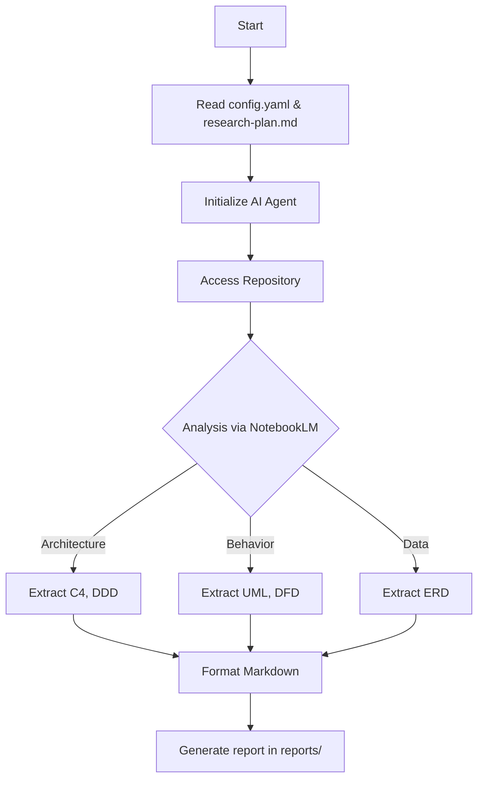

# 🤖 Automated Reverse Engineering Explorer

**Tool for automatic code analysis and documentation generation.**

---

### 📝 About the Project

This tool helps you quickly understand unfamiliar or legacy codebases. It automatically explores the code and generates detailed reports with architectural diagrams (C4, UML, ERD).

At its core is an AI agent that uses NotebookLM to analyze large volumes of code. You just need to provide the repository URL and a research plan.

---

### ✨ Features

*   🏗️ **Diagram Generation:** Automatically builds architecture (C4), sequence (UML), data flow (DFD), and data model (ERD) diagrams.
*   🧠 **Logic Analysis:** Identifies entry points, domain boundaries, and relationships between system components.
*   🤖 **Autonomous Operation:** The `re-auto-explorer` agent handles everything from code ingestion to final report generation.
*   💾 **Progress Persistence:** Results are saved in Markdown, serving as a knowledge base for the entire session.

---

### 📚 Getting Started

To get started, you need to set up the environment and install the required tools.

1.  **Install `notebooklm-mcp-cli`**:
    ```bash
    npm install -g notebooklm-mcp-cli
    # Follow the CLI instructions to authenticate
    ```

2.  **Clone the Repository**:
    ```bash
    git clone <repository-url>
    cd reverse-engineering
    ```

3.  **Configure Targets**: Open `config.yaml` and list the repositories you want to analyze.

---

## Workflow

The process follows a simple pipeline:



### Step-by-Step

1.  **Initialization**: The system reads `config.yaml` for target repositories.
2.  **Exploration**: The AI agent follows the steps in `research-plan.md`.
3.  **Analysis**: The agent uses `notebooklm-mcp-cli` to ingest the codebase.
4.  **Synthesis**: The agent identifies boundaries, flows, and models.
5.  **Documentation**: Reports are saved in the `reports/` folder.

---

## Project Structure

- **`.agent/skills/re-auto-explorer/`**: The core AI skill and its guides.
- **`reports/`**: Where the generated reports are stored.
- **`config.yaml`**: Main configuration for target projects.
- **`research-plan.md`**: The template that guides the exploration.

---

## Configuration

In `config.yaml`, specify the projects to be analyzed:

```yaml
communication_language: Russian
document_output_language: English
projects:
  - re_repo_url: "https://github.com/getzep/graphiti"
    re_project_name: "graphiti"
    re_base_plan: "{project-root}/research-plan.md"
    re_max_sources: 50
    re_output_folder: "{project-root}/reports/{re_project_name}"
  - re_repo_url: "https://github.com/getzep/zep"
      re_project_name: "zep"
      re_base_plan: "{project-root}/research-plan.md"
      re_max_sources: 50
```
