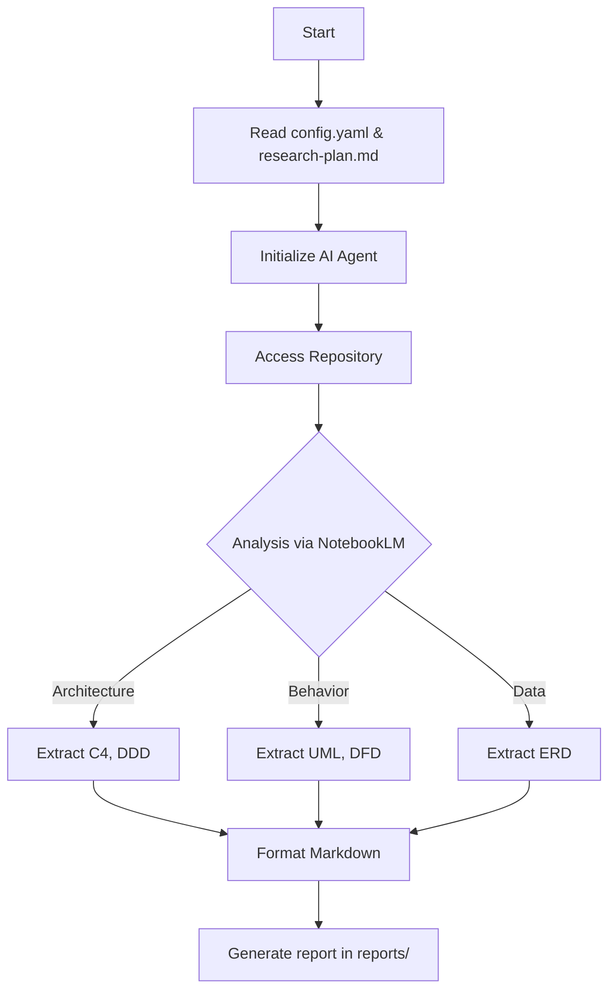

# 🤖 Automated Reverse Engineering Explorer

**Инструмент для автоматического разбора кода и генерации документации.**

---

### 📝 О проекте
Этот инструмент помогает быстро разобраться в незнакомом или старом проекте. Он автоматически изучает код и создаёт отчеты с архитектурными схемами (C4, UML, ERD).

В основе — ИИ-агент, который использует NotebookLM для анализа больших объемов кода. Вам нужно только указать репозиторий и план исследования.

---

### ✨ Что умеет
* 🏗️ **Рисует диаграммы:** Сами строятся схемы архитектуры (C4), последовательностей (UML), потоков данных (DFD) и моделей данных (ERD).
* 🧠 **Разбирает логику:** Находит точки входа, границы доменов и связи между частями системы.
* 🤖 **Работает сам:** Агент `bmad-re-auto-explorer` проходит весь путь от загрузки кода до готового отчета.
* 💾 **Сохраняет прогресс:** Результаты записываются в Markdown, который служит базой знаний для всей сессии.

---

### 📚 С чего начать
1. **[Инструкция по установке](#prerequisites--initial-setup)**
2. **[Настройка config.yaml](#configuration)**

---

## Overview

This tool helps you quickly understand unfamiliar or legacy codebases. It automatically explores the code and generates detailed reports with architectural diagrams (C4, UML, ERD).

It uses an AI agent integrated with NotebookLM to handle large contexts and perform system analysis. You just need to provide the repository URL and a research plan.

## Prerequisites & Initial Setup

To get started, you need to set up the environment and install the required tools.

1. **Install `notebooklm-mcp-cli`**:
   ```bash
   npm install -g notebooklm-mcp-cli
   # Follow the CLI instructions to authenticate
   ```

2. **Clone the Repository**:
   ```bash
   git clone <repository-url>
   cd reverse-engeneering
   ```

3. **Configure Targets**: Open `config.yaml` and list the repositories you want to analyze.

## Workflow

The process follows a simple pipeline:



### Step-by-Step
1. **Initialization**: The system reads `config.yaml` for target repositories.
2. **Exploration**: The AI agent follows the steps in `research-plan.md`.
3. **Analysis**: The agent uses `notebooklm-mcp-cli` to ingest the codebase.
4. **Synthesis**: The agent identifies boundaries, flows, and models.
5. **Documentation**: Reports are saved in the `reports/` folder.

## Project Structure

- **`.agent/skills/bmad-re-auto-explorer/`**: The core AI skill and its guides.
- **`reports/`**: Where the generated reports are stored.
- **`config.yaml`**: Main configuration for target projects.
- **`research-plan.md`**: The template that guides the exploration.

## Configuration

In `config.yaml`, specify the projects to be analyzed:

```yaml
communication_language: Russian
document_output_language: English
projects:
  - re_repo_url: "https://github.com/getzep/graphiti"
    re_project_name: "graphiti"
    re_base_plan: "{project-root}/research-plan.md"
    re_max_sources: 50
```
