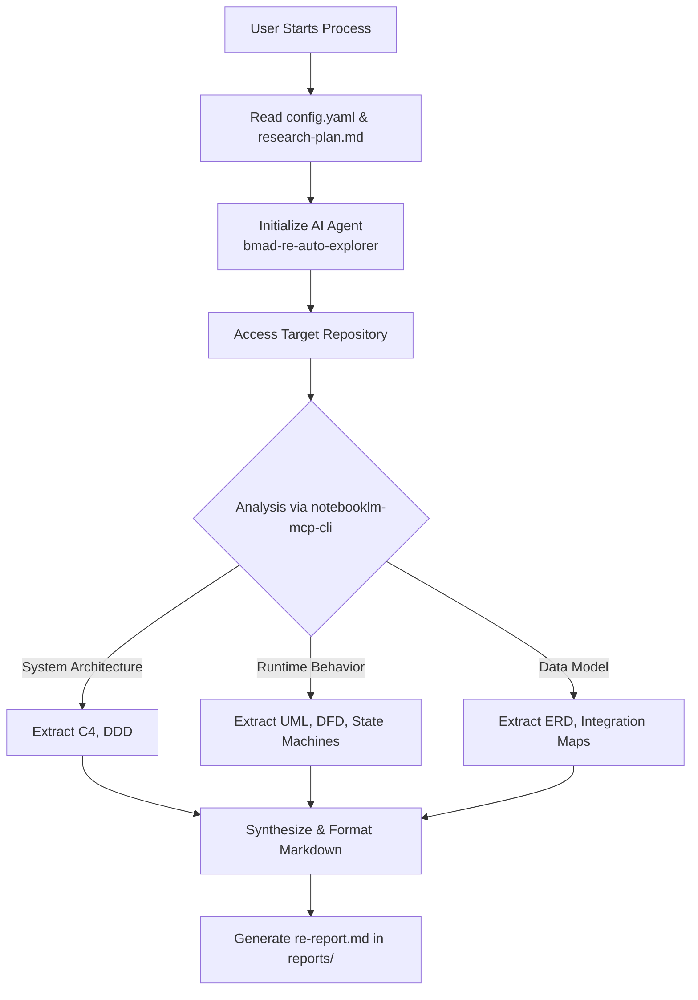

# Automated Reverse Engineering Explorer

This project is a Research & Development (R&D) initiative focused on automated reverse engineering of software repositories. It leverages AI agents to analyze codebases and automatically generate comprehensive documentation, including architectural diagrams, system behaviors, and data models.

## Overview

The core of this project is the automated exploration and documentation of existing software projects. By defining target repositories and a structured research plan, the system systematically investigates the codebase and produces detailed markdown reports with embedded diagrams (such as C4 models, UML, DFDs, and ERDs).

## Prerequisites & Initial Setup

To get started with the automated reverse engineering explorer, you need to set up the environment and install the required MCP (Model Context Protocol) tools.

1. **Install `notebooklm-mcp-cli`**: This project relies on the NotebookLM MCP CLI to connect AI agents with NotebookLM for advanced context handling and analysis.
   ```bash
   npm install -g notebooklm-mcp-cli
   # Follow the CLI instructions to authenticate and configure your NotebookLM connection
   ```

2. **Clone the Repository**:
   ```bash
   git clone <repository-url>
   cd reverse-engeneering
   ```

3. **Configure Targets**: Open `config.yaml` and define the repositories you want to analyze (see the Configuration section below).

## Workflow

The reverse engineering process follows a structured pipeline from initialization to document generation.



### Step-by-Step Execution

1. **Initialization**: The system reads `config.yaml` to identify the target repositories and the selected languages.
2. **Exploration**: Using the `bmad-re-auto-explorer` skill, the AI agent follows the steps outlined in `research-plan.md`.
3. **Analysis via MCP**: The agent uses `notebooklm-mcp-cli` to ingest the codebase and perform deep contextual analysis.
4. **Synthesis**: The agent extracts domain boundaries, entry points, data flows, and data models.
5. **Documentation**: Detailed reports are generated in the `reports/` directory, containing insights and visual diagrams representing the system's architecture and behavior.

## Project Structure

- **`.agent/skills/bmad-re-auto-explorer/`**: Contains the custom AI skill responsible for the automated exploration process. It includes reference guides for the various phases (initialization, refinement, exploration, synthesis) and validation scripts.
- **`reports/`**: The output directory where the generated reverse engineering reports (`re-report.md`) are stored, organized by project name (e.g., `graphiti`, `swarmify`).
- **`config.yaml`**: The main configuration file where target projects, their repository URLs, and language preferences are defined.
- **`research-plan.md`**: The structured template/plan that guides the reverse engineering process through different steps:
  1. Project overview
  2. System Architecture investigation (DDD, C4 L1/L2)
  3. Runtime behavior investigation (Sequence Diagrams, DFD, State Machines)
  4. Subsystems investigation
  5. Data model (ERD, Integration patterns)

## Configuration

The `config.yaml` file allows you to specify the projects to be analyzed. For example:

```yaml
communication_language: Russian
document_output_language: English
projects:
  - re_repo_url: "https://github.com/getzep/graphiti"
    re_project_name: "graphiti"
    re_base_plan: "{project-root}/research-plan.md"
    re_max_sources: 50
```
