# Отчет об обратной разработке: adk-rust

## 1. Обзор проекта и ключевые функции

### 1.1 Графовая оркестрация (adk-graph)

**Графовая оркестрация (`adk-graph`)** в ADK-Rust — это мощный движок рабочих процессов с сохранением состояния, в значительной степени вдохновленный LangGraph [1, 2]. Он выходит за рамки линейных цепочек LLM, рассматривая рабочие процессы агентов как направленные графы и выполняя их с использованием алгоритма передачи сообщений, основанного на модели Google Pregel [3, 4].

Эта оркестрация позволяет разработчикам создавать циклические графы (такие как циклы ReAct), выполнять условную маршрутизацию, запускать задачи параллельно и внедрять потоки одобрения с участием человека (Human-in-the-Loop, HITL) с детерминированным созданием контрольных точек состояния [2, 5].

#### 1.1.1 Основная архитектура и ключевые компоненты

Архитектура разделяет фазу определения графа и фазу выполнения рантайма [6]. 

**Основные структуры данных**
*   **`State` и `StateSchema`**: Граф работает с разделяемым состоянием, типизированным как `HashMap<String, serde_json::Value>` [7]. `StateSchema` определяет каналы для этого состояния и назначает каждому из них `Reducer` [8].
*   **`Reducer`**: Определяет, как обновления состояния объединяются во время выполнения. Варианты включают `Overwrite` (замена по умолчанию), `Append` (для списков), `Sum` (для числовых счетчиков) и `Custom` (для пользовательских замыканий) [7, 9].
*   **`Node`**: Вычислительная единица (асинхронная функция или обернутый агент ADK). Узлы получают `NodeContext` и возвращают `NodeOutput` [10, 11].
    *   `FunctionNode`: Оборачивает произвольные асинхронные Rust-замыкания [12].
    *   `AgentNode`: Оборачивает стандартных LLM-агентов ADK (`LlmAgent`), используя `input_mapper` для преобразования состояния графа в подсказки (prompts) агента и `output_mapper` для перевода событий агента обратно в обновления состояния [13].
*   **`Edge`**: Определяет поток управления. Типы включают `Direct` (A → B), `Conditional` (A → RouterFn → [B, C, END]) и `Entry` (START → [Nodes]) [14].
*   **`Checkpointer`**: Трейты, такие как `MemoryCheckpointer` и `SqliteCheckpointer`, сохраняют снимки выполнения (`Checkpoint`) на диск или в память после каждого шага, обеспечивая отказоустойчивость и отладку с "путешествием во времени" [15, 16].
*   **`GraphAgent`**: Структура-мост, которая оборачивает `CompiledGraph` и реализует стандартный трейт `adk_core::Agent`, позволяя вызывать весь граф точно так же, как стандартного текстового агента через `Runner` ADK [17, 18].

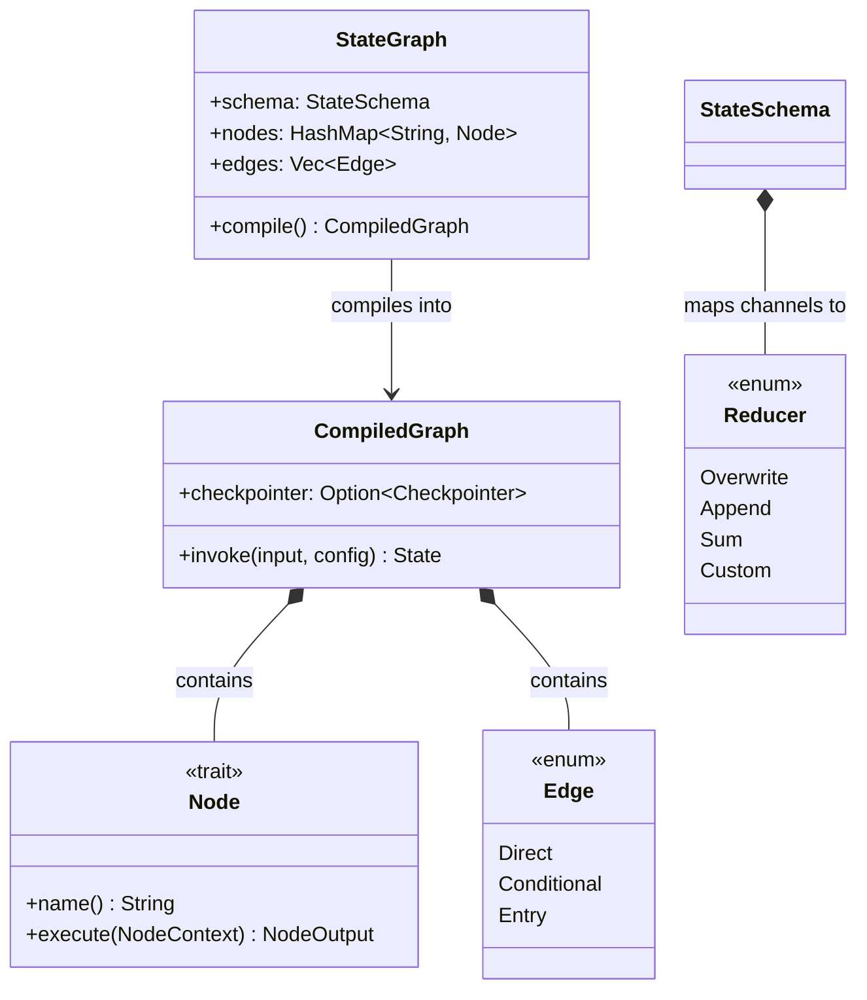
```mermaid
classDiagram
    class StateGraph {
        +schema: StateSchema
        +nodes: HashMap~String, Node~
        +edges: Vec~Edge~
        +compile() CompiledGraph
    }
    class CompiledGraph {
        +checkpointer: Option~Checkpointer~
        +invoke(input, config) State
    }
    class Node {
        <<trait>>
        +name() String
        +execute(NodeContext) NodeOutput
    }
    class Edge {
        <<enum>>
        Direct
        Conditional
        Entry
    }
    class Reducer {
        <<enum>>
        Overwrite
        Append
        Sum
        Custom
    }
    StateGraph --> CompiledGraph : compiles into
    CompiledGraph *-- Node : contains
    CompiledGraph *-- Edge : contains
    StateSchema *-- Reducer : maps channels to
```

#### 1.1.2 Алгоритм выполнения Pregel

`PregelExecutor` проводит граф через дискретные итерации, называемые **Супер-шагами (Super-Steps)** [4, 19]. Каждый шаг изолирует чтение от записи, обеспечивая безопасное параллельное выполнение без состояний гонки (data races) [4, 20].

**Пошаговый алгоритм:**
1.  **Инициализация**: `CompiledGraph` вызывается с начальным `State` и `ExecutionConfig` (который включает `thread_id` и `recursion_limit` для предотвращения бесконечных циклов) [10, 21].
2.  **Фаза планирования (Plan Phase)**: Исполнитель определяет все `pending_nodes`. На первом шаге это цели входных ребер `START` [4, 22, 23].
3.  **Проверка прерывания (до)**: Исполнитель проверяет, вызывают ли какие-либо ожидающие узлы предварительно настроенную паузу `interrupt_before` [24, 25].
4.  **Фаза выполнения (Execution Phase)**: 
    *   Исполнитель запускает асинхронные задачи для выполнения всех `pending_nodes` **параллельно** [4].
    *   Каждому узлу передается `NodeContext` только для чтения (текущее состояние, номер шага, конфигурация) [26].
    *   Каждый узел возвращает структуру `NodeOutput`, содержащую `HashMap` обновлений состояния, необязательные динамические прерывания (`Interrupt`) и пользовательские потоковые события [11].
5.  **Проверка прерывания (динамическая и после)**: Исполнитель приостанавливается, если узел вернул динамическое прерывание `Interrupt` (например, ожидание одобрения человеком) или сработала конфигурация `interrupt_after` [25].
6.  **Фаза обновления (Update Phase)**: Исполнитель применяет все буферизованные обновления состояния к разделяемому `State`. Он использует `Reducer`, назначенный каждому каналу, для детерминированного разрешения обновлений (например, добавление новых сообщений LLM в список вместо перезаписи) [4, 7].
7.  **Создание контрольной точки (Checkpointing)**: Структура `Checkpoint` (содержащая ID потока, состояние, шаг и ожидающие узлы) сериализуется и сохраняется через `Checkpointer` [27].
8.  **Фаза маршрутизации (Routing Phase)**: Исполнитель вычисляет определения `Edge`, исходящие из только что завершенных узлов [14]. Если узел имеет условное ребро (`Conditional`), выполняется замыкание маршрутизации применительно к *новому* состоянию для определения следующего узла [14, 28].
9.  **Завершение**: Цикл повторяется до тех пор, пока следующим целевым узлом не станет `END` или не будет достигнут лимит рекурсии [22, 29, 30].

---

### 1.2 Аудио-конвейеры реального времени (adk-realtime / adk-audio)

**Конвейер аудио реального времени (Realtime Audio Pipeline)** в ADK-Rust — это сложная архитектура с низкой задержкой, разделенная между двумя основными крейтами: **`adk-realtime`** (отвечает за сетевые транспорты, управление сессиями и оркестрацию агентов) и **`adk-audio`** (отвечает за цифровую обработку сигналов, детекцию голосовой активности, модели STT/TTS и топологию конвейера) [1, 2].

Эта архитектура позволяет разработчикам создавать «голосовых» агентов, поддерживающих двунаправленную потоковую передачу, прерывания со стороны человека (human-in-the-loop) и вызов инструментов в реальном времени без блокировки аудиопотока.

#### 1.2.1 Основная архитектура и ключевые компоненты

Система разделяет **транспортный/сессионный уровень** и **конвейер обработки аудио**.

**Компоненты `adk-realtime` (Оркестрация и Транспорт)**
*   **`RealtimeAgent`**: Реализует стандартный трейт `adk_core::Agent`, но работает с двунаправленным аудио, а не только с текстом [3]. Поддерживает стандартные обратные вызовы ADK, динамические наборы инструментов и передачу задач субагентам [3, 4].
*   **`RealtimeRunner`**: Основной движок оркестрации, который связывает сессию аудио реального времени с фреймворком агентов ADK. Он управляет жизненным циклом сессии, автоматически выполняет вызовы инструментов и маршрутизирует полезную нагрузку сообщений `ServerEvent` и `ClientEvent` [5, 6].
*   **`RealtimeSession` / `RealtimeModel`**: Абстрактные трейты, оборачивающие транспортный уровень (WebSocket или WebRTC) [7, 8]. Реализации включают `OpenAIRealtimeSession` (WebSocket/WebRTC) и `GeminiRealtimeSession` (WebSocket) [9-11].
*   **Транспорты WebRTC**: Использует `str0m` (Sans-IO WebRTC) для прямых WebRTC-соединений с использованием кодека Opus к OpenAI или `LiveKitEventHandler` для интеграции аудиодорожек удаленных участников в раннер ADK [11, 12].

**Компоненты `adk-audio` (DSP и конвейер ИИ)**
*   **`AudioPipelineBuilder` и `PipelineHandle`**: Создает и управляет асинхронную топологией узлов обработки аудио [13, 14].
*   **`FxChain` и `AudioProcessor`**: Применяет последовательные эффекты цифровой обработки сигналов (DSP), такие как `NoiseSuppressor` (подавление шума), `LoudnessNormalizer` (нормализация громкости по стандарту EBU R128) и `DynamicRangeCompressor` (компрессор динамического диапазона) [15-19].
*   **Провайдеры ИИ**: Трейты для `VadProcessor` (детекция голосовой активности), `SttProvider` (преобразование речи в текст через Whisper/Deepgram) и `TtsProvider` (преобразование текста в речь через ElevenLabs/Cartesia/OpenAI) [20-24].

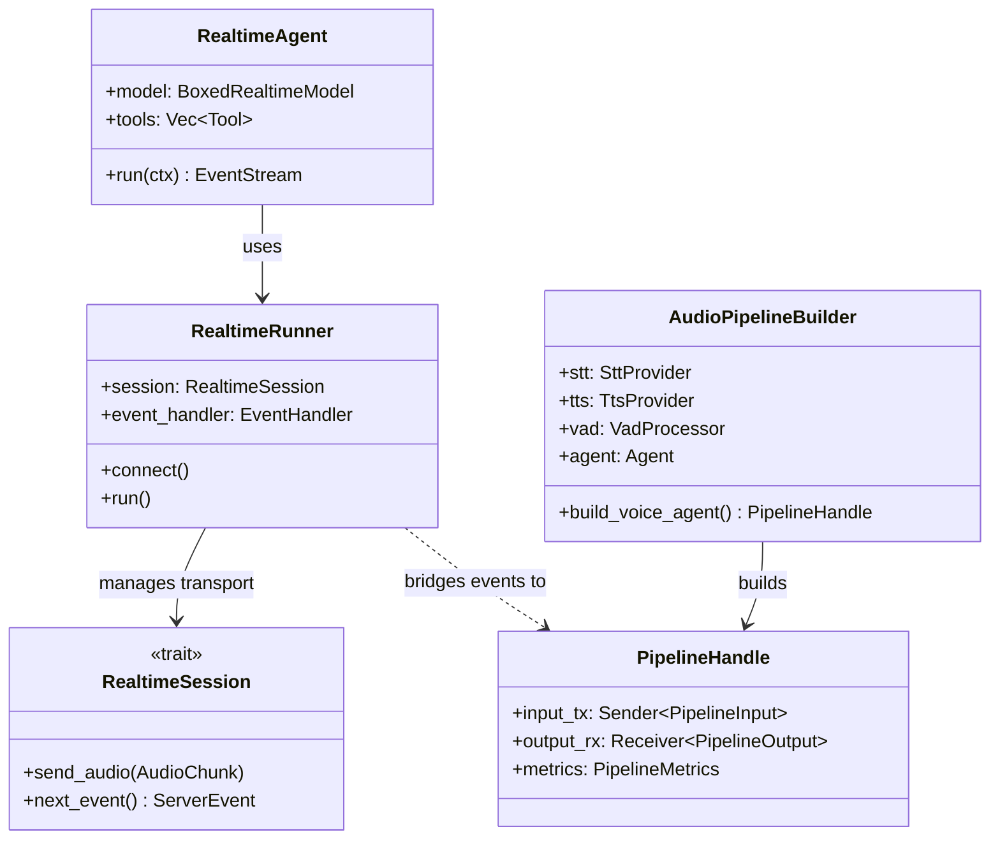
```mermaid
classDiagram
    class RealtimeAgent {
        +model: BoxedRealtimeModel
        +tools: Vec~Tool~
        +run(ctx) EventStream
    }
    class RealtimeRunner {
        +session: RealtimeSession
        +event_handler: EventHandler
        +connect()
        +run()
    }
    class RealtimeSession {
        <<trait>>
        +send_audio(AudioChunk)
        +next_event() ServerEvent
    }
    class AudioPipelineBuilder {
        +stt: SttProvider
        +tts: TtsProvider
        +vad: VadProcessor
        +agent: Agent
        +build_voice_agent() PipelineHandle
    }
    class PipelineHandle {
        +input_tx: Sender~PipelineInput~
        +output_rx: Receiver~PipelineOutput~
        +metrics: PipelineMetrics
    }
    
    RealtimeAgent --> RealtimeRunner : uses
    RealtimeRunner --> RealtimeSession : manages transport
    AudioPipelineBuilder --> PipelineHandle : builds
    RealtimeRunner ..> PipelineHandle : bridges events to
```

#### 1.2.2 Алгоритм конвейера голосового агента

Флагманской логикой крейта `adk-audio` является **Цикл голосового агента** (`voice_agent_loop`), который оркеструет преобразование сырого аудио в интеллектуальные ответы [31, 32].

**Пошаговое выполнение:**
1.  **Прием и предварительная обработка**: Конвейер получает `AudioFrame` через `input_rx` и применяет опциональную цепочку `pre_fx` (например, подавление шума, обрезка тишины) [32].
2.  **Гейтирование по VAD (детекция голоса)**: Кадр передается в `VadProcessor::is_speech()`. 
    *   Если обнаружена речь, кадр добавляется во внутренний `speech_buffer`.
    *   Если обнаружена тишина и количество последовательных кадров тишины превышает пороговое значение, цикл считает, что пользователь закончил говорить, и переходит к шагу 3 [32].
3.  **STT (речь в текст)**: Буферизованные кадры объединяются в один блок и передаются в `SttProvider`. Провайдер транскрибирует данные PCM в текстовую стенограмму `Transcript` [32, 33].
4.  **Рассуждение агента**: Транскрибированный текст упаковывается в блок `Content` ADK и отправляется LLM-агенту. Агент обрабатывает ввод, потенциально динамически выполняя инструменты (управляется `RealtimeRunner`), и начинает потоковую передачу текстовых токенов обратно [5, 6, 32].
5.  **Попредложенный TTS**: Чтобы минимизировать задержку до появления первого звука (TTFB), текстовый поток направляется в **`SentenceChunker`**.
    *   Чанкер буферизует отдельные токены LLM, пока не встретит разделитель (например, `.`, `!`, `?`, `\n`) [34].
    *   Как только сформировано полное предложение, оно немедленно отправляется в `TtsProvider` для синтеза, пока LLM продолжает генерировать остальную часть ответа [34, 35].
6.  **Постобработка и вывод**: Синтезированное аудио от TTS-провайдера опционально проходит через цепочку `post_fx` (например, нормализация громкости) и выдается дальше через `output_tx` для отправки по сети [32, 35].

---

### 1.3 Изолированное выполнение кода (adk-sandbox / adk-code)

Архитектура изолированного выполнения кода в ADK-Rust — это сложная многоуровневая система, разработанная для безопасной компиляции и запуска кода, сгенерированного ИИ-агентами. Она четко разделяет **логику инструментария конкретного языка** (компиляция, диагностика) и **вопросы изоляции среды выполнения** (песочницы, ограничения ресурсов) на два отдельных крейта: `adk-code` и `adk-sandbox` [1, 2].

#### 1.3.1 Основная архитектура и ключевые компоненты

Система разделена на две основные области:
*   **`adk-code` (языковой субстрат)**: Управляет конвейерами конкретных языков, парсит диагностику компиляторов, предоставляет шаблоны оберток (harness templates) и упаковывает исполнители в стандартные реализации `Tool` в ADK, такие как `CodeTool` [3-5].
*   **`adk-sandbox` (субстрат изоляции)**: Предоставляет типаж `SandboxBackend` и фактические среды изолированного выполнения, такие как `ProcessBackend` и `WasmBackend` [2, 6].

**Ключевые компоненты:**
*   **`CodeTool` / `SandboxTool`**: Реализации `adk_core::Tool`, которые открывают возможность выполнения кода для LLM [3, 7]. Они используют паттерн **«ошибка как информация»**, где сбои выполнения или компиляции возвращаются в LLM в виде структурированного JSON (например, `{"status": "compile_error", ...}`), а не выбрасывают жесткую ошибку `ToolError`. Это позволяет агенту анализировать и исправлять свой собственный код [7, 8].
*   **`RustExecutor`**: Флагманский конвейер для Rust. Он выполняет строгую последовательность `Check -> Build -> Execute` (Проверка -> Сборка -> Выполнение) и делегирует финальный этап в `SandboxBackend` [5, 9].
*   **`SandboxBackend`**: Асинхронный типаж, предоставляющий метод `execute()`. Он реализован в:
    *   **`ProcessBackend`**: Использует `tokio::process::Command` для запуска локальных подпроцессов на хосте. Обеспечивает лимиты времени (timeout) и переменные окружения, но *не* ограничивает доступ к сети или файловой системе [10, 11].
    *   **`WasmBackend`**: Использует `wasmtime` для выполнения WebAssembly внутри процесса. Обеспечивает строгие лимиты памяти (`StoreLimitsBuilder`), прерывания по таймауту на основе эпох и полную изоляцию WASI без доступа к сети или файловой системе [12, 13].

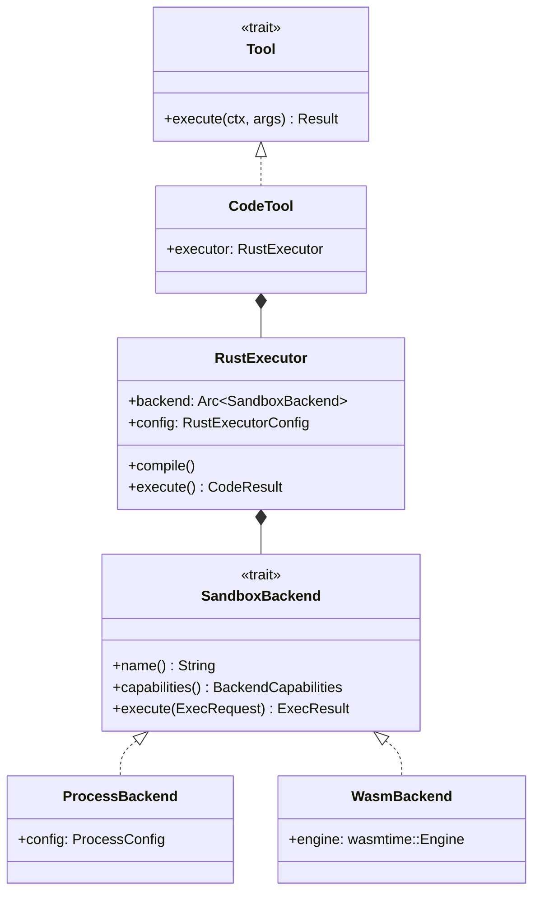
```mermaid
classDiagram
    class Tool {
        <<trait>>
        +execute(ctx, args) Result
    }
    class CodeTool {
        +executor: RustExecutor
    }
    class SandboxBackend {
        <<trait>>
        +name() String
        +capabilities() BackendCapabilities
        +execute(ExecRequest) ExecResult
    }
    class RustExecutor {
        +backend: Arc~SandboxBackend~
        +config: RustExecutorConfig
        +compile() 
        +execute() CodeResult
    }
    class ProcessBackend {
        +config: ProcessConfig
    }
    class WasmBackend {
        +engine: wasmtime::Engine
    }
    
    Tool <|.. CodeTool
    CodeTool *-- RustExecutor
    RustExecutor *-- SandboxBackend
    SandboxBackend <|.. ProcessBackend
    SandboxBackend <|.. WasmBackend
```

#### 1.3.2 Алгоритм выполнения кода Rust

Основной путь для агентов ADK — написание и выполнение кода на Rust. `RustExecutor` реализует многоэтапный конвейер с закрытием при ошибке (fail-closed), разработанный для безопасной оценки произвольного кода, сгенерированного LLM [9].

**Пошаговый алгоритм:**
1.  **Валидация запроса**: Функция `validate_policy` сравнивает запрашиваемую `SandboxPolicy` с возможностями бэкенда `BackendCapabilities`. Если политика запрашивает ограничение (например, `NetworkPolicy::Disabled`), которое бэкенд не может обеспечить (например, `ProcessBackend`), выполнение немедленно отклоняется [18, 23].
2.  **Валидация исходного кода и обертка (Harnessing)**: LLM предоставляет фрагмент кода, соответствующий контракту `fn run(input: Value) -> Value` [24]. Исполнитель проверяет, что код не содержит вредоносных или конфликтующих паттернов (таких как определение `fn main()` или атрибутов крейта `#![...]`) [25, 26]. Затем он внедряет этот фрагмент в **шаблон обертки (Harness Template)**, который предоставляет `fn main()`, читает `stdin`, вызывает `run()` и сериализует результат в `stdout` [24, 26].
3.  **Фаза проверки (Check Phase)**: `RustExecutor` записывает обернутый код во временную директорию и вызывает `rustc --error-format=json` [9, 27]. 
    *   Если компиляция не удалась, `parse_diagnostics` извлекает структурированные JSON-ошибки компилятора (номера строк, диапазоны, сообщения).
    *   Выполнение немедленно прерывается, и диагностика возвращается в LLM [9, 28, 29].
4.  **Фаза сборки (Build Phase)**: Если проверка прошла успешно, вызывается `rustc -o binary` для компиляции исполняемого файла [9].
5.  **Фаза выполнения (Execute Phase)**: Путь к скомпилированному бинарному файлу упаковывается в `ExecRequest` (`Language::Command`) и отправляется в настроенный `SandboxBackend` (например, `ProcessBackend` или `WasmBackend`) [9].
6.  **Извлечение вывода**: Бэкенд контролирует таймаут, перехватывает stdout/stderr и обрезает их до безопасного предела (например, 1 МБ, соблюдая границы UTF-8) [10, 30]. `extract_structured_output` парсит последнюю строку `stdout`, чтобы извлечь JSON, возвращенный функцией `run()` [21, 31].

## 2. Системная архитектура

### 2.1 Границы доменов (Bounded Contexts)

Основываясь на архитектурном дизайне и модульной структуре фреймворка ADK-Rust, система четко разделена на несколько хорошо определенных **ограниченных контекстов** (Bounded Contexts) в соответствии с принципами предметно-ориентированного проектирования (DDD). Фреймворк использует многоуровневую архитектуру, разделяющую интерфейсы приложений, среды выполнения, логику агентов и фундаментальные сервисы [1, 2].

Ниже приведены основные границы областей (ограниченные контексты) ADK-Rust:

#### 2.1.1 Контекст фундаментального ядра (Core Foundation Context)
Это общее ядро системы. Оно определяет единый язык (ubiquitous language) и фундаментальные абстракции, используемые во всех остальных контекстах, без реализации специфической логики инфраструктуры.
*   **Ключевые обязанности:** Определение интерфейсов для агентов (Agents), инструментов (Tools), LLM и сессий; управление иерархией контекстов; определение примитивов потоковой передачи событий (`Event`); обеспечение типобезопасной идентификации.
*   **Основные агрегаты и объекты-значения:** `Content`, `Part`, `Event`, `AdkIdentity` (безопасная адресация сессий для арендаторов), `ExecutionIdentity`.
*   **Крейты:** 
    *   `adk-core`: Определение базовых типажей и типов [3, 4].
    *   `adk-rust`: Единый фасад и зонтичный пакет (umbrella crate) [5, 6].

#### 2.1.2 Контекст исполнения и оркестрации (Execution & Orchestration Context)
Этот контекст управляет жизненным циклом, потоками выполнения и оркестрацией агентов. Он отвечает за прием входных данных, оценку состояния, маршрутизацию к нужному агенту и потоковую передачу ответов.
*   **Ключевые обязанности:** Выполнение агентов, делегирование задач между несколькими агентами, сжатие (compaction) контекста, маршрутизация в автоматах состояний и рабочие процессы с участием человека (HITL) на базе графов.
*   **Основные агрегаты:** `Runner`, `InvocationContext`, `StateGraph`, `AgentNode`.
*   **Крейты:**
    *   `adk-runner`: Центральный движок выполнения, связывающий агентов, память и сессии [7, 8].
    *   `adk-agent`: Реализует конкретные поведения агентов, такие как `LlmAgent`, `SequentialAgent`, `ParallelAgent` и агенты-роутеры [9, 10].
    *   `adk-graph`: Оркестрация рабочих процессов в стиле LangGraph с супершагами Pregel, контрольными точками и редьюсерами [11, 12].
    *   `adk-plugin`: Расширяемые хуки жизненного цикла (например, `before_agent`, `on_tool_error`) [13, 14].

#### 2.1.3 Контекст возможностей и расширяемости (Capabilities & Extensibility Context)
Этот контекст определяет, что агент *может делать* за пределами собственных рассуждений, связывая когнитивную область агента с его физическими возможностями.
*   **Ключевые обязанности:** Выполнение инструментов, интеграция внешних API, автоматизация браузера и декларативное внедрение навыков.
*   **Основные агрегаты:** `Tool`, `Toolset`, `McpToolset`, `SkillContext`.
*   **Крейты:**
    *   `adk-tool`: Предоставляет макрос `#[tool]`, встроенные инструменты (например, поиск Google) и полную поддержку клиента Model Context Protocol (MCP) [15, 16].
    *   `adk-skill`: «Координатор контекста», который обнаруживает, парсит и внедряет персонажи (personas) и привязки инструментов на основе Markdown [17, 18].
    *   `adk-browser`: Автоматизация на основе WebDriver, позволяющая навигацию и взаимодействие с веб-сайтами [19, 20].

#### 2.1.4 Контекст среды выполнения кода (Code Execution Substrate Context)
Высокоспециализированная область, сфокусированная на безопасной компиляции и выполнении сгенерированного кода, четко отделяя инструментарий языков программирования от инфраструктуры «песочниц».
*   **Ключевые обязанности:** Обработка специфической для языков компиляции (например, Rust check/build/execute), управление строгими политиками песочницы и преобразование диагностических данных компилятора в форматы, понятные LLM.
*   **Основные агрегаты:** `CodeExecutor`, `SandboxBackend`, `ExecRequest`, `SandboxPolicy`, `Workspace`.
*   **Крейты:**
    *   `adk-code`: Конвейер с поддержкой языков программирования, обрабатывающий компиляцию, диагностику и события совместного рабочего пространства [21, 22].
    *   `adk-sandbox`: Уровень изоляции, предоставляющий бэкенды для подпроцессов и WebAssembly (wasmtime) [23, 24].

#### 2.1.5 Контекст состояния и памяти (State & Memory Context)
Этот контекст управляет сохранением данных во времени, разделяя эфемерные состояния сессий, постоянные артефакты и семантическую долгосрочную память.
*   **Ключевые обязанности:** Управление трехуровневой моделью состояния (приложение, пользователь, сессия), обработка бинарных артефактов (изображения, PDF), разбиение документов на фрагменты (чанкинг) и поиск на основе векторов.
*   **Основные агрегаты:** `Session`, `State`, `MemoryEntry`, `Artifact`, `VectorStore`, `RagPipeline`.
*   **Крейты:**
    *   `adk-session`: Сохранение сессий в различных бэкендах (SQLite, Postgres, Redis, Mongo и т. д.) [25, 26].
    *   `adk-memory`: Долгосрочная семантическая память через векторный поиск [27, 28].
    *   `adk-artifact`: Хранение и извлечение бинарных данных [29, 30].
    *   `adk-rag`: Конвейеры генерации с дополненной выборкой (RAG) с подключаемым чанкингом и переранжированием [31, 32].

#### 2.1.6 Контекст провайдеров моделей (Model Provider Context)
Слой антикоррозии (anti-corruption layer), который абстрагирует нюансы различных внешних и локальных моделей ИИ за единым интерфейсом `Llm`.
*   **Ключевые обязанности:** Взаимодействие с API, обработка лимитов частоты запросов, кэширование промптов, мультимодальные преобразования и выполнение локального инференса.
*   **Основные агрегаты:** `LlmClient`, `ModelConfig`.
*   **Крейты:**
    *   `adk-model`: Унифицирует интеграции с облачными сервисами (OpenAI, Anthropic, DeepSeek, Bedrock, Azure AI, Groq) [33, 34].
    *   `adk-gemini`: Полнофункциональный выделенный клиент для Google Gemini API [35, 36].
    *   `adk-mistralrs`: Нативный, молниеносно быстрый локальный инференс LLM (с поддержкой ISQ, LoRA и Vision) без внешних демонов [37, 38].

#### 2.1.7 Реал-тайм и мультимодальный контекст (Realtime & Multimodal Context)
Эта область обрабатывает непрерывные двунаправленные потоки данных с низкой задержкой вместо традиционных цепочек запрос-ответ.
*   **Ключевые обязанности:** Обнаружение голосовой активности (VAD), синтез речи (TTS), распознавание речи (STT) и управление сессиями WebRTC/WebSocket.
*   **Основные агрегаты:** `RealtimeSession`, `AudioPipeline`, `AudioFrame`.
*   **Крейты:**
    *   `adk-realtime`: Двунаправленная потоковая передача для голосовых агентов с использованием OpenAI/Gemini Realtime API и мостов LiveKit WebRTC [39, 40].
    *   `adk-audio`: Цепочки цифровой обработки сигналов (DSP), речевые модели и аудиоконвейеры [41, 42].

#### 2.1.8 Контекст безопасности и управления качеством (Security & Quality Governance Context)
Вспомогательная область, гарантирующая авторизованность, безопасность и производительность действий агентов.
*   **Ключевые обязанности:** Ролевой контроль доступа (RBAC), декларативное применение областей видимости (scopes), скрытие персональных данных (PII), валидация схем вывода, телеметрия и оценка работы агентов.
*   **Основные агрегаты:** `AccessControl`, `GuardrailSet`, `Evaluator`, `TraceSpan`.
*   **Крейты:**
    *   `adk-auth`: Enterprise-уровень RBAC, интеграция OAuth/SSO и аудит [43, 44].
    *   `adk-guardrail`: Фильтры безопасности ввода/вывода [45, 46].
    *   `adk-eval`: Валидация траекторий инструментов и скоринг на основе LLM-судей [47, 48].
    *   `adk-telemetry`: Структурированное логирование OpenTelemetry и распределенная трассировка [49, 50].

#### 2.1.9 Контекст периферии и интерфейсов (Edge & Interfaces Context)
Самая внешняя граница, открывающая систему ADK конечным пользователям и другим системам.
*   **Ключевые обязанности:** HTTP-маршрутизация, согласование протокола межагентного взаимодействия (A2A), выполнение через CLI и манифесты развертывания.
*   **Крейты:**
    *   `adk-server`: REST API на базе Axum, JSON-RPC 2.0 протокол A2A и Server-Sent Events (SSE) [8, 51].
    *   `adk-cli`: Команды терминального REPL и лаунчера [52, 53].
    *   `adk-deploy`: Взаимодействие с панелью управления (control-plane), сборка рабочего пространства и манифесты [54].
    *   `cargo-adk`: Инструмент скаффолдинга CLI для генерации новых проектов [55].

---

### 2.2 Карта модулей и пакетов (C4 L3)

Ниже представлена карта зависимостей уровней C4 Level 3 (Компоненты/Пакеты) для рабочего пространства ADK-Rust.

Рабочее пространство сильно модулировано и содержит более 25 крейтов (crates), которые наследуют свои внутренние зависимости из корневого воркспейса по паттерну `adk-core = { workspace = true }` [1]. Поскольку Rust запрещает циклические зависимости, фреймворк соблюдает строгую единую иерархию зависимостей — от фундаментальных трейтов до внешних интерфейсов [2].

#### 2.2.1 Карта зависимостей компонентов


```mermaid
graph TD
    %% Фасад-зонтик
    ADK_RUST["adk-rust (Umbrella Facade)"]

    %% Внешние интерфейсы
    ADK_CLI["adk-cli"]
    ADK_SERVER["adk-server"]
    ADK_DEPLOY["adk-deploy"]

    %% Оркестрация и сложные рабочие процессы
    ADK_RUNNER["adk-runner"]
    ADK_GRAPH["adk-graph"]
    ADK_REALTIME["adk-realtime"]
    ADK_RAG["adk-rag"]
    ADK_EVAL["adk-eval"]

    %% Агенты и возможности
    ADK_AGENT["adk-agent"]
    ADK_TOOL["adk-tool"]
    ADK_BROWSER["adk-browser"]
    ADK_AUDIO["adk-audio"]
    ADK_SKILL["adk-skill"]
    ADK_MACROS["adk-rust-macros"]

    %% Субстраты состояния, памяти и выполнения
    ADK_SESSION["adk-session"]
    ADK_MEMORY["adk-memory"]
    ADK_ARTIFACT["adk-artifact"]
    ADK_CODE["adk-code"]
    ADK_SANDBOX["adk-sandbox"]
    
    %% Модели
    ADK_MODEL["adk-model"]
    ADK_GEMINI["adk-gemini"]
    ADK_MISTRALRS["adk-mistralrs"]

    %% Безопасность, управление и наблюдаемость
    ADK_AUTH["adk-auth"]
    ADK_GUARDRAIL["adk-guardrail"]
    ADK_PLUGIN["adk-plugin"]
    ADK_TELEMETRY["adk-telemetry"]

    %% Фундаментальное ядро
    ADK_CORE["adk-core"]

    %% Связи внешнего уровня
    ADK_RUST --> ADK_CLI & ADK_SERVER & ADK_GRAPH & ADK_EVAL & ADK_REALTIME & ADK_RAG & ADK_AUDIO & ADK_BROWSER & ADK_CODE & ADK_SANDBOX & ADK_RUNNER & ADK_AGENT
    ADK_CLI --> ADK_SERVER & ADK_RUNNER & ADK_DEPLOY & ADK_MODEL & ADK_TOOL
    
    %% Связи оркестрации
    ADK_SERVER --> ADK_RUNNER & ADK_SESSION & ADK_ARTIFACT & ADK_AUTH & ADK_TELEMETRY
    ADK_RUNNER --> ADK_AGENT & ADK_SESSION & ADK_ARTIFACT & ADK_MEMORY & ADK_PLUGIN & ADK_SKILL
    ADK_GRAPH --> ADK_AGENT
    ADK_EVAL --> ADK_AGENT
    ADK_REALTIME --> ADK_RUNNER & ADK_MODEL & ADK_GEMINI
    ADK_RAG --> ADK_GEMINI & ADK_TOOL
    
    %% Связи возможностей
    ADK_AGENT --> ADK_SKILL & ADK_GUARDRAIL & ADK_MODEL
    ADK_TOOL --> ADK_CODE & ADK_MACROS
    ADK_CODE --> ADK_SANDBOX
    
    %% Связи провайдеров
    ADK_MODEL --> ADK_GEMINI
    
    %% Фундаментальные зависимости
    ADK_TELEMETRY -.-> ADK_CORE
    ADK_MODEL -.-> ADK_CORE
    ADK_MODEL -.-> ADK_CORE
    ADK_TOOL -.-> ADK_CORE
    ADK_SESSION -.-> ADK_CORE
    ADK_ARTIFACT -.-> ADK_CORE
    ADK_MEMORY -.-> ADK_CORE
    ADK_AGENT -.-> ADK_CORE
    ADK_AUTH -.-> ADK_CORE
    ADK_GUARDRAIL -.-> ADK_CORE
    ADK_PLUGIN -.-> ADK_CORE
    ADK_SANDBOX -.-> ADK_CORE
    ADK_MISTRALRS -.-> ADK_CORE
    
    classDef foundation fill:#1e293b,stroke:#528bff,stroke-width:2px,color:#fff;
    classDef services fill:#282c34,stroke:#98c379,stroke-width:2px,color:#fff;
    classDef capabilities fill:#282c34,stroke:#e5c07b,stroke-width:2px,color:#fff;
    classDef orchestration fill:#282c34,stroke:#c678dd,stroke-width:2px,color:#fff;
    classDef edges fill:#282c34,stroke:#e06c75,stroke-width:2px,color:#fff;
    
    class ADK_CORE foundation;
    class ADK_SESSION,ADK_MEMORY,ADK_ARTIFACT,ADK_MODEL,ADK_GEMINI,ADK_MISTRALRS,ADK_SANDBOX,ADK_CODE,ADK_AUTH,ADK_GUARDRAIL,ADK_PLUGIN,ADK_TELEMETRY services;
    class ADK_AGENT,ADK_TOOL,ADK_MACROS,ADK_SKILL,ADK_BROWSER,ADK_AUDIO capabilities;
    class ADK_RUNNER,ADK_GRAPH,ADK_REALTIME,ADK_RAG,ADK_EVAL orchestration;
    class ADK_RUST,ADK_CLI,ADK_SERVER,ADK_DEPLOY edges;
```

#### 2.2.2 Подробная иерархия зависимостей

Архитектура гарантирует, что примитивы низкого уровня никогда не зависят от модулей оркестрации высокого уровня. Система сборки предписывает публиковать крейты строго в следующем порядке зависимостей [2]:

1. **Фундаментальный уровень (Foundation Layer, нет внутренних зависимостей)**
*   **`adk-core`**: Самый низкий уровень дерева зависимостей. Он определяет универсальные интерфейсы (`Agent`, `Tool`, `Session`, `State`, `Event`) и не содержит внутренних зависимостей ADK [2]. Любой другой пакет в рабочем пространстве прямо или косвенно полагается на него [1].

2. **Уровень сервисов и субстратов (Service & Substrate Layer)**
Эти крейты напрямую зависят от `adk-core` для предоставления конкретных реализаций фундаментальных трейтов:
*   **`adk-telemetry`**: Добавляет наблюдаемость через OpenTelemetry и структуры спанов поверх основных операций [3]. 
*   **`adk-sandbox`**: Реализует среду выполнения `SandboxBackend`, полагаясь на базовые инструменты [4].
*   **`adk-gemini`**: Выступает в качестве автономного API-клиента для Google Gemini [5].
*   **`adk-mistralrs`**: Нативный локальный движок инференса (отсутствует в crates.io из-за git-зависимостей), реализующий базовый трейт `Llm` [6, 7].
*   **`adk-model`**: Реализует обертки для облачных провайдеров, используя внутри `adk-gemini` и связывая внешние API с базовым трейтом `Llm` [8, 9].
*   **`adk-session`**: Управляет историей диалогов и полагается на базовые типы данных [10].
*   **`adk-artifact`**: Обеспечивает персистентность бинарных вложений, опираясь на базовые структуры контекста [11].
*   **`adk-memory`**: Реализует базовые трейты долгосрочной памяти на основе векторного поиска [12].
*   **`adk-auth`**: Реализует базовые контексты запросов и области видимости (scopes) для ролевого доступа [13].
*   **`adk-guardrail`**: Использует базовые типы `Content` для блокировки PII, вредоносных текстов и проверки схем [14].
*   **`adk-plugin`**: Предоставляет систему хуков для событий жизненного цикла из `adk-core` [15].

3. **Уровень агентов и способностей (Agent & Capabilities Layer)**
Эти крейты зависят от уровня сервисов для формирования когнитивных границ и наборов инструментов:
*   **`adk-code`**: Инструментарий, учитывающий специфику языков программирования. Он явно полагается на `adk-sandbox` для обработки логистики изоляции, в то время как сам занимается компиляцией и диагностикой [16, 17]. 
*   **`adk-tool`**: Предоставляет встроенные функции (такие как MCP и Google Search) и зависит от `adk-code` для предоставления оберток выполнения кода с языковыми пресетами [18]. Также использует `adk-rust-macros` для процедурного макроса `#[tool]` [19].
*   **`adk-skill`**: Полагается на `adk-plugin` для внедрения промптов и динамической регистрации зависимостей [20, 21].
*   **`adk-agent`**: Флагманский когнитивный модуль. Полагается на `adk-skill` для генерации персон, `adk-guardrail` для проверок безопасности и `adk-model` для генерации текста [22-24].

4. **Уровень оркестрации (Orchestration Layer)**
Эти крейты координируют состояния многошагового или мультиагентного выполнения:
*   **`adk-runner`**: Движок исполнения. Сильно зависит от `adk-agent`, `adk-session`, `adk-memory`, `adk-artifact`, `adk-plugin` и `adk-skill` для прозрачного выполнения сессий и управления состоянием/передачей задач [25, 26].
*   **`adk-graph`**: Зависит от `adk-core` и `adk-agent` (оборачивая стандартных LLM-агентов внутри `AgentNode`) для реализации супер-шагов в стиле LangGraph [27, 28].
*   **`adk-realtime`**: Реализует потоки голосовых агентов, завися от `adk-runner`, `adk-model` и (условно) от `adk-gemini` для live-транспортов [29, 30].
*   **`adk-rag`**: Зависит от `adk-gemini` (условно) для моделей эмбеддингов и экспортирует `RagTool` через `adk-tool` [31, 32].
*   **`adk-eval`**: Зависит от `adk-agent` для тестирования качества и ограничений траектории инструментов [33, 34].

5. **Уровень внешних интерфейсов (Edge / Interfaces Layer)**
Точки входа для взаимодействия с внешним миром:
*   **`adk-server`**: Зависит от `adk-runner` для выполнения REST-запросов, `adk-session` и `adk-artifact` для эндпоинтов данных, `adk-telemetry` для логирования и `JwtRequestContextExtractor` из `adk-auth` для валидации личности [13, 35, 36].
*   **`adk-cli`**: Консоль REPL. Напрямую зависит от `adk-runner` для интерактивных циклов, `adk-server` для хостинга веб-интерфейсов, `adk-deploy` для удаленной публикации и ссылается на `adk-model` и `adk-tool` для динамических конфигураций [37-39].
*   **`adk-rust`**: Всеобъемлющий зонтичный крейт, который экспортирует и объединяет весь набор функций для конечных пользователей [40, 41].

### 2.3 Глоссарий предметной области

Ниже приведен глоссарий предметной области фреймворка **ADK-Rust**, определяющий его основные сущности и их взаимосвязи, которые формируют целостную архитектуру ИИ-агентов.

#### 2.3.1 Когнитивные сущности и сущности исполнения
*   **Агент (Agent)**: Базовая единица исполнения, предназначенная для выполнения конкретных задач [1]. Агенты обрабатывают контекст и генерируют события. Типы включают **LlmAgent** (на базе языковых моделей), **Workflow Agents** (агенты рабочих процессов: последовательные, параллельные, циклические для детерминированной маршрутизации), **GraphAgent** (для сложных рабочих процессов на базе конечных автоматов с сохранением состояния) и **RealtimeAgent** (для потоковой передачи голоса/аудио) [1].
*   **LLM (Large Language Model)**: Базовый провайдер (Gemini, OpenAI, Anthropic, DeepSeek, mistral.rs), обеспечивающий когнические способности и рассуждения `LlmAgent` [2, 3].
*   **Инструмент (Tool)**: Возможности, предоставляемые агентам помимо обычного диалога, позволяющие им взаимодействовать с внешними API, выполнять код или проводить операции [4]. Реализации включают `FunctionTool` (функции Rust), `GoogleSearchTool` (поиск Google) и инструменты, интегрированные через протокол MCP (Model Context Protocol) [4, 5].
*   **Набор инструментов (Toolset)**: Динамическая коллекция инструментов, разрешаемая во время выполнения (для каждого вызова) на основе контекста, что позволяет гибко управлять доступом на основе разрешений или специфических настроек пользователя [6, 7].
*   **Раннер (Runner)**: Движок выполнения, который оркеструет весь поток работы. Он управляет жизненным циклом сессии, внедряет память, координирует выполнение инструментов, обрабатывает передачу задач между агентами (handoffs) и обрабатывает поток выходных событий [8, 9].

#### 2.3.2 Контекст, состояние и сущности данных
*   **Событие (Event)**: Фундаментальный строительный блок истории диалога, представляющий одно взаимодействие (например, сообщение пользователя, ответ агента, вызов инструмента) [10, 11]. События содержат `LlmResponse` (контент) и `EventActions` (метаданные для побочных эффектов) [11, 12].
*   **Сессия (Session)**: Контейнер диалога, хранящий историю (`Events`) и рабочую память (`State`) между пользователем и приложением [13]. 
*   **Состояние (State)**: Хранилище «ключ-значение», привязанное к сессии, которое сохраняет данные между ходами диалога [14]. Ключи используют типизированные префиксы для управления областями видимости: `user:` (предпочтения пользователя между сессиями), `app:` (глобальное состояние приложения) и `temp:` (эфемерные данные текущего хода) [14, 15].
*   **Контекст (Context)**: Иерархия типажей (`ReadonlyContext`, `CallbackContext`, `ToolContext`, `InvocationContext`), передаваемая во время выполнения для предоставления агентам и инструментам доступа к данным сессии, идентификаторам, артефактам и памяти [16].
*   **AdkIdentity**: Строго типизированная стабильная тройка адресации сессии (`AppName`, `UserId`, `SessionId`), используемая для обеспечения абсолютной мультиарендной (multi-tenant) изоляции в хранилищах данных [17, 18].
*   **ExecutionIdentity**: Расширяет `AdkIdentity` координаты времени выполнения (`InvocationId`, `branch`, `agent_name`) для отслеживания конкретного хода и агента, выполняющего текущий запрос, в целях аудита и телеметрии [19, 20].
*   **Артефакт (Artifact)**: Бинарные данные (изображения, PDF, аудио), созданные или потребляемые агентом, хранящиеся с версиями и MIME-типами, и привязанные либо к конкретной сессии, либо глобально к пользователю [21, 22].
*   **Память (Memory)**: Долгосрочное семантическое хранилище на базе векторных баз данных (таких как Qdrant, LanceDB, Postgres pgvector). В отличие от эфемерной истории сессий, память сохраняется постоянно и оправивается через векторный поиск сходства для предоставления контекста RAG (Retrieval-Augmented Generation) [23, 24].

#### 2.3.3 Сущности управления, безопасности и конфигурации
*   **Навык (Skill / ParsedSkill / SkillDocument)**: Декларативная спецификация персонажа и способностей агента, определенная в Markdown с YAML-метаданными (в соответствии со стандартом `agentskills.io`). Навыки связывают системные инструкции с разрешенными инструментами [25].
*   **SkillContext (ResolvedContext)**: Атомарная единица, создаваемая `ContextCoordinator`, которая гарантирует полное соответствие когнитивных инструкций LLM ее физическим возможностям (привязанным инструментам), предотвращая галлюцинации «фантомных инструментов» [26, 27].
*   **Шлюз безопасности (Guardrail)**: Фильтры валидации, запускаемые параллельно с выполнением агента для блокировки вредоносного контента, обеспечения соблюдения схем JSON или сокрытия персональных данных (PII) во входных и выходных данных [28, 29].
*   **Роль и Разрешение (Role & Permission)**: Примитивы для управления доступом на основе ролей (RBAC). Роли определяют строгие правила `allow` (разрешить) и `deny` (запретить) для доступа к инструментам и агентам (при этом `deny` всегда имеет приоритет) [30, 31].
*   **ScopeGuard**: Декларативная обертка безопасности, гарантирующая, что выполняющий запрос пользователь обладает необходимыми областями видимости (scopes) JWT/сессии перед тем, как инструменту будет разрешено запуститься [32, 33].

#### 2.3.4 Сущности графов и оркестрации
*   **StateGraph**: Строитель для создания оркестрации рабочих процессов в стиле LangGraph [34, 35].
*   **Узел (Node)**: Вычислительная единица внутри графа. Может быть простой Rust-функцией (`FunctionNode`) или обернутым агентом ADK (`AgentNode`) [36-38].
*   **Ребро (Edge)**: Определяет поток управления между узлами (прямой, условный или входной), диктуя порядок выполнения [39, 40].
*   **Редьюсер (Reducer)**: Логика, назначенная конкретному каналу состояния в графе, определяющая, как объединяются новые обновления состояния (например, `Overwrite` — перезапись, `Append` — добавление, `Sum` — суммирование) [41, 42].
*   **A2A (Agent-to-Agent)**: Протокол JSON-RPC 2.0, позволяющий агентам обнаруживать, общаться и взаимодействовать с удаленными агентами через границы сети так же просто, как если бы они были локальными субагентами [43, 44].

---

### 2.4 Системный контекст (C4 L1)

Ниже представлена диаграмма системного контекста (C4 Level 1) для фреймворка ADK-Rust. Она иллюстрирует, как приложение ИИ-агента, построенное на базе ADK-Rust, взаимодействует с пользователями и внешними инфраструктурными границами.

#### 2.4.1 Системная диаграмма контекста (C4 System Context)

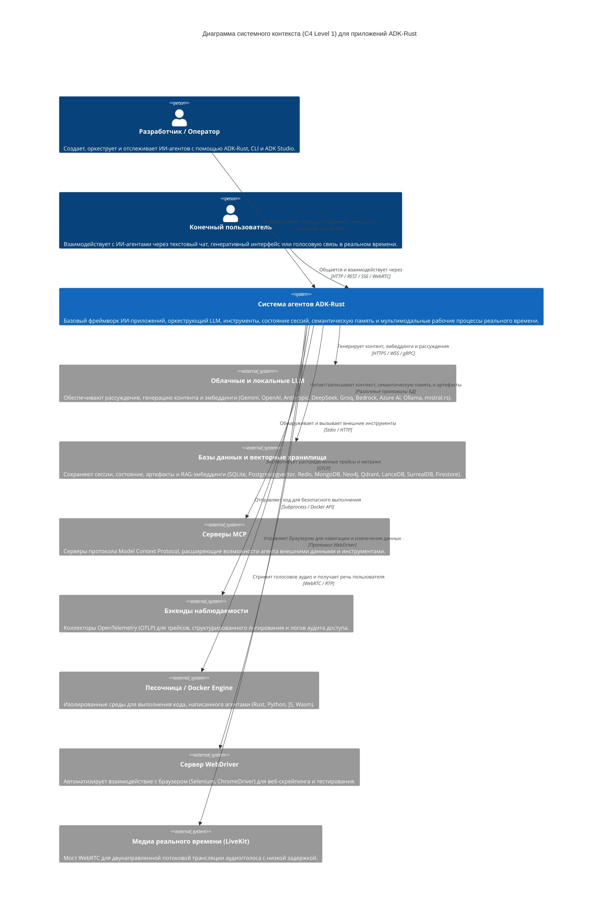
```mermaid
C4Context
  title Диаграмма системного контекста (C4 Level 1) для приложений ADK-Rust
  
  Person(developer, "Разработчик / Оператор", "Создает, оркеструет и отслеживает ИИ-агентов с помощью ADK-Rust, CLI и ADK Studio.")
  Person(end_user, "Конечный пользователь", "Взаимодействует с ИИ-агентами через текстовый чат, генеративный интерфейс или голосовую связь в реальном времени.")

  System(adk_rust, "Система агентов ADK-Rust", "Базовый фреймворк ИИ-приложений, оркеструющий LLM, инструменты, состояние сессий, семантическую память и мультимодальные рабочие процессы реального времени.")

  System_Ext(llm_apis, "Облачные и локальные LLM", "Обеспечивают рассуждение, генерацию контента и эмбеддинги (Gemini, OpenAI, Anthropic, DeepSeek, Groq, Bedrock, Azure AI, Ollama, mistral.rs).")
  System_Ext(storage, "Базы данных и векторные хранилища", "Сохраняют сессии, состояние, артефакты и RAG-эмбеддинги (SQLite, Postgres/pgvector, Redis, MongoDB, Neo4j, Qdrant, LanceDB, SurrealDB, Firestore).")
  System_Ext(mcp_servers, "Серверы MCP", "Серверы протокола Model Context Protocol, расширяющие возможности агента внешними данными и инструментами.")
  System_Ext(observability, "Бэкенды наблюдаемости", "Коллекторы OpenTelemetry (OTLP) для трейсов, структурированного логирования и логов аудита доступа.")
  System_Ext(execution_env, "Песочница / Docker Engine", "Изолированные среды для выполнения кода, написанного агентами (Rust, Python, JS, Wasm).")
  System_Ext(web_browser, "Сервер WebDriver", "Автоматизирует взаимодействие с браузером (Selenium, ChromeDriver) для веб-скрейпинга и тестирования.")
  System_Ext(rtc_bridge, "Медиа реального времени (LiveKit)", "Мост WebRTC для двунаправленной потоковой трансляции аудио/голоса с низкой задержкой.")

  Rel(developer, adk_rust, "Разрабатывает, тестирует и деплоит с помощью", "cargo-adk, CLI, Studio")
  Rel(end_user, adk_rust, "Общается и взаимодействует через", "HTTP / REST / SSE / WebRTC")

  Rel(adk_rust, llm_apis, "Генерирует контент, эмбеддинги и рассуждения", "HTTPS / WSS / gRPC")
  Rel(adk_rust, storage, "Читает/записывает контекст, семантическую память и артефакты", "Различные протоколы БД")
  Rel(adk_rust, mcp_servers, "Обнаруживает и вызывает внешние инструменты", "Stdio / HTTP")
  Rel(adk_rust, observability, "Экспортирует распределенные трейсы и метрики", "OTLP")
  Rel(adk_rust, execution_env, "Отправляет код для безопасного выполнения", "Subprocess / Docker API")
  Rel(adk_rust, web_browser, "Управляет браузером для навигации и извлечения данных", "Протокол WebDriver")
  Rel(adk_rust, rtc_bridge, "Стримит голосовое аудио и получает речь пользователя", "WebRTC / RTP")
```

#### 2.4.2 Анализ компонентов
*   **Разработчик / Оператор**: Использует CLI-инструмент `cargo-adk` для создания проектов, ADK Studio для визуального проектирования рабочих процессов агентов и инструменты развертывания для публикации агентов в продакшен [1-3].
*   **Конечный пользователь**: Человек, взаимодействующий с развернутым приложением ADK-Rust. Общение происходит через текст (потоки REST/SSE), динамические генеративные интерфейсы или двунаправленное аудио с низкой задержкой (Golos) [4-6].
*   **Система агентов ADK-Rust**: Основное приложение, построенное на базе фреймворка. Оно выступает в роли оркестратора: управляет контекстом диалога, проверяет «защитные ограждения» (guardrails), выполняет конвейеры кода, маршрутизирует рабочие процессы (графы/иерархии) и распределяет вызовы инструментов [4, 7].
*   **Облачные и локальные LLM**: Когнитивный «движок» системы. ADK-Rust взаимодействует с облачными API (Gemini, OpenAI, Anthropic, DeepSeek, Groq, AWS Bedrock, Azure AI) и локальными движками инференса (Ollama, `mistral.rs`) для генерации текста, аудио, изображений и семантических эмбеддингов [8, 9].
*   **Базы данных и векторные хранилища**: ADK-Rust активно полагается на внешние базы данных для обеспечения персистентности. 
    *   *Состояние диалогов и сессии:* SQLite, PostgreSQL, MongoDB, Redis, Neo4j, Firestore [10].
    *   *RAG / Семантическая память:* Qdrant, LanceDB, pgvector, SurrealDB и встроенные векторные хранилища в оперативной памяти [11].
    *   *Артефакты:* Бинарные хранилища для PDF-файлов, сгенерированных изображений и аудио [12].
*   **Серверы MCP (Model Context Protocol)**: Внешние серверы (локально через стандартный ввод/вывод или удаленно по HTTP/SSE), которые предоставляют агенту специализированные инструменты, источники данных и ресурсы [13, 14].
*   **Бэкенды наблюдаемости**: Целевые системы телеметрии (такие как Jaeger, Datadog или Honeycomb). ADK-Rust нативно экспортирует структурированные логи, журналы аудита (для RBAC) и распределенные трейсы агентов по протоколу OpenTelemetry (OTLP) [15-17].
*   **Песочница / Docker Engine**: Для безопасного запуска кода, сгенерированного агентом, ADK-Rust делегирует компиляцию и выполнение внешним средам, таким как эфемерные или постоянные Docker-контейнеры (через Docker API), изолированные подпроцессов ОС или среды Wasmtime [18-20].
*   **Сервер WebDriver**: Внешние серверы автоматизации браузеров (например, ChromeDriver или автономные инстансы Selenium), с которыми ADK взаимодействует по протоколу WebDriver, позволяя агенту переходить по ссылкам, нажимать кнопки, извлекать текст и делать скриншоты веб-страниц [21, 22].
*   **Медиа реального времени (LiveKit)**: Для «голосовых» агентов ADK подключается к серверу LiveKit WebRTC, чтобы получать речь пользователя и транслировать синтезированное ИИ аудио в удаленные комнаты [23, 24].

---

### 2.5 Диаграмма контейнеров (C4 L2)

Ниже представлена диаграмма контекста контейнеров (C4 Level 2) для системы **ADK-Rust**, а также подробное описание ее основных сервисов, баз данных, клиентов и их взаимодействия.

#### 2.5.1 C4 Container Diagram

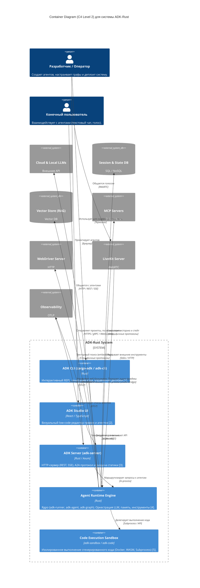
```mermaid
C4Container
    title Container Diagram (C4 Level 2) для системы ADK-Rust

    Person(developer, "Разработчик / Оператор", "Создает агентов, настраивает графы и деплоит систему.")
    Person(end_user, "Конечный пользователь", "Взаимодействует с агентами (текстовый чат, голос).")

    System_Boundary(adk_boundary, "ADK-Rust System") {
        Container(cli, "ADK CLI (cargo-adk / adk-cli)", "Rust", "Интерактивный REPL, генерация кода, управление деплоем [1].")
        Container(studio_ui, "ADK Studio UI", "React / TypeScript", "Визуальный low-code редактор графов и агентов [2].")
        Container(server, "ADK Server (adk-server)", "Rust / Axum", "HTTP-сервер (REST, SSE), A2A протокол и раздача статики [3].")
        Container(runtime, "Agent Runtime Engine", "Rust", "Ядро (adk-runner, adk-agent, adk-graph). Оркестрация LLM, память, инструменты [4].")
        Container(sandbox, "Code Execution Sandbox", "adk-sandbox / adk-code", "Изолированное выполнение сгенерированного кода (Docker, WASM, Subprocess) [5].")
    }

    System_Ext(llms, "Cloud & Local LLMs", "Внешние API", "Gemini, OpenAI, Anthropic, DeepSeek, Groq, Ollama, mistral.rs [6].")
    
    SystemDb_Ext(session_db, "Session & State DB", "SQL / NoSQL", "Сохранение сессий и состояний (PostgreSQL, SQLite, MongoDB, Redis, Neo4j, Firestore) [7].")
    SystemDb_Ext(vector_db, "Vector Store (RAG)", "Vector DB", "Семантическая память и RAG (Qdrant, LanceDB, pgvector, SurrealDB) [8].")
    
    System_Ext(mcp_servers, "MCP Servers", "Stdio / HTTP", "Внешние инструменты по Model Context Protocol [9].")
    System_Ext(webdriver, "WebDriver Server", "HTTP", "Автоматизация браузера (ChromeDriver, Selenium) [10].")
    System_Ext(livekit, "LiveKit Server", "WebRTC", "Мост для двунаправленного потокового аудио/голоса [11].")
    System_Ext(otel, "Observability", "OTLP", "Сбор метрик и трейсов (Jaeger, Datadog и др.) [12].")

    Rel(developer, cli, "Использует для скаффолдинга и REPL", "Терминал")
    Rel(developer, studio_ui, "Проектирует агентов", "Браузер")
    Rel(end_user, server, "Общается с агентами", "HTTP / REST / SSE")
    Rel(end_user, livekit, "Общается голосом", "WebRTC")

    Rel(studio_ui, server, "Генерирует код и вызывает API", "JSON / REST")
    Rel(cli, runtime, "Запускает локально", "In-process")
    Rel(server, runtime, "Маршрутизирует запросы к агентам", "In-process")

    Rel(runtime, llms, "Отправляет промпты, получает стрим", "HTTPS / gRPC / WebSockets")
    Rel(runtime, sandbox, "Делегирует выполнение кода", "Subprocess / API")
    Rel(runtime, session_db, "Сохраняет историю и стейт", "Специфичные протоколы")
    Rel(runtime, vector_db, "Векторный поиск (embeddings)", "Специфичные протоколы")
    Rel(runtime, mcp_servers, "Вызывает внешние инструменты", "Stdio / HTTP")
    Rel(runtime, webdriver, "Управляет веб-браузером", "WebDriver Protocol")
    
    Rel(livekit, runtime, "Передает аудио-фреймы", "In-process (LiveKit Bridge)")
    Rel(server, otel, "Экспортирует трейсы", "OTLP")
    Rel(runtime, otel, "Экспортирует спаны агентов", "OTLP")
```

#### 2.5.2 Подробное описание компонентов (Контейнеров)
*   **ADK Server (`adk-server`)**: Основной шлюз для внешнего мира в production. Это веб-сервер на базе фреймворка `axum`, который предоставляет REST API, поддержку потоковой передачи Server-Sent Events (SSE) для ответов агента, а также обслуживает протокол Agent-to-Agent (A2A) поверх JSON-RPC 2.0 [3, 13]. Сервер также включает `Auth Bridge` для маппинга JWT-токенов в контекст авторизации агентов [14].
*   **Agent Runtime Engine (`adk-runner`, `adk-agent`, `adk-graph`)**: Центральное "сердце" системы, работающее внутри процессов сервера или CLI. Оно выполняет графы состояний (LangGraph-стиль) [15], координирует цепочки вызовов между агентами (`Sequential`, `Parallel`, `Router`), применяет правила безопасности (`adk-guardrail`) и управляет оперативной памятью [16, 17].
*   **ADK CLI (`cargo-adk`, `adk-cli`)**: Инструмент командной строки для разработчика. Умеет генерировать новые проекты на Rust (`cargo adk new`), служить точкой входа в REPL для локальной отладки агентов и управлять деплоем [1, 18].
*   **ADK Studio UI**: Графический интерфейс на React/TypeScript для визуального low-code программирования агентов (в стиле AutoGen Studio). Позволяет соединять узлы-агенты, тестировать их в реальном времени и компилировать граф прямо в код на языке Rust [2, 19].
*   **Session & State DB (`adk-session`)**: Хранилище, отвечающее за персистентность истории диалогов (событий) и трехуровневого State (приложение, пользователь, сессия) [20].
    *   *Поддерживаемые СУБД*: PostgreSQL, SQLite, MongoDB, Redis, Neo4j, Firestore [7].
*   **Vector Store (`adk-rag`, `adk-memory`)**: Базы данных для долгосрочной семантической памяти и пайплайнов RAG (Retrieval-Augmented Generation). Хранят векторные эмбеддинги и метаданные чанков.
    *   *Поддерживаемые СУБД*: pgvector (через PostgreSQL), Qdrant, LanceDB, SurrealDB и локальное in-memory хранилище [8, 21].
*   **Artifact Storage (`adk-artifact`)**: Хранилище бинарных данных (изображений, аудио, PDF-документов), привязанных к сессиям агентов [22]. Хранится либо локально в файловой системе, либо в in-memory [23].
*   **Code Execution Sandbox (`adk-code`, `adk-sandbox`)**: Критически важная подсистема безопасности, позволяющая LLM генерировать и запускать код. Поддерживает несколько классов изоляции: выполнение в Docker-контейнерах (`Persistent` или `Ephemeral`), внутрипроцессный WebAssembly (через `wasmtime`), и локальные подпроцессы с ограничением по времени и памяти [5, 24, 25].
*   **Cloud & Local LLMs (`adk-model`, `adk-mistralrs`)**: Внешние провайдеры интеллекта. Вызовы уходят по HTTPS/SSE или gRPC к Gemini, OpenAI, Anthropic, DeepSeek, Groq, или Azure [6]. Локальный инференс обеспечивается связью с Ollama или через нативную интеграцию с `mistral.rs` (которая исполняется прямо на GPU пользователя без внешних демонов) [26].
*   **MCP Servers (`adk-tool`)**: Интеграция с Model Context Protocol. Агенты могут использовать внешние серверы как инструменты. Общение с ними идет либо через локальные пайпы (`stdio`), либо удаленно по HTTP/SSE [9].
*   **WebDriver / Browser Automation (`adk-browser`)**: Клиент для взаимодействия с браузером. Сервис связывается с ChromeDriver или Selenium, предоставляя агентам 46 готовых инструментов для скрейпинга, кликов и навигации [10, 27].
*   **LiveKit Server (`adk-realtime`)**: Для голосовых агентов, работающих с задержками менее 500мс (двунаправленное аудио), используется LiveKit мост. ADK-Rust читает аудио-треки участника через WebRTC, передает их локально (в памяти) голосовому агенту (`RealtimeAgent`), и транслирует синтезированный ИИ голос обратно в комнату [11, 30].

---

## 3. Поведение в рантайме

### 3.1 Диаграммы последовательности (Runtime Behavior)

#### 3.1.1 Поток Server REST API (run_sse)

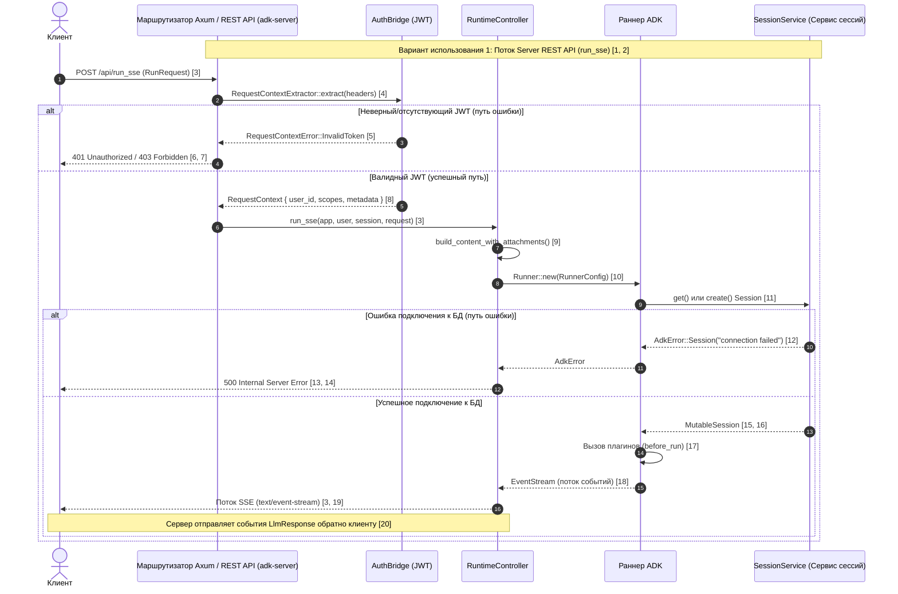
```mermaid
sequenceDiagram
    autonumber
    actor Client as Клиент
    participant HTTP as Маршрутизатор Axum / REST API (adk-server)
    participant Auth as AuthBridge (JWT)
    participant Controller as RuntimeController
    participant Runner as Раннер ADK
    participant DB as SessionService (Сервис сессий)

    Note over HTTP,DB: Вариант использования 1: Поток Server REST API (run_sse) [1, 2]
    
    Client->>HTTP: POST /api/run_sse (RunRequest) [3]
    
    HTTP->>Auth: RequestContextExtractor::extract(headers) [4]
    alt Неверный/отсутствующий JWT (путь ошибки)
        Auth-->>HTTP: RequestContextError::InvalidToken [5]
        HTTP-->>Client: 401 Unauthorized / 403 Forbidden [6, 7]
    else Валидный JWT (успешный путь)
        Auth-->>HTTP: RequestContext { user_id, scopes, metadata } [8]
        
        HTTP->>Controller: run_sse(app, user, session, request) [3]
        Controller->>Controller: build_content_with_attachments() [9]
        
        Controller->>Runner: Runner::new(RunnerConfig) [10]
        Runner->>DB: get() или create() Session [11]
        
        alt Ошибка подключения к БД (путь ошибки)
            DB-->>Runner: AdkError::Session("connection failed") [12]
            Runner-->>Controller: AdkError
            Controller-->>Client: 500 Internal Server Error [13, 14]
        else Успешное подключение к БД
            DB-->>Runner: MutableSession [15, 16]
            
            Runner->>Runner: Вызов плагинов (before_run) [17]
            
            Runner-->>Controller: EventStream (поток событий) [18]
            Controller-->>Client: Поток SSE (text/event-stream) [3, 19]
            Note over Controller,Client: Сервер отправляет события LlmResponse обратно клиенту [20]
        end
    end
```

#### 3.1.2 Основной когнитивный цикл и Guardrails

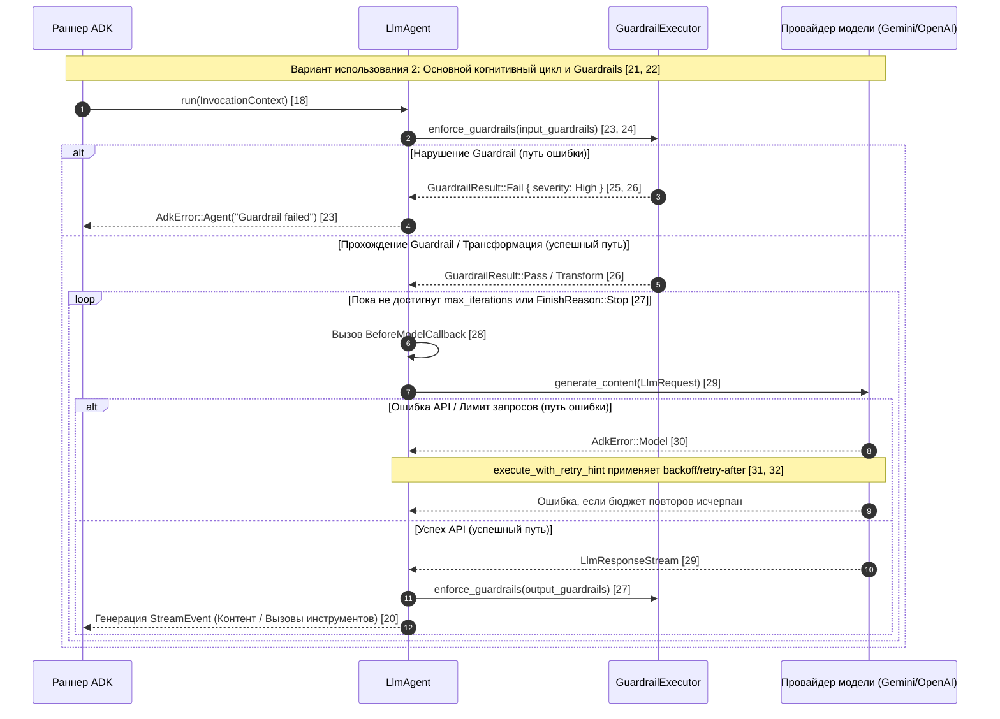
```mermaid
sequenceDiagram
    autonumber
    participant Runner as Раннер ADK
    participant Agent as LlmAgent
    participant GR as GuardrailExecutor
    participant LLM as Провайдер модели (Gemini/OpenAI)

    Note over Runner,LLM: Вариант использования 2: Основной когнитивный цикл и Guardrails [21, 22]

    Runner->>Agent: run(InvocationContext) [18]
    
    Agent->>GR: enforce_guardrails(input_guardrails) [23, 24]
    
    alt Нарушение Guardrail (путь ошибки)
        GR-->>Agent: GuardrailResult::Fail { severity: High } [25, 26]
        Agent-->>Runner: AdkError::Agent("Guardrail failed") [23]
    else Прохождение Guardrail / Трансформация (успешный путь)
        GR-->>Agent: GuardrailResult::Pass / Transform [26]
        
        loop Пока не достигнут max_iterations или FinishReason::Stop [27]
            Agent->>Agent: Вызов BeforeModelCallback [28]
            
            Agent->>LLM: generate_content(LlmRequest) [29]
            
            alt Ошибка API / Лимит запросов (путь ошибки)
                LLM-->>Agent: AdkError::Model [30]
                Note over Agent,LLM: execute_with_retry_hint применяет backoff/retry-after [31, 32]
                LLM-->>Agent: Ошибка, если бюджет повторов исчерпан
            else Успех API (успешный путь)
                LLM-->>Agent: LlmResponseStream [29]
                
                Agent->>GR: enforce_guardrails(output_guardrails) [27]
                Agent-->>Runner: Генерация StreamEvent (Контент / Вызовы инструментов) [20]
            end
        end
    end
```

#### 3.1.3 Выполнение инструмента, области видимости и повторы

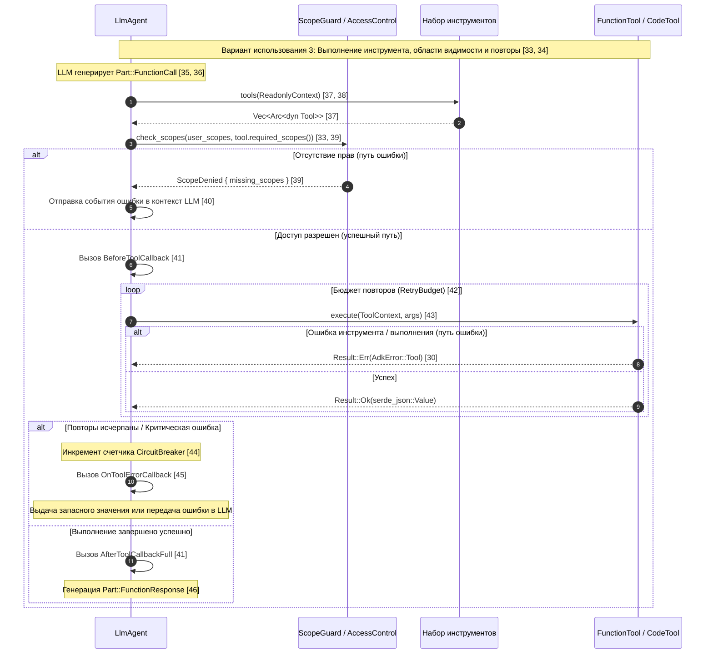
```mermaid
sequenceDiagram
    autonumber
    participant Agent as LlmAgent
    participant Scope as ScopeGuard / AccessControl
    participant Toolset as Набор инструментов
    participant Tool as FunctionTool / CodeTool
    
    Note over Agent,Tool: Вариант использования 3: Выполнение инструмента, области видимости и повторы [33, 34]

    Note over Agent: LLM генерирует Part::FunctionCall [35, 36]
    Agent->>Toolset: tools(ReadonlyContext) [37, 38]
    Toolset-->>Agent: Vec<Arc<dyn Tool>> [37]

    Agent->>Scope: check_scopes(user_scopes, tool.required_scopes()) [33, 39]
    
    alt Отсутствие прав (путь ошибки)
        Scope-->>Agent: ScopeDenied { missing_scopes } [39]
        Agent->>Agent: Отправка события ошибки в контекст LLM [40]
    else Доступ разрешен (успешный путь)
        Agent->>Agent: Вызов BeforeToolCallback [41]
        
        loop Бюджет повторов (RetryBudget) [42]
            Agent->>Tool: execute(ToolContext, args) [43]
            
            alt Ошибка инструмента / выполнения (путь ошибки)
                Tool-->>Agent: Result::Err(AdkError::Tool) [30]
            else Успех
                Tool-->>Agent: Result::Ok(serde_json::Value)
            end
        end

        alt Повторы исчерпаны / Критическая ошибка
            Note over Agent: Инкремент счетчика CircuitBreaker [44]
            Agent->>Agent: Вызов OnToolErrorCallback [45]
            Note over Agent: Выдача запасного значения или передача ошибки в LLM
        else Выполнение завершено успешно
            Agent->>Agent: Вызов AfterToolCallbackFull [41]
            Note over Agent: Генерация Part::FunctionResponse [46]
        end
    end
```

#### 3.1.4 Выполнение RPC A2A (Agent-to-Agent)

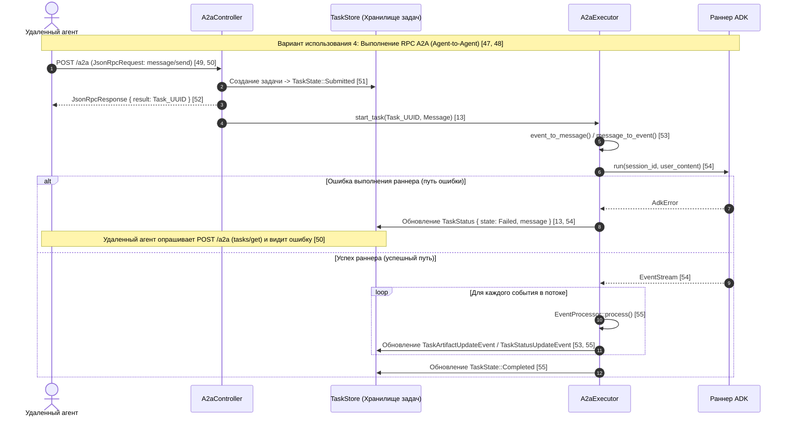
```mermaid
sequenceDiagram
    autonumber
    actor RemoteAgent as Удаленный агент
    participant Ctrl as A2aController
    participant Store as TaskStore (Хранилище задач)
    participant Exec as A2aExecutor
    participant Runner as Раннер ADK
    
    Note over RemoteAgent,Runner: Вариант использования 4: Выполнение RPC A2A (Agent-to-Agent) [47, 48]

    RemoteAgent->>Ctrl: POST /a2a (JsonRpcRequest: message/send) [49, 50]
    
    Ctrl->>Store: Создание задачи -> TaskState::Submitted [51]
    Ctrl-->>RemoteAgent: JsonRpcResponse { result: Task_UUID } [52]

    Ctrl->>Exec: start_task(Task_UUID, Message) [13]
    
    Exec->>Exec: event_to_message() / message_to_event() [53]
    Exec->>Runner: run(session_id, user_content) [54]

    alt Ошибка выполнения раннера (путь ошибки)
        Runner-->>Exec: AdkError
        Exec->>Store: Обновление TaskStatus { state: Failed, message } [13, 54]
        Note over RemoteAgent,Store: Удаленный агент опрашивает POST /a2a (tasks/get) и видит ошибку [50]
    else Успех раннера (успешный путь)
        Runner-->>Exec: EventStream [54]
        loop Для каждого события в потоке
            Exec->>Exec: EventProcessor::process() [55]
            Exec->>Store: Обновление TaskArtifactUpdateEvent / TaskStatusUpdateEvent [53, 55]
        end
        Exec->>Store: Обновление TaskState::Completed [55]
    end
```

#### 3.1.5 Графовый рабочий процесс и Human-In-The-Loop

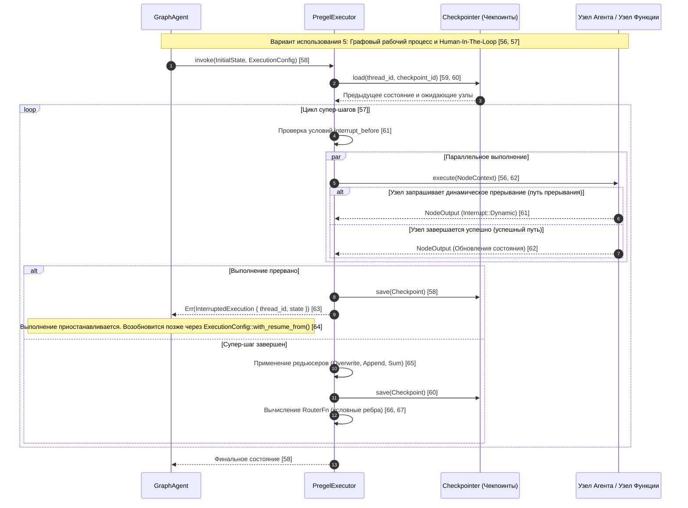
```mermaid
sequenceDiagram
    autonumber
    participant Agent as GraphAgent
    participant Exec as PregelExecutor
    participant Checkpoint as Checkpointer (Чекпоинты)
    participant Node as Узел Агента / Узел Функции

    Note over Agent,Node: Вариант использования 5: Графовый рабочий процесс и Human-In-The-Loop [56, 57]

    Agent->>Exec: invoke(InitialState, ExecutionConfig) [58]
    
    Exec->>Checkpoint: load(thread_id, checkpoint_id) [59, 60]
    Checkpoint-->>Exec: Предыдущее состояние и ожидающие узлы
    
    loop Цикл супер-шагов [57]
        Exec->>Exec: Проверка условий interrupt_before [61]
        
        par Параллельное выполнение
            Exec->>Node: execute(NodeContext) [56, 62]
            
            alt Узел запрашивает динамическое прерывание (путь прерывания)
                Node-->>Exec: NodeOutput (Interrupt::Dynamic) [61]
            else Узел завершается успешно (успешный путь)
                Node-->>Exec: NodeOutput (Обновления состояния) [62]
            end
        end

        alt Выполнение прервано
            Exec->>Checkpoint: save(Checkpoint) [58]
            Exec-->>Agent: Err(InterruptedExecution { thread_id, state }) [63]
            Note over Agent: Выполнение приостанавливается. Возобновится позже через ExecutionConfig::with_resume_from() [64]
        else Супер-шаг завершен
            Exec->>Exec: Применение редьюсеров (Overwrite, Append, Sum) [65]
            Exec->>Checkpoint: save(Checkpoint) [60]
            Exec->>Exec: Вычисление RouterFn (условные ребра) [66, 67]
        end
    end
    
    Exec-->>Agent: Финальное состояние [58]
```

---

### 3.2 Потоки данных (Data Flow)

#### 3.2.1 Глобальный поток данных

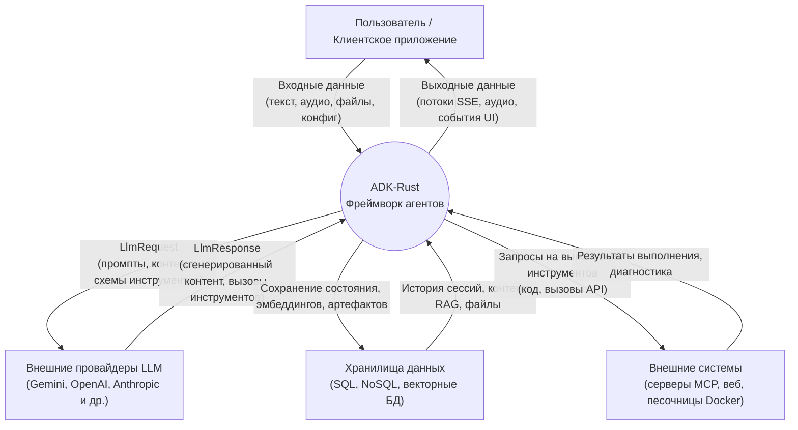
```mermaid
flowchart TD
    %% Внешние сущности
    User["Пользователь / Клиентское приложение"]
    LLM["Внешние провайдеры LLM\n(Gemini, OpenAI, Anthropic и др.)"]
    DB["Хранилища данных\n(SQL, NoSQL, векторные БД)"]
    ExtTools["Внешние системы\n(серверы MCP, веб, песочницы Docker)"]

    %% Центральный процесс
    ADK(("ADK-Rust\nФреймворк агентов"))

    %% Потоки данных
    User -- "Входные данные\n(текст, аудио, файлы, конфиг)" --> ADK
    ADK -- "Выходные данные\n(потоки SSE, аудио, события UI)" --> User
    
    ADK -- "LlmRequest\n(промпты, контекст, схемы инструментов)" --> LLM
    LLM -- "LlmResponse\n(сгенерированный контент, вызовы инструментов)" --> ADK
    
    ADK -- "Сохранение состояния, эмбеддингов, артефактов" --> DB
    DB -- "История сессий, контекст RAG, файлы" --> ADK
    
    ADK -- "Запросы на выполнение инструментов\n(код, вызовы API)" --> ExtTools
    ExtTools -- "Результаты выполнения, диагностика" --> ADK
```

#### 3.2.2 Жизненный цикл данных ADK-Rust (DFD уровень 1)

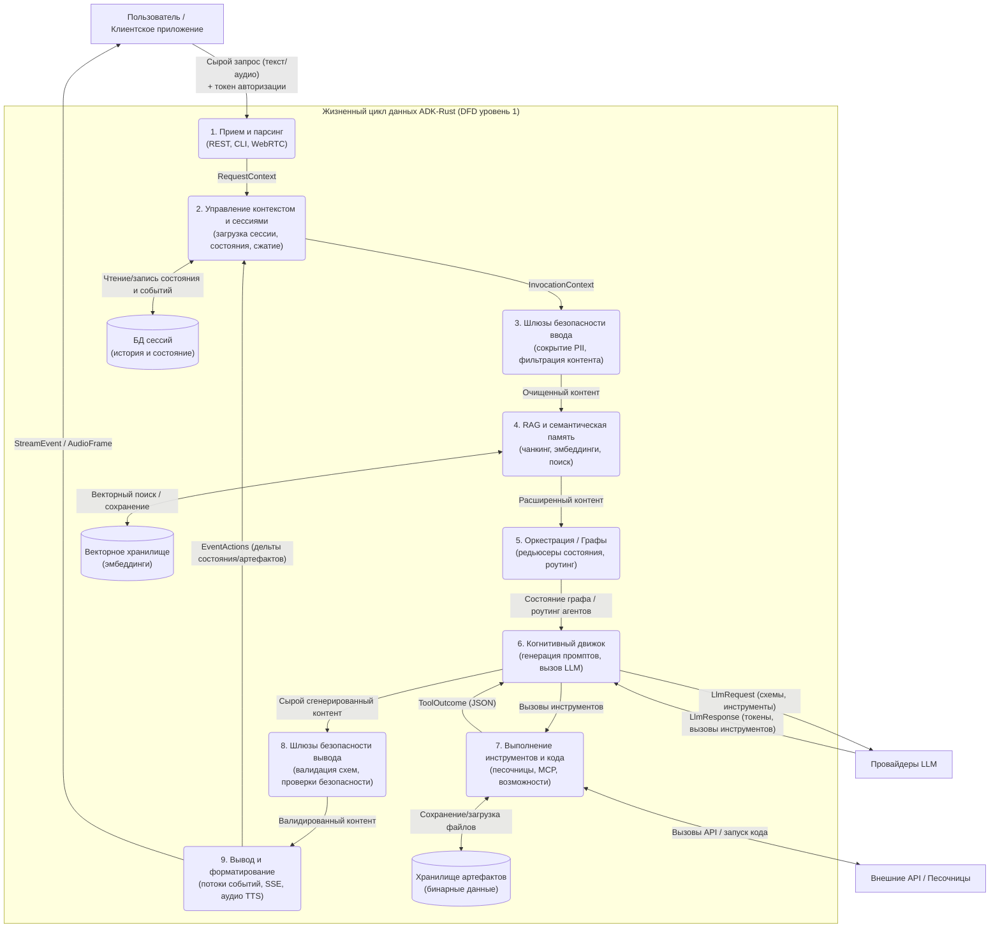
```mermaid
flowchart TD
    %% Внешние сущности
    User["Пользователь / Клиентское приложение"]
    LLMs["Провайдеры LLM"]
    MCP["Внешние API / Песочницы"]
    
    subgraph ADK_System ["Жизненный цикл данных ADK-Rust (DFD уровень 1)"]
        
        P1("1. Прием и парсинг\n(REST, CLI, WebRTC)")
        P2("2. Управление контекстом и сессиями\n(загрузка сессии, состояния, сжатие)")
        P3("3. Шлюзы безопасности ввода\n(сокрытие PII, фильтрация контента)")
        P4("4. RAG и семантическая память\n(чанкинг, эмбеддинги, поиск)")
        P5("5. Оркестрация / Графы\n(редьюсеры состояния, роутинг)")
        P6("6. Когнитивный движок\n(генерация промптов, вызов LLM)")
        P7("7. Выполнение инструментов и кода\n(песочницы, MCP, возможности)")
        P8("8. Шлюзы безопасности вывода\n(валидация схем, проверки безопасности)")
        P9("9. Вывод и форматирование\n(потоки событий, SSE, аудио TTS)")
        
        DS1[("БД сессий\n(история и состояние)")]
        DS2[("Векторное хранилище\n(эмбеддинги)")]
        DS3[("Хранилище артефактов\n(бинарные данные)")]
    end

    %% Потоки: Ввод -> Трансформации -> Вывод
    User -- "Сырой запрос (текст/аудио)\n+ токен авторизации" --> P1
    P1 -- "RequestContext" --> P2
    
    P2 <--> |"Чтение/запись состояния и событий"| DS1
    P2 -- "InvocationContext" --> P3
    
    P3 -- "Очищенный контент" --> P4
    P4 <--> |"Векторный поиск / сохранение"| DS2
    P4 -- "Расширенный контент" --> P5
    
    P5 -- "Состояние графа / роутинг агентов" --> P6
    
    P6 -- "LlmRequest (схемы, инструменты)" --> LLMs
    LLMs -- "LlmResponse (токены, вызовы инструментов)" --> P6
    
    P6 -- "Вызовы инструментов" --> P7
    P7 <--> |"Сохранение/загрузка файлов"| DS3
    P7 <--> |"Вызовы API / запуск кода"| MCP
    P7 -- "ToolOutcome (JSON)" --> P6
    
    P6 -- "Сырой сгенерированный контент" --> P8
    P8 -- "Валидированный контент" --> P9
    
    P9 -- "EventActions (дельты состояния/артефактов)" --> P2
    P9 -- "StreamEvent / AudioFrame" --> User
```

---

### 3.3 Конечные автоматы (State Machines)

#### 3.3.1 Задача Агент-Агенту (A2A)
Отслеживает жизненный цикл выполнения удаленных RPC-задач между агентами [1].

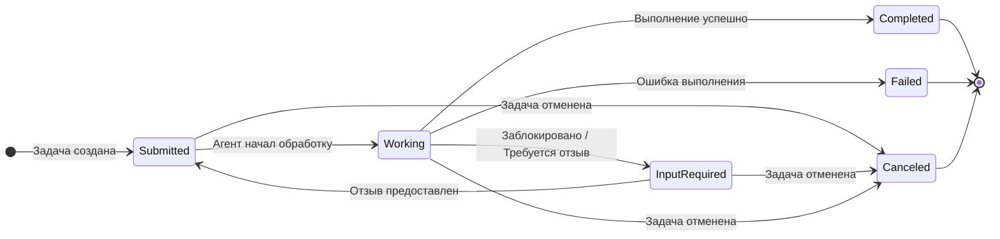
```mermaid
stateDiagram-v2
    direction LR
    [*] --> Submitted : Задача создана
    Submitted --> Working : Агент начал обработку
    Submitted --> Canceled : Задача отменена
    
    Working --> InputRequired : Заблокировано / Требуется отзыв
    InputRequired --> Submitted : Отзыв предоставлен
    InputRequired --> Canceled : Задача отменена
    
    Working --> Completed : Выполнение успешно
    Working --> Failed : Ошибка выполнения
    Working --> Canceled : Задача отменена
    
    Completed --> [*]
    Failed --> [*]
    Canceled --> [*]
```

#### 3.3.2 Статус выполнения кода
Отслеживает конвейер (pipeline) с закрытием при ошибке, когда агенты пишут и выполняют код в песочницах [2, 3].

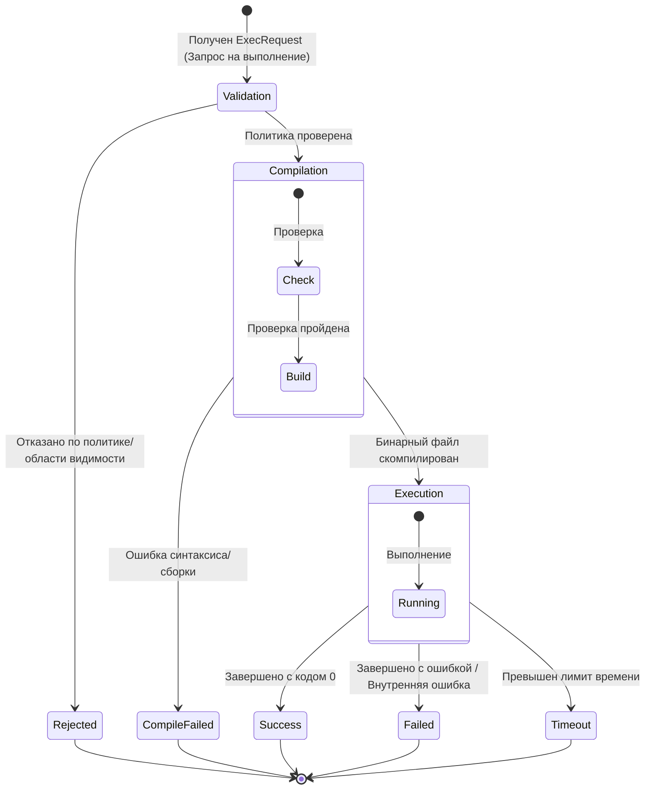
```mermaid
stateDiagram-v2
    direction TB
    [*] --> Validation : Получен ExecRequest (Запрос на выполнение)
    
    Validation --> Rejected : Отказано по политике/области видимости
    Validation --> Compilation : Политика проверена
    
    state Compilation {
        [*] --> Check : Проверка
        Check --> Build : Проверка пройдена
    }
    
    Compilation --> CompileFailed : Ошибка синтаксиса/сборки
    Compilation --> Execution : Бинарный файл скомпилирован
    
    state Execution {
        [*] --> Running : Выполнение
    }
    
    Execution --> Success : Завершено с кодом 0
    Execution --> Failed : Завершено с ошибкой / Внутренняя ошибка
    Execution --> Timeout : Превышен лимит времени
    
    Rejected --> [*]
    CompileFailed --> [*]
    Success --> [*]
    Failed --> [*]
    Timeout --> [*]
```

#### 3.3.3 Рабочий элемент совместного пространства
Использует `CollaborationEventKind` для сопоставления сборок мультиагентных проектов с семантикой ожидания/возобновления [4].

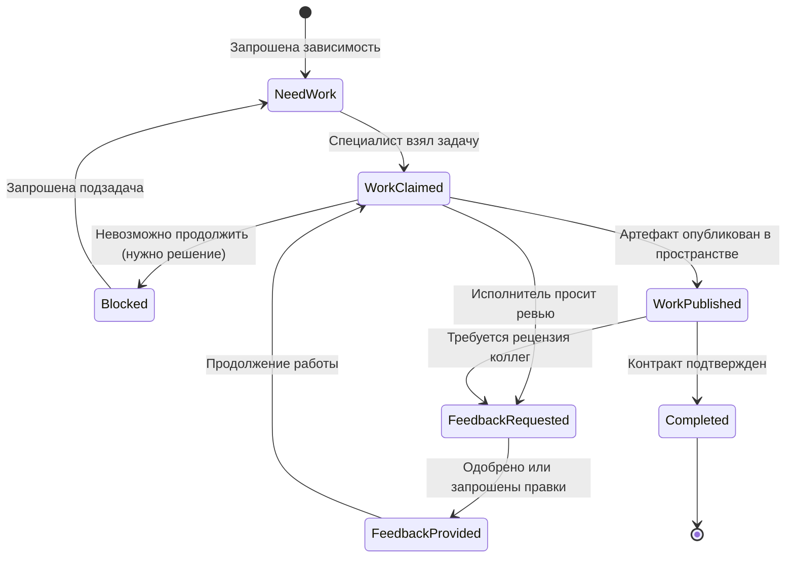
```mermaid
stateDiagram-v2
    direction TB
    [*] --> NeedWork : Запрошена зависимость
    
    NeedWork --> WorkClaimed : Специалист взял задачу
    
    WorkClaimed --> Blocked : Невозможно продолжить (нужно решение)
    Blocked --> NeedWork : Запрошена подзадача
    
    WorkClaimed --> FeedbackRequested : Исполнитель просит ревью
    FeedbackRequested --> FeedbackProvided : Одобрено или запрошены правки
    FeedbackProvided --> WorkClaimed : Продолжение работы
    
    WorkClaimed --> WorkPublished : Артефакт опубликован в пространстве
    
    WorkPublished --> FeedbackRequested : Требуется рецензия коллег
    WorkPublished --> Completed : Контракт подтвержден
    
    Completed --> [*]
```

#### 3.3.4 Выполнение графового рабочего процесса
Работает на базе машины состояний с передачей сообщений Pregel, включая супер-шаги, редьюсеры и прерывания [5, 6].

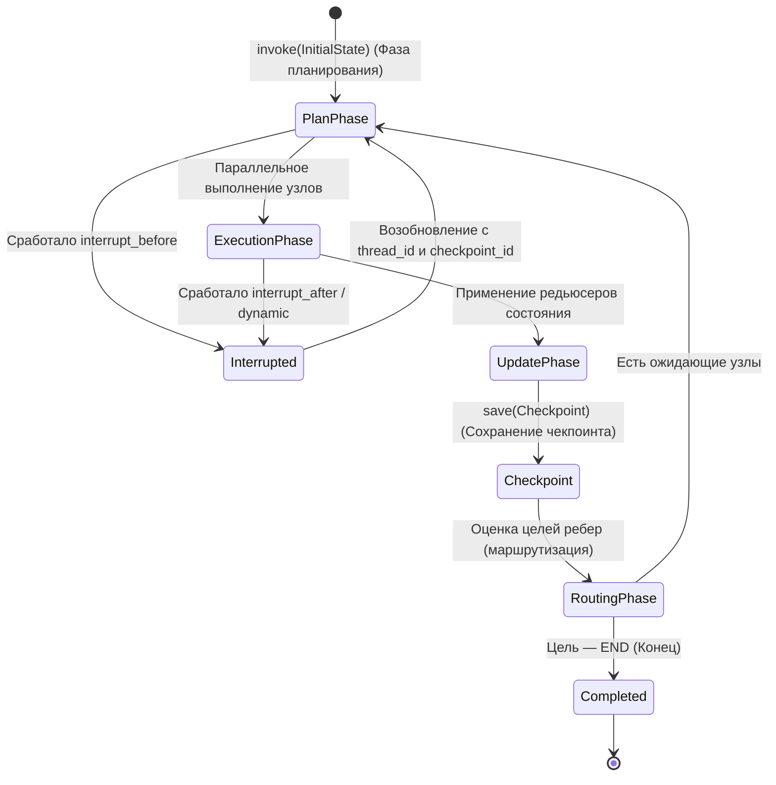
```mermaid
stateDiagram-v2
    direction TB
    [*] --> PlanPhase : invoke(InitialState) (Фаза планирования)
    
    PlanPhase --> Interrupted : Сработало interrupt_before
    PlanPhase --> ExecutionPhase : Параллельное выполнение узлов
    
    ExecutionPhase --> Interrupted : Сработало interrupt_after / dynamic
    ExecutionPhase --> UpdatePhase : Применение редьюсеров состояния
    
    UpdatePhase --> Checkpoint : save(Checkpoint) (Сохранение чекпоинта)
    
    Checkpoint --> RoutingPhase : Оценка целей ребер (маршрутизация)
    RoutingPhase --> PlanPhase : Есть ожидающие узлы
    RoutingPhase --> Completed : Цель — END (Конец)
    
    Interrupted --> PlanPhase : Возобновление с thread_id и checkpoint_id
    
    Completed --> [*]
```

#### 3.3.5 Состояние обработки файлов Gemini
Отслеживает удаленный жизненный цикл загруженных медиафайлов и документов [7].

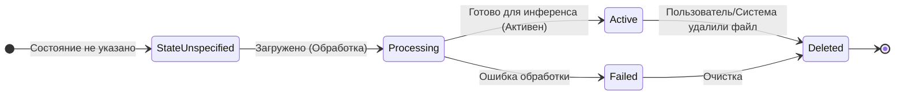
```mermaid
stateDiagram-v2
    direction LR
    [*] --> StateUnspecified : Состояние не указано
    StateUnspecified --> Processing : Загружено (Обработка)
    
    Processing --> Active : Готово для инференса (Активен)
    Processing --> Failed : Ошибка обработки
    
    Active --> Deleted : Пользователь/Система удалили файл
    Failed --> Deleted : Очистка
    
    Deleted --> [*]
```

#### 3.3.6 Состояние развертывания (Deployment Rollout)
Отслеживает фазу развертывания инфраструктуры агента ADK-Rust [8].

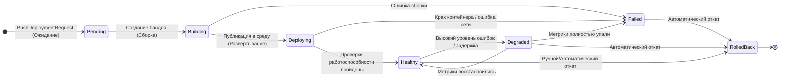
```mermaid
stateDiagram-v2
    direction LR
    [*] --> Pending : PushDeploymentRequest (Ожидание)
    
    Pending --> Building : Создание бандла (Сборка)
    Building --> Failed : Ошибка сборки
    
    Building --> Deploying : Публикация в среду (Развертывание)
    Deploying --> Failed : Крах контейнера / ошибка сети
    
    Deploying --> Healthy : Проверки работоспособности пройдены
    
    Healthy --> Degraded : Высокий уровень ошибок / задержка
    Degraded --> Healthy : Метрики восстановились
    Degraded --> Failed : Метрики полностью упали
    
    Healthy --> RolledBack : Ручной/Автоматический откат
    Degraded --> RolledBack : Автоматический откат
    Failed --> RolledBack : Автоматический откат
    
    RolledBack --> [*]
```

## 4. Исследование подсистем

### 4.1 Core / Domain Layer (adk-core)

Крейт `adk-core` служит фундаментом доменного слоя и определяет единый язык (ubiquitous language) для всего фреймворка ADK-Rust.

#### 4.1.1 Бизнес-проблема
*   **Независимость от инфраструктуры**: Позволяет менять базы данных и провайдеров LLM без изменения логики агентов.
*   **Предотвращение галлюцинаций инструментов**: `ResolvedContext` гарантирует соответствие системных инструкций доступным инструментам.
*   **Изоляция в Multi-tenant**: Строго типизированная система ID (`AdkIdentity`) исключает ошибки идентификации.

#### 4.1.2 Иерархия контекстов

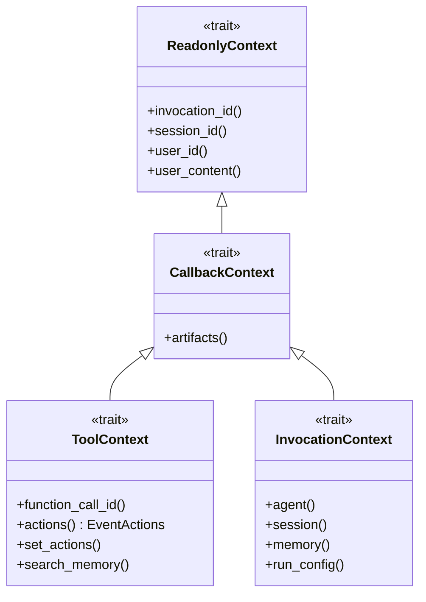
```mermaid
classDiagram
    class ReadonlyContext {
        <<trait>>
        +invocation_id()
        +session_id()
        +user_id()
        +user_content()
    }
    class CallbackContext {
        <<trait>>
        +artifacts()
    }
    class ToolContext {
        <<trait>>
        +function_call_id()
        +actions() EventActions
        +set_actions()
        +search_memory()
    }
    class InvocationContext {
        <<trait>>
        +agent()
        +session()
        +memory()
        +run_config()
    }
    
    ReadonlyContext <|-- CallbackContext
    CallbackContext <|-- ToolContext
    CallbackContext <|-- InvocationContext
```

#### 4.1.3 Ключевые сущности
*   **Идентификация**: Разделение на Auth Identity (`RequestContext`), Session Identity (`AdkIdentity`) и Execution Identity (`ExecutionIdentity`).
*   **События и контент**: Агенты возвращают `EventStream`. `Part` (Часть контента) поддерживает текст, бинарные данные, ссылки на файлы, вызовы функций и "рассуждения" (thinking).
*   **Система обратных вызовов (Callbacks)**: Перехват событий на этапах работы агента, модели и инструментов.

---

### 4.2 API / Interface Layer (adk-server, adk-cli)

Служит внешним краем системы, обеспечивая интеграцию с клиентами и другими агентами.

#### 4.2.1 Бизнес-проблема
*   **SSE и потоковая передача**: Клиенты получают ответы в реальном времени.
*   **Agent-to-Agent (A2A)**: Реализация JSON-RPC 2.0 для взаимодействия между распределенными агентами.
*   **Generative UI (A2UI)**: Поддержка протоколов динамического рендеринга интерфейсов.

#### 4.2.2 Архитектура сервера

```mermaid
classDiagram
    class ServerConfig {
        +agent_loader: Arc~AgentLoader~
        +session_service: Arc~SessionService~
        +security: SecurityConfig
    }
    class Router { <<Axum>> }
    class RuntimeController { +run_sse() }
    class SessionController { +create_session() }
    class A2aController { +handle_jsonrpc() }

    ServerConfig --> Router : injected via State
    Router --> RuntimeController : /run_sse
    Router --> SessionController : /sessions
    Router --> A2aController : /a2a
```

---

### 4.3 Storage / Persistence (adk-session, adk-memory, adk-artifact)

Обеспечивает состояние и непрерывность контекста.

#### 4.3.1 Бизнес-проблема
*   **Изоляция арендаторов**: Гарантия приватности сессий.
*   **Сжатие контекста**: Предотвращение исчерпания окна токенов LLM через саммаризацию.
*   **3-уровневое состояние**: Разделение на App, User и Session state.
*   **Семантическая память**: Долгосрочный отзыв фактов через векторный поиск (RAG).

#### 4.3.2 Бэкенды и алгоритмы
*   **Поддерживаемые БД**: SQLite, PostgreSQL (с pgvector), MongoDB, Redis, Neo4j.
*   **Алгоритм Halfvec**: Автоматическое переключение на `halfvec(N)` в Postgres для эмбеддингов высокой размерности (>2000), таких как Gemini.
*   **Маршрутизация префиксов состояния**: Ключи `app:`, `user:`, `temp:` определяют область персистентности.

---

### 4.4 Authentication / Security (adk-auth)

Обеспечивает безопасность автономных агентов и корпоративный контроль доступа.

#### 4.4.1 Бизнес-проблема
*   **RBAC для инструментов**: Контроль за выполнением кода и доступом к данным.
*   **Identity Flow**: Связывание OAuth/SSO с контекстом выполнения агента.
*   **Аудит**: Криптографическое доказательство действий агента.

#### 4.4.2 Модель безопасности
*   **Приоритет запрета (RBAC)**: Правила `deny` всегда подавляют `allow`.
*   **Декларативные Scopes**: Инструменты запрашивают области видимости через `required_scopes()`.
*   **SSO Провайдеры**: Готовая интеграция с Google, Azure AD, Okta, Auth0 и Generic OIDC.
*   **Кэширование JWKS**: Безопасная валидация подписей JWT с защитой от "thundering herd".

---

### 4.5 Observability & Evaluation (adk-eval)

*Валидация поведения агентов и возможность регрессионного тестирования.*

*   **Evaluator**: Основной компонент оценки.
*   **LLM Judge**: Использование сильных моделей для оценки качества ответов слабых агентов.
*   **Формат `.test.json`**: Стандартизированные наборы тестов и критериев (`criteria.rs`).

---

### 4.6 RAG & External Integrations (adk-rag, adk-tool, adk-browser)

Решает проблему изоляции LLM от внешних данных.

#### 4.6.1 Компоненты RAG
*   **Пайплайн**: Chunker -> EmbeddingProvider -> VectorStore -> Reranker.
*   **Markdown Chunker**: Иерархическое разбиение с сохранением заголовков.

#### 4.6.2 Model Context Protocol (MCP)
*   **McpToolset**: Трансляция удаленных инструментов MCP в локальные трейты ADK.
*   **Опрос длительных задач**: Асинхронный цикл для операций, превышающих время ожидания HTTP.

#### 4.6.3 Автоматизация браузера
*   **BrowserSessionPool**: Изоляция сессий WebDriver между пользователями.
*   **Browser Profile**: Группировка 46+ инструментов браузера в профили (Minimal, Scraping и др.) для экономии контекстного окна.

---

### 4.7 Configuration & Deployment (adk-deploy)

Мост между локальной разработкой и облачными средами.

#### 4.7.1 Бизнес-проблема
*   **Декларативная инфраструктура (IaC)**: Определение ресурсов в `adk-deploy.toml`.
*   **Reproducible Bundles**: Детерминированная упаковка бинарников и ресурсов.

#### 4.7.2 Конвейер Push-развертывания
1. Валидация манифеста.
2. Сборка (Release build) и архивация.
3. Вычисление SHA-256 чексуммы.
4. Загрузка в панель управления (multipart upload) с использованием токенов из системного Keyring.

#### 4.7.3 Scaffolding (cargo-adk)
*   Генерация проектов по шаблонам: `basic`, `tools`, `rag`, `api`, `openai`.
*   Автоматическое внедрение нужных флагов функций (`features`) в Cargo.toml.

### 5.1 ER-диаграмма (ERD)

Логическая структура хранения данных сессий и состояний (PostgreSQL / SQLite).

```mermaid
erDiagram
    APP_STATES ||--o{ USER_STATES : "contains"
    USER_STATES ||--o{ SESSIONS : "owns"
    SESSIONS ||--o{ EVENTS : "has"

    SESSIONS {
        string app_name PK
        string user_id PK
        string session_id PK
        jsonb state "Сессионное состояние"
    }

    EVENTS {
        string id PK
        string app_name PK, FK
        string user_id PK, FK
        string session_id PK, FK
        string invocation_id
        timestamp timestamp
        jsonb llm_response "Данные ответа LLM"
        jsonb actions "Побочные эффекты"
    }

    APP_STATES {
        string app_name PK
        jsonb state "Глобальное состояние приложения"
    }

    USER_STATES {
        string app_name PK
        string user_id PK
        jsonb state "Глобальное состояние пользователя"
    }
```

#### 5.1.1 Основные коллекции и уровни состояния
*   **SESSIONS (Сессии)**: Изоляция по составному ключу `(app_name, user_id, session_id)`.
*   **EVENTS (События)**: Журнал истории с каскадным удалением.
*   **APP_STATES**: Глобальные настройки приложения (префикс `app:`).
*   **USER_STATES**: Настройки пользователя между сессиями (префикс `user:`).

---

### 5.2 Документация сущностей (Entities)

| Сущность | Ключевые поля | Описание |
| :--- | :--- | :--- |
| **sessions** | `app_name`, `user_id`, `session_id` | Метаданные и локальное состояние диалога. |
| **events** | `id`, `invocation_id`, `llm_response`, `actions` | Неизменяемый лог сообщений и вызовов инструментов. |
| **memory_entries** | `content`, `embedding`, `timestamp` | Долгосрочная семантическая память с векторным поиском. |
| **rag_chunks** | `document_id`, `text`, `embedding` | Динамические коллекции для баз знаний. |

---

### 5.3 Архитектурные паттерны

1.  **Event Sourcing**: Состояние сессии восстанавливается/изменяется через дельты (`state_delta`) в цепочке событий.
2.  **Pregel (BSP)**: Оркестрация графа через параллельные "супер-шаги" и редьюсеры состояния.
3.  **Агент как инструмент (Agent-as-a-Tool)**: Рекурсивная композиция агентов.
4.  **Middleware / Decorator**: Защита инструментов через `ScopeGuard` и `ProtectedTool` без изменения их кода.
5.  **Circuit Breaker**: Предотвращение бесконечных циклов вызова сломанных инструментов для экономии токенов.

---

### 5.4 Карта и матрица интеграций

| Категория | Провайдеры / Системы | Протоколы |
| :--- | :--- | :--- |
| **Интеллект (LLM)** | Gemini, OpenAI, Anthropic, DeepSeek, Groq, Bedrock | REST, SSE, gRPC, WebSocket |
| **Голос (Realtime)** | LiveKit, ElevenLabs, Cartesia, Deepgram | WebRTC, WebSocket |
| **Инструменты** | MCP Servers, WebDriver (Selenium/Chrome) | Stdio, HTTP/SSE, WebDriver JSON Wire |
| **Хранение** | Postgres (pgvector), Redis, MongoDB, SurrealDB, Qdrant | Родные протоколы СУБД |
| **Безопасность** | Auth0, Okta, Azure AD, Google SSO | OAuth 2.0, OIDC |

---

### 5.5 Примеры кода (Implementation Examples)

#### 5.5.1 Определение инструмента (Tool)
```rust
#[tool]
async fn get_weather(args: WeatherArgs) -> Result<Value, AdkError> {
    Ok(json!({ "temp": 72, "condition": "sunny" }))
}
```

#### 5.5.2 Построение графового агента
```rust
let agent = GraphAgent::builder("processor")
    .node_fn("fetch", |ctx| async move { ... })
    .edge(START, "fetch")
    .edge("fetch", END)
    .build()?;
```

#### 5.5.3 Запуск сервера с A2A
```rust
let config = ServerConfig::new(agent_loader, session_service);
let app = create_app_with_a2a(config, Some("http://localhost:8080"));
axum::serve(listener, app).await?;
```

## Заключение

Проект adk-rust — это мощный модульный фреймворк для разработки ИИ-агентов на Rust, обеспечивающий высокую производительность, безопасность и гибкость в оркестрации сложных рабочих процессов.
