# Отчет об обратной разработке: bluep-js

### Step 1 Project overview

#### 1.1 Project Brief
Продукт `@bluepjs/vm` представляет собой **виртуальную машину для выполнения блюпринтов** (blueprints) системы `@bluepjs`. Он не является самостоятельным приложением, не хранит библиотеки и состояния автономно, а специально разработан для интеграции в другие проекты. Виртуальная машина выполняет алгоритмы, составленные из «узлов» (Nodes) — базовых блоков операций, и может работать как в серверной среде (Node.js), так и в браузере.

Продукт относится к сфере **визуального (графового/узлового) программирования**. В документации он характеризуется как «псевдо-типизированная» система программирования ("pseudo-typed" programming system). Для создания логики и управления компонентами используется официальная графическая среда разработки (IDE), которой виртуальная машина передает всю информацию о доступных узлах, типах данных, модулях и библиотеках.

На практике виртуальная машина предназначена для управления "акторами" (Actors) — внешними объектами, которые подчиняются её логике. Благодаря своей универсальности, предметная область применения продукта может охватывать различные сферы разработки:
- **Интернет вещей (IoT):** управление и написание логики для IoT-устройств.
- **Сетевое взаимодействие и коммуникация:** координация комнат веб-сокетов (WebSockets) и управление событиями чат-ботов.
- **3D-веб-разработка:** управление поведением 3D-объектов на сценах WebGL в браузере.

#### 1.2 Project Structure
```text
bluep-js/
├── LICENSE.md
├── README.md
├── package-lock.json
├── package.json
└── src/
    ├── context.js          # Управление контекстом выполнения
    ├── graph.js            # Графовая модель выполнения
    ├── index.js            # Точка входа, экспорт Vm и абстракций
    ├── types.js            # Базовые типы данных
    ├── utils.js            # Утилиты (клонирование, комбинирование)
    ├── vm.js               # Основной класс виртуальной машины
    ├── module/
    │   ├── abstract.js     # Базовый интерфейс AbstractModule
    │   ├── actor.js        # Менеджер акторов
    │   ├── core.js         # Обработка базовых событий ядра
    │   ├── cron.js         # Планировщик по cron-выражениям
    │   └── actor/          # Реализации акторов
    └── nodes/
        ├── abstract.js      # Базовый класс AbstractNode
        ├── index.js        # Индекс узлов
        ├── array/          # Операции с массивами
        ├── boolean/        # Логические операции
        ├── branches/       # Ветвления и циклы (If, Switch, For)
        ├── class/          # Работа с классами
        ├── color/          # Операции с цветом
        ├── datetime/       # Время и даты
        ├── enum/           # Перечисления
        ├── execute/        # Управление потоком выполнения
        ├── float/          # Числа с плавающей точкой
        ├── math/           # Математические операции
        ├── number/         # Числовые операции
        ├── string/         # Строковые операции
        ├── struct/         # Структуры
        ├── undefined/      # Неопределенные значения
        └── variable/       # Переменные
```

#### 1.3 Technology Stack
| Компонент | Назначение | Описание |
| :--- | :--- | :--- |
| **Core (Ядро VM)** | Движок выполнения | Инициализация и управление жизненным циклом виртуальной машины (запуск, остановка, управление библиотеками) в классе `Vm`. Выполнение графов и узлов (`graph.js`). Управление контекстом выполнения (`context.js`). |
| **Modules** | Интеграция и расширение | Базовый интерфейс `AbstractModule`. Включает стандартные модули: `core` (события ядра), `cron` (планировщик), `actor` (менеджер акторов). |
| **Actors** | Управление внешними объектами | Интерфейс `AbstractActor` для интеграции внешних объектов (веб-сокеты, IoT, 3D-объекты). Системные узлы: `ActorGet`, `ActorMethod`, `ActorState`. |
| **Nodes** | Блоки операций | Базовый класс `AbstractNode`. Встроенная библиотека узлов для массивов, логики, математики, строк, ветвлений, классов, цветов, дат и переменных. |
| **Graph Engine** | Исполнение алгоритмов | Создание графа узлов, выполнение в цикле `while (next)`, маршрутизация потока по слотам, поддержка ветвлений и циклов. |

#### 1.4 Project Type
Виртуальная машина для визуального (графового) программирования. Основной точкой входа является класс `Vm`, экспортируемый из главного модуля вместе с абстрактными классами `AbstractNode`, `AbstractModule`, `AbstractActor`.

**Жизненный цикл:**
- Асинхронные методы `start()` и `stop()` для управления VM и модулями
- Методы `runLibraryFunction`, `runLibraryConstructor`, `runLibraryMethod` для запуска сценариев

**Принцип работы:**
1. Инициализация графа и создание экземпляра `Graph`
2. Создание изолированного контекста `Context` для хранения данных выполнения
3. Цикл выполнения `while (next)` — выборка и выполнение узлов
4. Подготовка данных через `prepareAndExecute` — сбор входов от родительских узлов
5. Выполнение бизнес-логики узла в методе `execute(inputs)`
6. Маршрутизация потока по возвращаемому слоту (например, `'return'`, `'ifTrue'`)
7. Поддержка ветвлений и циклов через `executeBranch`

### Step 2 System Architecture investigation

#### 2.1 Domain Boundaries
Виртуальная машина `@bluepjs/vm` реализует единственный ограниченный контекст (Bounded Context) — **Blueprint Execution Engine**. Продукт не имеет внешних зависимостей и предназначен для встраивания в хост-приложения.

#### 2.2 Module Structure (C4 L3)

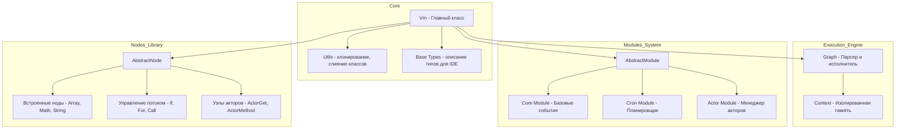

#### 2.3 System Context Diagram (C4 L1)

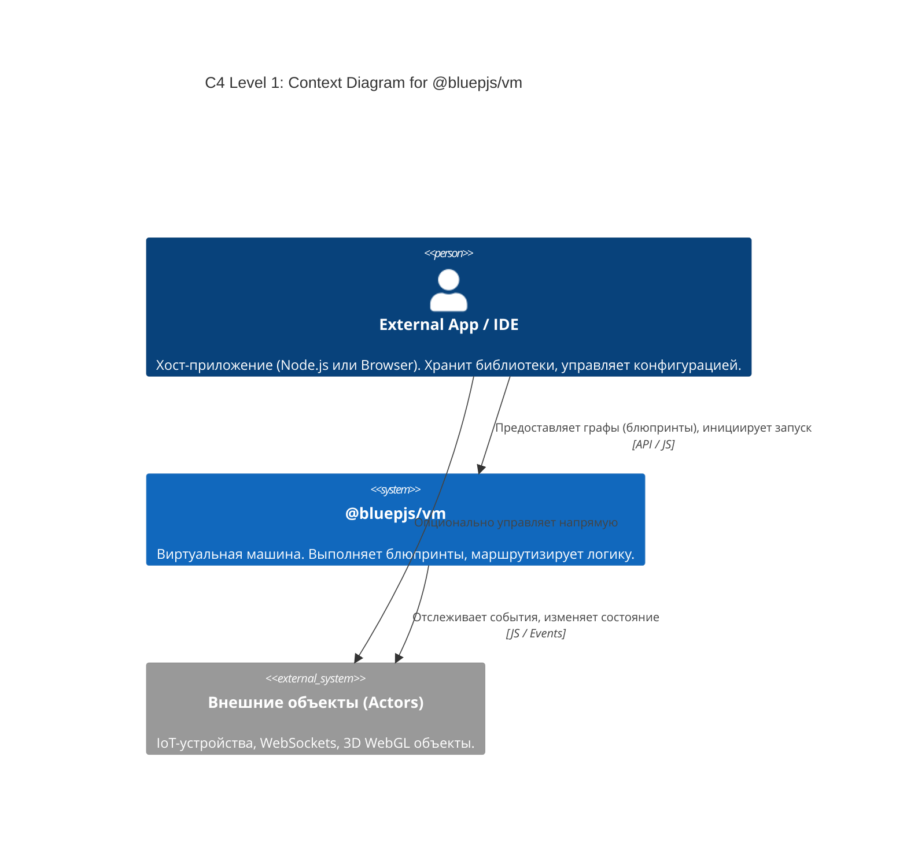

#### 2.4 Container Diagram (C4 L2)

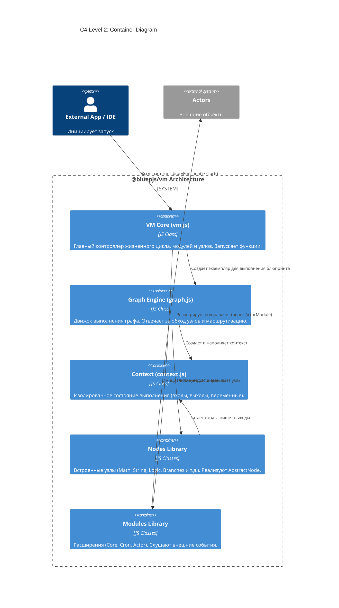

#### 2.5 Data Flow Diagram (DFD L0)

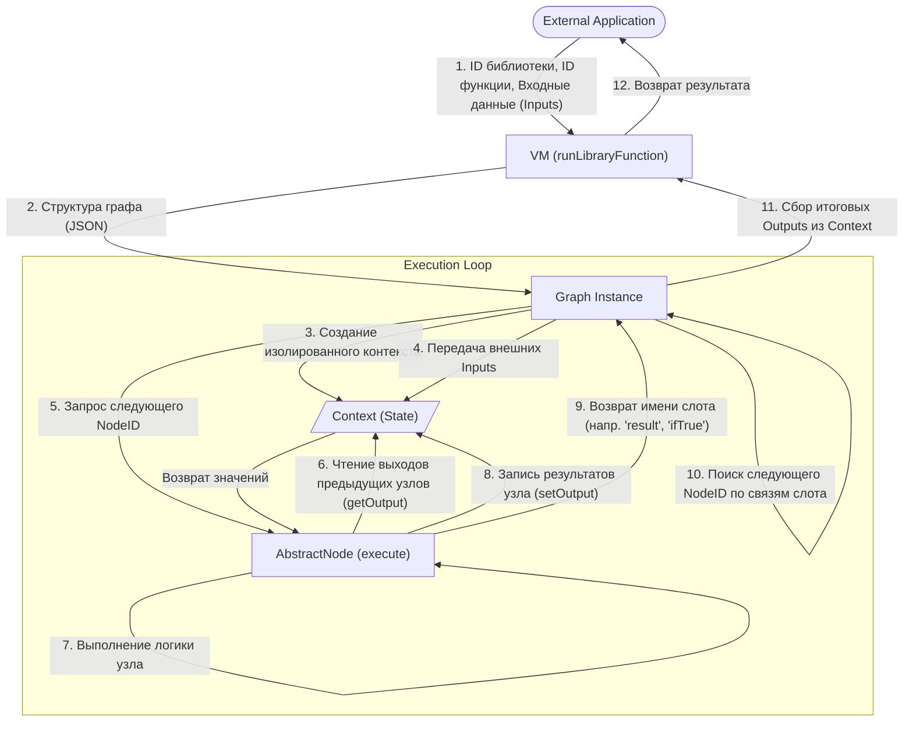

#### 2.6 Domain Language Glossary

| Термин | Описание |
| :--- | :--- |
| **Blueprint** | JSON-структура, описывающая граф узлов и связи между ними |
| **Node** | Базовый блок операции в графе. Имеет входы (inputs), выходы (outputs) |
| **Slot** | Конкретный вход или выход узла. Типы: `basic/execute` (поток управления), данные |
| **Connection** | Связь между выходным слотом одного узла и входным слотом другого |
| **Actor** | Внешний объект (IoT, WebSocket, 3D), управляемый VM через AbstractActor |
| **Module** | Расширение VM для обработки событий, планирования, управления акторами |
| **Context** | Изолированное хранилище состояния выполнения одного графа |
| **Pseudo-typed** | Система типов для визуального программирования, описываемая в JSON-типах |

### Step 3 Runtime behavior investigation

#### 3.1 Entry Points

| Метод | Описание |
| :--- | :--- |
| `start()` | Асинхронный запуск VM. Инициализирует модули, устанавливает `_run = true` |
| `stop()` | Асинхронная остановка VM. Останавливает модули, устанавливает `_run = false` |
| `runLibraryFunction(lib, fn, inputs)` | Запуск blueprint-функции из библиотеки |
| `runLibraryConstructor(self, lib, cls, fn, inputs)` | Запуск конструктора класса с передачей `self` |
| `runLibraryMethod(self, lib, cls, fn, inputs)` | Запуск метода класса для объекта `self` |

#### 3.2 Execution Loop (while next)

1. Создание объекта `Context` с входящими аргументами и переменными
2. Определение стартового узла через `entry()`
3. Цикл `while (next)`: вызов `executeNode(nodeId, ctx)`
4. Узел возвращает имя слота (`'return'`, `'ifTrue'` и т.д.)
5. Поиск следующего узла по связям возвращённого слота
6. При отсутствии связей — `next = null`, цикл завершается

#### 3.3 Data Preparation (prepareAndExecute)

Каждый узел перед выполнением собирает данные через `prepareAndExecute()`:
- Итерация по входам (кроме `basic/execute`)
- При наличии связи с другим узлом — рекурсивное выполнение родительского узла
- Чтение результата через `context.getOutput(nodeFrom, slotFrom)`
- Вызов `execute(inputs)` только после сбора всех данных

#### 3.4 Slot Routing

| Узел | Возвращаемые слоты |
| :--- | :--- |
| Математические, строковые | `'return'` |
| Условие `If` | `'ifTrue'`, `'ifFalse'` |
| Цикл `For` | `'body'`, `'done'` |
| Конструкция `Switch` | Множественные case-слоты |

#### 3.5 Branches and Cycles (executeBranch)

- Циклы (`For`, `Each`) используют `callOutput('body')` для выполнения тела цикла
- `executeBranch` запускает вложенный цикл `while (next)` для переданной ветки
- При завершении ветки управление возвращается в родительский узел

#### 3.6 Sequence Diagram

```mermaid
sequenceDiagram
    autonumber
    actor App as Host Application
    participant VM as Vm Engine
    participant G as Graph Instance
    participant C as Context
    participant N1 as Execute Node (e.g. CallFunction)
    participant N2 as Modifier Node (e.g. Math/Get)

    App->>VM: runLibraryFunction(lib, fn, inputs)
    VM->>G: new Graph(), load(blueprint structure)
    VM->>G: execute(inputs)
    G->>C: new Context(vm, self)
    C-->>G: (context initialized)

    rect rgb(240, 240, 250)
        Note right of G: Main Execution Loop: while(next)
        G->>N1: executeNode(nodeId, context)
        N1->>N1: prepareAndExecute()

        opt Data dependencies resolution
            Note right of N1: Checks input connections
            N1->>G: executeNode(parentNode, context)
            G->>N2: prepareAndExecute()
            N2->>N2: execute(inputs)
            Note right of N2: Calculates math / reads variables
            N2->>C: setOutput(slot, value)
            N2-->>G: returns undefined (no execute slots)
            G-->>N1: parent node executed
            N1->>C: getOutput(parent, slot)
            C-->>N1: value
        end

        N1->>N1: execute(resolved_inputs)
        Note right of N1: Performs main node logic
        N1->>C: setOutput(node_results)
        N1-->>G: returns "return" (or "ifTrue", etc.)
    end

    G->>G: next = find node connected to nextSlot
    Note right of G: Loop repeats until next is null

    G->>C: collect final graph outputs
    G-->>VM: getResult()
    G-->>App: final return values
  
  ```

#### 3.7 Data Flow Diagram (DFD L1)

```mermaid
  flowchart TD
      Inputs([Входящие параметры / События])
      Outputs([Итоговый результат])

      VMCore("1. Vm.runLibraryFunction")
      GraphInit("2. Graph.execute")
      NodePrep("3. Node.prepareAndExecute")
      NodeExec("4. Node.execute")
      GraphRout("5. Маршрутизация - Graph while loop")

      CtxInputs["(Context: Inputs & Variables)"]
      CtxOutputs["(Context: Node Outputs)"]

      Inputs --> VMCore
      VMCore -->|Структура графа| GraphInit
      GraphInit -->|Инициализация начальных данных| CtxInputs

      GraphInit -->|Запуск entry node| NodePrep

      NodePrep -->|Запрос зависимостей| GraphRout
      NodePrep <-->|Чтение данных getOutput| CtxOutputs
      CtxInputs -->|Чтение переменных| NodePrep

      NodePrep -->|Подготовленные Inputs| NodeExec
      NodeExec -->|Запись промежуточных результатов| CtxOutputs
      NodeExec -->|Возврат выходного слота| GraphRout

      GraphRout -->|Определение следующего Node ID| NodePrep
      GraphRout -->|Если next = null, сбор выходов| Outputs
```

#### 3.8 State Machine Diagrams

**3.8.1 VM State Machine (Жизненный цикл виртуальной машины)**

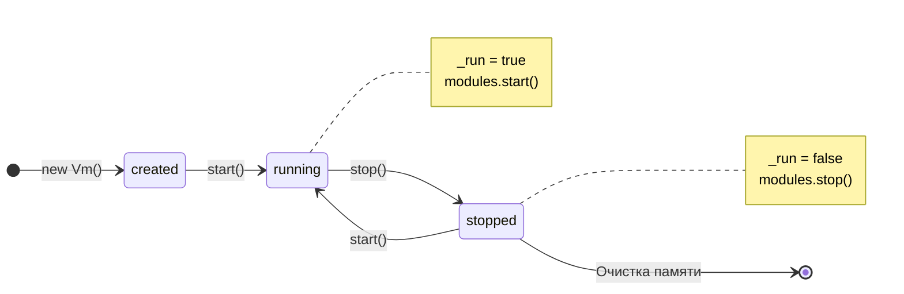

**3.8.2 Graph Execution State (Состояния выполнения графа)**

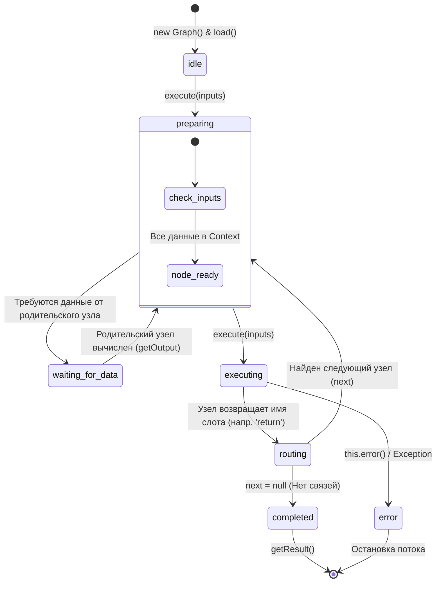

**3.8.3 Actor State Machine (Жизненный цикл актора)**

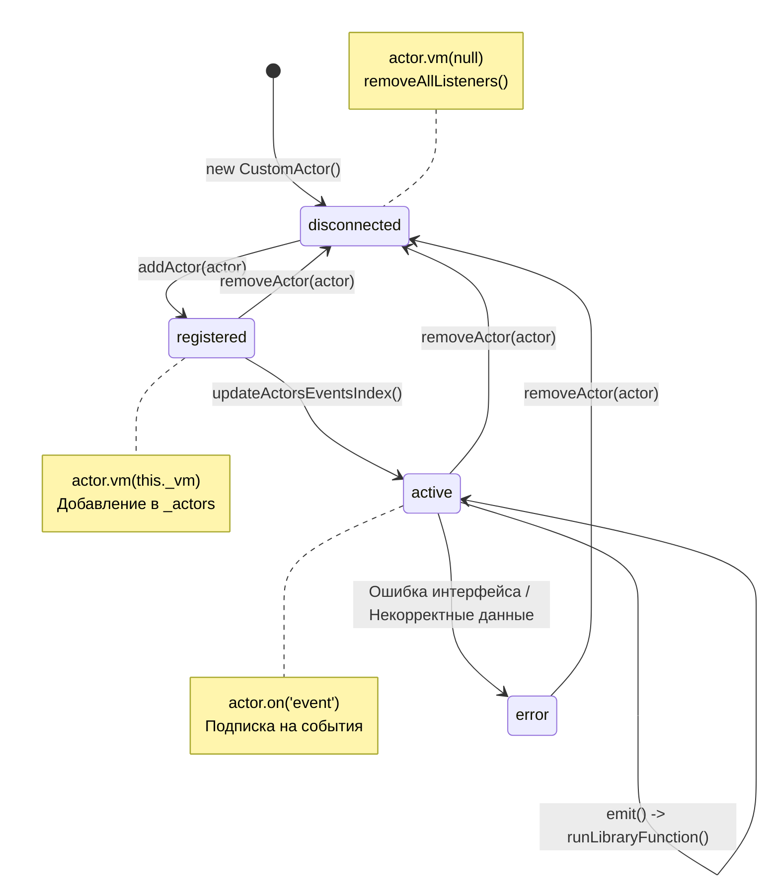

**3.8.4 CronModule State (Состояния планировщика)**

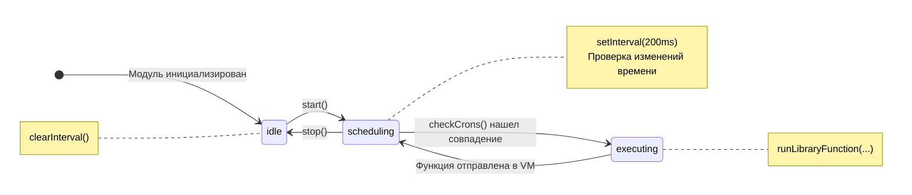

### 4.1 Core / Domain Layer (Ядро VM)

#### 4.1.1 Бизнес-задача ядра VM
Ядро решает задачу **изолированного выполнения визуальных программ (блюпринтов)**, транслируя графовую модель в последовательные асинхронные вызовы JavaScript.

**Ключевые аспекты:**
- **Встраиваемость:** VM не работает как самостоятельное приложение, встраивается в хост-приложение (Node.js или браузер)
- **Слабая связность (Agnostic):** Ядро не заботится о валидности библиотек — эта задача перекладывается на IDE
- **Масштабируемость:** Можно запустить множество независимых инстансов VM с разными конфигурациями

#### 4.1.2 Классы ядра

| Класс | Назначение |
|:------|:-----------|
| **Vm** (`src/vm.js`) | Оркестратор. Управляет реестрами (модули, типы, узлы), хранит загруженные библиотеки графов |
| **Graph** (`src/graph.js`) | Движок выполнения. Отвечает за обход графа, связывание узлов, разрешение зависимостей |
| **Context** (`src/context.js`) | Состояние (Memory Sandbox). Изолированная "песочница" памяти для выполнения графа |

#### 4.1.3 Ключевые свойства Vm

| Свойство | Описание |
|:--------|:--------|
| `_libraries` | Объект с загруженными библиотеками блюпринтов |
| `_types`, `_nodes`, `_modules` | Реестры базовых типов, классов узлов и активных модулей |
| `_run` | Булевый флаг состояния активности VM |
| `_console` | Объект логгера (по умолчанию `console`) |

#### 4.1.4 Конфигурация VM

| Параметр | Значение по умолчанию | Описание |
|:---------|:--------------------|:---------|
| `debug` | `false` | Флаг включения отладочной информации |
| `_libraries` | `null` | Хранилище для загруженных графов |
| `_run` | `false` | Машина создается остановленной |
| `_modules` | CoreModule, CronModule, ActorModule | Автоматически инициализируются базовые модули |

#### 4.1.5 Жизненный цикл VM

| Состояние | Переход | Описание |
|:---------|:--------|:---------|
| created | `new Vm()` | Машина создана, загружены реестры, запуски блокируются |
| running | `start()` | `_run = true`, модули запускают фоновые процессы |
| running | `stop()` | `_run = false`, модули останавливают фоновые процессы |
| stopped | `start()` | Повторный запуск |
| stopped | `Очистка памяти` | Уничтожение инстанса |

#### 4.1.6 Точки входа (Entry Points)

| Метод | Назначение |
|:------|:-----------|
| `runLibraryFunction(lib, fn, inputs)` | Стандартный запуск функции |
| `runLibraryConstructor(self, lib, cls, fn, inputs)` | Запуск конструктора класса |
| `runLibraryMethod(self, lib, cls, fn, inputs)` | Запуск метода ООП-класса |

#### 4.1.7 Диаграмма взаимодействия Core-компонентов

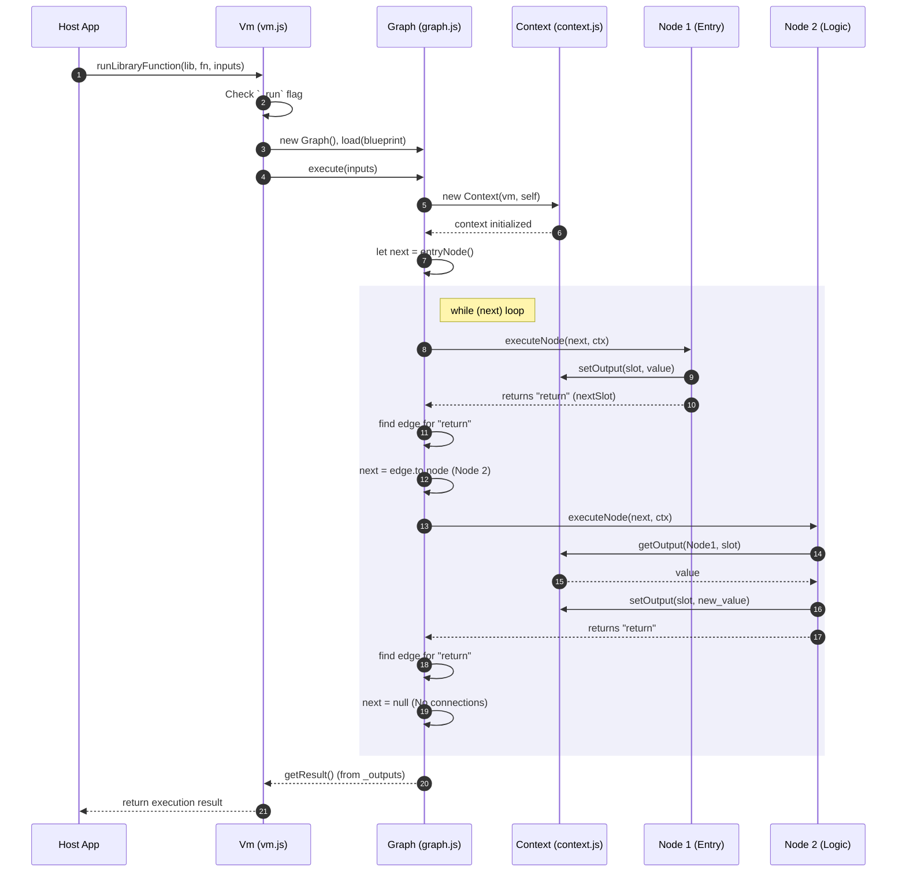

### 4.2 Modules System

#### 4.2.1 Базовый контракт AbstractModule

| Метод | Описание |
|:------|:---------|
| `constructor(vm)` | Принимает и сохраняет ссылку на Vm |
| `static metadata()` / `metadata()` | Возвращает метаданные модуля (code, name) |
| `vm()` | Геттер, возвращает привязанный инстанс VM |
| `async start()` / `async stop()` | Асинхронные методы жизненного цикла |
| `libraryUpdate()` | Хук при обновлении библиотек |

#### 4.2.2 Модули ядра

| Модуль | Назначение |
|:-------|:-----------|
| **CoreModule** | Предоставляет базовые системные события (`start`) и класс EventEmitter для блюпринтов |
| **CronModule** | Планировщик задач по cron-выражениям. Интервал проверки: 200мс |
| **ActorModule** | Менеджер акторов для интеграции с внешними объектами |

#### 4.2.3 Расширяемость модулей

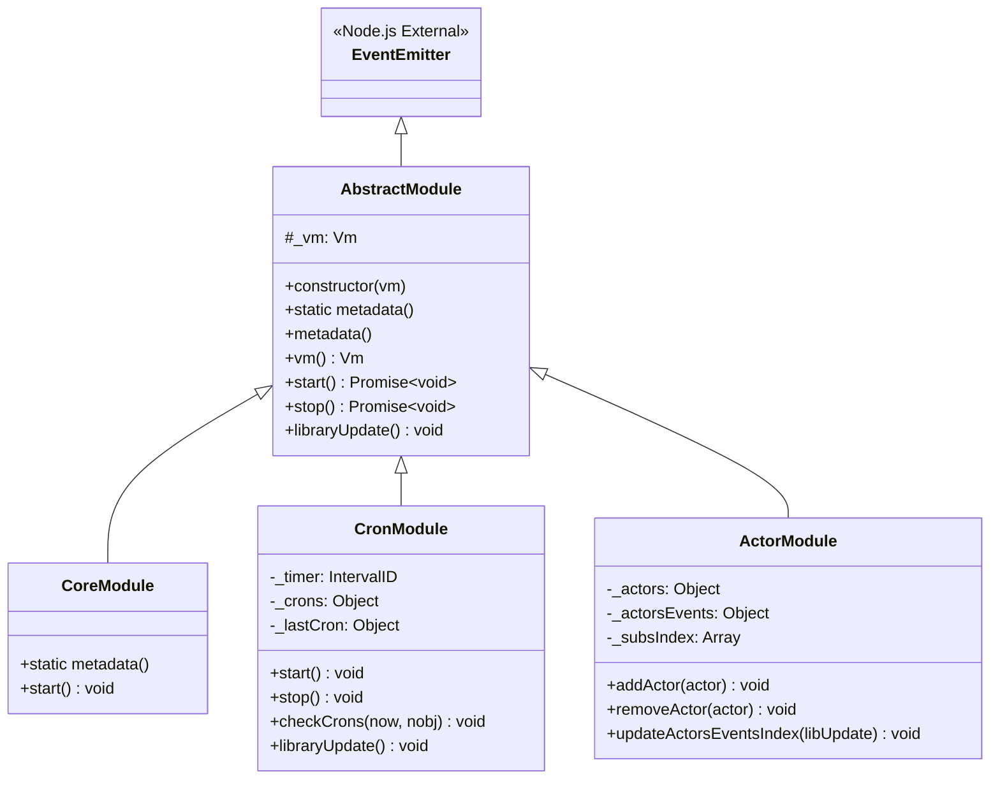

#### 4.2.4 Добавление нового модуля

1. Создать класс, наследующий `AbstractModule`
2. Реализовать статический метод `metadata()`, вернув уникальный `code` и `name`
3. Опционально реализовать `start()`, `stop()` и `libraryUpdate()`
4. Зарегистрировать: **`vm.addModule(ModuleClass)`**

### 4.3 Actors System

#### 4.3.1 Интерфейс AbstractActor

| Метод | Описание |
|:------|:---------|
| `constructor(id)` | Генерирует уникальный `_id`, инициализирует `_state = {}` |
| `static metadata()` / `metadata()` | Возвращает метаданные актора (состояния, методы, события) |
| `vm(next)` | Геттер/сеттер для привязки VM |
| `state(code)` | Возвращает внутреннее состояние или конкретное поле |
| `async method(method, inputs)` | **Обязателен для переопределения** — обработчик команд от VM |

#### 4.3.2 Базовые системные узлы для акторов

| Узел | Код | Назначение |
|:-----|:----|:-----------|
| ActorGet | `actor/get` | Запрос инстанса актора по ID |
| ActorState | `actor/state` | Чтение внутреннего состояния актора |
| ActorMethod | `actor/method` | Асинхронный вызов метода актора |

#### 4.3.3 Примеры реализаций акторов

| Тип актора | Среда | Описание |
|:-----------|:------|:---------|
| WebSocketActor | Node.js | Перехватывает сообщения из сокета, генерирует `emit('message')` |
| IoTActor | Embedded | Читает данные с датчиков, генерирует события `onTempChange` |
| Actor3D | Browser | 3D-модель (Three.js), события кликов, команды движения |

#### 4.3.4 Паттерн использования акторов

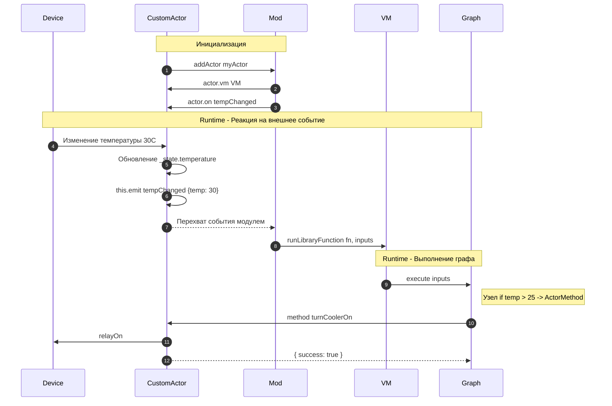

### 4.4 Nodes Library

#### 4.4.1 Базовый класс AbstractNode

| Метод | Описание |
|:------|:---------|
| `static metadata()` | Возвращает объект с описанием узла (имя, код, тип, входы, выходы) |
| `prepareAndExecute()` | Сердце логики: проверяет зависимости, вызывает `execute(inputs)` |
| `execute(inputs)` | Асинхронный метод с бизнес-логикой узла |
| `error(msg, ...objs)` | Вывод сообщения об ошибке через логгер VM |

#### 4.4.2 Категории узлов

| Категория | Узлы |
|:----------|:------|
| **Массивы** | ArrayEach, Push, Pop, Shift, Unshift, Concat, Slice, Includes |
| **Математика** | NumberPlus/Minus/Divide/Multiply, FloatPlus/Minus, MathAbs, MathSin, MathCos, MathPow |
| **Логика** | If, Switch, BooleanAnd/Or/Not/Eq, NumberIsGreater/IsLess |
| **Строки** | StringAppend, Replace, Slice, Length, Includes, ToUpperCase, ToLowerCase |
| **Классы/OOP** | New, ClassMethod, ClassVariableGet, ClassVariableSet, Constructor |
| **Цвета** | ColorToRgb, ColorToHsl, RgbToColor, HlsToColor (библиотека `colord`) |
| **Даты** | Now, DatetimeCreate, DatetimeToString (библиотека `dayjs`) |

#### 4.4.3 Создание кастомного узла

```javascript
class MyCustomNode extends AbstractNode {
  static metadata() {
    return {
      name: 'My Custom Multiply',
      code: 'custom/multiply',
      type: 'modifier',
      inputs: {
        valA: { code: 'valA', name: 'A', type: 'basic/number' },
        valB: { code: 'valB', name: 'B', type: 'basic/number' }
      },
      outputs: {
        result: { code: 'result', name: 'Result', type: 'basic/number' }
      }
    };
  }

  async execute(inputs) {
    const ret = (inputs.valA || 0) * (inputs.valB || 0);
    this.setOutput('result', ret);
  }
}
```

#### 4.4.4 Регистрация узла в VM

```javascript
vm.registerNode(MyCustomNode);
```

#### 4.4.5 Диаграмма механизма prepareAndExecute

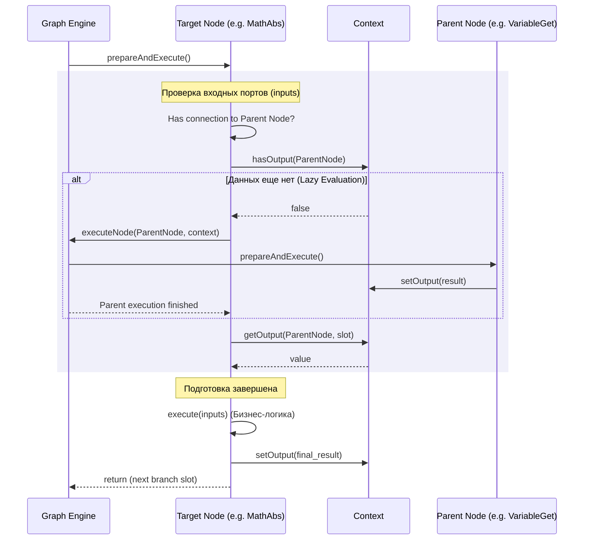

### 4.5 Configuration Management

#### 4.5.1 Реестры VM

| Реестр | Назначение | Как пополняется |
|:-------|:-----------|:----------------|
| `_nodes` | Классы всех доступных узлов, индексированные по `meta.code` | `registerNode(Class)` |
| `_modules` | Инстансы активных модулей | `addModule(ModuleClass)` |
| `_types` | Зарегистрированные типы данных (для IDE) | `BaseTypes` при создании VM |

#### 4.5.2 Управление библиотеками

| Метод | Назначение |
|:------|:-----------|
| `libraries(next)` | Геттер/сеттер `_libraries` |
| `updateLibraries(libs)` | Обновление + оповещение модулей (`libraryUpdate()`) |
| `Graph.load(graph)` | Загрузка и клонирование структуры графа |

#### 4.5.3 Консоль и логирование

| Свойство | Описание |
|:---------|:---------|
| `_console` | Объект логгера (по умолчанию `console.log/error`) |
| `_debug` | Флаг отладки (вывод с префиксом `'DEBUG#'`) |
| `console(next)` | Геттер/сеттер для подмены логгера |

### 4.6 Background Jobs / Schedulers (CronModule)

#### 4.6.1 Архитектура CronModule

| Компонент | Описание |
|:----------|:---------|
| `_crons` | Кэш закэшированных расписаний |
| `_lastCron` | Метка последней проверки (точность до секунд) |
| `_timer` | IntervalID таймера проверки |

#### 4.6.2 Цикл работы планировщика

1. `libraryUpdate()`: Сканирует блюпринты, парсит cron-выражения (`cron-parser`)
2. `start()`: Запускает `setInterval(200ms)`
3. `checkCrons()`: На каждом тике сравнивает время с расписаниями
4. При совпадении: `vm.runLibraryFunction('default', fnCode, {now})`

---

## Step 5 Data Model

### 5.1 Graph JSON Schema

```json
{
  "name": "My Function",
  "type": "function",
  "library": "default",
  "entry": "node-id-1",
  "context": {
    "inputs": {
      "arg1": { "code": "arg1", "type": "basic/string", "value": "default_val" }
    },
    "outputs": {},
    "variables": {
      "localCounter": { "code": "localCounter", "type": "basic/number", "value": 0 }
    }
  },
  "graph": {
    "nodes": {
      "node-id-1": { },
      "node-id-2": { }
    }
  }
}
```

### 5.2 Node Definition

```json
"node-id-1": {
  "code": "float/plusFloat",
  "type": "modifier",
  "data": {},
  "inputs": {
    "valA": { "type": "basic/float", "connections": { }, "value": 10 },
    "valB": { "type": "basic/float", "connections": {} }
  },
  "outputs": {
    "result": { "type": "basic/float", "connections": { } }
  }
}
```

### 5.3 Connections / Cables

```json
// outputs узла-источника
"outputs": {
  "result": {
    "type": "basic/float",
    "connections": {
      "edge-id-xyz": { "to": { "node": "node-id-2", "slot": "valA" } }
    }
  }
}

// inputs узла-приёмника
"inputs": {
  "valA": {
    "type": "basic/float",
    "connections": {
      "edge-id-xyz": { "from": { "node": "node-id-1", "slot": "result" } }
    }
  }
}
```

### 5.4 Blueprint Library Structure

```json
{
  "default": {
    "name": "My Project Library",
    "functions": {
       "func-id-1": { /* Graph JSON */ }
    },
    "classes": {
       "class-id-1": {
          "name": "MyCustomActor",
          "extends": { },
          "schema": { },
          "methods": {
             "method-id-1": { /* Graph JSON */ }
          }
       }
    }
  }
}
```

### 5.5 Pseudo-types System

| Категория | Типы |
|:----------|:-----|
| **Типы потока** | `basic/execute` — белый (#FFF), определяет последовательность обхода |
| **Базовые данные** | `basic/string`, `basic/number`, `basic/float`, `basic/boolean`, `basic/object`, `basic/color`, `basic/datetime` |
| **Шаблонные** | `basic/template` — динамический тип для generic-узлов |
| **Объектные/ООП** | `bluep/class`, `bluep/struct`, `bluep/enum`, `bluep/actor` |

### 5.6 Entity-Relationship Diagram

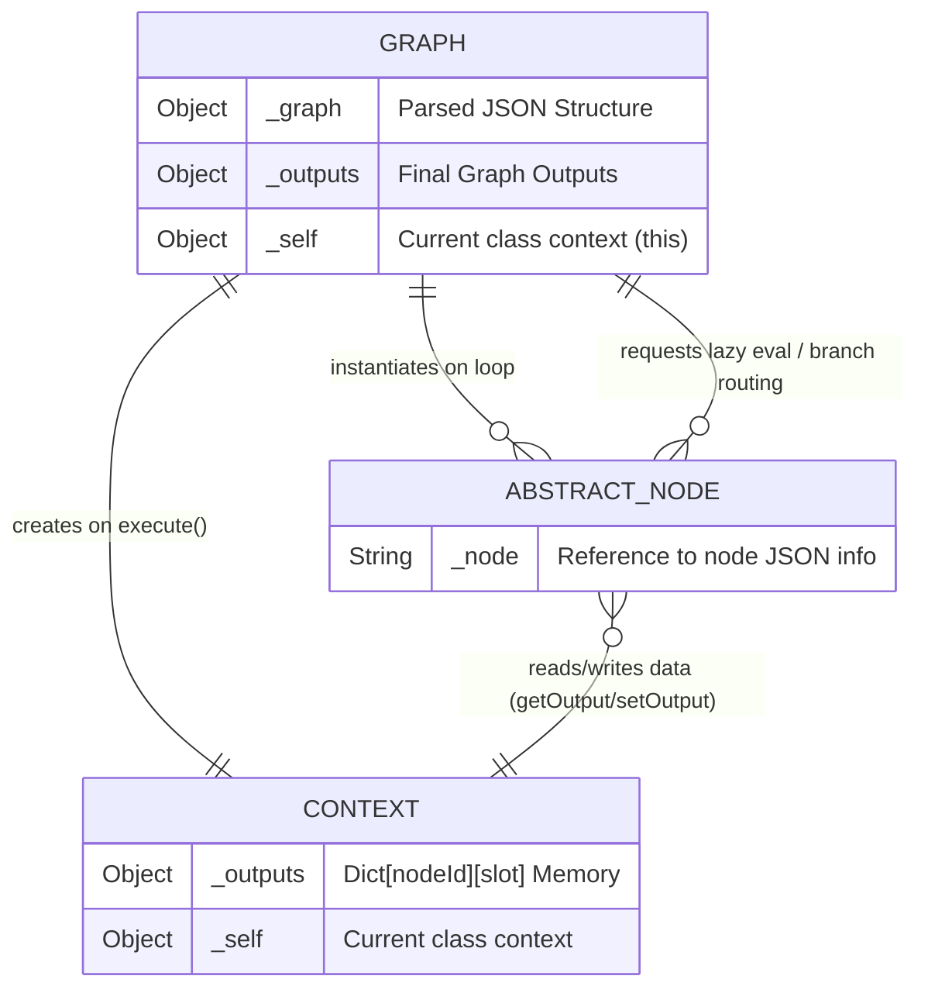

---

## Step 6 Implementation Recommendations

### 6.1 Сильные стороны архитектуры
- Чёткое разделение на подсистемы с единым контрактом (AbstractModule, AbstractActor, AbstractNode)
- Ленивые вычисления (lazy evaluation) через prepareAndExecute
- Слабая связность: VM не заботится о валидности данных, это задача IDE
- Расширяемость через модульную систему

### 6.2 Потенциальные улучшения
- Отсутствие строгой валидации типов в runtime
- Нет встроенного механизма кэширования результатов
- Ограниченный набор встроенных узлов (нет map/filter для массивов, нет vec2/vec3)
- CronModule использует фиксированный интервал 200ms (может быть избыточно)

### 6.3 Рекомендации по интеграции
1. Для веб-приложений: использовать WebSocketActor для real-time коммуникации
2. Для IoT: создать кастомный актор, наследующий AbstractActor
3. Для игр/3D: использовать Actor3D для интеграции с Three.js
4. Для планировщиков: добавить cron-функции в библиотеку с событием `cron`

---

*Отчёт сгенерирован автоматически с помощью BMAD RE Auto Explorer*
*Дата: 2026-03-25*
