# Reverse Engineering Report: graphiti

### Step 1 Project overview

#### 1.1 Project Brief
Graphiti is an open-source Python framework for building and querying temporally-aware knowledge graphs (context graphs) for AI agents. It provides agents with a continuously evolving "memory" that tracks facts and relationships over time, overcoming the limitations of static RAG approaches. Key capabilities include incremental graph construction, temporal fact management with validity windows, strict data provenance tracking, and hybrid retrieval (semantic, keyword, and graph traversal).

#### 1.2 Project Structure
```text
graphiti/
├── .github/                # CI/CD workflows and GitHub templates
├── examples/               # Usage examples (Azure OpenAI, Podcast, etc.)
├── graphiti_core/          # Core Python framework library
│   ├── driver/             # Database drivers (FalkorDB, Neo4j, etc.)
│   ├── embedder/           # Embedding clients
│   ├── llm_client/         # LLM integration clients
│   ├── models/             # Pydantic models
│   ├── search/             # Search strategies and pipelines
│   └── telemetry/          # OpenTelemetry integration
├── mcp_server/             # Model Context Protocol server
├── server/                 # FastAPI REST API service
├── tests/                  # Pytest suite and evaluations
├── pyproject.toml          # Build and dependency configuration
└── README.md               # Project documentation
```

#### 1.3 Technology Stack
| Category | Technology | Description |
| :--- | :--- | :--- |
| **Language** | Python 3.10+ | Primary programming language. |
| **API Framework** | FastAPI | Used for the REST API server. |
| **MCP** | FastMCP | Implements the Model Context Protocol. |
| **Data Modeling** | Pydantic | Extensive use for models and DTOs. |
| **Databases** | FalkorDB, Neo4j, Kuzu | Supported graph database backends. |
| **AI/LLM** | OpenAI, Anthropic, Gemini | Native integrations for LLMs and embeddings. |
| **Package Manager**| uv | Primary dependency and environment manager. |
| **Tooling** | Ruff, Pyright, Pytest| Linting, type checking, and testing framework. |
| **Observability** | OpenTelemetry | Distributed tracing for graph operations. |

#### 1.4 Project Type
Python Library/Framework with bundled Microservices (REST API and MCP servers).

#### 1.5 Feature: Temporal Fact Management

**Temporal Fact Management** is a core capability of Graphiti that differentiates it from static knowledge graphs and traditional RAG architectures. It employs a bi-temporal data model to explicitly track the validity windows of facts, ensuring the graph maintains a historical record of how information changes over time [1], [2], [3]. When facts change, older facts are invalidated—not deleted—allowing the system to query what is true now versus what was true in the past [2].

Below is a comprehensive technical breakdown of its architecture, data flow, key components, and underlying algorithms.

##### 1. Core Data Structures
Temporal tracking in Graphiti relies heavily on tracking "system time" (when data was processed) and "world time" (when the fact was actually true). The primary data structures handling this are **`EntityEdge`** (representing facts) and **`EpisodicNode`** (representing source events). 

**`EntityEdge` Temporal Properties** [4], [5]:
*   `created_at`: The system datetime when the edge was created.
*   `expired_at`: The system datetime when the edge was conceptually expired/removed.
*   `valid_at`: The world datetime when the fact became true or was established. 
*   `invalid_at`: The world datetime when the fact stopped being true or ended.
*   `episodes`: A list of episode UUIDs providing provenance to the source data [6], [5].

**`EpisodicNode` Temporal Properties** [7]:
*   `created_at`: System ingestion time.
*   `valid_at`: The datetime when the original document or interaction actually occurred (used as the `REFERENCE_TIME` for extraction).

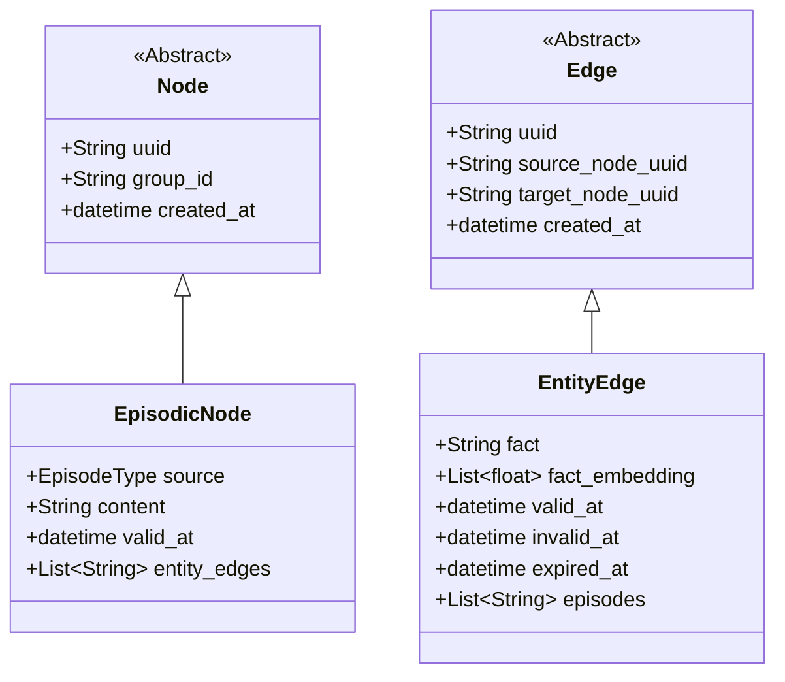
```mermaid
classDiagram
    class Node {
        <<Abstract>>
        +String uuid
        +String group_id
        +datetime created_at
    }
    class EpisodicNode {
        +EpisodeType source
        +String content
        +datetime valid_at
        +List~String~ entity_edges
    }
    class Edge {
        <<Abstract>>
        +String uuid
        +String source_node_uuid
        +String target_node_uuid
        +datetime created_at
    }
    class EntityEdge {
        +String fact
        +List~float~ fact_embedding
        +datetime valid_at
        +datetime invalid_at
        +datetime expired_at
        +List~String~ episodes
    }
    Node <|-- EpisodicNode
    Edge <|-- EntityEdge
```

##### 2. Architecture & Key Components
Temporal Fact Management is orchestrated through the synergy between LLM extraction prompts, graph maintenance utilities, and specialized database queries.

*   **Extraction Prompts (`extract_edges.py`)**: Uses a `REFERENCE_TIME` (derived from the `EpisodicNode.valid_at`) to resolve relative temporal expressions (e.g., "last week") and bind them to strict ISO 8601 UTC timestamps [8], [9].
*   **Deduplication Prompts (`dedupe_edges.py`)**: Responsible for contradiction detection. It receives existing facts and new fact candidates, instructing the LLM to identify `contradicted_facts` [10], [11].
*   **Edge Operations (`edge_operations.py`)**: Contains the business logic (`resolve_extracted_edges`, `resolve_edge_contradictions`) that safely transitions old edges into an invalidated state and inserts the new superseding edges [12], [13].
*   **Search Filters (`search_filters.py`)**: Provides runtime capability to filter the knowledge graph via `DateFilter` objects targeting `valid_at`, `invalid_at`, `created_at`, or `expired_at` parameters, allowing for precise historical queries [14].

##### 3. Detailed Data Flow

When a new episode (e.g., a conversation or document) is ingested, Graphiti processes the temporal shifts. 

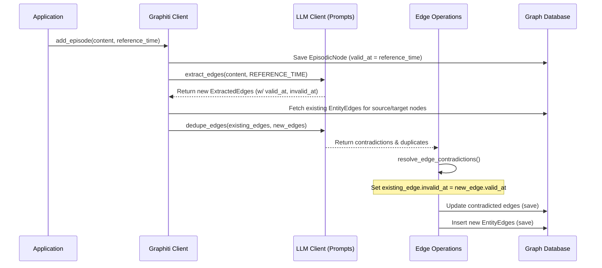
```mermaid
sequenceDiagram
    participant App as Application
    participant GC as Graphiti Client
    participant LLM as LLM Client (Prompts)
    participant EdgeOps as Edge Operations
    participant DB as Graph Database

    App->>GC: add_episode(content, reference_time)
    GC->>DB: Save EpisodicNode (valid_at = reference_time)
    GC->>LLM: extract_edges(content, REFERENCE_TIME)
    LLM-->>GC: Return new ExtractedEdges (w/ valid_at, invalid_at)
    GC->>DB: Fetch existing EntityEdges for source/target nodes
    GC->>LLM: dedupe_edges(existing_edges, new_edges)
    LLM-->>EdgeOps: Return contradictions & duplicates
    EdgeOps->>EdgeOps: resolve_edge_contradictions()
    Note over EdgeOps: Set existing_edge.invalid_at = new_edge.valid_at
    EdgeOps->>DB: Update contradicted edges (save)
    EdgeOps->>DB: Insert new EntityEdges (save)
```

### 4. Step-by-Step Algorithm Description

**Step 1: Temporal Binding at Ingestion**
When an episode is added, it is assigned a `reference_time` [15], [16] representing the real-world timestamp of the event. This is saved as the `EpisodicNode`'s `valid_at` property [17], [7].

**Step 2: Fact Extraction & Time Resolution**
The `extract_edges` prompt feeds the LLM the `CURRENT_MESSAGE` and the `REFERENCE_TIME` [8]. The algorithm enforces strict LLM rules:
1. If the fact is ongoing (present tense), `valid_at` is set to the `REFERENCE_TIME` [9].
2. If a change or termination is expressed, `invalid_at` is set to the relevant timestamp [9].
3. Dates are resolved to ISO 8601 UTC format. If no time is mentioned, `00:00:00` is assumed [9].

**Step 3: Contradiction Detection**
Graphiti searches the database for existing `EntityEdge` records connected to the newly extracted entities [12]. It passes both the existing facts and the new candidates to the `dedupe_edges.py` prompt. The LLM evaluates the lists and returns an `EdgeDuplicate` object containing indices of `contradicted_facts` [10], [11].

**Step 4: Fact Invalidation & Graph Update**
The `resolve_edge_contradictions` function processes the LLM's contradiction flags [13]. Instead of deleting the old fact from the database, the algorithm modifies the old `EntityEdge`. Specifically, the old edge's `invalid_at` timestamp is updated to mark the end of its validity window, effectively superseding it [18], [2]. The new `EntityEdge` (with its active `valid_at` timestamp) is then saved to the database alongside the updated old edge [4]. 

#### 5. Fact Lifecycle (State Diagram)

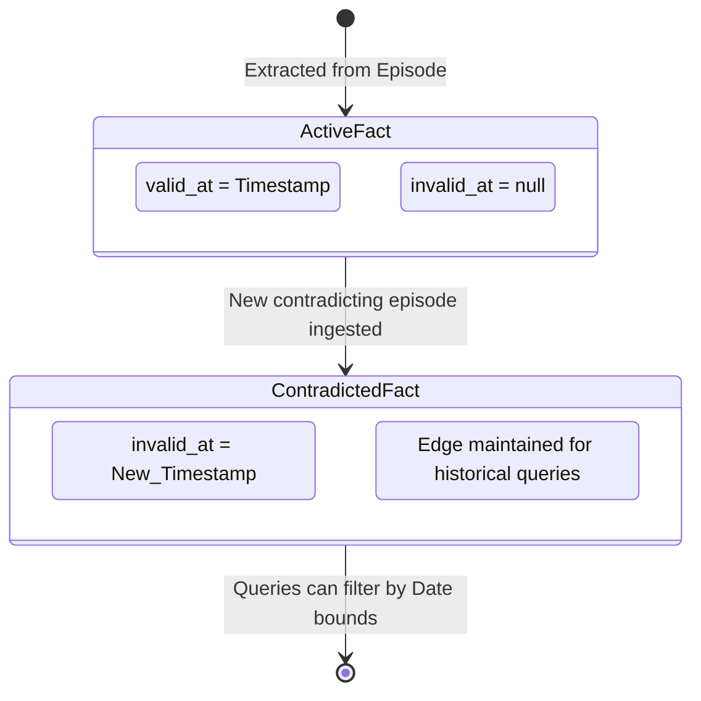
```mermaid
stateDiagram-v2
    [*] --> ActiveFact : Extracted from Episode
    
    state ActiveFact {
        %% A fact that is currently true
        valid_at_set : valid_at = Timestamp
        invalid_at_null : invalid_at = null
    }

    ActiveFact --> ContradictedFact : New contradicting episode ingested
    
    state ContradictedFact {
        %% A fact that has been superseded
        invalidated : invalid_at = New_Timestamp
        history_preserved : Edge maintained for historical queries
    }
    
    ContradictedFact --> [*] : Queries can filter by Date bounds
```

This bi-temporal architecture guarantees that AI agents querying Graphiti can always retrieve the exact state of knowledge at any requested point in time, without suffering from "memory loss" when facts naturally evolve [19], [2].

#### 1.6 Feature: Incremental Graph Construction

**Incremental Graph Construction** is a foundational capability of the Graphiti framework. Unlike traditional Retrieval-Augmented Generation (RAG) approaches that rely on periodic batch processing or static document chunking, Graphiti continuously integrates user interactions, unstructured enterprise data, and external information into a coherent, queryable context graph in real-time [1, 2]. 

This allows the graph to evolve organically with every interaction, preserving strict provenance back to source data and automatically invalidating superseded facts [3, 4].

Below is a comprehensive technical breakdown of its architecture, data flow, key components, and algorithms.

##### 1. Core Architecture and Key Components

Graphiti's incremental construction is orchestrated through several specialized components working together:

*   **Graphiti Orchestrator (`Graphiti`):** The primary client that exposes the `add_episode` pipeline, coordinating extraction, deduplication, and persistence [5, 6].
*   **LLM Client (`LLMClient`):** Executes structured extraction prompts (`extract_nodes`, `extract_edges`, `dedupe_nodes`, `dedupe_edges`, `summarize_nodes`) across supported providers like OpenAI, Anthropic, or local models [7, 8].
*   **Embedder Client (`EmbedderClient`):** Generates high-dimensional vector embeddings for node names and edge facts, preparing the graph for hybrid semantic search [9, 10].
*   **Deduplication Engine (`dedup_helpers.py`):** Employs a hybrid deterministic/heuristic (MinHash/LSH/Jaccard similarity) and LLM-driven approach to map newly extracted information onto the existing graph topology [11, 12].
*   **Graph Driver & Operations Layer (`GraphDriver`, `QueryExecutor`):** Database-agnostic interfaces that translate Graphiti's Pydantic models into native graph database operations (Neo4j, FalkorDB, Kuzu, Amazon Neptune) executing inside safe transactions [13, 14].

##### 2. Core Data Structures

Graphiti relies on a highly structured ontology to model incoming data and its integration into the graph.

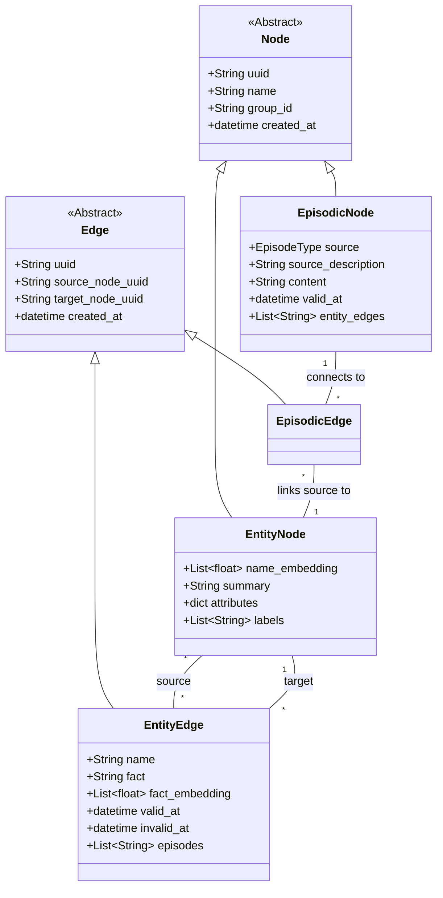
```mermaid
classDiagram
    class Node {
        <<Abstract>>
        +String uuid
        +String name
        +String group_id
        +datetime created_at
    }
    class EpisodicNode {
        +EpisodeType source
        +String source_description
        +String content
        +datetime valid_at
        +List~String~ entity_edges
    }
    class EntityNode {
        +List~float~ name_embedding
        +String summary
        +dict attributes
        +List~String~ labels
    }
    class Edge {
        <<Abstract>>
        +String uuid
        +String source_node_uuid
        +String target_node_uuid
        +datetime created_at
    }
    class EntityEdge {
        +String name
        +String fact
        +List~float~ fact_embedding
        +datetime valid_at
        +datetime invalid_at
        +List~String~ episodes
    }
    class EpisodicEdge {
        %% Connects EpisodicNode to EntityNode (Provenance)
    }

    Node <|-- EpisodicNode
    Node <|-- EntityNode
    Edge <|-- EntityEdge
    Edge <|-- EpisodicEdge
    EpisodicNode "1" -- "*" EpisodicEdge : connects to
    EpisodicEdge "*" -- "1" EntityNode : links source to
    EntityNode "1" -- "*" EntityEdge : source
    EntityNode "1" -- "*" EntityEdge : target
```

*   **`EpisodicNode`**: Represents the raw source of information (a message, a JSON payload, or a document chunk) and anchors all derived facts with a real-world `valid_at` timestamp [15].
*   **`EntityNode`**: Represents a distinct entity (person, place, concept). It maintains an evolving `summary` of its context [16].
*   **`EntityEdge`**: Represents a temporal relationship or fact connecting two `EntityNode`s. It includes explicitly tracked `valid_at` and `invalid_at` bounds [17].
*   **`EpisodicEdge`**: Provides strict data provenance, linking the `EpisodicNode` to the `EntityNode`s it mentions [15, 17].

### 3. Step-by-Step Algorithm & Detailed Data Flow

The incremental construction algorithm triggers whenever a new "episode" is submitted. The data flow proceeds through a series of strictly governed stages:

#### Step 1: Content Chunking & Density Evaluation
When raw content is ingested, Graphiti evaluates its size and **entity density**. If the content is highly dense (e.g., structured JSON with many entities) and exceeds thresholds (`CHUNK_TOKEN_SIZE`, `CHUNK_MIN_TOKENS`, `CHUNK_DENSITY_THRESHOLD`), Graphiti intelligently splits the content into smaller, overlapping chunks to prevent the LLM from dropping entities during extraction [18-21]. Normal prose (low density) is processed in a single pass.

#### Step 2: Entity Node Extraction
The `LLMClient` receives the episode chunk alongside prior conversation history (`PREVIOUS_MESSAGES`). Using specific prompts (`extract_message`, `extract_text`, or `extract_json`), the LLM identifies entities explicitly or implicitly mentioned, resolving pronouns, and classifies them into standard or custom developer-defined entity types [22-24].

#### Step 3: Node Deduplication & Resolution
Newly extracted nodes must be merged with existing graph nodes to prevent duplicates.
1.  **Deterministic/Fuzzy Pass:** Graphiti uses MinHash signatures, LSH (Locality-Sensitive Hashing), and Jaccard similarity (`_resolve_with_similarity`) to rapidly match extracted entity names against an index of existing graph nodes [12, 25, 26]. 
2.  **LLM Escalation:** Ambiguous matches are escalated to the `dedupe_nodes.py` prompt. The LLM evaluates the context and explicitly marks pairs as duplicates or distinct entities (`_resolve_with_llm`) [27, 28]. 
3.  **Pointer Resolution:** A `uuid_map` is generated to collapse duplicate chains into canonical UUIDs [29].

#### Step 4: Edge (Fact) Extraction & Temporal Binding
Using the successfully resolved entities, the LLM processes the episode again via the `extract_edges` prompt to derive relationships [30, 31]. 
*   The LLM adheres to strict temporal rules, anchoring facts to the episode's `REFERENCE_TIME`. Ongoing facts receive a `valid_at` timestamp, while obsolete or changed facts receive an `invalid_at` timestamp [32].

#### Step 5: Edge Deduplication & Contradiction Handling
Before edges are saved, they are compared against existing edges bridging the same entities. The `dedupe_edges.py` prompt returns lists of `duplicate_facts` and `contradicted_facts` [33]. 
*   Duplicates are ignored. 
*   If a new fact contradicts an old fact (e.g., changing a user's location from "NY" to "CA"), the old edge is marked with an `invalid_at` timestamp equal to the new episode's time, superseding it without deleting historical context (`resolve_edge_contradictions`) [34].

#### Step 6: Summarization & Embedding Generation
To keep the graph context rich, entity summaries are updated via batched LLM calls (`_extract_entity_summaries_batch`) blending new episodic context with the existing summary [35, 36]. Simultaneously, the `EmbedderClient` generates vectors (`fact_embedding` and `name_embedding`) for the new nodes and edges [10, 37].

#### Step 7: Transactional Persistence & Provenance
Finally, the `GraphDriver` executes a single atomic database transaction to persist the graph state (`add_nodes_and_edges_bulk_tx`) [38]:
*   The `EpisodicNode` is inserted.
*   New `EntityNode`s and `EntityEdge`s are merged into the graph.
*   `EpisodicEdge`s (`MENTIONS`) are created, rigidly tying every entity back to the exact episode that established it, guaranteeing lineage [39, 40].

#### 4. Sequence Diagram: The Ingestion Pipeline

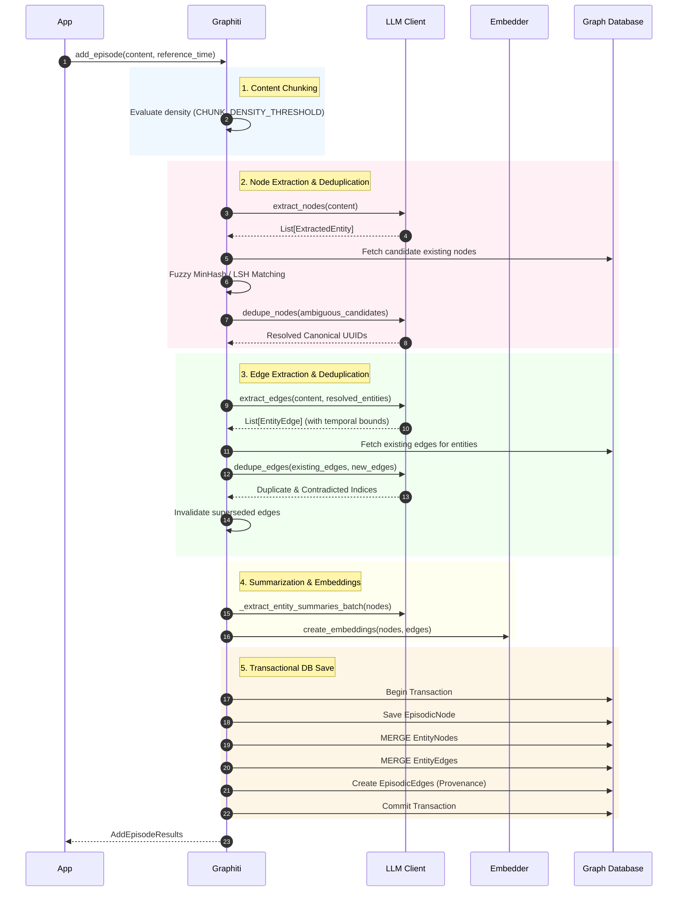
```mermaid
sequenceDiagram
    autonumber
    participant App
    participant Graphiti
    participant LLM as LLM Client
    participant Embed as Embedder
    participant DB as Graph Database

    App->>Graphiti: add_episode(content, reference_time)
    
    rect rgb(240, 248, 255)
        Note right of Graphiti: 1. Content Chunking
        Graphiti->>Graphiti: Evaluate density (CHUNK_DENSITY_THRESHOLD)
    end
    
    rect rgb(255, 240, 245)
        Note right of Graphiti: 2. Node Extraction & Deduplication
        Graphiti->>LLM: extract_nodes(content)
        LLM-->>Graphiti: List[ExtractedEntity]
        Graphiti->>DB: Fetch candidate existing nodes
        Graphiti->>Graphiti: Fuzzy MinHash / LSH Matching
        Graphiti->>LLM: dedupe_nodes(ambiguous_candidates)
        LLM-->>Graphiti: Resolved Canonical UUIDs
    end
    
    rect rgb(240, 255, 240)
        Note right of Graphiti: 3. Edge Extraction & Deduplication
        Graphiti->>LLM: extract_edges(content, resolved_entities)
        LLM-->>Graphiti: List[EntityEdge] (with temporal bounds)
        Graphiti->>DB: Fetch existing edges for entities
        Graphiti->>LLM: dedupe_edges(existing_edges, new_edges)
        LLM-->>Graphiti: Duplicate & Contradicted Indices
        Graphiti->>Graphiti: Invalidate superseded edges
    end

    rect rgb(255, 255, 240)
        Note right of Graphiti: 4. Summarization & Embeddings
        Graphiti->>LLM: _extract_entity_summaries_batch(nodes)
        Graphiti->>Embed: create_embeddings(nodes, edges)
    end

    rect rgb(253, 245, 230)
        Note right of Graphiti: 5. Transactional DB Save
        Graphiti->>DB: Begin Transaction
        Graphiti->>DB: Save EpisodicNode
        Graphiti->>DB: MERGE EntityNodes
        Graphiti->>DB: MERGE EntityEdges
        Graphiti->>DB: Create EpisodicEdges (Provenance)
        Graphiti->>DB: Commit Transaction
    end
    
    Graphiti-->>App: AddEpisodeResults
```

#### 1.7 Feature: Hybrid Retrieval Pipeline

**Graphiti’s Hybrid Retrieval Pipeline** is a highly concurrent, configurable search architecture designed to query temporally-aware knowledge graphs. Unlike traditional Retrieval-Augmented Generation (RAG) models that rely primarily on single-strategy vector searches and sequential LLM summarization, Graphiti achieves low-latency, high-precision querying by concurrently combining semantic embeddings, keyword search (BM25), and structural graph traversal (Breadth-First Search) [1-4].

Below is a comprehensive breakdown of the pipeline’s architecture, core data structures, algorithms, and data flow.

##### 1. Core Data Structures

The retrieval pipeline uses a modular configuration system to dictate exactly how queries execute across different graph components (nodes, edges, episodes, and communities) [5, 6]. 

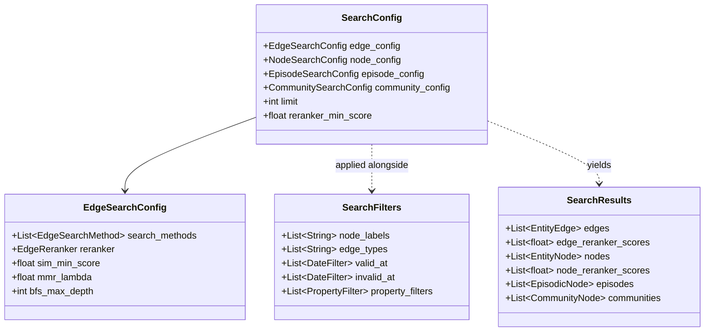
```mermaid
classDiagram
    class SearchConfig {
        +EdgeSearchConfig edge_config
        +NodeSearchConfig node_config
        +EpisodeSearchConfig episode_config
        +CommunitySearchConfig community_config
        +int limit
        +float reranker_min_score
    }
    
    class EdgeSearchConfig {
        +List~EdgeSearchMethod~ search_methods
        +EdgeReranker reranker
        +float sim_min_score
        +float mmr_lambda
        +int bfs_max_depth
    }

    class SearchFilters {
        +List~String~ node_labels
        +List~String~ edge_types
        +List~DateFilter~ valid_at
        +List~DateFilter~ invalid_at
        +List~PropertyFilter~ property_filters
    }

    class SearchResults {
        +List~EntityEdge~ edges
        +List~float~ edge_reranker_scores
        +List~EntityNode~ nodes
        +List~float~ node_reranker_scores
        +List~EpisodicNode~ episodes
        +List~CommunityNode~ communities
    }

    SearchConfig --> EdgeSearchConfig
    SearchConfig ..> SearchFilters : applied alongside
    SearchConfig ..> SearchResults : yields
```

*   **`SearchConfig`**: The master configuration object dictating the search behavior. It contains specific sub-configurations for each graph component type (e.g., `EdgeSearchConfig`, `NodeSearchConfig`) [6].
*   **Search Methods**: Enums defining the retrieval strategies: `cosine_similarity`, `bm25` (fulltext keyword), and `bfs` (graph traversal) [7].
*   **`SearchFilters`**: A robust filtering object that applies temporal bounds (`valid_at`, `invalid_at`, `created_at`, `expired_at`), node labels, edge types, and property comparisons directly at the database query level [8, 9].
*   **`SearchResults`**: The final output payload containing the retrieved graph components alongside their calculated reranker scores [10].

### 2. Step-by-Step Algorithm & Data Flow

When a search is initiated, Graphiti processes the request through a highly parallelized pipeline orchestrated by the central `search()` function [5, 11].

**Step 1: Query Preparation & Embeddings**
The pipeline receives a natural language `query`, a set of `group_ids` (for data isolation), the `SearchConfig`, and `SearchFilters`. The embedding client first converts the text query into a high-dimensional vector (`query_vector`) [5, 12].

**Step 2: Parallel Strategy Execution**
Depending on the `SearchConfig`, Graphiti triggers independent, concurrent database operations for edges, nodes, episodes, and communities [5, 13, 14]. Within a given component search (e.g., `edge_search`), multiple search methods run in parallel:
*   **Full-Text Search (`bm25`)**: Executes a Lucene-based or native database keyword search against names, summaries, facts, and content [15-17].
*   **Semantic Search (`cosine_similarity`)**: Compares the `query_vector` against stored embeddings using native database vector search capabilities, applying a `sim_min_score` threshold [17, 18].
*   **Graph Traversal (`bfs`)**: Initiates a Breadth-First Search from specified `bfs_origin_node_uuids` up to a `bfs_max_depth`, retrieving structurally adjacent context regardless of semantic similarity [18-20].

**Step 3: Temporal and Metadata Filtering**
During the execution of Step 2, `SearchFilters` are injected directly into the database queries. This strictly enforces Graphiti's bi-temporal model, ensuring that only facts or nodes valid during the requested `valid_at` / `invalid_at` windows are retrieved [8, 9, 21].

**Step 4: Aggregation and Reranking**
The raw results from the parallel strategies are concatenated. Because BM25, semantic, and BFS searches yield different scoring metrics (or none at all), the combined pool of candidates must be normalized and ordered. Graphiti applies the configured `reranker` to the aggregated candidate pool [5, 7, 19].

**Step 5: Result Construction**
The reranked lists are trimmed to the configured `limit`. Graphiti packages the finalized lists and their corresponding scores into the `SearchResults` object, which is returned to the AI agent [6, 10].

#### 3. Pipeline Architecture Diagram

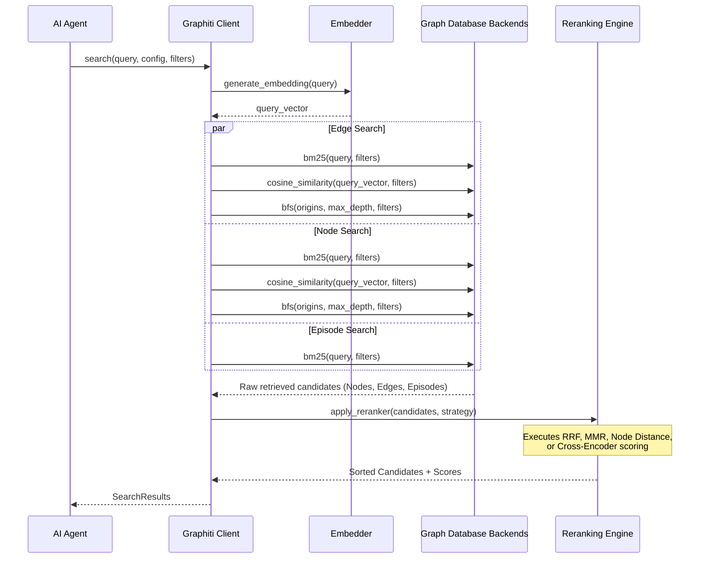
```mermaid
sequenceDiagram
    participant App as AI Agent
    participant GC as Graphiti Client
    participant Embed as Embedder
    participant DB as Graph Database Backends
    participant Rerank as Reranking Engine

    App->>GC: search(query, config, filters)
    GC->>Embed: generate_embedding(query)
    Embed-->>GC: query_vector
    
    par Edge Search
        GC->>DB: bm25(query, filters)
        GC->>DB: cosine_similarity(query_vector, filters)
        GC->>DB: bfs(origins, max_depth, filters)
    and Node Search
        GC->>DB: bm25(query, filters)
        GC->>DB: cosine_similarity(query_vector, filters)
        GC->>DB: bfs(origins, max_depth, filters)
    and Episode Search
        GC->>DB: bm25(query, filters)
    end
    
    DB-->>GC: Raw retrieved candidates (Nodes, Edges, Episodes)
    
    GC->>Rerank: apply_reranker(candidates, strategy)
    Note over Rerank: Executes RRF, MMR, Node Distance,<br/>or Cross-Encoder scoring
    Rerank-->>GC: Sorted Candidates + Scores
    
    GC-->>App: SearchResults
```

#### 4. Deep Dive: Reranking Strategies

The power of the hybrid pipeline heavily relies on its reranking strategies, defined by `EdgeReranker`, `NodeReranker`, `CommunityReranker`, and `EpisodeReranker` [7, 19].

*   **Reciprocal Rank Fusion (`rrf`)**: The default strategy. It combines the ranked lists from BM25, semantic search, and BFS without requiring score calibration. It calculates a new score based on the formula `1 / (rank + rank_constant)` for each item's position in the respective lists, promoting items that appear near the top of multiple distinct retrieval methods [7, 22, 23].
*   **Maximal Marginal Relevance (`mmr`)**: Optimizes for diversity. It selects items that are highly relevant to the query but penalizes items that are too similar to those already selected (using `mmr_lambda` to balance relevance vs. diversity), preventing the AI agent from receiving redundant facts [19, 24, 25].
*   **Node Distance Reranker (`node_distance`)**: Re-scores results based on their topological proximity in the graph to a specific `center_node_uuid`. This acts as an attention mechanism, pulling focus toward an entity actively being discussed in the current agent conversation [7, 23, 26].
*   **Episode Mentions Reranker (`episode_mentions`)**: Promotes facts or entities that have been frequently mentioned across multiple distinct episodes, acting as a proxy for "importance" or "confidence" based on historical recurrence [7, 25, 27].
*   **Cross-Encoder (`cross_encoder`)**: The highest precision strategy. It passes the raw query and the retrieved passage pair directly through an external neural reranking model (e.g., OpenAI, Gemini, or local BGE models). The model outputs a strict semantic relevance score (0-100), acting as a powerful final filter for ambiguous queries [7, 28-31].

### Step 2 System Architecture investigation

Based on the provided repository structure and architectural guidelines, Graphiti is explicitly organized into distinct "domain modules" [1]. Applying Domain-Driven Design (DDD) principles, the project can be divided into the following bounded contexts:

**1. Graph Elements & Ontology Context (The Core Domain)**
This context defines the fundamental data structures and lifecycle of the temporal knowledge graph. It models how information is represented, including its temporal validity and provenance.
*   **Key Concepts:** Entities (EntityNodes), Facts/Relationships (EntityEdges), Communities (CommunityNodes), and Episodes (the raw provenance data) [2, 3].
*   **Module Location:** Managed centrally in `graphiti_core/nodes.py`, `graphiti_core/edges.py`, `graphiti_core/models/`, and accessed via `graphiti_core/namespaces/` [1, 4, 5].

**2. Ingestion & Graph Maintenance Context**
This context is responsible for incrementally building and evolving the graph. It handles raw content processing, data resolution, and contradiction handling.
*   **Key Responsibilities:** Content chunking (evaluating entity density to prevent extraction loss), prompting LLMs for entity/edge extraction, summarizing nodes, and running deterministic/fuzzy deduplication (MinHash/Jaccard similarity) [6-8].
*   **Module Location:** Managed under `graphiti_core/utils/` (specifically `bulk_utils.py` and the `maintenance/` subdirectory) and `graphiti_core/prompts/` [4, 6, 9].

**3. Search & Retrieval Context**
This context handles querying the temporal graph and assembling context for AI agents. 
*   **Key Responsibilities:** Orchestrating highly concurrent hybrid searches (semantic embeddings, full-text BM25, and structural Breadth-First Search) and applying multi-strategy reranking (e.g., Reciprocal Rank Fusion, Maximal Marginal Relevance, Node Distance) [10, 11].
*   **Module Location:** Contained entirely within the `graphiti_core/search/` module [1, 4].

**4. AI Provider Abstractions Context**
Graphiti relies heavily on external AI models but abstracts them away from the core logic to prevent vendor lock-in. 
*   **Key Responsibilities:** Managing rate limits, tokens, and inference/embedding generation across providers like OpenAI, Anthropic, Google Gemini, and local models [12-14].
*   **Module Location:** Separated into `graphiti_core/llm_client/`, `graphiti_core/embedder/`, and `graphiti_core/cross_encoder/` [4, 15].

**5. Graph Storage & Driver Context (Infrastructure)**
This context isolates all specific database interactions and query translations from the rest of the application, adhering to a strict Database-Agnostic design.
*   **Key Responsibilities:** Translating Graphiti's data models into native queries for specific backends (Neo4j, FalkorDB, Kuzu, Amazon Neptune) and managing safe transactional boundaries [4, 16, 17].
*   **Module Location:** Housed in `graphiti_core/driver/`, which is further split into fine-grained operation classes (e.g., `EntityNodeOperations`, `SearchOperations`) [18, 19].

**6. Service Interfaces Context (Application Layer)**
This context serves as the "API glue" that exposes the core Graphiti engine to external consumers, handling transport, routing, and data transfer objects (DTOs).
*   **Key Responsibilities:** Exposing endpoints for ingestion and retrieval to downstream applications or AI assistants [1, 20].
*   **Module Location:** Divided into two distinct deployments:
    *   **REST API:** Built with FastAPI, located in `server/graph_service/` [1, 20].
    *   **MCP Server:** A Model Context Protocol implementation for AI assistants (like Claude Desktop or Cursor), located in `mcp_server/` [1, 20].

Here is the Component/Module Level (C4 Level 3) map for the Graphiti project, detailing the internal structure and dependencies between the framework's core packages and application layers.

#### **C4 Level 3 Component Diagram**

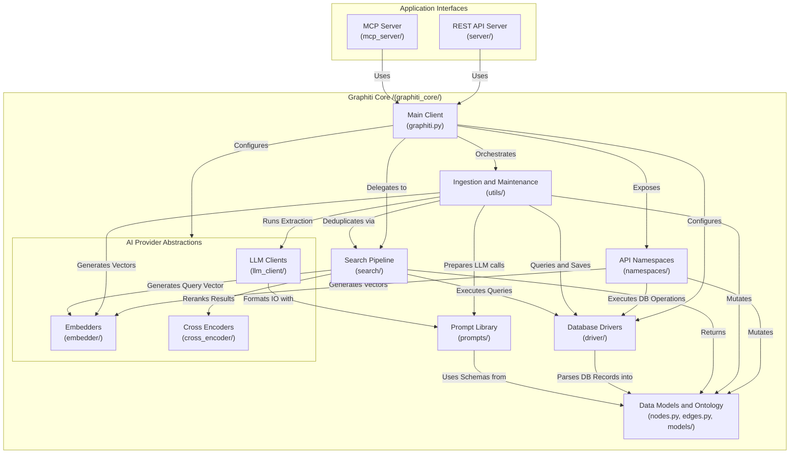
```mermaid
flowchart TD
    %% Application Layer
    subgraph AppLayer [Application Interfaces]
        Server["REST API Server<br/>(server/)"]
        MCP["MCP Server<br/>(mcp_server/)"]
    end

    %% Core Framework (graphiti_core)
    subgraph CoreFramework ["Graphiti Core /(graphiti_core/)"]
        Main["Main Client<br/>(graphiti.py)"]
        Namespaces["API Namespaces<br/>(namespaces/)"]
        Utils["Ingestion and Maintenance<br/>(utils/)"]
        Search["Search Pipeline<br/>(search/)"]
        Driver["Database Drivers<br/>(driver/)"]
        Prompts["Prompt Library<br/>(prompts/)"]
        Ontology["Data Models and Ontology<br/>(nodes.py, edges.py, models/)"]

        subgraph AIClients [AI Provider Abstractions]
            LLM["LLM Clients<br/>(llm_client/)"]
            Embed["Embedders<br/>(embedder/)"]
            CrossEnc["Cross Encoders<br/>(cross_encoder/)"]
        end
    end

    %% Application Dependencies
    Server -->|Uses| Main
    MCP -->|Uses| Main

    %% Main Client Dependencies
    Main -->|Exposes| Namespaces
    Main -->|Orchestrates| Utils
    Main -->|Delegates to| Search
    Main -->|Configures| Driver
    Main -->|Configures| AIClients

    %% Business Logic Dependencies
    Namespaces -->|Executes DB Operations| Driver
    Namespaces -->|Generates Vectors| Embed
    Namespaces -->|Mutates| Ontology

    Utils -->|Queries and Saves| Driver
    Utils -->|Runs Extraction| LLM
    Utils -->|Generates Vectors| Embed
    Utils -->|Prepares LLM calls| Prompts
    Utils -->|Deduplicates via| Search
    Utils -->|Mutates| Ontology

    Search -->|Executes Queries| Driver
    Search -->|Generates Query Vector| Embed
    Search -->|Reranks Results| CrossEnc
    Search -->|Returns| Ontology

    %% Infrastructure and Lower Level Dependencies
    Driver -->|Parses DB Records into| Ontology
    LLM -->|Formats IO with| Prompts
    Prompts -->|Uses Schemas from| Ontology
```

#### **Module & Dependency Breakdown**

#### **1. Application Interfaces (External Consumers)**
These modules act as the entry points for external systems to interact with the core engine [1].
*   **`server/` (REST API Server)**: A FastAPI service exposing endpoints for data ingestion and retrieval [2, 3]. 
    *   *Dependencies:* Extends the core `Graphiti` client (via `ZepGraphiti`) and relies heavily on `graphiti_core.nodes` and `graphiti_core.edges` for Data Transfer Objects (DTOs) [4, 5].
*   **`mcp_server/` (Model Context Protocol)**: An MCP server exposing Graphiti's capabilities as tools to AI assistants like Claude or Cursor [6, 7].
    *   *Dependencies:* `graphiti_core` (`Graphiti` client, `SearchFilters`, `nodes`, `edges`), and custom services (like `QueueService`) to manage async LLM processing [7, 8].

#### **2. Core Orchestration (`graphiti_core`)**
*   **`graphiti.py` (Main Client)**: The central orchestrator that applications instantiate.
    *   *Dependencies:* It ties together almost every module in the system. It initializes the `GraphDriver`, `LLMClient`, `EmbedderClient`, and `CrossEncoderClient` [9]. It delegates API calls to the `Namespaces` module and ingestion logic to the `Utils` module [9].
*   **`namespaces/`**: Logical groupings for API operations (e.g., `NodeNamespace`, `EdgeNamespace`).
    *   *Dependencies:* Acts as a thin wrapper that routes operations to the `Driver` (executing database operations) and `EmbedderClient` (for vector generation) while operating on `nodes` and `edges` [10, 11].

#### **3. Business Logic & Processing (`graphiti_core`)**
*   **`utils/` (Ingestion & Maintenance)**: Contains the core logic for incremental graph construction, chunking, deduplication, and community generation [12-14].
    *   *Dependencies:* Heavily reliant on `LLMClient` for extraction, `Prompts` for guiding the LLM, `Embedder` for vector generation, `Search` for fuzzy/deterministic deduplication, and `Driver` for bulk persistence operations [12, 15, 16].
*   **`search/` (Search Pipeline)**: Implements the hybrid retrieval pipeline (semantic, full-text BM25, BFS) and reranking logic [17].
    *   *Dependencies:* Uses `Driver` to execute native database searches, `EmbedderClient` to vectorize search queries, and `CrossEncoderClient` or other LLM algorithms to rerank the resulting `EntityNode` and `EntityEdge` objects [17].
*   **`prompts/` (Prompt Library)**: Contains the raw system and user prompts used to instruct LLMs for extraction, deduplication, and summarization [18-20].
    *   *Dependencies:* Depends on `models.py` and ontology definitions to dynamically inject expected JSON schemas into the prompt templates [21-23].

#### **4. Infrastructure Adapters (Ports) (`graphiti_core`)**
These modules abstract third-party services and databases, allowing the framework to remain vendor-agnostic [24, 25].
*   **`driver/` (Database Drivers)**: Translates framework operations into native database queries. It implements concrete providers for Neo4j, FalkorDB, Kuzu, and Amazon Neptune [26].
    *   *Dependencies:* Depends on `Ontology` modules (`nodes.py`, `edges.py`, `models/edges/edge_db_queries.py`) to parse database records back into Pydantic models [27, 28].
*   **`llm_client/` (LLM Integrations)**: Manages inference execution, token tracking, and rate limiting across providers like OpenAI, Anthropic, Gemini, and Groq [29, 30].
    *   *Dependencies:* Relies on `Prompts` to format messages before sending them to external APIs [31, 32].
*   **`embedder/`**: Wrappers for external embedding models (OpenAI, Voyage, Gemini) [33, 34].
*   **`cross_encoder/`**: Wrappers for external reranking models (BGE, Gemini, OpenAI) [35, 36].

#### **5. Domain Data Models (`graphiti_core`)**
*   **`nodes.py`, `edges.py`, & `models/` (Ontology)**: The foundational Pydantic models defining `EpisodicNode`, `EntityNode`, `EntityEdge`, and `CommunityNode` [37, 38].
    *   *Dependencies:* These are pure data structures with almost zero outbound dependencies. They act as the central schema contract passed between the Driver, Search, Utils, and Application layers [39-41].

Here is the domain language glossary for Graphiti, defining the core entities, their relationships, and key concepts that form the ubiquitous language of its temporal context graph architecture.

#### **Core Entities (Nodes)**

*   **Node**: The abstract base class for all vertices in the graph. Every node is uniquely identified by a `uuid`, belongs to a specific `group_id` for multitenancy/partitioning, and tracks its system ingestion time via `created_at` [1].
*   **Episode (`EpisodicNode`)**: Represents the **raw source data** (e.g., a chat message, a document chunk, or a JSON payload) ingested into the system. It acts as the ground-truth stream [2, 3]. It explicitly tracks the real-world time the event occurred via `valid_at` [1].
*   **Entity (`EntityNode`)**: Represents a distinct person, place, object, or abstract concept extracted from Episodes [3]. Entities are dynamic; they maintain an evolving `summary` of their context, a `name_embedding` for semantic search, and custom developer-defined `attributes` and `labels` [4]. 
*   **Community (`CommunityNode`)**: Represents a clustered grouping of closely related `EntityNode`s. It maintains a synthesized regional `summary` of the information contained within its member nodes [4].
*   **Saga (`SagaNode`)**: Represents a higher-level collection or narrative sequence of related `EpisodicNode`s [5-7].

#### **Relationships (Edges)**

*   **Edge**: The abstract base class for all directed connections in the graph, linking a `source_node_uuid` to a `target_node_uuid` within a specific `group_id` [8].
*   **Fact / Relationship (`EntityEdge`)**: Connects two `EntityNode`s. This is the core repository of knowledge, containing a natural language `fact` describing the relationship [9]. It is explicitly temporal, utilizing `valid_at` and `invalid_at` boundaries to track exactly when the fact was true in the real world [9, 10]. It also maintains an `episodes` list, serving as strict provenance back to the source data [9].
*   **Provenance Link (`EpisodicEdge` / `MENTIONS`)**: A structural relationship connecting an `EpisodicNode` to the `EntityNode`s it references. This guarantees full data lineage from derived facts back to the raw source data [3, 7, 11].
*   **Membership Link (`CommunityEdge` / `HAS_MEMBER`)**: Connects a `CommunityNode` to its constituent `EntityNode`s (or other sub-communities), defining the structural boundaries of a community cluster [7, 11].
*   **Sequence Links (`HasEpisodeEdge`, `NextEpisodeEdge`)**: Structural edges used to link an `EpisodicNode` to its parent `SagaNode` (`HAS_EPISODE`), or to chain sequential episodes together (`NEXT_EPISODE`) [7, 12].

#### **Domain Concepts & Value Objects**

*   **Context Graph**: Graphiti's overarching data structure. Unlike a static knowledge graph, a context graph is temporally-aware, tracking how facts change over time, maintaining strict data provenance, and evolving automatically as new episodes are ingested [2, 13].
*   **Temporal Bounds (`valid_at`, `invalid_at`)**: The core of Graphiti's **bi-temporal data model**. When new information contradicts an existing fact, the old fact is not deleted. Instead, its `invalid_at` timestamp is set, superseding it while preserving historical context [2, 9, 10].
*   **Group ID**: A namespace or partition key applied to all nodes and edges. It is used to isolate graph data into separate knowledge domains, user silos, or tenant workspaces [8, 14].
*   **Ontology**: The schema defining the allowed types of Entities and Relationships. Graphiti supports both **prescribed ontology** (developer-defined via custom Pydantic models like `Person` or `Location`) and **learned ontology** (emergent structure derived automatically by the LLM) [3, 10, 15].

Here is the System Context Diagram (C4 Level 1) for the Graphiti project, illustrating the core system, its users, and the external systems it interacts with to function. 

To ensure maximum compatibility across Markdown renderers, this uses standard Mermaid flowchart syntax styled with C4 conventions.

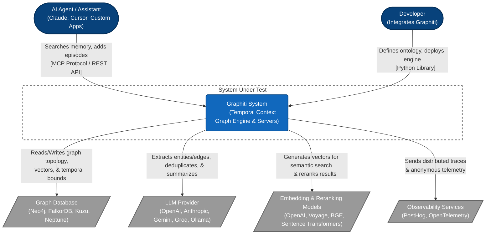
```mermaid
flowchart TB
    %% Actors
    User_AIAgent(["AI Agent / Assistant
    (Claude, Cursor, Custom Apps)"])
    User_Developer(["Developer
    (Integrates Graphiti)"])

    %% System Under Test
    subgraph System_Graphiti [System Under Test]
        Graphiti("Graphiti System
        (Temporal Context Graph Engine & Servers)")
    end

    %% External Systems
    Ext_GraphDB[/"Graph Database
    (Neo4j, FalkorDB, Kuzu, Neptune)"/]
    Ext_LLM[/"LLM Provider
    (OpenAI, Anthropic, Gemini, Groq, Ollama)"/]
    Ext_Embed[/"Embedding & Reranking Models
    (OpenAI, Voyage, BGE, Sentence Transformers)"/]
    Ext_Telemetry[/"Observability Services
    (PostHog, OpenTelemetry)"/]

    %% Relationships
    User_AIAgent -- "Searches memory, adds episodes
    [MCP Protocol / REST API]" --> Graphiti
    User_Developer -- "Defines ontology, deploys engine
    [Python Library]" --> Graphiti

    Graphiti -- "Reads/Writes graph topology,
    vectors, & temporal bounds" --> Ext_GraphDB
    Graphiti -- "Extracts entities/edges, 
    deduplicates, & summarizes" --> Ext_LLM
    Graphiti -- "Generates vectors for semantic search 
    & reranks results" --> Ext_Embed
    Graphiti -- "Sends distributed traces
    & anonymous telemetry" --> Ext_Telemetry
    
    %% C4 Styling
    classDef actor fill:#08427b,color:#fff,stroke:#052e56,stroke-width:2px;
    classDef system fill:#1168bd,color:#fff,stroke:#0b4884,stroke-width:2px;
    classDef external fill:#999999,color:#fff,stroke:#666666,stroke-width:2px;
    classDef boundary fill:none,stroke:#444,stroke-width:2px,stroke-dasharray: 5 5;
    
    class User_AIAgent,User_Developer actor;
    class Graphiti system;
    class Ext_GraphDB,Ext_LLM,Ext_Embed,Ext_Telemetry external;
    class System_Graphiti boundary;
```

#### Breakdown of the System Context

**1. The System**
*   **Graphiti**: The core temporal context graph engine. It continuously ingests episodes, extracts facts with validity windows, and provides hybrid search capabilities [1]. It encompasses the core Python library, the REST API service, and the Model Context Protocol (MCP) server [2, 3].

**2. External Actors**
*   **AI Agents / Assistants**: End-user applications (like Claude Desktop, Cursor, or custom AI agents) that connect to Graphiti via the MCP server or REST API to persist conversation history and query established memory [1, 4, 5].
*   **Developers**: Software engineers who interact with Graphiti directly via the Python library to build context-aware AI applications or define custom ontology schemas via Pydantic models [1, 6].

**3. External Systems**
*   **Graph Databases**: The infrastructure where Graphiti persists nodes, edges, embeddings, and temporal metadata. Graphiti is database-agnostic but natively supports Neo4j, FalkorDB, Kuzu, and Amazon Neptune [7, 8].
*   **LLM Providers**: External AI inference services used by Graphiti's internal pipeline to extract entities and edges, deduplicate graphs, and summarize context. Supported providers include OpenAI, Anthropic, Google Gemini, Groq, and local models via Ollama [3, 9-11].
*   **Embedding & Reranking Providers**: Services utilized to create high-dimensional vectors for semantic search and neural cross-encoders to rerank the results of hybrid queries. Integrations include OpenAI, Voyage AI, Google Gemini, and local BGE models [3, 11-13].
*   **Observability Services**: Systems used for operational monitoring. Graphiti natively integrates with OpenTelemetry for distributed tracing and PostHog for optional, anonymous usage telemetry [7, 14-16].

Here is the Container Diagram (C4 Level 2) for the Graphiti project, illustrating the high-level software architecture, including its deployable services, core libraries, queues, database backends, and external API integrations [1-3].

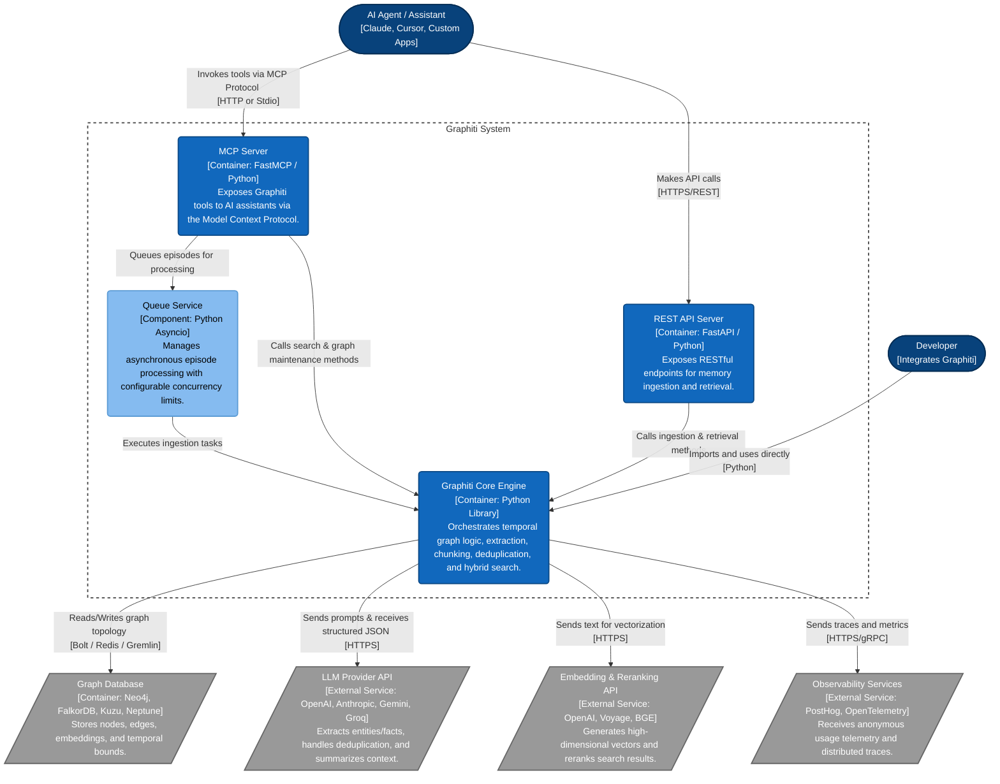
```mermaid
flowchart TB
    %% Actors
    User_AIAgent(["AI Agent / Assistant
    [Claude, Cursor, Custom Apps]"])
    User_Developer(["Developer
    [Integrates Graphiti]"])

    %% System Boundary
    subgraph System_Graphiti ["Graphiti System"]
        direction TB
        
        %% Containers
        REST_API("REST API Server
        [Container: FastAPI / Python]
        Exposes RESTful endpoints for memory ingestion and retrieval.")
        
        MCP_Server("MCP Server
        [Container: FastMCP / Python]
        Exposes Graphiti tools to AI assistants via the Model Context Protocol.")
        
        Queue_Service("Queue Service
        [Component: Python Asyncio]
        Manages asynchronous episode processing with configurable concurrency limits.")
        
        Core_Library("Graphiti Core Engine
        [Container: Python Library]
        Orchestrates temporal graph logic, extraction, chunking, deduplication, and hybrid search.")
        
        %% Internal Connections
        MCP_Server -- "Queues episodes for processing" --> Queue_Service
        Queue_Service -- "Executes ingestion tasks" --> Core_Library
        MCP_Server -- "Calls search & graph maintenance methods" --> Core_Library
        REST_API -- "Calls ingestion & retrieval methods" --> Core_Library
    end

    %% External Containers/Systems
    Ext_GraphDB[/"Graph Database
    [Container: Neo4j, FalkorDB, Kuzu, Neptune]
    Stores nodes, edges, embeddings, and temporal bounds."/]
    
    Ext_LLM[/"LLM Provider API
    [External Service: OpenAI, Anthropic, Gemini, Groq]
    Extracts entities/facts, handles deduplication, and summarizes context."/]
    
    Ext_Embed[/"Embedding & Reranking API
    [External Service: OpenAI, Voyage, BGE]
    Generates high-dimensional vectors and reranks search results."/]
    
    Ext_Telemetry[/"Observability Services
    [External Service: PostHog, OpenTelemetry]
    Receives anonymous usage telemetry and distributed traces."/]

    %% External Connections
    User_AIAgent -- "Invokes tools via MCP Protocol 
    [HTTP or Stdio]" --> MCP_Server
    User_AIAgent -- "Makes API calls 
    [HTTPS/REST]" --> REST_API
    User_Developer -- "Imports and uses directly 
    [Python]" --> Core_Library
    
    Core_Library -- "Reads/Writes graph topology 
    [Bolt / Redis / Gremlin]" --> Ext_GraphDB
    Core_Library -- "Sends prompts & receives structured JSON 
    [HTTPS]" --> Ext_LLM
    Core_Library -- "Sends text for vectorization 
    [HTTPS]" --> Ext_Embed
    Core_Library -- "Sends traces and metrics 
    [HTTPS/gRPC]" --> Ext_Telemetry

    %% C4 Styling
    classDef actor fill:#08427b,color:#fff,stroke:#052e56,stroke-width:2px;
    classDef container fill:#1168bd,color:#fff,stroke:#0b4884,stroke-width:2px;
    classDef component fill:#85bbf0,color:#000,stroke:#5b9bd5,stroke-width:2px;
    classDef external fill:#999999,color:#fff,stroke:#666666,stroke-width:2px;
    classDef boundary fill:none,stroke:#444,stroke-width:2px,stroke-dasharray: 5 5;
    
    class User_AIAgent,User_Developer actor;
    class REST_API,MCP_Server,Core_Library container;
    class Queue_Service component;
    class Ext_GraphDB,Ext_LLM,Ext_Embed,Ext_Telemetry external;
    class System_Graphiti boundary;
```

#### Container Breakdown

**1. Primary Applications & Services (The Containers)**
*   **REST API Server**: Built using FastAPI, this container exposes the Graphiti engine over standard HTTP REST endpoints for external applications wanting to ingest or query graph data [1, 3-5].
*   **MCP Server**: Implements the Model Context Protocol (MCP) using the `FastMCP` framework [2, 6]. It exposes Graphiti's capabilities as explicitly defined "tools" (e.g., `add_memory`, `search_nodes`) to AI clients like Claude Desktop or Cursor IDE [7-9]. It supports both HTTP and `stdio` transport layers [7, 10].
*   **Queue Service**: A critical internal component of the MCP server. Because episode ingestion generates many parallel LLM calls, this asynchronous queue manages concurrent processing to prevent `429 Rate Limit Errors` from LLM providers, bounded by a configurable `SEMAPHORE_LIMIT` [7, 11-13].
*   **Graphiti Core Engine**: The foundational Python library (`graphiti_core`) that holds all the business logic for the temporal context graph [1, 2]. It orchestrates content chunking, entity extraction, determinist/heuristic deduplication, and the hybrid retrieval pipeline [14-16]. Both the REST and MCP servers wrap this core library [1, 5, 17].

**2. Data Stores & External Dependencies**
*   **Graph Database**: Graphiti operates as a database-agnostic engine but requires a graph backend to persist the temporal graph topology. Supported driver implementations include **Neo4j** (Enterprise full-featured), **FalkorDB** (Redis-based, default for MCP Docker), **Kuzu** (Embedded), and **Amazon Neptune** [7, 18-20].
*   **AI Provider Abstractions**: Graphiti separates its AI workloads into three distinct external pipelines:
    *   **LLM Provider APIs**: Used heavily during ingestion to extract structured nodes and edges, determine contradictions, and summarize communities [7, 15, 21]. 
    *   **Embedding & Reranking APIs**: External neural models (e.g., OpenAI, Voyage, local BGE models) used to generate high-dimensional vectors for text and to strictly re-score candidate pools during hybrid retrieval [7, 22-24].
*   **Observability Services**: Uses **OpenTelemetry** for optional distributed tracing of complex graph ingestion operations and **PostHog** for anonymous, opt-out usage telemetry [18, 25, 26].

### Step 3 Runtime behavior investigation

Here are the sequence diagrams tracing the main execution paths for Graphiti's core functionalities: adding memory (ingestion) and searching memory (retrieval) [1].

#### 1. Adding Memory (Episode Ingestion)
This diagram traces the flow when an AI agent calls the `add_memory` tool or a developer invokes `add_episode` via the Python client [2-4].

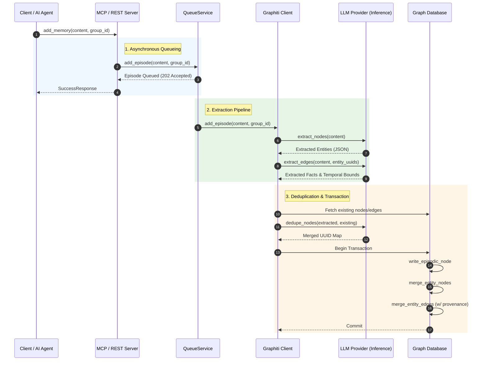
```mermaid
sequenceDiagram
    autonumber
    participant App as Client / AI Agent
    participant MCP as MCP / REST Server
    participant Queue as QueueService
    participant GC as Graphiti Client
    participant LLM as LLM Provider (Inference)
    participant DB as Graph Database

    App->>MCP: add_memory(content, group_id)
    
    rect rgb(240, 248, 255)
        Note right of MCP: 1. Asynchronous Queueing
        MCP->>Queue: add_episode(content, group_id)
        Queue-->>MCP: Episode Queued (202 Accepted)
        MCP-->>App: SuccessResponse
    end

    rect rgb(230, 245, 230)
        Note right of Queue: 2. Extraction Pipeline
        Queue->>GC: add_episode(content, group_id)
        GC->>LLM: extract_nodes(content)
        LLM-->>GC: Extracted Entities (JSON)
        GC->>LLM: extract_edges(content, entity_uuids)
        LLM-->>GC: Extracted Facts & Temporal Bounds
    end

    rect rgb(255, 245, 230)
        Note right of GC: 3. Deduplication & Transaction
        GC->>DB: Fetch existing nodes/edges
        GC->>LLM: dedupe_nodes(extracted, existing)
        LLM-->>GC: Merged UUID Map
        GC->>DB: Begin Transaction
        DB->>DB: write_episodic_node
        DB->>DB: merge_entity_nodes
        DB->>DB: merge_entity_edges (w/ provenance)
        DB-->>GC: Commit
    end
```

#### 2. Searching Memory (Hybrid Retrieval)
This diagram traces the flow when an agent or application searches the knowledge graph [1, 5, 6].

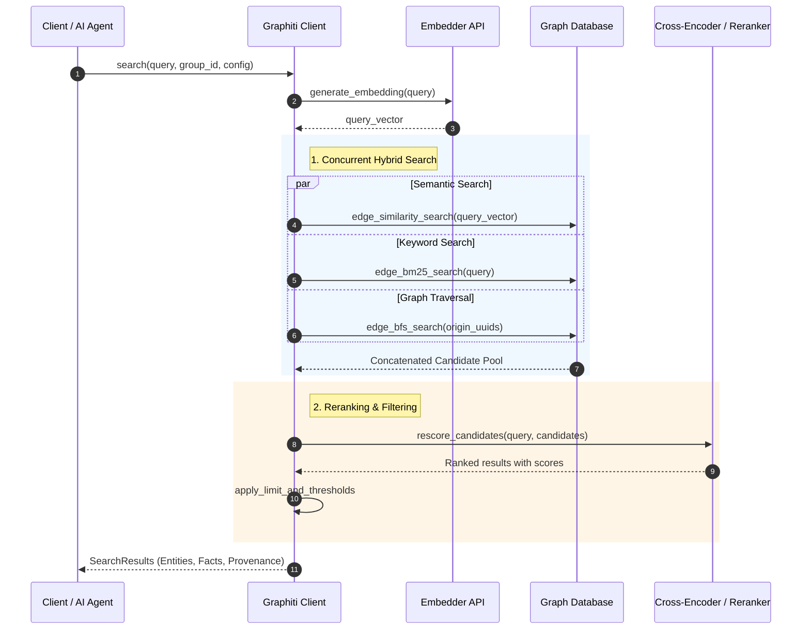
```mermaid
sequenceDiagram
    autonumber
    participant App as Client / AI Agent
    participant GC as Graphiti Client
    participant Embed as Embedder API
    participant DB as Graph Database
    participant Rerank as Cross-Encoder / Reranker

    App->>GC: search(query, group_id, config)
    GC->>Embed: generate_embedding(query)
    Embed-->>GC: query_vector

    rect rgb(240, 248, 255)
        Note right of GC: 1. Concurrent Hybrid Search
        par Semantic Search
            GC->>DB: edge_similarity_search(query_vector)
        and Keyword Search
            GC->>DB: edge_bm25_search(query)
        and Graph Traversal
            GC->>DB: edge_bfs_search(origin_uuids)
        end
        DB-->>GC: Concatenated Candidate Pool
    end

    rect rgb(255, 245, 230)
        Note right of GC: 2. Reranking & Filtering
        GC->>Rerank: rescore_candidates(query, candidates)
        Rerank-->>GC: Ranked results with scores
        GC->>GC: apply_limit_and_thresholds
    end

    GC-->>App: SearchResults (Entities, Facts, Provenance)
```

#### 3. Trace Summary (Main Entry Points)
*   **`mcp_server/src/graphiti_mcp_server.py`**: The entry point for the MCP server. It maps agent tool calls like `add_memory` or `search_memory_facts` to the internal `QueueService` or `Graphiti` client methods [4].
*   **`server/graph_service/routers/`**: The entry point for the FastAPI REST service. It exposes endpoints like `POST /messages` which offload processing to background workers [7].
*   **`graphiti_core/graphiti.py`**: The core library entry point used by developers for direct programmatic integration [2].

Here are the Data Flow Diagrams (DFD) illustrating the data lifestyle of the Graphiti project, from raw inputs to processed knowledge graph outputs.

#### DFD Level 0: Context Diagram
This diagram shows the system boundaries, illustrating how raw data and queries enter the Graphiti Engine, how it interacts with external AI and storage systems, and the final outputs delivered back to the client [1, 2].

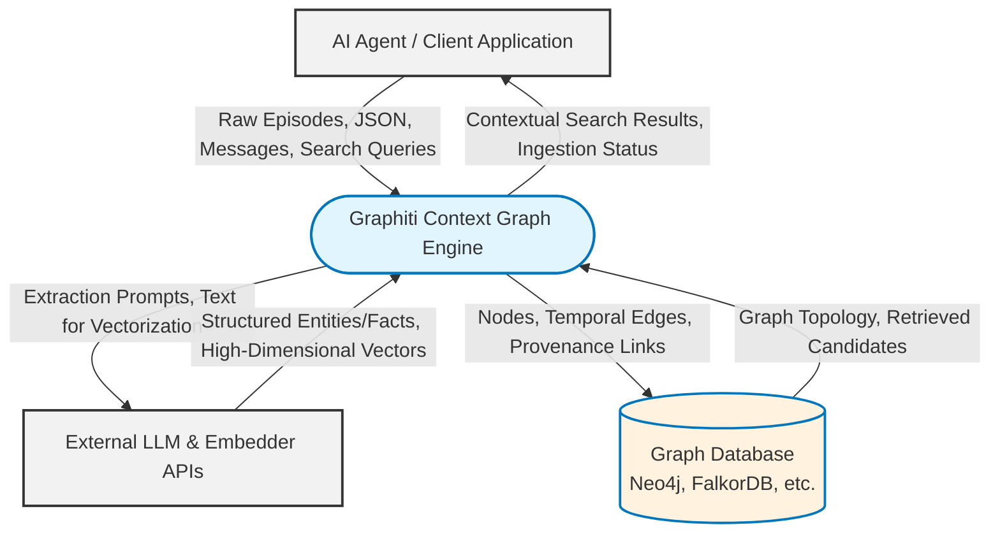
```mermaid
flowchart TD
    classDef external fill:#f2f2f2,stroke:#333,stroke-width:2px;
    classDef process fill:#e1f5fe,stroke:#0277bd,stroke-width:2px,rx:10,ry:10;
    classDef datastore fill:#fff3e0,stroke:#0277bd,stroke-width:2px;

    Agent[AI Agent / Client Application]:::external
    LLM[External LLM & Embedder APIs]:::external
    DB[(Graph Database<br/>Neo4j, FalkorDB, etc.)]:::datastore

    Graphiti([Graphiti Context Graph Engine]):::process

    Agent -->|Raw Episodes, JSON, Messages, Search Queries| Graphiti
    Graphiti -->|Contextual Search Results, Ingestion Status| Agent

    Graphiti -->|Extraction Prompts, Text for Vectorization| LLM
    LLM -->|Structured Entities/Facts, High-Dimensional Vectors| Graphiti

    Graphiti -->|Nodes, Temporal Edges, Provenance Links| DB
    DB -->|Graph Topology, Retrieved Candidates| Graphiti
```

**Description (Level 0):**
*   **Input Data:** Applications or AI Agents submit raw `Episodes` (unstructured text, conversational messages, or structured JSON) and natural language search queries [3-6].
*   **Transformations:** The central Graphiti Engine coordinates with external LLMs and Embedders to translate unstructured data into structured knowledge and vectors [1].
*   **Output Data:** The engine outputs persisted temporal graphs to the database and returns synthesized, highly relevant `SearchResults` (facts, nodes, and communities) to the requesting agent [7, 8].

---

#### DFD Level 1: System Processes
This diagram breaks down the internal transformation lifecycle inside the Graphiti Engine. It visualizes the step-by-step data mutation pipeline during ingestion and retrieval [1, 9].

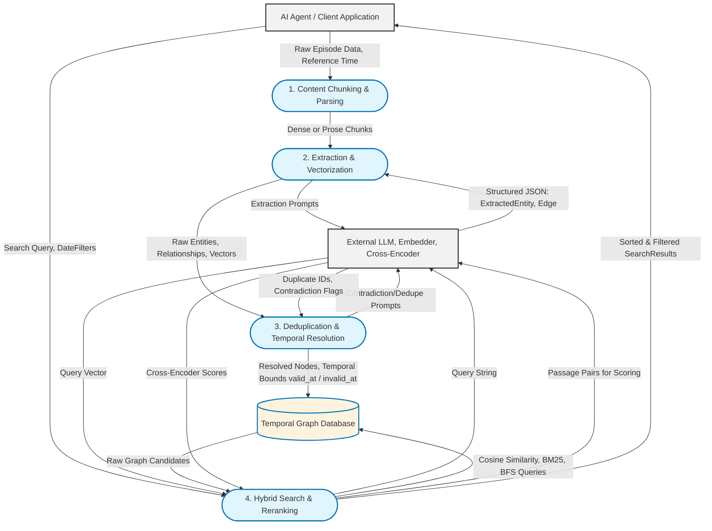
```mermaid
flowchart TD
    classDef external fill:#f2f2f2,stroke:#333,stroke-width:2px;
    classDef process fill:#e1f5fe,stroke:#0277bd,stroke-width:2px,rx:10,ry:10;
    classDef datastore fill:#fff3e0,stroke:#0277bd,stroke-width:2px;

    Agent[AI Agent / Client Application]:::external
    LLM[External LLM, Embedder, Cross-Encoder]:::external
    DB[(Temporal Graph Database)]:::datastore

    P1([1. Content Chunking & Parsing]):::process
    P2([2. Extraction & Vectorization]):::process
    P3([3. Deduplication & Temporal Resolution]):::process
    P4([4. Hybrid Search & Reranking]):::process

    %% Ingestion Flow
    Agent -->|Raw Episode Data, Reference Time| P1
    P1 -->|Dense or Prose Chunks| P2
    P2 -->|Extraction Prompts| LLM
    LLM -->|Structured JSON: ExtractedEntity, Edge| P2
    P2 -->|Raw Entities, Relationships, Vectors| P3
    
    P3 -->|Contradiction/Dedupe Prompts| LLM
    LLM -->|Duplicate IDs, Contradiction Flags| P3
    P3 -->|Resolved Nodes, Temporal Bounds valid_at / invalid_at| DB

    %% Retrieval Flow
    Agent -->|Search Query, DateFilters| P4
    P4 -->|Query String| LLM
    LLM -->|Query Vector| P4
    
    P4 -->|Cosine Similarity, BM25, BFS Queries| DB
    DB -->|Raw Graph Candidates| P4
    
    P4 -->|Passage Pairs for Scoring| LLM
    LLM -->|Cross-Encoder Scores| P4
    
    P4 -->|Sorted & Filtered SearchResults| Agent
```

**Description (Level 1 Transformations):**
1.  **Content Chunking (Input Parsing):** Raw `Episodes` are evaluated for entity density. Highly dense data (like JSON) is chunked to prevent extraction loss, while prose passes through [6, 10, 11].
2.  **Extraction & Vectorization (Data Transformation):** Chunks are sent to the LLM to extract `EntityNode` and `EntityEdge` structures. Simultaneously, the `EmbedderClient` generates semantic vectors for these objects [12-14].
3.  **Deduplication & Temporal Resolution (Data Transformation):** New entities are merged with existing graph data using fuzzy/MinHash matching and LLM resolution [15, 16]. Extracted facts are evaluated for contradictions; superseded facts receive an `invalid_at` timestamp, while new facts are saved with a `valid_at` timestamp [17-19]. The resolved data is then persisted to the `Graph Database` [20].
4.  **Hybrid Search & Reranking (Output Generation):** Search queries are vectorized and pushed to the database using concurrent BM25 (keyword), Cosine Similarity, and BFS (graph traversal) strategies [21]. The raw candidates are aggregated, reranked (via Reciprocal Rank Fusion, Cross-Encoder, or Maximal Marginal Relevance), and formatted as the final output for the agent [8, 22, 23].

In the Graphiti framework, state transitions are primarily driven by its bi-temporal data model and its asynchronous ingestion pipeline. 

Here are the key entities with state and their corresponding State Machine diagrams.

#### 1. EntityEdge (Temporal Fact Lifecycle)
The `EntityEdge` represents a factual relationship between two entities. Unlike traditional knowledge graphs where updated facts overwrite old ones, Graphiti explicitly tracks the temporal validity of facts over time [1, 2]. 

*   **Active:** The fact is currently true. It has a `valid_at` timestamp, and `invalid_at` is null [3].
*   **Superseded (Invalidated):** When new information contradicts an existing fact, the old fact is not deleted. Instead, its `invalid_at` timestamp is set to mark when it stopped being true [1, 3].
*   **Expired:** If a fact is explicitly removed via the API or MCP tools (like `delete_entity_edge`), it is conceptually expired by setting the `expired_at` timestamp [3].

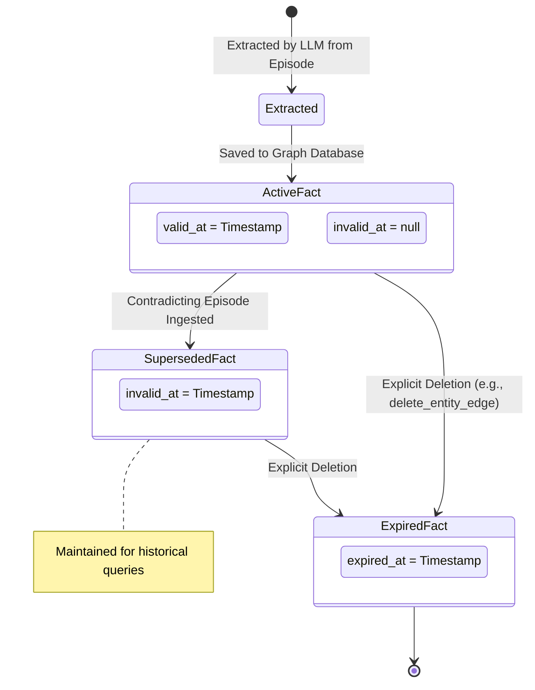
```mermaid
stateDiagram-v2
    direction TB
    [*] --> Extracted : Extracted by LLM from Episode
    Extracted --> ActiveFact : Saved to Graph Database
    
    state ActiveFact {
        valid_at_set : valid_at = Timestamp
        invalid_at_null : invalid_at = null
    }
    
    ActiveFact --> SupersededFact : Contradicting Episode Ingested
    
    state SupersededFact {
        invalidated : invalid_at = Timestamp
    }
    note right of SupersededFact : Maintained for historical queries
    
    ActiveFact --> ExpiredFact : Explicit Deletion (e.g., delete_entity_edge)
    SupersededFact --> ExpiredFact : Explicit Deletion
    
    state ExpiredFact {
        expired : expired_at = Timestamp
    }
    
    ExpiredFact --> [*]
```

#### 2. Episode Processing (Ingestion Queue Lifecycle)
Because episode ingestion involves multiple parallel LLM calls (extraction, deduplication, and summarization), processing is highly concurrent but explicitly bounded by a `QueueService` to prevent rate limit errors [4-6]. 

*   **Queued:** An AI agent invokes `add_memory` or a client hits the `/messages` endpoint, and the episode enters the `QueueService` [6, 7].
*   **Processing:** The episode begins processing once concurrency falls below the configured `SEMAPHORE_LIMIT` [5]. It cycles through chunking, extraction, and deduplication.
*   **Completed:** The graph mutations are successfully persisted to the database inside a single transaction [8].
*   **Failed:** The pipeline encounters an error, most commonly an LLM provider Rate Limit Error (HTTP 429) if the concurrency is tuned too high for the given API tier [9].

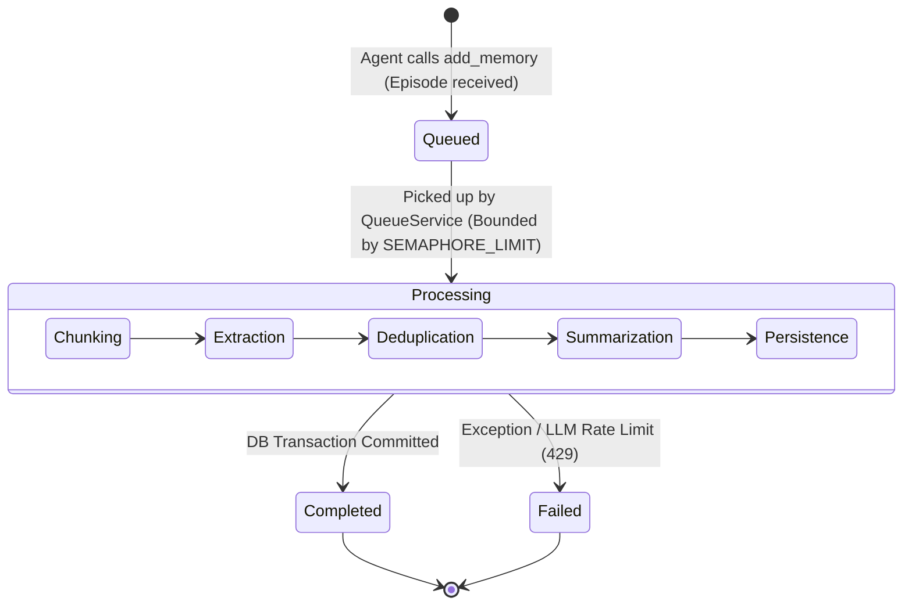
```mermaid
stateDiagram-v2
    direction TB
    [*] --> Queued : Agent calls add_memory (Episode received)
    
    Queued --> Processing : Picked up by QueueService (Bounded by SEMAPHORE_LIMIT)
    
    state Processing {
        direction LR
        Chunking --> Extraction
        Extraction --> Deduplication
        Deduplication --> Summarization
        Summarization --> Persistence
    }
    
    Processing --> Completed : DB Transaction Committed
    Processing --> Failed : Exception / LLM Rate Limit (429)
    
    Completed --> [*]
    Failed --> [*]
```

### Step 4 Subsystems investigation
#### Core / Domain Layer

**Business Purpose**
Graphiti's core domain solves the fundamental limitations of traditional Retrieval-Augmented Generation (RAG) by providing AI agents with **temporal context graphs** [1]. Traditional RAG struggles with frequently changing data due to its reliance on batch processing and static document chunking [2]. Graphiti instead builds an evolving memory structure that explicitly tracks how facts change over time (via a bi-temporal data model) and guarantees data provenance by linking all derived facts back to the raw interactions or documents (episodes) that established them [1, 2]. 

**Internal Structure (Classes, Functions, Modules)**
The core library resides under the `graphiti_core/` module [3]. 
*   **Orchestrator:** `graphiti.py` contains the central `Graphiti` client which orchestrates ingestion, searching, and configuration [4].
*   **Ontology / Data Models (`nodes.py`, `edges.py`, `models/`):** Defines the foundational Pydantic classes: `Node`, `EpisodicNode` (raw data), `EntityNode` (extracted concepts), `CommunityNode`, `Edge`, `EntityEdge` (extracted facts), and structural edges like `EpisodicEdge` [4-8].
*   **Search (`search/`):** Handles retrieval through `search()`, `edge_search()`, and `node_search()`, utilizing `SearchConfig` objects and executing multiple search strategies concurrently [9-11].
*   **Ingestion & Maintenance (`utils/`):** Contains logic for `extract_nodes_and_edges_bulk()`, deterministic and fuzzy deduplication (`dedupe_nodes_bulk`), and dynamic entity summarization [4, 12, 13]. 
*   **API Namespaces (`namespaces/`):** Organizes user-facing DB operations logically into `NodeNamespace` and `EdgeNamespace` [14, 15].
*   **Prompts (`prompts/`):** A centralized library of system prompts for LLM interactions (e.g., `extract_edges`, `dedupe_nodes`) [4, 16, 17].

**Dependencies**
*   **What it depends on:** The core layer relies heavily on **Pydantic** for modeling its ontology and parsing structured LLM output [5, 18]. It also depends on third-party SDKs for inference (e.g., **OpenAI**, **Anthropic**, **Google GenAI**, **Groq**), embedding generation (e.g., **Voyage AI**), and specific database drivers (e.g., **Neo4j**, **FalkorDB**, **Kuzu**, **Boto3** for Neptune) [4, 19-23].
*   **Who depends on it:** Graphiti is the underlying engine for two deployable application layers: the **FastAPI REST Service** (`server/graph_service/`) and the **Model Context Protocol (MCP) Server** (`mcp_server/`) [3, 24]. Furthermore, it is imported directly by developers building custom AI applications and is the core OSS engine powering the managed enterprise service, **Zep** [1, 25, 26].

**Key Algorithms**
*   **Incremental Graph Construction & Deduplication:** When raw data is ingested, it is first evaluated for entity density. High-density data (like JSON) is intelligently chunked [27, 28]. Extracted entities are then merged into the graph using a two-pass deduplication system: a fast, deterministic pass using **MinHash, Locality-Sensitive Hashing (LSH), and Jaccard Similarity**, followed by an LLM-driven prompt to resolve ambiguous semantic duplicates [29-32]. 
*   **Temporal Fact Contradiction:** When a new fact contradicts an existing `EntityEdge` in the graph, the core engine explicitly preserves history. Instead of overwriting the database record, it modifies the older edge by setting its `invalid_at` timestamp to the exact time the new episode occurred, superseding it while allowing AI agents to query the historical state [2, 33].
*   **Hybrid Retrieval & Reranking:** Queries execute highly parallelized sub-searches combining **BM25 full-text**, **cosine similarity vector search**, and **Breadth-First Search (BFS) graph traversal** [34, 35]. The disparate result sets are aggregated and re-scored using algorithms like **Reciprocal Rank Fusion (RRF)**, **Maximal Marginal Relevance (MMR)** (optimizing for diversity), **Node Distance** (graph topology proximity), or passing passage pairs through a neural **Cross-Encoder** [34, 36, 37]. 

**Public API**
The primary interface is the `Graphiti` client class, which exports high-level functions like:
*   `add_episode(episode_body, reference_time, ...)`: Triggers the full extraction and ingestion pipeline [38, 39].
*   `search(query, search_filters, config, ...)`: Executes the hybrid retrieval pipeline returning `SearchResults` [39].
*   `build_indices_and_constraints()`: Bootstraps the connected graph database [39].
*   **Namespaced Accessors:** Direct CRUD and mutation methods are available via `client.nodes.entity.save(node)` or `client.edges.entity.save(edge)` [14, 15, 40].

**Invariants (Contracts, Preconditions, Postconditions)**
*   **Strict Provenance:** Every derived `EntityNode` or `EntityEdge` MUST trace back to its origin. The system guarantees this by generating an `EpisodicEdge` (a `MENTIONS` relationship) linking every extracted fact back to the `EpisodicNode` representing the raw data [5, 41].
*   **Bi-Temporal Bounding:** All `EntityEdge` records must track real-world temporal validity. An active fact has a `valid_at` timestamp and an `invalid_at` value of null. A superseded fact MUST maintain its old `valid_at` and receive an `invalid_at` bound [2, 8].
*   **Group Isolation:** Data partitions are strictly enforced via a `group_id`. Graph traversal and database queries must never cross boundaries into nodes/edges belonging to an unrequested `group_id` [42-44].

**Configuration**
*   **Environment Variables:** Driven largely by `pydantic-settings` and `.env` files. Common configurations include `OPENAI_API_KEY`, `NEO4J_URI`, `FALKORDB_HOST`, etc. [19, 45]. 
*   **Concurrency (`SEMAPHORE_LIMIT`):** Defaults to 10 or 20. Limits the number of concurrent asynchronous LLM inferences during extraction to prevent API Rate Limit (429) errors [46-48].
*   **Chunking Defaults:** `CHUNK_TOKEN_SIZE` (3000), `CHUNK_OVERLAP_TOKENS` (200), `CHUNK_MIN_TOKENS` (1000), and `CHUNK_DENSITY_THRESHOLD` (0.15) [49, 50].
*   **Search Defaults:** Limit defaults to `10`, MMR Lambda defaults to `0.5`, minimum similarity score defaults to `0.6` [35, 51].

**Extension Points**
*   **Graph Databases (`GraphDriver`):** Adding a new graph database backend requires implementing the `GraphDriver` base class (managing connections and indices) and satisfying the `QueryExecutor` and `Transaction` interfaces. The specific Cypher/query logic is injected by implementing operation classes like `EntityNodeOperations` and `SearchOperations` [52-55].
*   **AI Integrations:** Abstract base classes `LLMClient`, `EmbedderClient`, and `CrossEncoderClient` allow developers to plug in new LLMs, vectorizers, or neural rerankers [56-58].
*   **Custom Ontology:** Developers can inject domain-specific structure by subclassing `BaseModel` for custom entity/edge types (e.g., `Procedure`, `Person`) and passing them to the core pipeline, driving the LLM to extract to a prescribed ontology rather than an emergent one [2, 5, 41, 59].
*   **Telemetry/Observability:** Supports distributed tracing via the `Tracer` interface (`OpenTelemetryTracer`), allowing developers to implement custom logging or use the `NoOpTracer` [60, 61].

#### API / Interface Layer

**Purpose: What business problem does it solve?**
The API / Interface Layer of Graphiti serves as the bridge between Graphiti’s core temporal graph engine and external client applications. It solves the problem of exposing stateful, temporal graph memory to stateless distributed systems and autonomous AI agents.
*   **FastAPI REST Service (`server/`)**: Solves the need for a scalable, web-accessible microservice. It allows developers to integrate Graphiti into broader enterprise backend architectures, decoupling the graph engine from client applications via standard HTTP endpoints [1, 2].
*   **MCP Server (`mcp_server/`)**: Solves the integration bottleneck for autonomous AI assistants. By implementing the Model Context Protocol (MCP), it provides standardized "tools" that agents like Claude Desktop or Cursor IDE can natively discover and invoke to augment their own memory dynamically [3, 4].

**Internal Structure: Classes, Functions, Modules and their Relations**
*   **FastAPI Implementation (`server/graph_service/`)**:
    *   **`main.py`**: The application entry point. It manages the app lifecycle (startup/shutdown) and mounts routers [5].
    *   **`routers/ingest.py` & `routers/retrieve.py`**: Separate route controllers handling data ingestion (`POST /messages`, `POST /entity-node`) and querying (`POST /search`, `POST /get-memory`) [6, 7].
    *   **`zep_graphiti.py`**: Contains `ZepGraphiti`, a wrapper extending the core `Graphiti` client. It provides the dependency injection (`ZepGraphitiDep`) used across route handlers to securely inject configured database and LLM clients [8, 9].
    *   **`dto/`**: Defines Pydantic data transfer objects (e.g., `AddMessagesRequest`, `SearchResults`, `Message`) to strictly enforce API contracts [10-12].
*   **MCP Implementation (`mcp_server/src/`)**:
    *   **`graphiti_mcp_server.py`**: The core FastMCP server that registers Python functions as explicit tools (`@mcp.tool()`) [13, 14].
    *   **`services/queue_service.py`**: Contains `QueueService`, which manages an `asyncio.Queue` and throttles LLM calls to prevent rate limiting [15, 16].
    *   **`services/factories.py`**: Contains `LLMClientFactory`, `DatabaseDriverFactory`, and `EmbedderFactory`. These abstract away the instantiation of specific external provider clients [17, 18].
    *   **`config/schema.py`**: Defines the hierarchical configuration schema using `pydantic-settings` to parse YAML and environment variables [19, 20].
    *   **`models/entity_types.py`**: Holds pre-defined Pydantic ontology models tailored for agent memory, such as `Preference`, `Requirement`, and `Procedure` [21].

**Dependencies**
*   **What it depends on**: Both layers depend on `graphiti_core` for the actual graph mutation and retrieval logic [22, 23]. The REST API depends on **FastAPI** and **Uvicorn** for routing and HTTP serving [5]. The MCP server depends on **FastMCP** (part of the official MCP Python SDK) and **PyYAML** for configuration [13, 19].
*   **Who depends on it**: The FastAPI server is consumed by custom AI applications and backend microservices. The MCP server is directly consumed by MCP-compatible AI clients like **Claude Desktop**, **Cursor IDE**, and **GitHub Copilot Chat** [24, 25].

**Key Algorithms / Patterns**
*   **Asynchronous Queueing & Throttling (MCP)**: Because episode ingestion triggers multiple LLM inference calls, the MCP server utilizes a `QueueService` bounded by an `asyncio.Semaphore` [15]. It groups processing tasks by `group_id` and strictly limits concurrency (via `SEMAPHORE_LIMIT`) to prevent `429 Rate Limit Errors` from LLM providers like OpenAI or Anthropic [26, 27].
*   **Factory Pattern for Provider Agnosticism (MCP)**: The `factories.py` module uses the Factory pattern to dynamically instantiate database drivers, LLMs, and embedders. When the server boots, the config is passed to these factories, which resolve the correct classes (e.g., `FalkorDriver` vs `Neo4jDriver`) without hardcoding dependencies [17, 18].
*   **Background Task Offloading (FastAPI)**: The REST API utilizes an `AsyncWorker` to process bulk message ingestion. When a client calls `POST /messages`, the endpoint accepts the payload, returns a `202 Accepted` response, and places the ingestion tasks onto an internal `asyncio.Queue` for background processing [28, 29].

**Public API: Exported Interfaces**
*   **FastAPI REST Routes**:
    *   **Ingestion**: `POST /messages`, `POST /entity-node`, `POST /clear`, `DELETE /entity-edge/{uuid}`, `DELETE /episode/{uuid}`, `DELETE /group/{group_id}` [7, 29, 30].
    *   **Retrieval**: `POST /search` (hybrid search), `POST /get-memory` (context assembly from messages), `GET /episodes/{group_id}`, `GET /entity-edge/{uuid}` [31, 32].
*   **MCP Server Tools**:
    *   `add_memory`: Adds text, JSON, or conversation history to the graph [14].
    *   `search_nodes` / `search_memory_facts`: Executes semantic/hybrid searches for entities and relationships [33].
    *   `get_entity_edge` / `get_episodes`: Direct retrievals by UUID or Group ID [34].
    *   `delete_entity_edge` / `delete_episode` / `clear_graph`: Maintenance and deletion tools [33, 34].
    *   `get_status`: Returns connection health [35].

**Invariants (Contracts, Preconditions, Postconditions)**
*   **Preconditions**: Both servers strictly require valid LLM Provider credentials (e.g., `OPENAI_API_KEY`) and a reachable, initialized graph database backend (FalkorDB or Neo4j) [36].
*   **Contracts**: Data isolation is strictly enforced via `group_id`. All read/write operations must operate within a defined `group_id` (defaulting to `"main"`) to prevent data leakage between tenants or agent sessions [3, 37]. Inputs must conform strictly to Pydantic DTOs [10, 12].
*   **Postconditions**: Tool executions via MCP return a standardized `SuccessResponse`, `ErrorResponse`, or heavily formatted dictionary results like `NodeSearchResponse` or `FactSearchResponse`, guaranteeing predictable schema formats for the calling LLM agent [38, 39].

**Configuration: Parameters, Environment Variables, Defaults**
*   **FastAPI Config**: Managed via a simple `Settings` class pulling from `.env`, requiring `neo4j_uri`, `neo4j_user`, `neo4j_password`, and `openai_api_key` [40].
*   **MCP Config**: Uses a highly hierarchical config prioritizing CLI args -> Environment Variables -> `config.yaml` [41].
    *   **Transport**: Configurable as `http` (default, available at `http://localhost:8000/mcp/`) or `stdio` [3, 41].
    *   **Defaults**: Uses `FalkorDB` as the default database, `gpt-5-mini` (or `gpt-4o-mini`) as the default LLM, and `text-embedding-3-small` for embeddings [41, 42].
    *   **`SEMAPHORE_LIMIT`**: Crucial environment variable defaulting to `10`, dictating maximum parallel episode processing [26, 43].

**Extension Points: Plugin points, hooks, abstract interfaces**
*   **Custom Entity Ontology**: The MCP server exposes an `entity_types` array in `config.yaml`. Developers can define custom prescribed schemas (e.g., overriding defaults like `Preference` or `Procedure` to inject domain-specific entities like `MedicalRecord` or `SoftwareComponent`) without modifying the Python source [44-46].
*   **Service Factories**: By implementing new classes matching the `LLMClient` or `GraphDriver` base classes from `graphiti_core`, developers can simply register them in the `factories.py` module to instantly expose new third-party providers through the API layer [18].

##### Storage / Persistence

**Purpose: What business problem does it solve?**
The Storage/Persistence layer of Graphiti abstracts the underlying graph database infrastructure, solving the problem of **vendor lock-in** while enabling the robust, transactional persistence of **temporally-aware knowledge graphs** [1], [2]. It allows AI agents to reliably store, evolve, and retrieve complex relationships (facts), entity embeddings, and precise temporal bounds (`valid_at`, `invalid_at`) without the core engine needing to couple its business logic to a specific database query language (like Cypher) [3], [4], [5].

**Internal Structure: Classes, Functions, Modules and their Relations**
The persistence layer was heavily refactored to cleanly decouple data from I/O. It operates across three distinct sub-layers [5]:
1.  **Operations ABCs (`graphiti_core/driver/operations/`)**: Defines flat, abstract base classes for every entity type in the ontology (e.g., `EntityNodeOperations`, `EntityEdgeOperations`, `SearchOperations`, `GraphMaintenanceOperations`) [6], [7].
2.  **Concrete Drivers & Implementations (`graphiti_core/driver/`)**: The `GraphDriver` abstract base class acts as the central factory, exposing the operations via property accessors [2]. Concrete implementations (`Neo4jDriver`, `FalkorDriver`, `KuzuDriver`, `NeptuneDriver`) implement the core connection logic and compose the specific operation implementations (e.g., `Neo4jEntityNodeOperations`, `FalkorSearchOperations`) [8], [9].
3.  **Query Generators & Parsers**: Raw database queries (e.g., Cypher) are abstracted into functions within `models/nodes/node_db_queries.py` and `models/edges/edge_db_queries.py` [2], [10]. Result sets from the databases are mapped back to Pydantic models via `driver/record_parsers.py` [11].

**Dependencies**
*   **What it depends on:** 
    *   **Data Models:** It depends heavily on Graphiti's core ontology ontology models (`EntityNode`, `EntityEdge`, `EpisodicNode`, etc.) [12], [13].
    *   **Vendor SDKs:** Native database clients: `neo4j` (for Neo4j), `falkordb` (for FalkorDB), `kuzu` (for embedded Kuzu), and `boto3` / `opensearchpy` (for Amazon Neptune paired with OpenSearch) [14], [15], [16], [17].
*   **Who depends on it:** 
    *   **Graphiti Core Client:** The `Graphiti` orchestrator configures and holds the active `GraphDriver` [18].
    *   **Namespaces:** `NodeNamespace` and `EdgeNamespace` act as thin API wrappers delegating logic to the driver's operations [19], [20], [21].
    *   **Ingestion Utilities:** `bulk_utils.py` uses the driver heavily for bulk transactional writes (`add_nodes_and_edges_bulk_tx`) [22].
    *   **Search Pipeline:** `search.py` routes semantic, BM25, and BFS queries to the driver's `SearchOperations` [23].

**Key Algorithms / Patterns**
*   **Transaction API Normalization:** Graphiti standardizes transactions via an `async with driver.transaction() as tx:` context manager [5]. For databases supporting true rollbacks (Neo4j), it initiates a real transaction (`session.begin_transaction()`). For non-transactional or limited drivers (FalkorDB, Kuzu, Neptune), it yields a `_SessionTransaction` fallback where queries execute immediately, providing a uniform API while being explicit about varying transactional guarantees [24], [25].
*   **Import Cycle Breaker (QueryExecutor):** To prevent import cycles (where operations need to call the driver, but the driver instantiates the operations), Graphiti uses the Dependency Inversion Principle. Operations only depend on a slim `QueryExecutor` ABC (which `GraphDriver` extends) [26], [27].
*   **Vector Search & Fulltext Translation:** Semantic and keyword search algorithms dynamically translate logic based on the provider. For example, Neo4j uses `db.idx.fulltext.queryNodes`, FalkorDB uses a custom `@` syntax with `vec.cosineDistance`, and Neptune delegates to an external OpenSearch collection [10], [28], [29].

**Public API: Exported Interfaces**
The `GraphDriver` ABC mandates the following core interface contract [2]:
*   `execute_query(query: str, **kwargs)`: Executes a raw query natively.
*   `session()`: Returns a `GraphDriverSession`.
*   `transaction()`: Yields an async `Transaction` context manager [5].
*   `build_indices_and_constraints()`: Bootstraps the DB schema and vector indices [2].
*   `delete_all_indexes()`: Cleans up the schema [2].
*   **Operation Accessors:** Properties returning the instantiated domain operations (e.g., `driver.entity_nodes`, `driver.search`) [2].

**Invariants: Contracts, Preconditions, Postconditions**
*   **Pure Data Models (Precondition):** Pydantic data models (`EntityNode`, `EntityEdge`) are strictly pure data. They must contain zero database logic and maintain no hidden state [4], [5].
*   **Strict Multi-Tenancy (Contract):** All read and write operations **must** enforce boundary isolation by evaluating or writing the `group_id` attribute. Cross-tenant traversal is strictly prohibited [30], [31].
*   **Schema Consistency (Postcondition):** `build_indices_and_constraints()` guarantees that regardless of the backend (e.g., Neo4j, FalkorDB, or Kuzu's explicit schema requirements), the necessary fulltext indices and vector properties are initialized before reads/writes occur [32], [33].

**Configuration: Parameters, Environment Variables, Defaults**
*   **Neo4j:** Requires `NEO4J_URI` (default: `bolt://localhost:7687`), `NEO4J_USER` (default: `neo4j`), and `NEO4J_PASSWORD` [34], [35], [36]. The database name is hardcoded to `neo4j` by default but can be overridden in the constructor [37]. Enterprise users can enable `USE_PARALLEL_RUNTIME` [37].
*   **FalkorDB:** Configured via `FALKORDB_HOST` (default: `localhost`), `FALKORDB_PORT` (default: `6379`), `FALKORDB_USERNAME`, and `FALKORDB_PASSWORD` [35]. The default database name is `default_db` [37].
*   **Kuzu:** Configured via `KUZU_DB`, which defaults to `:memory:` for embedded local testing [35].
*   **Neptune:** Requires `NEPTUNE_HOST`, `NEPTUNE_PORT` (default: `8182`), and `AOSS_HOST` for its OpenSearch dependency [35], [38].

**Extension Points: Plugin points, hooks, abstract interfaces**
The storage layer is highly extensible. Adding support for a new graph database backend follows a strict plugin pattern [2]:
1.  **Register the Provider:** Add the new provider name to the `GraphProvider` Enum [2], [39].
2.  **Implement the Driver:** Create a class implementing the `GraphDriver` interface (handling `execute_query`, `session`, `transaction`, etc.) [2].
3.  **Implement Operations:** Create concrete implementations for all interfaces in `graphiti_core/driver/operations/` (e.g., `EntityNodeOperations`, `SearchOperations`) and expose them via properties on the new driver [2], [6].
4.  **Inject Query Dialects:** Add provider-specific query syntax to the branching logic in `graphiti_core/models/nodes/node_db_queries.py` and `graphiti_core/models/edges/edge_db_queries.py` [2].

##### Search / Retrieval

**Purpose: What business problem does it solve?**
The Search/Retrieval subsystem of Graphiti solves the limitations of traditional Retrieval-Augmented Generation (RAG) when dealing with dynamic, frequently changing knowledge [1-3]. Traditional RAG relies heavily on batch processing, static document chunking, and sequential LLM summarization, which results in high latency and poor historical tracking [2, 3]. Graphiti solves this by executing a **hybrid retrieval pipeline** that combines semantic embeddings, keyword search (BM25), and structural graph traversal [2]. This allows AI agents to execute low-latency, high-precision queries across time, meaning, and relationships to retrieve exact factual states at any given moment without requiring LLM-driven summarization [2-4].

**Internal Structure: Classes, functions, modules, and their relations**
The retrieval subsystem is contained entirely within the `graphiti_core/search/` module [5, 6].
*   **Orchestration (`search.py`)**: Contains the master `search()` function, which acts as a router. It delegates parallelized sub-searches to `edge_search()`, `node_search()`, `community_search()`, and `episode_search()` based on the provided configuration [7-9].
*   **Configuration & Data Transfer (`search_config.py`)**: Defines the central `SearchConfig` Pydantic model, which houses specific configurations (`EdgeSearchConfig`, `NodeSearchConfig`, etc.) [10-14]. It defines Enums for `SearchMethod` (e.g., `bm25`, `cosine_similarity`, `bfs`) and `Reranker` (e.g., `rrf`, `mmr`, `cross_encoder`) [11, 12]. It also defines the final `SearchResults` output payload [15].
*   **Query Filtering (`search_filters.py`)**: Defines the `SearchFilters` class, which handles dynamic database filtering for `valid_at` / `invalid_at` temporal boundaries, `node_labels`, and explicit property comparisons (`PropertyFilter`, `DateFilter`) [16, 17]. 
*   **Algorithms & Database Interface (`search_utils.py`)**: Contains the concrete implementations of reranking algorithms (`rrf`, `maximal_marginal_relevance`) and delegates execution to the database drivers (e.g., `node_similarity_search`, `edge_bfs_search`) [18-29].
*   **Recipes (`search_config_recipes.py`)**: A library of predefined `SearchConfig` objects for common retrieval patterns (e.g., `COMBINED_HYBRID_SEARCH_RRF`, `EDGE_HYBRID_SEARCH_MMR`) [30-40].

**Dependencies: What does it depend on? Who depends on it?**
*   **What it depends on**: 
    *   **`GraphDriver`**: Relies on the active graph database driver (Neo4j, FalkorDB, etc.) through its `SearchOperations` interface to execute native database queries [41, 42].
    *   **`EmbedderClient`**: Used to generate vector embeddings (`query_vector`) from the natural language query prior to executing semantic searches [7, 42].
    *   **`CrossEncoderClient`**: Used to re-score candidate results using neural models (e.g., BGE, Gemini, or OpenAI) if configured [7, 42, 43].
*   **Who depends on it**:
    *   **Core Framework**: The main `Graphiti` orchestrator class exposes `search` directly as `client.search()` [44].
    *   **REST API Layer**: Used by `routers/retrieve.py` for the `POST /search` and `POST /get-memory` endpoints [45-47].
    *   **MCP Server Layer**: Consumed by MCP agent tools exposed via `search_nodes` and `search_memory_facts` [48].

**Key Algorithms / Patterns**
*   **Concurrent Hybrid Execution**: Instead of running searches sequentially, Graphiti uses an asynchronous `semaphore_gather` pattern to execute Full-Text (BM25), Semantic (Cosine Similarity), and structural Graph Traversal (BFS) queries simultaneously against the database backend [18, 21-25, 42].
*   **Reciprocal Rank Fusion (RRF)**: The default reranking algorithm. It normalizes and merges the disparately scored candidates from BM25, Semantic, and BFS methods by calculating a combined score using the formula `1 / (rank + rank_constant)` [28].
*   **Maximal Marginal Relevance (MMR)**: Used to optimize for diversity in the returned context. It normalizes query and candidate vectors using L2 normalization (`normalize_l2`) and penalizes highly relevant candidates that are too semantically similar to candidates already selected, governed by an `mmr_lambda` parameter [29].
*   **Graph-Aware Rerankers**: 
    *   *Node Distance Reranker*: Rescores candidates based on their topological proximity in the graph to a defined `center_node_uuid` [28].
    *   *Episode Mentions Reranker*: Promotes facts/entities that have been corroborated or mentioned across many distinct episodes [29].
*   **Neural Cross-Encoder Scoring**: Passes the raw query and the candidate string together into a neural reranker model to receive an absolute relevance score (0-100) for high-precision filtering [49].

**Public API: What interfaces does it export?**
*   **`search()`**: The primary asynchronous function. Accepts a query string, a list of `group_ids`, a `SearchConfig`, and `SearchFilters`. Returns a `SearchResults` object [7].
*   **`SearchResults`**: A Pydantic model containing ordered lists of retrieved `EntityEdge`, `EntityNode`, `EpisodicNode`, and `CommunityNode` objects, alongside their respective calculated `reranker_scores` [15].
*   **Pre-built Configurations**: `COMBINED_HYBRID_SEARCH_RRF`, `EDGE_HYBRID_SEARCH_CROSS_ENCODER`, etc. [31-40].
*   **`SearchFilters`**: API for applying temporal or categorical bounds to the query [17].

**Invariants: Contracts, preconditions, postconditions**
*   **Precondition (Group Validation)**: The `search` function must immediately invoke `validate_group_ids(group_ids)` to ensure the requested tenants/partitions are valid [7, 50].
*   **Contract (Strict Multi-Tenancy)**: All database-level query constructors (e.g., `node_search_filter_query_constructor`) enforce data isolation. Graph traversals must never retrieve facts or nodes belonging to a `group_id` that was not explicitly requested [51, 52].
*   **Postcondition (Trimmed & Ranked Output)**: Output arrays within the `SearchResults` object must be explicitly ordered by their reranker scores and truncated to the requested `limit` parameter defined in the `SearchConfig` [7-9, 14, 15].

**Configuration: Parameters, environment variables, defaults**
Search limits and thresholds are defined as defaults in `search_utils.py` and `search_config.py` but can be dynamically overridden per-query via the `SearchConfig` object:
*   `DEFAULT_SEARCH_LIMIT = 10` [10].
*   `DEFAULT_MIN_SCORE = 0.6` (for cosine similarity) [19].
*   `DEFAULT_MMR_LAMBDA = 0.5` (balance factor between relevance and diversity) [19].
*   `MAX_SEARCH_DEPTH = 3` (for Breadth-First Search traversal) [19].
*   `MAX_QUERY_LENGTH = 128` (prevents excessively long strings from overwhelming BM25 indices) [19].

**Extension Points: Plugin points, hooks, abstract interfaces**
*   **`SearchOperations` Interface**: Graphiti's storage layer isolates search logic. Adding a new graph database requires implementing the abstract `SearchOperations` class, providing native database translation for semantic, full-text, and BFS methods (e.g., `Neo4jSearchOperations`, `FalkorSearchOperations`) [41, 53, 54].
*   **`CrossEncoderClient` Abstract Class**: Developers can inject custom neural rerankers by implementing the `CrossEncoderClient` interface [43]. Native implementations already exist for OpenAI, Gemini, and local Sentence Transformers (BGE) [49, 55, 56].
*   **`EmbedderClient` Abstract Class**: The pipeline relies on this interface for vectorizing the search query, allowing for custom embedding model plugins [42, 57].
*   **Custom Search Recipes**: Developers are not restricted to predefined recipes and can instantiate custom `SearchConfig` objects to mix and match retrieval strategies and rerankers [10, 14].

##### Observability

Here is a deep dive into the Observability subsystem of Graphiti, which encompasses both distributed tracing (via OpenTelemetry) and usage analytics (via PostHog).

##### **Purpose: What business problem does it solve?**
Graphiti’s observability subsystem solves two primary problems:
1. **Operational Observability (OpenTelemetry):** Graphiti relies on highly concurrent, distributed operations involving complex LLM extractions and graph database transactions. OpenTelemetry tracing allows developers to trace these asynchronous operations step-by-step, measure latency bottlenecks (e.g., LLM inference vs. database I/O), and debug hybrid retrieval pipelines [1, 2].
2. **Product Observability (Telemetry):** It provides anonymous usage tracking to help the maintainers understand which databases (Neo4j, FalkorDB, etc.), LLMs, and Python environments are most widely used. This solves the problem of prioritizing framework improvements and roadmap development without compromising user privacy [3, 4].

##### **Internal Structure: Classes, functions, modules and their relations**
The observability layer is split into two distinct modules:
*   **`graphiti_core/tracer.py` (Tracing)**:
    *   `Tracer` & `TracerSpan`: Abstract base classes (ABCs) that define the interface for starting and managing spans [5].
    *   `OpenTelemetryTracer` & `OpenTelemetrySpan`: Concrete implementations wrapping the official OpenTelemetry SDK [6].
    *   `NoOpTracer` & `NoOpSpan`: Null-object implementations that safely absorb tracing calls when tracing is disabled [5, 6].
    *   `create_tracer()`: A factory function that provisions the appropriate tracer [6].
*   **`graphiti_core/telemetry/telemetry.py` (Analytics)**:
    *   `initialize_posthog()`: Sets up the PostHog client [7].
    *   `get_anonymous_id()`: Manages the generation and local caching of the UUID [8].
    *   `capture_event()`: Wraps event dispatching [7].
    *   `is_telemetry_enabled()`: Evaluates environment state to determine if data should be sent [8].

##### **Dependencies: What does it depend on? Who depends on it?**
*   **What it depends on**: 
    *   **OpenTelemetry**: Relies on the `opentelemetry-api` and `opentelemetry-sdk` packages, but strictly as *optional* dependencies [2].
    *   **PostHog**: Depends on the `posthog` Python SDK for anonymous event tracking [7, 9].
*   **Who depends on it**: 
    *   The `Graphiti` main orchestrator (`graphiti.py`) initializes the tracer [10].
    *   Core components like the `LLMClient` and search functions use the injected `Tracer` to wrap expensive operations (like `extract_nodes` or `edge_similarity_search`) inside spans [11].
    *   The `Graphiti` initialization process automatically invokes `capture_event()` to record setup configuration [3, 7].

##### **Key Algorithms / Patterns**
*   **The Null-Object Pattern (Zero-Overhead Fallback)**: Tracing is strictly optional. If OpenTelemetry is not installed or not configured, the `create_tracer` factory returns a `NoOpTracer` [2]. This ensures that the core application code can freely use `with tracer.start_span(...)` without adding `if` statements everywhere, and introduces zero performance overhead when tracing is off [2, 5].
*   **Context Manager Span Lifecycle**: Both `Tracer` and `TracerSpan` implement the Context Manager protocol (`AbstractContextManager`, `@contextmanager`). This guarantees that spans are accurately timed and cleanly closed regardless of whether the enclosed asynchronous graph operation succeeds or raises an exception [5].
*   **Silent Failure Pattern**: All telemetry operations (`capture_event`, `initialize_posthog`) are wrapped in broad `try/except` blocks. If the network is down or the PostHog service is unreachable, the operations fail silently so they *never* interrupt or crash the host AI application [7, 9].
*   **Persistent Anonymous ID Generation**: The telemetry system checks for `~/.cache/graphiti/telemetry_anon_id`. If it doesn't exist, it generates a fresh UUID4, writes it to the local file system, and reuses it across sessions, ensuring consistent telemetry without requiring user accounts [3, 8].

##### **Public API: What interfaces does it export?**
*   `create_tracer(otel_tracer: Any | None = None, span_prefix: str = 'graphiti') -> Tracer`: Creates the tracer interface. You can pass a pre-configured OpenTelemetry tracer instance here [6].
*   `Tracer.start_span(name: str)`: Interface used to start a span around a unit of work [5].
*   `capture_event(event_name: str, properties: dict[str, Any] | None = None)`: Pushes an analytics event to PostHog [7].
*   `is_telemetry_enabled() -> bool`: Returns the current active state of the telemetry subsystem [8, 12].

##### **Invariants: Contracts, preconditions, postconditions**
*   **Absolute Privacy Contract (Invariant)**: Telemetry is strictly forbidden from collecting personal information, actual graph data, node content, edge facts, API keys, or IP addresses. It only captures system architecture and Graphiti configuration choices [4].
*   **Opt-Out Enforcement (Precondition)**: `capture_event` *must* verify `is_telemetry_enabled()` before proceeding. If `pytest` is detected in `sys.modules`, telemetry is automatically forced to `False` to prevent test suites from polluting analytics [8, 9].
*   **Safe I/O (Postcondition)**: Interactions with the cache directory (`~/.cache/graphiti`) must gracefully handle missing parent directories by invoking `mkdir(parents=True, exist_ok=True)` [8].

##### **Configuration: Parameters, environment variables, defaults**
*   **`GRAPHITI_TELEMETRY_ENABLED`**: Environment variable used to opt-out of analytics. Set to `false` or `0` to disable PostHog tracking [8, 9, 13].
*   **PostHog API Key**: Hardcoded to `phc_UG6EcfDbuXz92neb3rMlQFDY0csxgMqRcIPWESqnSmo`. (This is a public, client-side key explicitly flagged as safe to commit to version control) [14, 15].
*   **OTEL Setup**: Graphiti does not enforce specific OTEL environment variables. It expects the developer to configure the OpenTelemetry SDK (e.g., using `ConsoleSpanExporter` or OTLP exporters) and pass the resulting tracer to `create_tracer()` [16, 17].

##### **Extension Points: Plugin points, hooks, abstract interfaces**
*   **`Tracer` and `TracerSpan` ABCs**: The tracing layer is abstracted. Developers are not forced to use OpenTelemetry. By inheriting from the `Tracer` and `TracerSpan` abstract base classes, developers can inject custom tracing systems (like Datadog, Honeycomb, AWS X-Ray, or a custom logging wrapper) directly into the `Graphiti` class constructor [5].

##### Configuration Management

**Purpose: What business problem does it solve?**
The Configuration Management subsystem solves the problem of managing complex, hierarchical settings across multiple deployment environments (local, Docker, enterprise infrastructure) safely and flexibly [1, 2]. Because Graphiti acts as a bridge between various external systems—multiple LLM providers, diverse graph databases, and embedding models—the subsystem allows operators to dynamically switch backend integrations without altering the source code [3-5]. It standardizes configuration using strong typing and validation, preventing runtime failures caused by missing or malformed credentials.

**Internal Structure: Classes, functions, modules and their relations**
The configuration layer is split into two primary applications, with the MCP Server implementing the most robust schema:
*   **MCP Server (`mcp_server/src/config/schema.py`)**: Uses a heavily nested set of `pydantic` models to represent the configuration tree [1, 2].
    *   `YamlSettingsSource`: A custom settings class for loading configuration from YAML files [1].
    *   `GraphitiConfig`: The master configuration object inheriting from `BaseSettings`. It aggregates all sub-configurations [2].
    *   **Domain-Specific Config Models**: `ServerConfig` (transport, host, port), `LLMConfig`, `EmbedderConfig`, `DatabaseConfig`, and `GraphitiAppConfig` (group IDs, default prefixes, and entity types) [1, 2, 6, 7].
    *   **Provider-Specific Models**: Classes like `OpenAIProviderConfig`, `AzureOpenAIProviderConfig`, `Neo4jProviderConfig`, and `FalkorDBProviderConfig` strictly define the credentials and endpoints required for each specific third-party integration [1, 6, 7].
*   **REST API Server (`server/graph_service/config.py`)**: Uses a flatter configuration.
    *   `Settings`: Inherits directly from `BaseSettings` to manage environment variables (`neo4j_uri`, `openai_api_key`) [8].
    *   `get_settings()`: A cached function providing dependency injection via `ZepEnvDep` for FastAPI routes [8, 9].

**Dependencies: What does it depend on? Who depends on it?**
*   **Depends on**: `pydantic` (for data validation), `pydantic-settings` (for environment variable and file parsing), and `yaml` (`PyYAML` for parsing the physical `.yaml` files) [1].
*   **Depended on by**:
    *   The `graphiti_mcp_server.py` main execution script, which uses it to bootstrap the application [10, 11].
    *   `services/factories.py` (`LLMClientFactory`, `DatabaseDriverFactory`, `EmbedderFactory`), which consume the config models to instantiate the correct concrete framework classes (e.g., initializing `Neo4jDriver` if the config specifies `provider: "neo4j"`) [4, 5].
    *   The FastAPI router handlers via dependency injection [12].

**Key Algorithms / Patterns**
*   **Hierarchical Resolution with YAML Variable Expansion**: The system evaluates configurations in a strict order of precedence: CLI arguments -> Environment Variables -> `config.yaml` [3]. To make YAML files dynamic (especially for Docker deployments), Graphiti utilizes an environment variable expansion pattern directly inside the YAML (`${VAR_NAME:default_value}`). This allows Docker compose to inject secrets into a static YAML template safely [13-15].
*   **Factory-Driven Instantiation**: Configuration acts as the blueprint for the Factory pattern. The config models are passed into factory classes that read the string `provider` selector (e.g., `falkordb` or `neo4j`) and return the initialized concrete driver or LLM client [4, 5].

**Public API: What interfaces does it export?**
*   `GraphitiConfig()`: The primary constructor called at startup to load, parse, and validate the complete settings tree [16, 17].
*   `get_settings()`: Exported for the REST API to provide singleton access to configurations [8].
*   The YAML schema itself (`config.yaml`), acting as the user-facing public interface for configuration management [3, 15].

**Invariants: Contracts, preconditions, postconditions**
*   **Validation Contract**: The `pydantic` schema acts as a strict contract. If a provider is selected (e.g., `openai`), the corresponding provider configuration block must contain the required fields (e.g., `api_key`), otherwise the server fails to boot, guaranteeing that the application never enters an invalid state with missing credentials [1, 14].
*   **Precondition**: Environment variables required by the YAML files or `Settings` models (like `OPENAI_API_KEY` or `NEO4J_URI`) must be present in the shell environment or a `.env` file before execution [8, 13].
*   **Default Fallbacks**: If environment variables are missing, the system must safely fall back to the default values hardcoded in the schema or YAML expansion syntax (e.g., `http://localhost:8000`) [3, 13, 15].

**Configuration: Parameters, environment variables, defaults**
Key configurable parameters include:
*   **Transport Settings**: `transport` (defaults to `http`), `host` (`0.0.0.0`), `port` (`8000`) [15].
*   **LLM & Embedder**: Defaults to `provider: "openai"`, `model: "gpt-4o-mini"`, and `text-embedding-3-small` [18]. Keys like `OPENAI_API_KEY` and `ANTHROPIC_API_KEY` are read from the environment [13].
*   **Database**: `FALKORDB_URI` (defaults to `redis://localhost:6379`) or `NEO4J_URI` (defaults to `bolt://localhost:7687`), alongside username/password variables [13, 19].
*   **Concurrency**: `SEMAPHORE_LIMIT` manages parallel episode processing limits, defaulting to `10` to avoid HTTP 429 Rate Limit errors from LLM providers [15, 20].
*   **Graphiti Context**: `GRAPHITI_GROUP_ID` defaults to `main` [13].

**Extension Points: Plugin points, hooks, abstract interfaces**
*   **Dynamic Ontology Injection (`EntityTypeConfig`)**: The configuration subsystem provides a major extension point via the `entity_types` array in `config.yaml`. Developers can inject custom prescriptive ontologies (e.g., defining `Preference`, `Requirement`, or domain-specific entities) with custom descriptions directly in the YAML. The config subsystem parses these and feeds them into the extraction prompts, allowing users to alter LLM behavior without writing Python code [7, 21, 22].
*   **Adding New Providers**: Because of the `pydantic` architecture, developers can extend the configuration by creating a new `BaseModel` (e.g., `CustomLLMProviderConfig`), adding it to the `LLMProvidersConfig` union, and updating the Factory to map the new configuration to a concrete class [1, 5, 6].
*   **Custom Settings Sources**: By inheriting from `PydanticBaseSettingsSource`, developers can hook into `pydantic-settings` to pull configurations from cloud secret managers (AWS Secrets, HashiCorp Vault) rather than local YAML files [1].

### Step 5 Data model

Here is the Entity-Relationship Diagram (ERD) and foundational schema for Graphiti's temporal context graph. This models the bi-temporal nature of facts and their provenance back to source data [1-3].

#### Entity-Relationship Diagram (ERD)

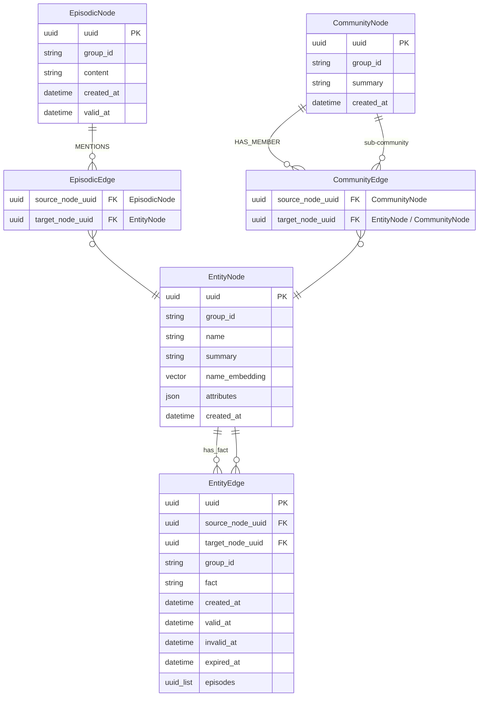
```mermaid
erDiagram
    %% Core Nodes
    EpisodicNode {
        uuid uuid PK
        string group_id
        string content
        datetime created_at
        datetime valid_at
    }

    EntityNode {
        uuid uuid PK
        string group_id
        string name
        string summary
        vector name_embedding
        json attributes
        datetime created_at
    }

    CommunityNode {
        uuid uuid PK
        string group_id
        string summary
        datetime created_at
    }

    %% Relationships (Edges)
    EntityEdge {
        uuid uuid PK
        uuid source_node_uuid FK
        uuid target_node_uuid FK
        string group_id
        string fact
        datetime created_at
        datetime valid_at
        datetime invalid_at
        datetime expired_at
        uuid_list episodes
    }

    EpisodicEdge {
        uuid source_node_uuid FK "EpisodicNode"
        uuid target_node_uuid FK "EntityNode"
    }

    CommunityEdge {
        uuid source_node_uuid FK "CommunityNode"
        uuid target_node_uuid FK "EntityNode / CommunityNode"
    }

    %% ERD Connections
    EpisodicNode ||--o{ EpisodicEdge : "MENTIONS"
    EpisodicEdge }o--|| EntityNode : ""
    
    EntityNode ||--o{ EntityEdge : "has_fact"
    EntityEdge }o--|| EntityNode : ""

    CommunityNode ||--o{ CommunityEdge : "HAS_MEMBER"
    CommunityEdge }o--|| EntityNode : ""
    CommunityEdge }o--|| CommunityNode : "sub-community"
```

#### **Core Ontology Definition**

#### **1. EpisodicNode (The Input Stream)**
Represents raw source data ingested into the system (e.g., a chat message, a document chunk).
*   **`uuid`**: Unique identifier.
*   **`group_id`**: Namespace for multitenancy/partitioning [4].
*   **`content`**: The raw text or data payload [1].
*   **`valid_at`**: The real-world time the event occurred (important for ordering facts) [1].
*   **`created_at`**: The system-level ingestion time [1].

#### **2. EntityNode (The Extracted Concept)**
Represents a person, place, object, or abstract concept extracted from episodes.
*   **`name`**: The primary label (e.g., "John Doe", "San Francisco") [5].
*   **`summary`**: A recursively updated natural language summary of the entity's context [2].
*   **`name_embedding`**: A high-dimensional vector for semantic similarity searches [5, 6].
*   **`attributes`**: Arbitrary developer-defined metadata [5].

#### **3. EntityEdge (The Temporal Fact)**
The most critical structure in Graphiti. It links two `EntityNodes` and stores a specific fact.
*   **`fact`**: Natural language description of the relationship (e.g., "John lives in San Francisco") [3, 7].
*   **`valid_at`**: When the fact **became true** in the real world [3].
*   **`invalid_at`**: When the fact **ceased to be true** (set during contradiction handling) [3].
*   **`episodes`**: A list of `EpisodicNode` UUIDs, providing strict data provenance [1, 7].
*   **`reranker_score`**: (Runtime only) Field used by the hybrid retrieval pipeline to rank results [8, 9].

#### **4. CommunityNode**
A higher-level abstraction grouping related `EntityNodes` to provide broader context [2].
*   **`summary`**: A synthesized summary of all members within the community [2].

Here is the detailed documentation for Graphiti's core entities, including their field-level constraints, indices, and specific storage requirements for the supported database backends (Neo4j and FalkorDB) [1-3].

#### **Core Node Documentation**

#### **1. `Node` (Abstract Base Class)**
All nodes in the system share these base fields and constraints [1].
*   **`uuid`**: `UUID` (Primary Key). Must be unique across all nodes.
*   **`group_id`**: `string`. Used for strict data isolation/partitioning. Indexing on `(group_id, uuid)` is required for performant multitenant queries [4-6].
*   **`created_at`**: `datetime`. System timestamp of ingestion.

#### **2. `EpisodicNode`**
Represents the raw source of truth [1, 7].
*   **`content`**: `string`. The raw unstructured text or JSON blob.
*   **`valid_at`**: `datetime`. Represents the real-world time the episode occurred. Used as the reference time for extracting temporal facts [8].
*   **Constraint**: Must be linked to at least one `EntityNode` via a `MENTIONS` edge for provenance [9].

#### **3. `EntityNode`**
Represents a distinct real-world or abstract entity [1, 10].
*   **`name`**: `string`. The primary identifier for the concept.
*   **`summary`**: `string`. A dynamic field that is updated via LLM summarization as new episodes arrive [2].
*   **`name_embedding`**: `vector`. High-dimensional vector (e.g., 1536 for OpenAI, 768 for Gemini).
    *   **Index**: Requires a **Vector Index** (HNSW or flat) in the database for semantic search [11].
*   **`attributes`**: `dict/JSON`. Optional custom metadata.

#### **4. `CommunityNode`**
Represents a cluster of related nodes [1, 2].
*   **`summary`**: `string`. A synthesized regional summary of its member nodes.
*   **`group_id`**: `string`. (Inherited).

---

#### **Core Edge Documentation**

#### **1. `EntityEdge` (Temporal Facts)**
The primary knowledge store, connecting two `EntityNodes` [1, 12].
*   **`fact`**: `string`. The semantic relationship description.
*   **`valid_at`**: `datetime`. When the fact became true.
*   **`invalid_at`**: `datetime` (Optional). When the fact was superseded by a contradiction [1, 3].
*   **`expired_at`**: `datetime` (Optional). Set during explicit deletions.
*   **`episodes`**: `List[UUID]`. A collection of source `EpisodicNode` UUIDs for lineage [1, 9].
*   **Index**: Should have a composite index on `(source_node_uuid, target_node_uuid)` for fast graph traversal [13].

---

#### **Database Schema Constraints & Indices**

The following indices and constraints must be initialized via `client.build_indices_and_constraints()` before the system is operational [14].

| Database | Constraint Type | Target Fields |
| :--- | :--- | :--- |
| **Neo4j** | Unique Constraint | `uuid` (on Node, Episode, Entity, Community) |
| **Neo4j** | Fulltext Index | `fact` (on EntityEdge), `name` (on EntityNode) |
| **Neo4j** | Vector Index | `name_embedding` (on EntityNode) |
| **FalkorDB**| ID Index | `uuid` (on all node types) |
| **FalkorDB**| Vector Index | `name_embedding` (on EntityNode) |
| **FalkorDB**| Fulltext Index | `fact` (on EntityEdge) |

**Notes on Naming Conventions:**
*   Nodes are typically mapped to labels like `Entity`, `Episode`, and `Community` in the DB [1, 15].
*   Edges are mapped to types like `HAS_FACT`, `MENTIONS`, `HAS_MEMBER`, and `NEXT_EPISODE` [15].
*   Indices name prefixes (e.g., `graphiti_`) are used to prevent collisions with existing database objects [1].

Based on the code analysis, the Graphiti framework utilizes several key architectural patterns to manage its temporal context graph.

#### **1. Bi-temporal Data Model**
This is the foundational pattern of Graphiti [1]. It distinguishes between:
*   **System Time (`created_at`)**: When the data was recorded in the database.
*   **World Time (`valid_at` / `invalid_at`)**: When the fact was true in the real world [2, 3].
*   **Purpose**: This allows for "Time Travel" queries. When a new episode contradicts an old fact, the old fact is not deleted; its `invalid_at` bound is set. This preserves historical context and allows agents to reconcile change [2, 4].

#### **2. Event Sourcing / Immutable Input Stream**
Graphiti treats incoming information as an immutable stream of **Episodes** (`EpisodicNode`) [5]. 
*   **Pattern**: All higher-level knowledge (entities and facts) is *derived* from these episodes [5, 6]. 
*   **Purpose**: Ensures **Provenace**. Every fact in the graph points back to its source episode UUIDs, allowing the system to justify its "memory" [6, 7].

#### **3. Command Query Responsibility Segregation (CQRS)**
While not a pure implementation, the system separates the responsibility of building the graph (the Ingestion pipeline) from querying the graph (the Hybrid Retrieval pipeline) [8].
*   **Write Path**: Heavy, asynchronous extraction using LLMs, deduplication, and transactional graph mutations [9-11].
*   **Read Path**: High-performance concurrently executed hybrid searches (BM25, vector, BFS) designed for low-latency agent response [12, 13].

#### **4. Factory Pattern (Vendor Agnosticism)**
Graphiti provides abstract base classes (`LLMClient`, `EmbedderClient`, `GraphDriver`) and uses Factories to instantiate concrete providers like OpenAI, Neo4j, or FalkorDB at runtime [14, 15].
*   **Purpose**: Prevents vendor lock-in and allows the framework to operate identically across different infrastructure backends [15, 16].

#### **5. Bridge Pattern (Scalable Search)**
The search subsystem uses a bridge pattern to decouple the high-level `SearchConfig` from the low-level database-specific operation implementations (`SearchOperations`) [17, 18].
*   **Purpose**: Allows adding complex new reranking strategies (like Cross-Encoders or RRF) without modifying the underlying database drivers [18-20].

Graphiti is designed as a vendor-agnostic framework that coordinates multiple external cloud and local services. Here is the map of its primary external integrations [1-3].

#### **1. Graph Databases (Infrastructure)**
Graphiti abstracts its storage layer through its `GraphDriver` system. It persists the temporal graph topology, embeddings, and indices in one of the following backends:
*   **Neo4j**: Native support for Bolt protocol; supports full-featured transactional graph operations and vector indexing [4, 5].
*   **FalkorDB (Redis)**: Default database for many Docker/local deployments. High performance Redis-based graph [6, 7].
*   **Kuzu**: Supports embedded local graphs without requiring a separate server [8, 9].
*   **Amazon Neptune / OpenSearch**: Cloud-native integration for AWS environments, utilizing OpenSearch for the vector/full-text components [1, 10].

#### **2. LLM Providers (Inference)**
LLMs are the core engine for entity extraction, deduplication, and summarization. 
*   **OpenAI**: Default provider (`gpt-4o`, `gpt-4o-mini`) [1, 11].
*   **Anthropic**: Support for Claude series (`claude-3-5-sonnet`) [11, 12].
*   **Google Gemini**: Integration for Gemini models [11, 13].
*   **Groq**: Used for high-speed, low-latency inference [11, 14].
*   **Ollama**: Supports local models for privacy-centric deployments [11, 15].

#### **3. Embedding & Reranking Models**
Used for semantic search and refining results during the hybrid retrieval pipeline.
*   **OpenAI**: Vector embeddings (`text-embedding-3-small/large`) [16, 17].
*   **Voyage AI**: Professional embedding models [16, 18].
*   **BGE (Sentence Transformers)**: Support for local rerankers and embedding models [16, 19].
*   **Cross-Encoders**: Neural reranking via external models to re-score retrieval candidates [20, 21].

#### **4. Observability & Analytics**
*   **OpenTelemetry**: Standardized distributed tracing for debugging complex extraction pipelines [22, 23].
*   **PostHog**: Anonymous, opt-out usage telemetry to track framework adoption and common configurations [22, 24].

Graphiti implements several critical integration patterns to ensure robustness and performance when interacting with external AI providers and databases.

#### **1. Asynchronous Queueing with Throttling**
To prevent `429 Rate Limit` errors from LLM providers during bulk ingestion, Graphiti utilizes an asynchronous processing queue [1].
*   **Pattern**: Inbound episodes are placed in a queue. A worker picks them up but is explicitly bounded by a `SEMAPHORE_LIMIT` (default 10) [2, 3].
*   **Outcome**: Ensures predictable API consumption even when raw data arrives in sudden bursts [3].

#### **2. Database Operation Abstraction (DAA)**
Graphiti avoids using a single global "Database Agent." Instead, it follows a strict interface-based abstraction for its storage layer [4, 5].
*   **Pattern**: It separates database capabilities into fine-grained interfaces like `EntityNodeOperations`, `SearchOperations`, and `GraphMaintenanceOperations` [4].
*   **Outcome**: Allows individual database drivers (Neo4j, FalkorDB) to implement only the parts of the Cypher/query language they support, making it easier to add new backends [5].

#### **3. Transactional Integrity**
Even though it coordinates external LLM calls (which are non-transactional), Graphiti ensures the resulting graph mutations are atomic [6].
*   **Pattern**: The entire modification (creating nodes, edges, and provenance links) is wrapped in a single database transaction [6, 7].
*   **Outcome**: Prevents "partial graphs" or broken lineage links if the database connection fails mid-process [6].

#### **4. Distributed Tracing Wrapper**
Graphiti treats observability as a first-class citizen via its `Tracer` abstraction [8].
*   **Pattern**: It wraps all expensive external I/O (LLM calls and DB queries) in OpenTelemetry spans [9].
*   **Outcome**: Allows developers to visualize the "silent failures" or latency bottlenecks when multiple providers are involved in a single search or ingestion task [8, 9].

#### **5. Hybrid Retrieval Concurrency**
Search is not sequential.
*   **Pattern**: Graphiti uses `asyncio.gather` (or its custom `semaphore_gather` equivalent) to execute BM25, Semantic, and BFS search strategies concurrently [10, 11].
*   **Outcome**: Reduces overall agent response latency by waiting for the slowest search path rather than the sum of all paths [11, 12].

Here is the high-level Integration Map illustrating how Graphiti's internal components interact with external systems. 

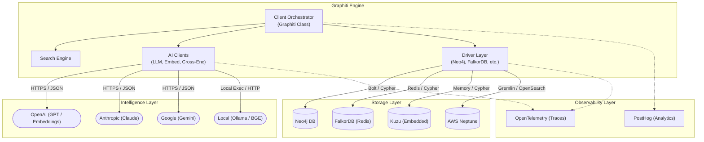
```mermaid
flowchart TB
    %% Core Framework
    subgraph Graphiti_Framework [Graphiti Engine]
        direction TB
        Orchestrator["Client Orchestrator<br/>(Graphiti Class)"]
        Drivers["Driver Layer<br/>(Neo4j, FalkorDB, etc.)"]
        AI_Abstractions["AI Clients<br/>(LLM, Embed, Cross-Enc)"]
        Search["Search Engine"]
    end

    %% External Systems
    subgraph Storage [Storage Layer]
        Neo4j[("Neo4j DB")]
        FalkorDB[("FalkorDB (Redis)")]
        Kuzu[("Kuzu (Embedded)")]
        Neptune[("AWS Neptune")]
    end

    subgraph AI_Providers [Intelligence Layer]
        OpenAI(["OpenAI (GPT / Embeddings)"])
        Anthropic(["Anthropic (Claude)"])
        Google(["Google (Gemini)"])
        Local(["Local (Ollama / BGE)"])
    end

    subgraph Obs [Observability Layer]
        OTel["OpenTelemetry (Traces)"]
        PostHog["PostHog (Analytics)"]
    end

    %% Integrations
    Orchestrator --> Search
    Orchestrator --> AI_Abstractions
    Orchestrator --> Drivers

    %% Drivers to DBs
    Drivers -- "Bolt / Cypher" --> Neo4j
    Drivers -- "Redis / Cypher" --> FalkorDB
    Drivers -- "Memory / Cypher" --> Kuzu
    Drivers -- "Gremlin / OpenSearch" --> Neptune

    %% AI Clients to Providers
    AI_Abstractions -- "HTTPS / JSON" --> OpenAI
    AI_Abstractions -- "HTTPS / JSON" --> Anthropic
    AI_Abstractions -- "HTTPS / JSON" --> Google
    AI_Abstractions -- "Local Exec / HTTP" --> Local

    %% Obs Integrations
    AI_Abstractions -.-> OTel
    Drivers -.-> OTel
    Orchestrator -.-> PostHog
```

#### **System Boundaries & Data Exchange**

1.  **Framework <-> Storage Interface**: Graphiti communicates with databases using high-level Cypher queries (for Neo4j/FalkorDB/Kuzu) or a hybrid Gremlin/OpenSearch search strategy for AWS Neptune [1, 2]. All state persistence (nodes, edges, vectors) is offloaded to these external systems [1].
2.  **Framework <-> AI Interface**: Communication is primarily via HTTPS and structured JSON (OpenAI-compatible endpoints) [1]. Data sent includes prompts and raw text; data received includes extracted entity/edge lists and high-dimensional vectors [3, 4].
3.  **Framework <-> Observability Interface**: Graphiti sends distributed traces to any OpenTelemetry-compatible collector (e.g., Jaeger, Honeycomb) and anonymous usage telemetry (configuration options, database type) to PostHog [5, 6].
