# Reverse Engineering Report: swarmify

### Step 1 Project overview

#### 1.1 Project Brief
Swarmify is a multi-agent coding framework that enables developers to orchestrate a team of specialized AI models (Claude, Codex, Gemini, Cursor) directly within their IDE. It aims to overcome the limitations of single AI agents by allowing parallel task execution across different parts of a project, such as research, implementation, and debugging. The system utilizes human-in-the-loop approval gates for agent plans and leverages the Model Context Protocol (MCP) for cross-platform agent orchestration.

#### 1.2 Project Structure
```text
swarmify/
├── agents-mcp/                # MCP server for agent orchestration
│   ├── src/                   # Core MCP logic (agents, api, server)
│   ├── scripts/               # Build and lifecycle scripts
│   └── tests/                 # E2E testing framework
├── extension/                 # VS Code and Cursor extension
│   ├── src/                   # VS Code-specific implementations and core logic
│   ├── ui/                    # Webview UIs (Dashboard, MD Editor) built with React+Vite
│   └── mcp/                   # Native notification MCP server
├── prompts/                   # Version-controlled slash-command prompts
│   ├── claude/                # Claude-specific markdown prompts
│   ├── codex/                 # Codex-specific prompts
│   └── gemini/                # Gemini-specific TOML prompts
├── web/                       # Next.js marketing and landing page
├── oauth-worker/              # Cloudflare Worker for OAuth handling
├── AGENTS.md                  # Project-level agent definitions
├── package.json               # Monorepo configuration
└── README.md                  # Main documentation
```

#### 1.3 Technology Stack
| Category | Technology | Description |
| :--- | :--- | :--- |
| **Languages** | TypeScript, Python 3.12 | Primary development languages. |
| **Package Manager** | Bun | Default runner and manager for JS/TS. |
| **Protocol** | Model Context Protocol (MCP) | SDK for agent spawning and orchestration. |
| **IDE Integration** | VS Code Extension API | Deep integration with VS Code and Cursor. |
| **Frontend (UI)** | React 19, Tailwind CSS v4, Radix UI| Used for extension webviews and landing page. |
| **Build Tools** | Vite, Next.js | Bundlers for UI components and web. |
| **Database/Storage** | sql.js (Wasm SQLite), Supabase/Postgres| Local (for Cursor DB) and remote persistence. |
| **Backend Framework**| FastAPI (Python) | For cloud-hosted services. |
| **Video Production** | Remotion | Programmatic video generation for promos. |

#### 1.4 Project Type
Open-source multi-agent coding framework and monorepo consisting of a VS Code extension, an MCP server (Node.js library), and a set of version-controlled prompt workflows. It is designed as a suite of local developer tools rather than a centralized SaaS.

#### 1.5 Feature: Multi-Agent Orchestration via MCP

**Multi-Agent Orchestration via MCP** in Swarmify operates on a strict separation of concerns: the MCP server provides pure infrastructure (the "pipes and wires"), while the calling agent (the orchestrator, such as Claude) provides the intelligence, handling task assignment, scheduling, and conflict resolution [1, 2]. 

By using the Model Context Protocol (MCP) as a universal interface, Swarmify achieves **cross-platform orchestration**, meaning any client can spawn any agent (e.g., Claude can spawn Codex, Gemini can spawn Cursor) [3]. This enables two primary workflows: **SubAgents** (hierarchical delegation to specialists) and **Swarms** (parallel execution on non-overlapping files) [4, 5].

#### Core Architecture & Key Components

The orchestration backend (`@swarmify/agents-mcp`) is built on Node.js and exposes four core MCP tools: `Spawn`, `Status`, `Stop`, and `Tasks` [6]. Agents do not communicate via shared memory; instead, they communicate through the filesystem, writing to their own dedicated log files (`stdout.log`), which the MCP server parses to provide unified updates [7].

#### Core Data Structures

1.  **`AgentManager`**: The central orchestrator class responsible for the lifecycle of all agents.
    *   **Enforces Limits:** Caps the system at 50 maximum agents and 10 concurrent executions [8, 9].
    *   **State Tracking:** Tracks agent states (`running`, `completed`, `failed`, `stopped`) [8, 9].
    *   **Persistence:** Loads existing agents from disk on startup (`~/.agents/swarm/agents/`), allowing agents to survive IDE restarts [8, 10].
    *   **Auto-cleanup:** Automatically purges agents older than 7 days [8].
2.  **`AgentProcess`**: Represents an individual spawned agent. It tracks metadata such as `agentId`, `taskName`, `agentType`, `mode` (`plan`, `edit`, `ralph`, `cloud`), `pid`, `cwd`, and temporal data (`startedAt`, `completedAt`) [11-13].
3.  **`EffortModelMap`**: Maps the user's requested effort level (`fast`, `default`, `detailed`) to specific underlying LLMs (e.g., `fast` Claude maps to `claude-haiku-4-5-20251001`, while `detailed` maps to `claude-opus-4-5`) [14].

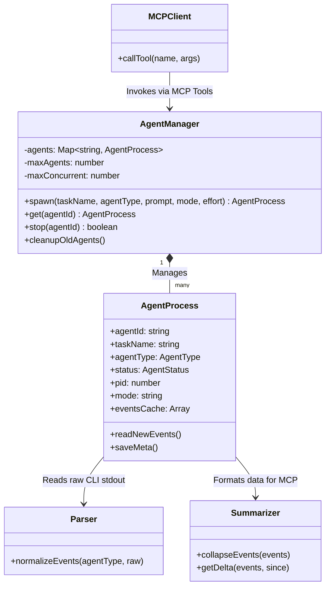
```mermaid
classDiagram
    class MCPClient {
        +callTool(name, args)
    }
    class AgentManager {
        -agents: Map~string, AgentProcess~
        -maxAgents: number
        -maxConcurrent: number
        +spawn(taskName, agentType, prompt, mode, effort) AgentProcess
        +get(agentId) AgentProcess
        +stop(agentId) boolean
        +cleanupOldAgents()
    }
    class AgentProcess {
        +agentId: string
        +taskName: string
        +agentType: AgentType
        +status: AgentStatus
        +pid: number
        +mode: string
        +eventsCache: Array
        +readNewEvents()
        +saveMeta()
    }
    class Summarizer {
        +collapseEvents(events)
        +getDelta(events, since)
    }
    class Parser {
        +normalizeEvents(agentType, raw)
    }

    MCPClient --> AgentManager : Invokes via MCP Tools
    AgentManager "1" *-- "many" AgentProcess : Manages
    AgentProcess --> Parser : Reads raw CLI stdout
    AgentProcess --> Summarizer : Formats data for MCP
```

#### Detailed Data Flow & Algorithms

The orchestration flow relies on asynchronous, non-blocking execution combined with delta-based polling to conserve the orchestrator's context window.

#### 1. The `Spawn` Algorithm
When the orchestrator calls the `Spawn` tool, the MCP server must instantiate a detached background process [10, 15].
*   **Step 1: Validation & Discovery.** The server checks if the requested CLI tool (e.g., `codex`, `gemini`) is installed and available in the system `PATH` [16, 17].
*   **Step 2: Parameter Resolution.** The server resolves the `mode` (`plan` is read-only, `edit` allows file writes, `ralph` is autonomous) and maps the `effort` parameter to the specific target model via the `EffortModelMap` [14, 18, 19].
*   **Step 3: Process Execution.** The `AgentManager` constructs the command line arguments, assigns a unique `agent_id`, creates a dedicated directory (`~/.agents/swarm/agents/{id}/`), and spawns the CLI process as a **detached process group** so it survives IDE restarts [7, 10, 20].
*   **Step 4: Immediate Return.** The tool returns the `agent_id` immediately without waiting for the task to finish, enabling parallel swarms [10, 21].

#### 2. The `Status` (Delta Polling) Algorithm
Because the orchestrator must poll for updates without overwhelming its token limits, the `Status` tool utilizes highly optimized Delta Polling [18].
*   **Step 1: File Ingestion.** The `AgentProcess` reads the tail of its specific `stdout.log` file [22].
*   **Step 2: Event Normalization.** The `Parser` module translates raw, agent-specific JSON streams into a unified event format (e.g., `init`, `message`, `bash`, `file_read`, `tool_use`, `result`) [23, 24].
    *   *Critical Edge Case:* Codex outputs arguments as a JSON *string*, whereas Claude/Gemini use objects. The parser explicitly runs `JSON.parse()` on Codex arguments to prevent crashes [14, 25].
*   **Step 3: Delta Calculation.** If the orchestrator provides a `since` cursor (an ISO timestamp), the `Summarizer` filters out all events older than the cursor [21, 26]. 
*   **Step 4: Event Collapsing.** The `Summarizer` collapses sequential streaming events (like continuous `thinking` or `message_delta` fragments), deduplicates file operation paths (creating unique sets of read/written/deleted files), and truncates bash commands to a maximum of 120 characters (converting heredocs to `cat <<EOF > path`) [18, 27, 28].
*   **Step 5: File Inference.** If an agent uses Bash to modify a file without logging a dedicated file tool event, the `extractFileOpsFromBash` utility infers the read/write/delete operation via regex (e.g., matching `sed -i` or `rm -rf`) [29, 30].

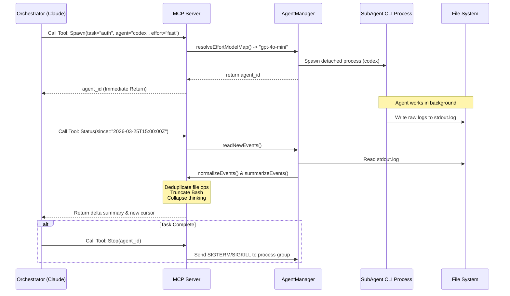
```mermaid
sequenceDiagram
    participant O as Orchestrator (Claude)
    participant MCP as MCP Server
    participant AM as AgentManager
    participant CLI as SubAgent CLI Process
    participant FS as File System

    O->>MCP: Call Tool: Spawn(task="auth", agent="codex", effort="fast")
    MCP->>AM: resolveEffortModelMap() -> "gpt-4o-mini"
    AM->>CLI: Spawn detached process (codex)
    AM-->>MCP: return agent_id
    MCP-->>O: agent_id (Immediate Return)
    
    Note over CLI,FS: Agent works in background
    CLI->>FS: Write raw logs to stdout.log
    
    O->>MCP: Call Tool: Status(since="2026-03-25T15:00:00Z")
    MCP->>AM: readNewEvents()
    AM->>FS: Read stdout.log
    AM->>MCP: normalizeEvents() & summarizeEvents()
    Note over MCP: Deduplicate file ops<br/>Truncate Bash<br/>Collapse thinking
    MCP-->>O: Return delta summary & new cursor
    
    alt Task Complete
        O->>MCP: Call Tool: Stop(agent_id)
        MCP->>AM: Send SIGTERM/SIGKILL to process group
    end
```

#### Safety and Lifecycle Components

*   **Process Groups & Termination:** When the `Stop` tool is invoked, the `AgentManager` sends a `SIGTERM` to the entire process group. If the processes do not exit within 10 seconds, it escalates to a `SIGKILL`, ensuring no orphaned bash shells or background processes are left running [31, 32].
*   **Ralph Mode Safety:** When an agent is spawned in `ralph` mode (autonomous iteration through a `RALPH.md` task file), the server actively blocks execution if the `cwd` points to a dangerous directory path (like `/System`, `/usr`, or the user's home directory) to strictly limit the blast radius [32, 33].


#### 1.6 Feature: Approval Gates & Human-in-the-Middle

The **Approval Gates & Human-in-the-Middle (HITM)** architecture in Swarmify is designed to elevate the developer from a solo coder to an "engineering manager" [1]. Because AI agents can quickly consume tokens and overwrite files, Swarmify enforces a strict halt-and-catch-fire mechanism before any destructive or costly multi-agent operations occur [2, 3]. 

This is implemented through a combination of strict prompt engineering, a React-based Dashboard UI, and native OS-level blocking mechanisms via MCP.

#### 1. Core Architecture & Key Components

The approval system relies on three distinct layers that work in tandem to ensure agents never spawn sub-agents without human consent:

1.  **Orchestrator Prompt Constraints (`/swarm` command)**: The foundational layer. The lead agent (usually Claude) is instructed via its system prompt to halt execution after drafting a "Distribution Plan" [4-6]. It is strictly forbidden from invoking the `mcp__Swarm__spawn` tool until the user explicitly approves the plan [6, 7].
2.  **Dashboard Approval Queue (UI Layer)**: The VS Code extension provides an interactive dashboard (`ApprovalQueueSection`) where pending swarm plans are intercepted and displayed [8, 9]. Users can review the plan, edit the requested "Mix of Agents", and explicitly approve or reject the task [10].
3.  **Native Notifications MCP (`notifications-mcp`)**: For system-level blocking, Swarmify utilizes a dedicated MCP server that triggers native macOS `alerter` dialogs [11, 12]. This tool (`ask_permission`) physically blocks the agent's execution loop until the human clicks "Allow" or "Deny" [12].

---

#### 2. Core Data Structures

The system tracks the lifecycle of approvals using the following primary structures:

*   **`ApprovalStatus` (Type)**: Defines the finite states of a swarm's approval lifecycle [13, 14].
    *   `'pending'`: The plan is generated and awaiting human review.
    *   `'approved'`: The user has authorized the plan.
    *   `'rejected'`: The user has denied the plan (requiring a revision).
    *   `'running'`: The agents have been spawned and are executing.
    *   `'complete'`: The task is finished.
*   **`TaskSummary` (Interface Extension)**: Includes approval tracking metadata for the dashboard [15].
    *   `approval_status`: The current `ApprovalStatus`.
    *   `mix`: A string representing the requested model distribution (e.g., "70% Claude, 30% Codex") [15].
*   **`NotificationResult` (Interface)**: The payload returned by the `notifications-mcp` to the orchestrator [11].
    *   `action`: `'allow' | 'deny' | 'timeout' | 'closed'`
    *   `raw`: The raw string output from the OS alerter [11, 16].

---

#### 3. Detailed Data Flow & Logic Visualization

#### Approval Lifecycle State Machine
The approval gate ensures that tasks can never transition from `pending` directly to `running` without traversing the `approved` state via human action.

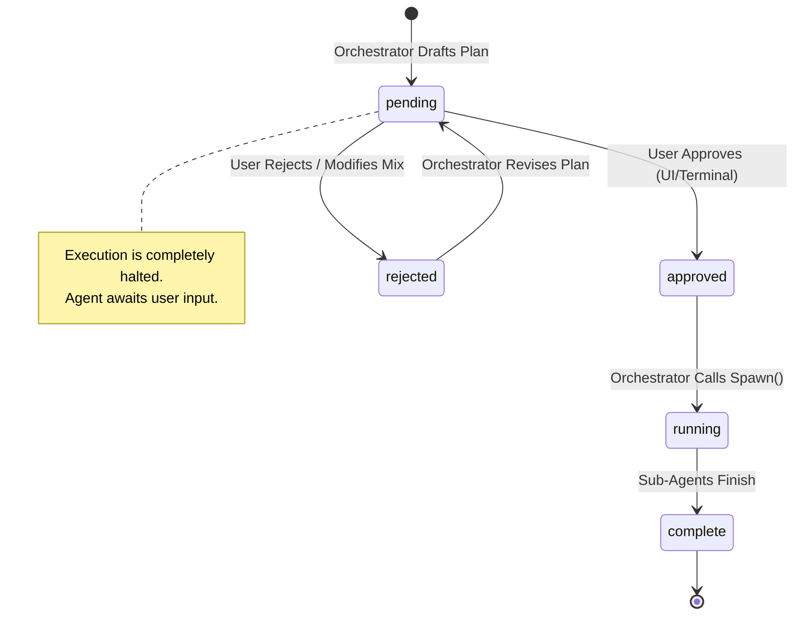
```mermaid
stateDiagram-v2
    [*] --> pending : Orchestrator Drafts Plan
    
    pending --> approved : User Approves (UI/Terminal)
    pending --> rejected : User Rejects / Modifies Mix
    
    rejected --> pending : Orchestrator Revises Plan
    
    approved --> running : Orchestrator Calls Spawn()
    running --> complete : Sub-Agents Finish
    complete --> [*]
    
    note right of pending
        Execution is completely halted.
        Agent awaits user input.
    end note
```

#### Full Sequence: Dashboard & Native OS Approval

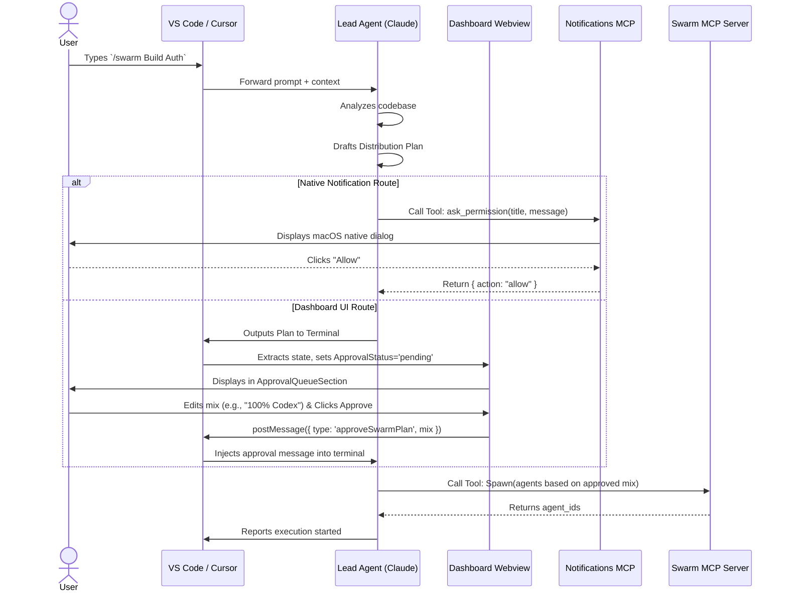
```mermaid
sequenceDiagram
    actor User
    participant IDE as VS Code / Cursor
    participant Lead as Lead Agent (Claude)
    participant UI as Dashboard Webview
    participant NMCP as Notifications MCP
    participant SMCP as Swarm MCP Server

    User->>IDE: Types `/swarm Build Auth`
    IDE->>Lead: Forward prompt + context
    Lead->>Lead: Analyzes codebase
    Lead->>Lead: Drafts Distribution Plan
    
    alt Native Notification Route
        Lead->>NMCP: Call Tool: ask_permission(title, message)
        NMCP->>User: Displays macOS native dialog
        User-->>NMCP: Clicks "Allow"
        NMCP-->>Lead: Return { action: "allow" }
    else Dashboard UI Route
        Lead->>IDE: Outputs Plan to Terminal
        IDE->>UI: Extracts state, sets ApprovalStatus='pending'
        UI->>User: Displays in ApprovalQueueSection
        User->>UI: Edits mix (e.g., "100% Codex") & Clicks Approve
        UI->>IDE: postMessage({ type: 'approveSwarmPlan', mix })
        IDE->>Lead: Injects approval message into terminal
    end
    
    Lead->>SMCP: Call Tool: Spawn(agents based on approved mix)
    SMCP-->>Lead: Returns agent_ids
    Lead->>IDE: Reports execution started
```

---

#### 4. Step-by-Step Algorithm Descriptions

#### Algorithm A: The Orchestrator's Halt-and-Catch-Fire
This algorithm is driven by the strict constraints embedded in the `/swarm` command prompt [4, 6].
1.  **Analyze Task**: The lead agent parses the user's prompt and explores the codebase using read-only tools to find integration points [17].
2.  **Generate Plan**: The agent formulates a "Distribution Plan" detailing which sub-agents (e.g., Gemini, Codex) will handle which files [6].
3.  **Halt**: The prompt strictly dictates: *"Before spawning ANY Swarm agent, you MUST show a distribution plan and get user approval."* [6, 7]. The agent outputs the plan to the terminal and stops generating tokens, effectively yielding control back to the user.
4.  **Acknowledge**: Once the user provides affirmative text input (or the UI injects it), the agent parses the confirmation and proceeds to step 5.
5.  **Spawn**: The agent iterates through the approved plan, calling the `Spawn` MCP tool for each required sub-agent [5].

#### Algorithm B: Native MCP Blocking (`notifications-mcp`)
When critical, destructive, or high-stakes operations are requested, the agent can leverage the native OS to demand attention [12].
1.  **Tool Invocation**: The agent calls `ask_permission` passing a `title` and a `message` [12].
2.  **Binary Resolution**: The MCP server locates the macOS `alerter` binary (or falls back to system defaults) [18].
3.  **Execution Suspension**: The server executes the `alerter` command with a configured timeout (default 60s) [11]. *Crucially, the MCP server does not return a response to the LLM during this time, leaving the LLM's tool-call suspended.*
4.  **User Interaction**: A native notification appears with "Allow" and "Deny" buttons [16].
5.  **Response Mapping**: 
    *   If clicked "Allow", returns `{"action": "allow"}` [16].
    *   If clicked "Deny", returns `{"action": "deny"}`.
    *   If timed out, returns `{"action": "timeout"}` [16].
6.  **Agent Continuation**: The LLM receives the JSON result. If denied, it is instructed to abort the current path.

#### Algorithm C: UI-Driven Mix Modification
The user can intercept a pending plan and alter the AI's intended composition [8, 10].
1.  **Intercept**: The Dashboard Tab mounts and filters the `tasks` array for items where the `approval_status` evaluates to `'pending'` [19].
2.  **Display**: The UI renders the `ApprovalQueueSection` displaying the task and the proposed "Mix" (e.g., 50% Gemini, 45% Codex) [9, 20].
3.  **Edit**: The user modifies the mix ratio in the text input, updating the `mixEdits` state in React [21].
4.  **Dispatch**: The user clicks "Apply Edits" or "Approve". 
    *   If applying edits, the Webview posts a `updateSwarmPlan` message back to the VS Code extension [21].
    *   If approving, it posts an `approveSwarmPlan` message [10].
5.  **Terminal Injection**: The VS Code extension receives the message and sends keystrokes directly to the active Lead Agent's terminal, forcing the agent to read the human's revised parameters before executing the spawn commands.


#### 1.7 Feature: Slash-Command Prompt Workflows

The **Slash-Command Prompt Workflows** in Swarmify serve as the production-ready "workflow layer" that sits on top of the IDE extension and the Agents MCP server. While the MCP server provides the raw infrastructure to spawn and manage processes, the prompt libraries provide the *intelligence and procedural constraints* required to orchestrate multiple LLMs safely and effectively [1].

Here is a deep technical breakdown of the slash-command architecture, data structures, and orchestration algorithms.

#### 1. Core Architecture & Key Components

The prompt ecosystem is designed around **Model-Specific Calibration**. Because different foundational models possess different strengths (e.g., Claude excels at multi-step synthesis, Codex at rapid implementation, Gemini at multi-modal research), the prompts are physically separated and customized per agent [2, 3]. 

*   **Core Commands (Single-Agent):** Commands like `/plan`, `/debug`, `/clean`, `/test`, and `/ship` handle standard engineering tasks within a single context window [4].
*   **Swarm-Verified Commands (Multi-Agent):** Prefixed with an `s` (e.g., `/splan`, `/sdebug`, `/sclean`, `/sship`), these commands force the lead agent to spawn parallel, independent sub-agents to verify its findings or establish consensus [5].
*   **The Orchestrator Command:** `/swarm` is the master entry point. It accepts a task and a "Mix of Agents" (e.g., "70% Claude, 30% Cursor"), drafts a distribution plan, awaits human approval, and then spawns the swarm [6, 7].

#### Physical Architecture
Instead of sending massive system prompts via an API, Swarmify installs these prompts directly into the local filesystem configuration directories of the respective CLI tools. 
*   **Claude:** `~/.claude/commands/*.md` [8]
*   **Codex:** `~/.codex/prompts/*.md` [8]
*   **Gemini:** `~/.gemini/commands/*.toml` [8]
*   **Cursor:** `~/.cursor/commands/*.md` [8]

#### 2. Core Data Structures

Internally, the extension manages these commands using the `SkillDefinition` structure to track cross-platform compatibility and deployment status [9].

```typescript
type SkillName = 'plan' | 'splan' | 'debug' | 'sdebug' | 'sconfirm' | 'clean' | 'sclean' | 'test' | 'stest' | 'ship' | 'sship' | 'recap' | 'srecap' | 'simagine';

interface SkillDefinition {
  name: SkillName;
  description: string;
  assets: {
    claude?: string | 'builtin'; // Markdown asset filename
    codex?: string;              // Markdown asset filename
    cursor?: string;             // Markdown asset filename
    gemini?: string;             // TOML asset filename
  };
}
```

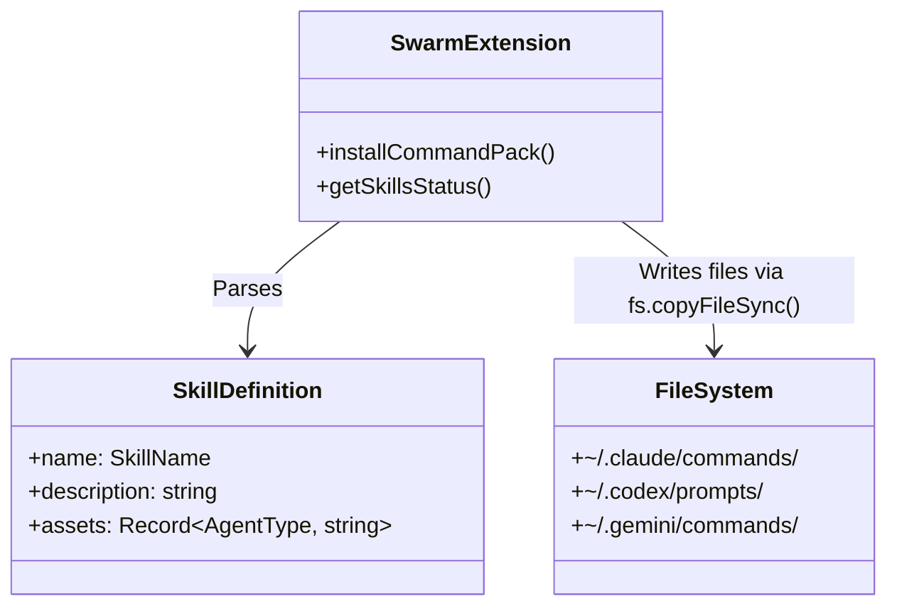
```mermaid
classDiagram
    class SwarmExtension {
        +installCommandPack()
        +getSkillsStatus()
    }
    class SkillDefinition {
        +name: SkillName
        +description: string
        +assets: Record~AgentType, string~
    }
    class FileSystem {
        +~/.claude/commands/
        +~/.codex/prompts/
        +~/.gemini/commands/
    }
    
    SwarmExtension --> SkillDefinition : Parses
    SwarmExtension --> FileSystem : Writes files via fs.copyFileSync()
```

#### 3. Detailed Data Flow & Algorithms

The workflows rely on strict prompt engineering principles to conserve tokens and prevent "agent loops." The foundational rule is: **"Agents execute, you architect. Never delegate exploration to swarm agents."** [10, 11]

#### Algorithm A: Skill Installation & Synchronization
When a user initiates the installation of the command pack via the VS Code Extension, the system provisions the specific CLIs.
1.  **Target Resolution:** The extension iterates over all registered `PromptPackAgent` targets (`claude`, `codex`, `gemini`, `cursor`) and checks if their configuration directories exist (e.g., `isPromptPackTargetAvailable`) [12, 13].
2.  **Asset Mapping:** It looks up the `SkillDefinition` array (e.g., mapping the `sdebug` skill to `sdebug.md` for Codex and `sdebug.toml` for Gemini) [9].
3.  **File Copy/Transform:** For Markdown targets, it copies the `.md` file directly. For Gemini, it wraps the Markdown content in a TOML structure (`buildGeminiToml`) [12, 14].

#### Algorithm B: Swarm-Verified Debugging (`/sdebug`)
This algorithm is encoded directly into the prompt files (e.g., `sdebug.md`). It implements an "ACT → SHOW → CONTINUE" pattern combined with blind verification [15, 16].

1.  **Initial Investigation:** The lead agent explores the codebase (using local, read-only tools) and identifies the likely root cause of the bug [16].
2.  **Context Extraction:** The lead agent extracts the raw symptoms, error logs, and relevant file paths [17].
3.  **Blind Spawn:** *Crucially*, the lead agent calls the `mcp__Swarm__spawn` tool to launch 1-2 verifier agents (e.g., Codex or Gemini). It passes the context **but deliberately hides its own hypothesis** to prevent anchoring bias [17].
4.  **Parallel Execution:** The MCP server executes the sub-agents in the background. The lead agent uses `mcp__Swarm__status` to poll for completion [18].
5.  **Synthesis:** Once complete, the lead agent reviews the verifiers' independent findings. It cross-references their root-cause analysis against its own.
6.  **Resolution:** The lead agent outputs a unified report detailing agreements, divergences, and the final recommended fix [19, 20].

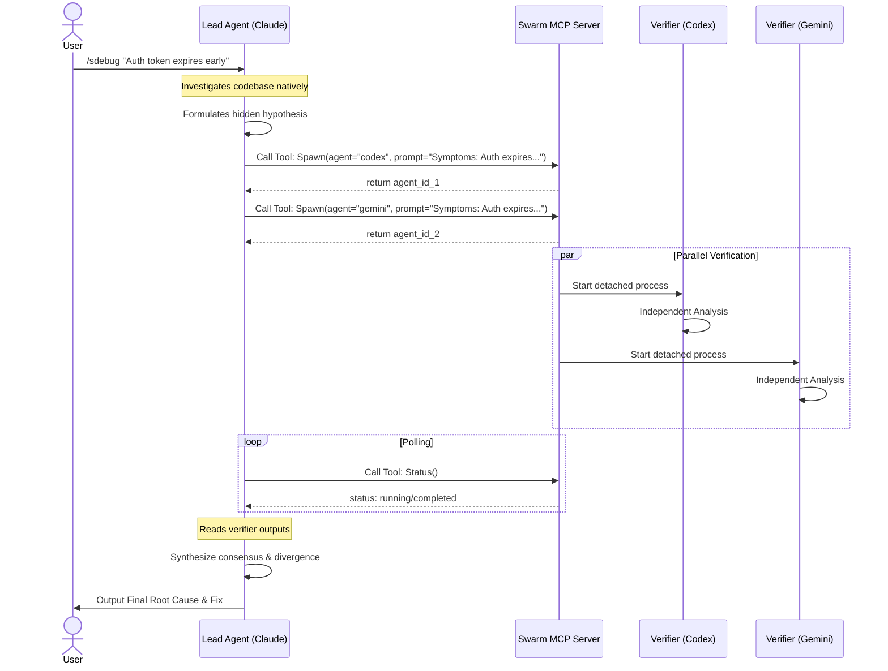
```mermaid
sequenceDiagram
    actor User
    participant Lead as Lead Agent (Claude)
    participant MCP as Swarm MCP Server
    participant V1 as Verifier (Codex)
    participant V2 as Verifier (Gemini)

    User->>Lead: /sdebug "Auth token expires early"
    Note over Lead: Investigates codebase natively
    Lead->>Lead: Formulates hidden hypothesis
    Lead->>MCP: Call Tool: Spawn(agent="codex", prompt="Symptoms: Auth expires...")
    MCP-->>Lead: return agent_id_1
    Lead->>MCP: Call Tool: Spawn(agent="gemini", prompt="Symptoms: Auth expires...")
    MCP-->>Lead: return agent_id_2
    
    par Parallel Verification
        MCP->>V1: Start detached process
        V1->>V1: Independent Analysis
        MCP->>V2: Start detached process
        V2->>V2: Independent Analysis
    end
    
    loop Polling
        Lead->>MCP: Call Tool: Status()
        MCP-->>Lead: status: running/completed
    end
    
    Note over Lead: Reads verifier outputs
    Lead->>Lead: Synthesize consensus & divergence
    Lead->>User: Output Final Root Cause & Fix
```

#### Algorithm C: "Pre-mortem" Product Feedback Workflow (`/feedback`)
This workflow demonstrates highly advanced multi-wave prompt orchestration to refine engineering strategies.
1.  **Wave 1 (Blind Feedback):** The lead agent spawns 2 swarm agents in `plan` (read-only) mode. One acts as the **"Red Team"** (Codex) looking for failure modes; the other acts as the **"Strategist"** (Gemini) looking at second-order effects. They are given the goal, *but not the proposed solution* [21].
2.  **Wave 2 (Informed Feedback):** After Wave 1, the lead agent spawns 2 new agents and reveals the proposed solution to them, asking for a Premortem analysis (assuming the solution fails in 6 months) [21].
3.  **Synthesis:** The lead agent correlates the blind feedback with the informed premortem feedback. If both waves flagged the same issue, it is elevated as a critical risk [22].

#### 4. Constraint Enforcement
To ensure the workflows do not devolve into expensive, infinite loops or modify the user's local environment maliciously, the prompts enforce **Hard Lines**:
*   **No Mocks:** All testing workflows (`/test`, `/stest`) mandate real service execution without fakes or stubs [23].
*   **No Git Operations:** Agents are strictly forbidden from running `git commit`, `git push`, or `git reset` (to prevent catastrophic data loss) [24].
*   **Context Passing:** The orchestrator must pass explicit file paths with line numbers (e.g., `src/auth.ts:145-160`) when calling the `Spawn` tool, rather than vaguely instructing sub-agents to "explore the codebase" [10].


### Step 2 System Architecture investigation


Based on the architecture and codebase structure of Swarmify, the system can be divided into several distinct Domain-Driven Design (DDD) Bounded Contexts. Swarmify enforces a strict separation of concerns, explicitly defining the backend as the pure "pipes and wires" infrastructure while delegating intelligence to the prompting layer and control to the IDE interface [1, 2].

Here are the primary Bounded Contexts and their domain boundaries:

#### 1. Agent Orchestration & Lifecycle Context (Backend Infrastructure)
This context acts as the universal engine for cross-platform agent execution. It is completely isolated from IDE specifics and operates as a standalone MCP server (`@swarmify/agents-mcp`) [3, 4].
*   **Domain Responsibility:** Spawning, stopping, limiting, and monitoring detached background CLI processes (Claude, Codex, Gemini, Cursor) [5, 6]. It handles the raw filesystem operations, parses differing LLM log formats into a unified event schema, and optimizes polling via cursors [5, 7, 8].
*   **Core Aggregates & Entities:**
    *   `AgentManager`: The central orchestrator enforcing limits (max 50 agents, 10 concurrent) and managing auto-cleanup [5, 9].
    *   `AgentProcess`: Represents an individual agent's state, tracking its `pid`, `mode` (plan, edit, ralph, cloud), `status` (running, completed, failed, stopped), and telemetry [10].
    *   `AgentSummary` / `QuickStatus`: Aggregated representations of agent activity (e.g., deduplicated file operations, collapsed streaming messages, and truncated bash commands) [8, 11, 12].
*   **Ubiquitous Language:** *Spawn, SubAgent, Swarm, Process Group, Delta Polling, Ralph Mode, Effort Level.*

#### 2. IDE Terminal & Windowing Context (Frontend IDE Integration)
This context lives within the VS Code/Cursor extension (`swarm-ext`) and maps the background agent processes to the user's visual workspace [13, 14].
*   **Domain Responsibility:** Managing the physical presentation of agents as full-screen editor tabs, maintaining terminal persistence across IDE restarts, handling window splitting, and maintaining warm session pools [14-16]. 
*   **Core Aggregates & Entities:**
    *   `EditorTerminal`: Maps a VS Code terminal instance to an agent, tracking `AGENT_TERMINAL_ID` and `AGENT_SESSION_ID` [15, 17].
    *   `PersistedSession`: Handles crash recovery by persisting terminal metadata to `sessions.yaml` [18].
    *   `SessionPoolState` / `PrewarmedSession`: Maintains a pool of ready-to-use agent sessions for instant hand-off [19].
    *   `TmuxTerminal`: Manages `tmux` sockets to safely pin agent sessions and handle split-pane layouts (`Cmd+Shift+H/V`) without keystroke collision [20, 21].
*   **Ubiquitous Language:** *Prewarming, Session Chunk, Tmux Pinning, Autogit, Active Terminal.*

#### 3. Human-in-the-Middle (HITM) & Approval Gate Context (Governance Layer)
This context elevates the developer to an "engineering manager" by enforcing explicit authorization boundaries before agents execute code [14, 22].
*   **Domain Responsibility:** Intercepting AI-generated distribution plans, allowing the user to modify the "Mix of Agents", and physically blocking execution until human consent is granted [14, 22, 23]. 
*   **Core Aggregates & Entities:**
    *   `ApprovalStatus`: A state machine tracking a swarm's progression (`pending`, `approved`, `rejected`, `running`, `complete`) [17, 24].
    *   `NotificationResult`: The payload (`allow`, `deny`, `timeout`) generated by the native macOS `alerter` dialogs via the isolated `notifications-mcp` server [23, 25].
*   **Ubiquitous Language:** *Approval Queue, Mix of Agents, Distribution Plan, Alerter.*

#### 4. Task & Context Management Context (Knowledge & Data Layer)
This context handles the ingestion and processing of tasks from various sources and monitors the filesystem to derive live agent context.
*   **Domain Responsibility:** Aggregating Markdown tasks, GitHub issues, and Linear tickets into a unified dashboard, parsing live session files to display agent activity, and managing custom `.agents` workspace configurations [26-28].
*   **Core Aggregates & Entities:**
    *   `UnifiedTask`: An aggregated entity standardizing tasks across `TaskSource` origins (`markdown`, `linear`, `github`) with mapped priorities and metadata [29-31].
    *   `CurrentActivity`: A parsed state (e.g., `reading`, `editing`, `running`) extracted from the tail of local JSONL session logs to fuel the dashboard UI [32].
    *   `AgentsConfig`: The parsed representation of `.agents` YAML settings, tracking task file targets, active agents, and contextual file aliases [33].
*   **Ubiquitous Language:** *Unified Task, Session Activity, Source Badge, Context Mapping.*

#### 5. Prompt & Skill Intelligence Context (Workflow Layer)
This context encompasses the version-controlled prompts and slash commands. It represents the "intelligence" that directs the orchestration infrastructure [34].
*   **Domain Responsibility:** Calibrating model-specific prompts, defining Swarm constraints (e.g., "Agents execute, you architect"), and establishing multi-wave verification routines [35, 36]. 
*   **Core Aggregates & Entities:**
    *   `SkillDefinition`: Represents a specific slash command (e.g., `/sdebug`, `/splan`, `/sship`) and maps it to the appropriate model-specific asset (e.g., `.md` for Claude/Codex, `.toml` for Gemini) [37, 38].
    *   `CommandAlias`: Custom user-defined shortcuts mapped to specific agents and CLI flags (e.g., "Fast" -> `claude-haiku-4-5`) [39].
*   **Ubiquitous Language:** *Hard Lines, Swarm-Verified Command, Blind Feedback, Effort Level.*


Based on the repository structure and internal architecture of the Swarmify framework, here is the C4 Level 3 (Component/Module) dependency map. 

The framework is primarily composed of two main containers: the **VS Code/Cursor Extension (`swarm-ext`)** and the **Agents MCP Server (`@swarmify/agents-mcp`)**. Because Swarmify eschews traditional APIs in favor of local, decentralized execution, these modules interact heavily via the local File System and Inter-Process Communication (IPC) [1, 2].

#### C4 Level 3 Component Diagram

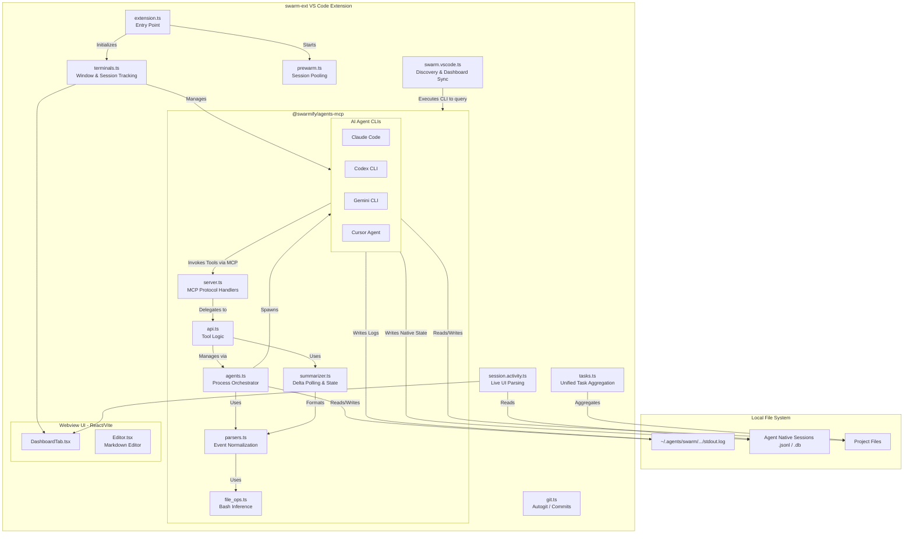
```mermaid
flowchart TB
    %% External Systems
    subgraph CLIs ["AI Agent CLIs"]
        Claude["Claude Code"]
        Codex["Codex CLI"]
        Gemini["Gemini CLI"]
        Cursor["Cursor Agent"]
    end

    subgraph FS ["Local File System"]
        Stdout["~/.agents/swarm/.../stdout.log"]
        Sessions["Agent Native Sessions .jsonl / .db"]
        Workspace["Project Files"]
    end

    %% Agents MCP Server Container
    subgraph MCPServer ["@swarmify/agents-mcp"]
        ServerTS["server.ts<br/>MCP Protocol Handlers"]
        ApiTS["api.ts<br/>Tool Logic"]
        AgentManager["agents.ts<br/>Process Orchestrator"]
        Parsers["parsers.ts<br/>Event Normalization"]
        Summarizer["summarizer.ts<br/>Delta Polling & State"]
        FileOps["file_ops.ts<br/>Bash Inference"]
        
        ServerTS -->|Delegates to| ApiTS
        ApiTS -->|Manages via| AgentManager
        ApiTS -->|Uses| Summarizer
        AgentManager -->|Reads/Writes| Stdout
        AgentManager -->|Spawns| CLIs
        AgentManager -->|Uses| Parsers
        Parsers -->|Uses| FileOps
        Summarizer -->|Formats| Parsers
    end

    %% VS Code Extension Container
    subgraph Extension ["swarm-ext VS Code Extension"]
        ExtCore["extension.ts<br/>Entry Point"]
        Terminals["terminals.ts<br/>Window & Session Tracking"]
        Prewarm["prewarm.ts<br/>Session Pooling"]
        SwarmDetect["swarm.vscode.ts<br/>Discovery & Dashboard Sync"]
        SessionActivity["session.activity.ts<br/>Live UI Parsing"]
        Git["git.ts<br/>Autogit / Commits"]
        Tasks["tasks.ts<br/>Unified Task Aggregation"]
        
        subgraph Webviews ["Webview UI - React/Vite"]
            Dashboard["DashboardTab.tsx"]
            CustomEditor["Editor.tsx<br/>Markdown Editor"]
        end

        ExtCore -->|Initializes| Terminals
        ExtCore -->|Starts| Prewarm
        Terminals -->|Manages| CLIs
        SwarmDetect -->|Executes CLI to query| MCPServer
        SessionActivity -->|Reads| Sessions
        Tasks -->|Aggregates| Workspace
        Terminals --> Dashboard
        SessionActivity --> Dashboard
    end

    %% Interactions
    CLIs -->|Writes Logs| Stdout
    CLIs -->|Writes Native State| Sessions
    CLIs -->|Reads/Writes| Workspace
    CLIs -->|Invokes Tools via MCP| ServerTS
```

---

#### 1. Agents MCP Server (`@swarmify/agents-mcp`)
This container is pure infrastructure. It exposes tools to clients and manages background execution without making architectural decisions [3, 4].

*   **`server.ts` (Protocol Layer)**: The entry point that initializes the `@modelcontextprotocol/sdk` server over `stdio`. It registers the four core tools (`Spawn`, `Status`, `Stop`, `Tasks`) and intercepts client info [5-7].
*   **`api.ts` (Tool Logic)**: Maps the raw MCP JSON-RPC requests to internal framework functions. It handles mode resolution (`plan`, `edit`, `ralph`, `cloud`) and invokes the orchestrator [8, 9].
*   **`agents.ts` (Process Orchestrator)**: Contains the `AgentManager` and `AgentProcess` classes. It is responsible for spawning detached Node child processes, tracking PIDs, enforcing limits (max 50 agents, 10 concurrent), and persisting agent metadata to disk [10-12].
*   **`parsers.ts` (Event Normalization)**: AI CLIs output different log formats (e.g., Claude uses stream-json, Codex uses raw JSON with stringified arguments). This module normalizes these disparate streams into a unified event schema (`init`, `tool_use`, `file_write`, `result`) [13-15].
*   **`file_ops.ts` (Command Inference)**: Extracts implicit file operations (read/write/delete) from raw Bash commands (e.g., parsing `cat > path` or `sed -i`) so the UI can display files modified even if the agent didn't use a native filesystem tool [16, 17].
*   **`summarizer.ts` (State & Delta Engine)**: Implements delta-based cursor polling to save token limits. It collapses sequential streaming events (like `thinking` chunks), truncates bash commands, and deduplicates file operations to return a concise `QuickStatus` to the orchestrator [13, 18-20].

#### 2. VS Code / Cursor Extension (`swarm-ext`)
This container maps the background processes and CLI tools to the visual IDE, transforming the user into an "engineering manager" [21].

*   **`extension.ts` (Entry Point & Context)**: Registers all commands, initializes webviews, and attaches window/terminal listeners. It ties the backend logic to VS Code's extension API [22, 23].
*   **`terminals.vscode.ts` (Terminal State Management)**: Implements a 2-map architecture (`editorTerminals` and `terminalToId`) to track VS Code terminal instances against CLI session UUIDs. It manages auto-labeling, tmux-based terminal splitting, and crash recovery [24-26].
*   **`prewarm.ts` & `prewarm.simple.ts` (Session Pooling)**: Maintains a pool of ready-to-use background CLI sessions (especially for slow-starting models like Codex). When a user requests an agent, it instantly hands off a pre-spawned session ID, reducing boot latency [27-30].
*   **`session.activity.ts` (Live UI Parsing)**: Independently polls and parses native LLM log files (`~/.claude/projects/*.jsonl` or Cursor's local SQLite `.db`) to extract live status (e.g., "Reading src/auth.ts") for the React Dashboard [2, 31, 32].
*   **`tasks.ts` & `tasks.vscode.ts` (Unified Tasks)**: Aggregates actionable items from local Markdown files (`TODO.md`, `RALPH.md`), Linear, and GitHub via their respective MCP clients into a unified `UnifiedTask` interface [33-35].
*   **`git.ts` (Autogit)**: Manages automated repository workflows. It parses `git status` and `git diff`, detects directory moves, and feeds the context to an AI provider to generate conventional commit messages [36-38].
*   **`swarm.detect.ts` (Environment Discovery)**: Scans the user's `$PATH` and filesystem to detect which CLIs are installed, whether they have MCP enabled, and if the `/swarm` prompt commands are synced [39, 40].

#### 3. Webview UI (`extension/ui/`)
Built as an isolated React/Vite app embedded inside the VS Code extension, communicating via `postMessage` [41].

*   **`DashboardTab.tsx`**: Renders the "Approval Queue", "Running Agents", and "Recent Swarms" UI. It consumes data from `session.activity.ts` and the MCP server's `Tasks` tool [42, 43].
*   **`Editor.tsx`**: A custom markdown editor built on TipTap/ProseMirror. It replaces VS Code's default markdown view for specific files to allow inline "Send to Agent" actions and rich-text rendering of `TODO` lists [44].


#### Core Entities (The Actors)

*   **Agent (CLI Agent):** A specialized AI model running locally or remotely as a detached background command-line process (e.g., `claude`, `codex`, `gemini`, `cursor-agent`, `opencode`) [1, 2]. Each agent has distinct strengths, such as Claude for planning, Codex for rapid implementation, and Cursor for debugging [1, 3].
*   **Orchestrator (Lead Agent):** The primary agent that receives the user's initial task. It explores the codebase, drafts a **Distribution Plan**, and delegates work to **SubAgents** instead of executing the entire task itself [4, 5]. 
*   **SubAgent:** An agent spawned by the Orchestrator to handle a specific, isolated piece of work (e.g., a specific file or feature) [5, 6]. 
*   **Swarm:** Multiple agents executing in parallel on non-overlapping parts of a problem, coordinated by the Orchestrator [5, 6].
*   **User (Engineering Manager):** The human developer who defines the task, dictates the **Mix of Agents**, and authorizes execution via **Approval Gates** [7].

#### Orchestration & Workflow (The Process)

*   **Mix of Agents:** The requested composition of the Swarm (e.g., "70% Claude, 30% Codex") specified by the user in the `/swarm` command to balance model strengths [8, 9].
*   **Distribution Plan:** A blueprint drafted by the Orchestrator detailing which agents will be spawned, their specific assignments, and the files they will own. Execution halts until this plan is approved [10, 11].
*   **Approval Gate (Human-in-the-Middle):** A strict control mechanism (via IDE UI or native OS notifications) that physically blocks the Orchestrator from spawning sub-agents until the user explicitly approves the Distribution Plan [7, 12, 13].
*   **Effort Level:** A parameter (`fast`, `default`, `detailed`) that dynamically maps the spawned agent to a specific underlying model (e.g., `fast` Claude maps to `claude-haiku`, `detailed` maps to `claude-opus`) [14, 15].
*   **Mode:** The permission level and operating context of an agent [4]:
    *   **`plan`:** Read-only mode used for research, exploration, and code review [4, 16].
    *   **`edit`:** Read and write mode for implementation and fixes [4, 16].
    *   **`ralph`:** A fully autonomous "YOLO" mode where a single agent iteratively works through a checklist in a `RALPH.md` file until complete [4, 17].
    *   **`cloud`:** Runs the agent on remote cloud infrastructure (e.g., Anthropic's VMs), returning a Pull Request URL upon completion [18].
*   **Swarm-Verified Commands:** Slash commands prefixed with 's' (e.g., `/sdebug`, `/splan`) that force the Orchestrator to spawn independent agents for blind verification and consensus building [19, 20].
*   **Hard Lines:** Unbreakable prompt engineering constraints (e.g., "NO MOCKING IN TESTS", "NO EMOJIS") that result in an immediate halt of the workflow if crossed [21, 22].

#### Infrastructure & State (The System)

*   **MCP (Model Context Protocol):** The universal interface protocol (`@swarmify/agents-mcp`) that provides the "pipes and wires" for cross-platform delegation. It allows any client to spawn any agent by exposing four tools: `Spawn`, `Status`, `Stop`, and `Tasks` [6, 23, 24].
*   **AgentManager:** The central backend class responsible for enforcing system limits (max 50 agents, 10 concurrent), persisting state, and managing OS-level Process Groups [25, 26].
*   **AgentProcess:** The backend representation of a spawned agent, tracking its metadata (`agentId`, `taskName`, `pid`), current `mode`, and lifecycle `status` (`running`, `completed`, `failed`, `stopped`) [25, 27].
*   **Delta Polling:** An optimized status-checking mechanism. The Orchestrator passes a cursor timestamp to the `Status` tool, and the backend returns only the summarized events (collapsed thinking, truncated bash) that occurred since that timestamp, conserving the LLM's context window [14, 28].
*   **Prewarming (Session Pooling):** A latency-reduction technique that spawns and maintains a pool of background CLI sessions, allowing instant hand-off when a user or Orchestrator requests a new agent [29-31].
*   **UnifiedTask:** An aggregated entity that standardizes tasks collected from various sources (Markdown files, Linear tickets, GitHub issues) for display in the IDE dashboard [32, 33].
*   **Tmux Socket Pinning:** A window-management technique using dedicated Unix sockets (`/tmp/agents-tmux-{session}.sock`) to safely multiplex full-screen terminal panes without keystroke collisions [34, 35].

---

#### Key Relationships & Data Flow

1.  **User ↔ Orchestrator (Approval Flow):**
    *   The **User** invokes the `/swarm` command, defining a task and a **Mix of Agents** [8, 10].
    *   The **Orchestrator** explores the codebase in `plan` mode and drafts a **Distribution Plan** [10, 11].
    *   The Orchestrator halts execution at the **Approval Gate**.
    *   The **User** reviews, modifies, and approves the plan via the IDE Dashboard or OS Alerter [10, 13].
2.  **Orchestrator ↔ MCP Server ↔ SubAgents (Execution Flow):**
    *   Upon approval, the **Orchestrator** invokes the `Spawn` tool via the **MCP Server** for each required **SubAgent**, defining their `prompt`, `mode`, and `effort` [14, 36].
    *   The **AgentManager** initiates detached **AgentProcesses** (CLI binaries like Codex or Gemini) in the background [37, 38].
    *   The **MCP Server** immediately returns the `agent_id` to the Orchestrator, allowing for parallel execution (a **Swarm**) [38, 39].
3.  **MCP Server ↔ File System ↔ Orchestrator (Monitoring Flow):**
    *   **SubAgents** write raw, model-specific logs to their respective `stdout.log` files on the **File System** [40].
    *   The **Orchestrator** periodically invokes the `Status` tool via **MCP** [6, 41].
    *   The **MCP Server** parses the raw logs, normalizes the disparate JSON formats, deduplicates file operations, and applies **Delta Polling** to return a concise `QuickStatus` back to the **Orchestrator** [14, 28].
4.  **IDE Extension ↔ File System (UI Flow):**
    *   The **VS Code Extension** continuously monitors the local **File System** (e.g., `~/.claude/projects/`, `~/.cursor/chats/`) to extract live session activity [42, 43].
    *   This live activity (e.g., "Reading src/auth.ts") is displayed to the **User** on the Dashboard, bridging the gap between invisible background processes and the visual workspace [44, 45].


Here is the **C4 Level 1 (System Context)** architectural breakdown for Swarmify. 

The System Context diagram illustrates the highest-level view of the Swarmify ecosystem, showing how the framework interacts with the human user, the host IDE, underlying AI CLI tools, and external cloud services.

#### C4 Level 1: System Context Diagram

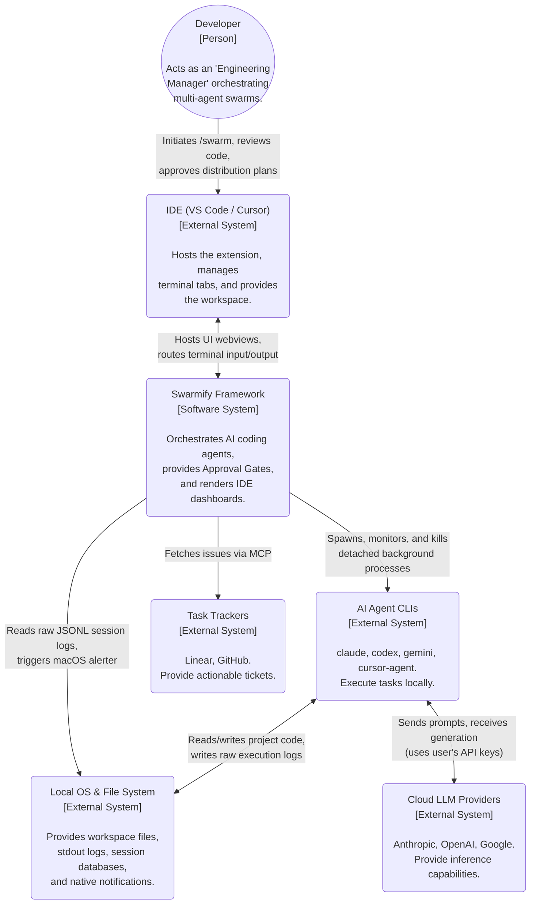
```mermaid
flowchart TB
    %% Core Actor
    User(("Developer\n[Person]\n\nActs as an 'Engineering\nManager' orchestrating\nmulti-agent swarms."))

    %% The System in Focus
    System_Swarmify("Swarmify Framework\n[Software System]\n\nOrchestrates AI coding agents,\nprovides Approval Gates,\nand renders IDE dashboards.")

    %% External Systems
    System_IDE("IDE (VS Code / Cursor)\n[External System]\n\nHosts the extension, manages\nterminal tabs, and provides\nthe workspace.")
    System_CLIs("AI Agent CLIs\n[External System]\n\nclaude, codex, gemini, cursor-agent.\nExecute tasks locally.")
    System_OS("Local OS & File System\n[External System]\n\nProvides workspace files,\nstdout logs, session databases,\nand native notifications.")
    System_LLMs("Cloud LLM Providers\n[External System]\n\nAnthropic, OpenAI, Google.\nProvide inference capabilities.")
    System_TaskSources("Task Trackers\n[External System]\n\nLinear, GitHub.\nProvide actionable tickets.")

    %% Relationships
    User -->|Initiates /swarm, reviews code,\napproves distribution plans| System_IDE
    System_IDE <-->|Hosts UI webviews,\nroutes terminal input/output| System_Swarmify
    
    System_Swarmify -->|Fetches issues via MCP| System_TaskSources
    System_Swarmify -->|Spawns, monitors, and kills\ndetached background processes| System_CLIs
    System_Swarmify -->|Reads raw JSONL session logs,\ntriggers macOS alerter| System_OS
    
    System_CLIs <-->|Reads/writes project code,\nwrites raw execution logs| System_OS
    System_CLIs <-->|"Sends prompts, receives generation\n(uses user's API keys)"| System_LLMs
```

---

#### System Context Breakdown

Swarmify acts as the "pipes and wires" orchestrator, bridging the gap between isolated AI command-line tools and the developer's visual workspace [1]. 

#### 1. The Core System: Swarmify Framework
Swarmify is the central software system being modeled. It is composed of the VS Code/Cursor extension (`swarm-ext`), the orchestration backend (`@swarmify/agents-mcp`), and the version-controlled prompt libraries [2-4]. 
*   **Responsibility:** It transforms isolated AI CLI tools into a collaborative team [5, 6]. It captures the user's intent via the `/swarm` command, intercepts the AI's distribution plan to enforce Approval Gates, and safely orchestrates parallel background execution [3, 4].

#### 2. The Primary Actor: Developer / Engineering Manager
Rather than writing every line of code, the human user is elevated to the role of an "engineering manager" [3]. 
*   **Responsibility:** The user describes the task and specifies a "Mix of Agents" (e.g., 70% Claude, 30% Codex) [6]. Most importantly, the user acts as the ultimate safeguard, explicitly reviewing and approving the AI's distribution plan via UI gates or native OS alerts before any agent executes code [3, 7].

#### 3. External System: IDE (VS Code / Cursor)
Swarmify relies heavily on the host IDE for its presentation layer and window management.
*   **Interaction:** The IDE hosts the extension and provides full-screen editor tabs for the agent terminals (rather than burying them in a bottom panel) [3, 8]. It also handles `tmux` splits for viewing multiple agents simultaneously [8].

#### 4. External System: AI Agent CLIs
Swarmify explicitly does *not* provide the models itself; it wraps existing, external Command Line Interfaces (CLIs) [6, 9].
*   **Interaction:** Swarmify spawns `claude`, `codex`, `gemini`, `cursor-agent`, or `opencode` as detached background processes [10-12]. The framework controls their lifecycle by sending `SIGTERM` or `SIGKILL` commands when tasks are stopped [13, 14].

#### 5. External System: Local OS & File System
The Swarmify architecture relies on the local file system for both Inter-Process Communication (IPC) and state persistence.
*   **Interaction:** Swarmify does not use shared memory to communicate with agents; instead, agents write their output to dedicated `stdout.log` files on the file system (`~/.agents/swarm/agents/{id}/stdout.log`), which Swarmify polls and parses [10, 15]. The OS is also leveraged to display native macOS notifications (`alerter`) when an agent requires explicit permission to proceed [7, 16].

#### 6. External System: Cloud LLM Providers
The intelligence of the system relies entirely on external cloud APIs provided by Anthropic, OpenAI, and Google [17, 18].
*   **Interaction:** Swarmify is free and open-source, so the user brings their own API keys [9]. The AI Agent CLIs communicate directly with these providers. For example, spawning three Claude sub-agents means the local `claude` CLI makes three parallel API calls to Anthropic, directly consuming the user's API quota [9, 19].

#### 7. External System: Task Trackers (Linear & GitHub)
Swarmify aggregates work from external project management tools to feed context directly to the agents.
*   **Interaction:** The framework includes dedicated MCP client implementations (`linear-client.ts`, `github-client.ts`) to fetch assigned Linear tickets and open GitHub issues, normalizing them into a `UnifiedTask` schema for the dashboard UI [8, 20-22].


Here is the **C4 Level 2 (Container) Diagram** for the Swarmify framework. This architectural view breaks down the core software system into its primary executable containers, demonstrating how the IDE extension, React webviews, isolated MCP backend servers, and external CLI agents interact to form the multi-agent orchestration system.

#### C4 Level 2: Container Diagram

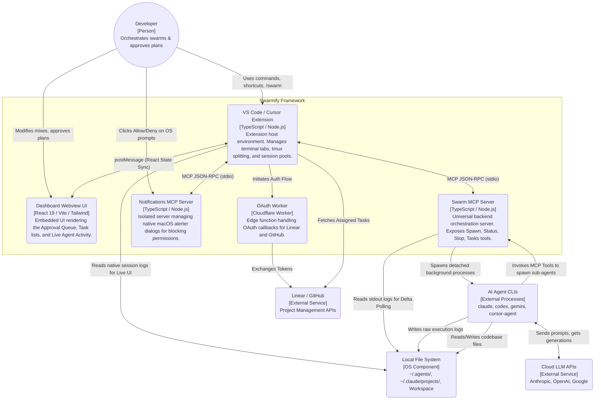
```mermaid
flowchart TB
    %% External Actors
    User(("Developer\n[Person]\nOrchestrates swarms & approves plans"))
    
    %% External Systems
    System_CLIs("AI Agent CLIs\n[External Processes]\nclaude, codex, gemini, cursor-agent")
    System_LLMs("Cloud LLM APIs\n[External Service]\nAnthropic, OpenAI, Google")
    System_TaskTrackers("Linear / GitHub\n[External Service]\nProject Management APIs")
    System_FS("Local File System\n[OS Component]\n~/.agents/, ~/.claude/projects/, Workspace")

    %% System Boundary
    subgraph System_Swarmify ["Swarmify Framework"]
        
        Container_Extension("VS Code / Cursor Extension\n[TypeScript / Node.js]\nExtension host environment. Manages terminal tabs, tmux splitting, and session pools.")
        
        Container_Webview("Dashboard Webview UI\n[React 19 / Vite / Tailwind]\nEmbedded UI rendering the Approval Queue, Task lists, and Live Agent Activity.")
        
        Container_SwarmMCP("Swarm MCP Server\n[TypeScript / Node.js]\nUniversal backend orchestration server. Exposes Spawn, Status, Stop, Tasks tools.")
        
        Container_NotifMCP("Notifications MCP Server\n[TypeScript / Node.js]\nIsolated server managing native macOS alerter dialogs for blocking permissions.")
        
        Container_OAuth("OAuth Worker\n[Cloudflare Worker]\nEdge function handling OAuth callbacks for Linear and GitHub.")
        
    end

    %% User Interactions
    User -->|Uses commands, shortcuts, /swarm| Container_Extension
    User -->|Modifies mixes, approves plans| Container_Webview
    User -->|Clicks Allow/Deny on OS prompts| Container_NotifMCP

    %% Internal Container Interactions
    Container_Extension <-->|"postMessage (React State Sync)"| Container_Webview
    Container_Extension <-->|"MCP JSON-RPC (stdio)"| Container_SwarmMCP
    Container_Extension <-->|"MCP JSON-RPC (stdio)"| Container_NotifMCP
    Container_Extension -->|Initiates Auth Flow| Container_OAuth

    %% External Interactions
    Container_OAuth -->|Exchanges Tokens| System_TaskTrackers
    Container_Extension -->|Fetches Assigned Tasks| System_TaskTrackers
    Container_Extension -->|Reads native session logs for Live UI| System_FS
    
    Container_SwarmMCP -->|Spawns detached background processes| System_CLIs
    Container_SwarmMCP -->|Reads stdout logs for Delta Polling| System_FS
    
    System_CLIs -->|Writes raw execution logs| System_FS
    System_CLIs -->|Reads/Writes codebase files| System_FS
    System_CLIs <-->|Sends prompts, gets generations| System_LLMs
    System_CLIs -->|Invokes MCP Tools to spawn sub-agents| Container_SwarmMCP
```

---

#### Container Breakdown

#### 1. VS Code / Cursor Extension (`swarm-ext`)
*   **Technology**: TypeScript, Node.js, VS Code Extension API.
*   **Responsibility**: Acts as the central nervous system within the IDE. It captures user inputs, manages full-screen terminal tabs for agents, implements `tmux` socket pinning for split views, and maintains a pool of pre-warmed background CLI sessions for instant hand-off [1-3]. It also directly parses native LLM log files (e.g., Claude's `.jsonl` files and Cursor's SQLite `.db` blobs) to feed live activity data to the UI [4, 5].

#### 2. Dashboard Webview UI (`extension/ui/`)
*   **Technology**: React 19, Vite, Tailwind CSS, Radix UI.
*   **Responsibility**: Runs inside an isolated webview within the extension. It provides the visual "Engineering Manager" interface, rendering the Approval Queue, the Running Agents monitor, and the Unified Tasks list. It communicates bidirectionally with the Extension container via `postMessage` payloads [6, 7].

#### 3. Swarm MCP Server (`@swarmify/agents-mcp`)
*   **Technology**: TypeScript, Node.js, `@modelcontextprotocol/sdk`.
*   **Responsibility**: The pure infrastructure "pipes and wires" of the framework. It runs locally as a standalone MCP server over `stdio`. It exposes the `Spawn`, `Status`, `Stop`, and `Tasks` tools [8, 9]. It manages the lifecycle (Process Groups, PIDs) of detached background agent CLIs and handles "Delta Polling" by parsing and normalizing disparate JSON log streams into a unified event schema [10-12].

#### 4. Notifications MCP Server (`notifications-mcp`)
*   **Technology**: TypeScript, Node.js, macOS `alerter`.
*   **Responsibility**: An isolated, specialized MCP server responsible for triggering native OS-level blocking alerts. It exposes an `ask_permission` tool that agents can invoke. The tool suspends the agent's execution loop by physically waiting for the user to click "Allow" or "Deny" on a macOS notification before returning a result [13, 14].

#### 5. OAuth Worker (`oauth-worker`)
*   **Technology**: Cloudflare Workers, TypeScript.
*   **Responsibility**: A remote edge function deployed to Cloudflare (`https://swarmify-oauth.muqsitnawaz.workers.dev`). It securely handles the OAuth redirect callbacks and token exchanges required to connect the developer's local IDE extension to external trackers like Linear and GitHub [15]. 

#### Key Architectural Data Flows

*   **Asynchronous IPC via File System**: The Swarm MCP server and the AI Agent CLIs do *not* communicate via shared memory or direct API calls. Instead, agents write their output directly to dedicated `stdout.log` files (`~/.agents/swarm/agents/{id}/stdout.log`) [16]. The Swarm MCP server continually polls and parses these files to generate delta summaries, conserving token windows for the Orchestrator agent [11, 12, 16].
*   **Live UI Pipeline**: The Extension bypasses the MCP server entirely to generate real-time Dashboard updates. It continuously polls native agent storage directories (like `~/.cursor/chats/*/store.db`) to parse the most recent tool activity (e.g., "Reading src/auth.ts") and posts that state to the React Webview [4, 5].
*   **Tool Delegation Loop**: A lead agent (e.g., Claude) running as a CLI process receives a user prompt. It decides it needs a sub-agent, so it invokes the `mcp__Swarm__spawn` tool via its internal MCP client [17, 18]. This request is routed to the Swarm MCP Server, which spawns a *new* detached CLI process (e.g., Codex) and returns a unique `agent_id` back to the lead agent immediately, establishing a hierarchical tree of parallel processes [12, 17].


### Step 3 Runtime behavior investigation


Here is a deep dive into the entry points and execution paths of the Swarmify framework. The architecture is highly decentralized, relying on local background processes and inter-process communication via the file system and MCP (Model Context Protocol). 

#### Primary System Entry Points

1.  **VS Code / Cursor Extension Host (`extension/src/vscode/extension.ts`)**: 
    *   The `activate(context)` function is the entry point for the IDE. It initializes session prewarming, registers all IDE commands, scans existing terminal tabs to restore persistent sessions, and mounts the React-based Dashboard Webview [1-3].
2.  **Agents MCP Server (`agents-mcp/src/index.ts`)**: 
    *   The backend entry point. It bootstraps an MCP server communicating over `stdio`, registers the core tools (`Spawn`, `Status`, `Stop`, `Tasks`), and initializes the `AgentManager` to enforce system concurrency limits [4-6].
3.  **The Orchestrator Workflows (`prompts/**/swarm.md`)**:
    *   The entry point for AI logic. When a user types `/swarm` in an agent terminal, the CLI reads the respective prompt file, which directs the lead agent to transition from a standard chatbot into a multi-agent orchestrator [7, 8].

Below are the UML sequence diagrams and execution traces for the 4 most critical use cases.

---

#### Use Case 1: Multi-Agent Task Orchestration & Approval Gate
This path traces what happens when a user types `/swarm` to initiate a complex task. Swarmify enforces a strict Human-in-the-Middle (HITM) approval flow before allowing the AI to spin up sub-agents.

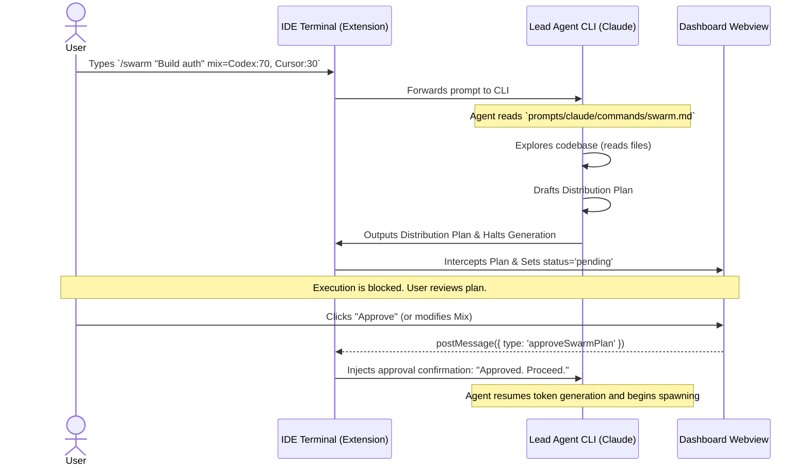
```mermaid
sequenceDiagram
    actor User
    participant IDE as IDE Terminal (Extension)
    participant Lead as Lead Agent CLI (Claude)
    participant UI as Dashboard Webview

    User->>IDE: Types `/swarm "Build auth" mix=Codex:70, Cursor:30`
    IDE->>Lead: Forwards prompt to CLI
    
    Note over Lead: Agent reads `prompts/claude/commands/swarm.md`
    Lead->>Lead: Explores codebase (reads files)
    Lead->>Lead: Drafts Distribution Plan
    Lead->>IDE: Outputs Distribution Plan & Halts Generation
    
    IDE->>UI: Intercepts Plan & Sets status='pending'
    
    Note over User,UI: Execution is blocked. User reviews plan.
    
    User->>UI: Clicks "Approve" (or modifies Mix)
    UI-->>IDE: postMessage({ type: 'approveSwarmPlan' })
    IDE->>Lead: Injects approval confirmation: "Approved. Proceed."
    
    Note over Lead: Agent resumes token generation and begins spawning
```

**Execution Trace:**
1.  The user types `/swarm` into a full-screen agent terminal [9].
2.  The Lead Agent parses its customized system prompt (e.g., `claude/commands/swarm.md`). The prompt strictly dictates: *"Before spawning ANY Swarm agent, you MUST show a distribution plan and get user approval"* [10, 11].
3.  The agent halts execution after outputting the plan [11].
4.  The VS Code Extension and React Dashboard (`ApprovalQueueSection.tsx`) detect the pending plan, shifting the UI status to `'pending'` and providing an interface for the human to approve or modify the agent mix [12, 13].
5.  Upon approval, the extension sends a message back to the active terminal, permitting the LLM to resume and begin calling the `Spawn` tool [14].

---

#### Use Case 2: Agent Spawning & Process Detachment (MCP)
Once the orchestrator is approved, it delegates tasks in parallel by invoking the `Spawn` tool on the MCP server. This handles process management safely.

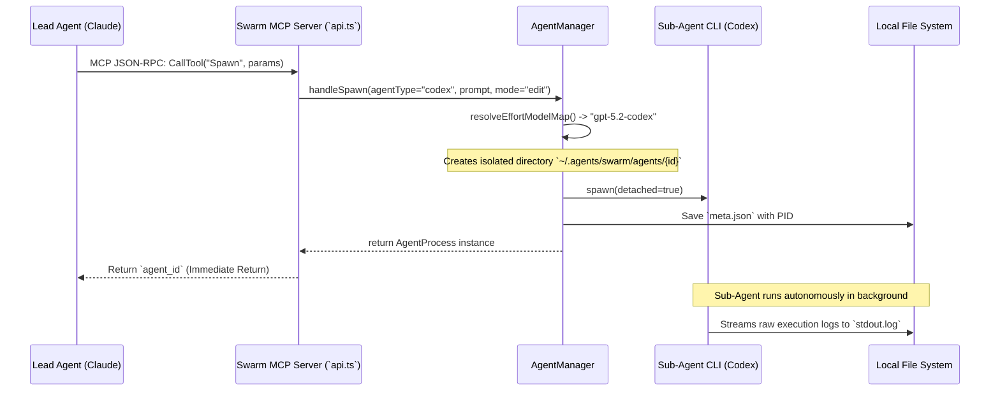
```mermaid
sequenceDiagram
    participant Lead as Lead Agent (Claude)
    participant MCP as Swarm MCP Server (`api.ts`)
    participant AM as AgentManager
    participant SubAgent as Sub-Agent CLI (Codex)
    participant FS as Local File System

    Lead->>MCP: MCP JSON-RPC: CallTool("Spawn", params)
    MCP->>AM: handleSpawn(agentType="codex", prompt, mode="edit")
    
    AM->>AM: resolveEffortModelMap() -> "gpt-5.2-codex"
    
    Note over AM: Creates isolated directory `~/.agents/swarm/agents/{id}`
    
    AM->>SubAgent: spawn(detached=true)
    AM->>FS: Save `meta.json` with PID
    
    AM-->>MCP: return AgentProcess instance
    MCP-->>Lead: Return `agent_id` (Immediate Return)
    
    Note over SubAgent,FS: Sub-Agent runs autonomously in background
    SubAgent->>FS: Streams raw execution logs to `stdout.log`
```

**Execution Trace:**
1.  The Lead Agent invokes the `mcp__Swarm__spawn` tool, passing parameters like `agent_type`, `prompt`, and `mode` (e.g., `edit` or `plan`) [6, 15].
2.  The `api.ts` handler validates the request and routes it to the `AgentManager` [16].
3.  The `AgentManager` resolves the specific LLM model based on the `effort` parameter (e.g., mapping `effort='default'` for Codex to `gpt-5.2-codex`) [17, 18].
4.  A Node.js `child_process.spawn()` call is executed with `detached: true`, meaning the sub-agent will survive an IDE restart [19]. 
5.  The server immediately returns the `agent_id` back to the orchestrator *without waiting for the sub-agent to finish*. This non-blocking architecture enables true parallel swarms [20, 21].

---

#### Use Case 3: Delta Polling for Task Execution
To monitor the swarm without blowing out its token limit, the Orchestrator periodically polls the `Status` tool, which uses a highly optimized "Delta Polling" algorithm to summarize filesystem logs.

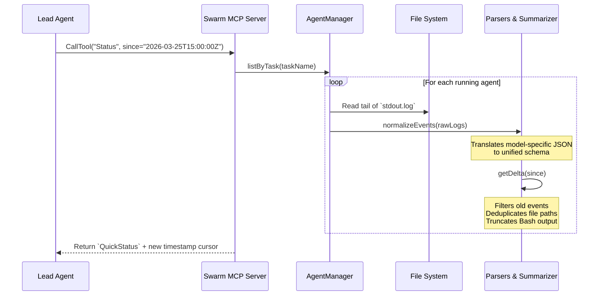
```mermaid
sequenceDiagram
    participant Lead as Lead Agent
    participant MCP as Swarm MCP Server
    participant AM as AgentManager
    participant FS as File System
    participant Parser as Parsers & Summarizer

    Lead->>MCP: CallTool("Status", since="2026-03-25T15:00:00Z")
    MCP->>AM: listByTask(taskName)
    
    loop For each running agent
        AM->>FS: Read tail of `stdout.log`
        AM->>Parser: normalizeEvents(rawLogs)
        Note over Parser: Translates model-specific JSON<br/>to unified schema
        
        Parser->>Parser: getDelta(since)
        Note over Parser: Filters old events<br/>Deduplicates file paths<br/>Truncates Bash output
    end
    
    MCP-->>Lead: Return `QuickStatus` + new timestamp cursor
```

**Execution Trace:**
1.  The Lead Agent waits, then calls the `Status` tool, passing an ISO timestamp cursor (`since`) from the previous poll [22].
2.  The `AgentManager` locates the relevant agents and reads the tail of their `stdout.log` files on disk [23].
3.  The raw JSON logs are passed through model-specific normalizers (e.g., `normalizeCodex`, `normalizeClaude`) to create a unified schema (e.g., mapping `assistant` blocks to `tool_use`) [24, 25].
4.  The `Summarizer` filters out events older than the `since` cursor, deduplicates file operations into sets (files read, written, deleted), and truncates raw bash outputs to a maximum of 120 characters to save tokens [26-28].
5.  The delta summary is returned to the orchestrator [28].

---

#### Use Case 4: Live UI Session Activity Parsing
While agents run invisibly in the background, the human user needs to see what they are doing. The VS Code Extension completely bypasses the MCP server to parse native agent databases for real-time Dashboard updates.

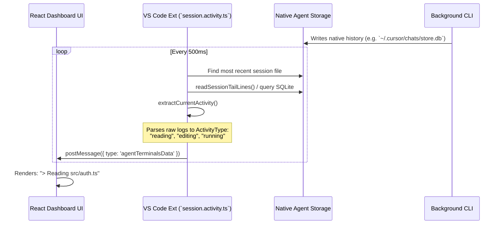
```mermaid
sequenceDiagram
    participant Webview as React Dashboard UI
    participant Ext as VS Code Ext (`session.activity.ts`)
    participant FS as Native Agent Storage
    participant Agent as Background CLI

    Agent->>FS: Writes native history (e.g. `~/.cursor/chats/store.db`)
    
    loop Every 500ms
        Ext->>FS: Find most recent session file
        Ext->>FS: readSessionTailLines() / query SQLite
        
        Ext->>Ext: extractCurrentActivity()
        Note over Ext: Parses raw logs to ActivityType:<br/>"reading", "editing", "running"
        
        Ext->>Webview: postMessage({ type: 'agentTerminalsData' })
    end
    
    Webview->>Webview: Renders: "> Reading src/auth.ts"
```

**Execution Trace:**
1.  The VS Code Extension runs a background polling loop [29].
2.  Instead of reading the MCP `stdout.log`, it reads the raw, native data stores of the CLIs (e.g., `~/.claude/projects/*.jsonl` or `~/.cursor/chats/*/store.db` using WebAssembly SQLite) [30, 31].
3.  The parser (`parseLineForActivity`) reads the tail of the files from bottom to top to find the most recent action [30].
4.  It normalizes raw tool calls into semantic `ActivityType` states (e.g., parsing a `Bash` tool invocation into a `'running'` state) [32, 33].
5.  The extension dispatches a `postMessage` payload to the React dashboard, which updates the UI to show live indicators like "Reading src/auth.ts" or "Running npm test" [34-36].


Here is the Data Flow Diagram (DFD) mapping the agent task lifecycle in the Swarmify framework. This DFD illustrates how data moves from the user’s initial intent, through the orchestrating agent and approval gates, down to the local file system where background sub-agents execute and log their progress.

#### Agent Task Lifecycle DFD (Level 1)

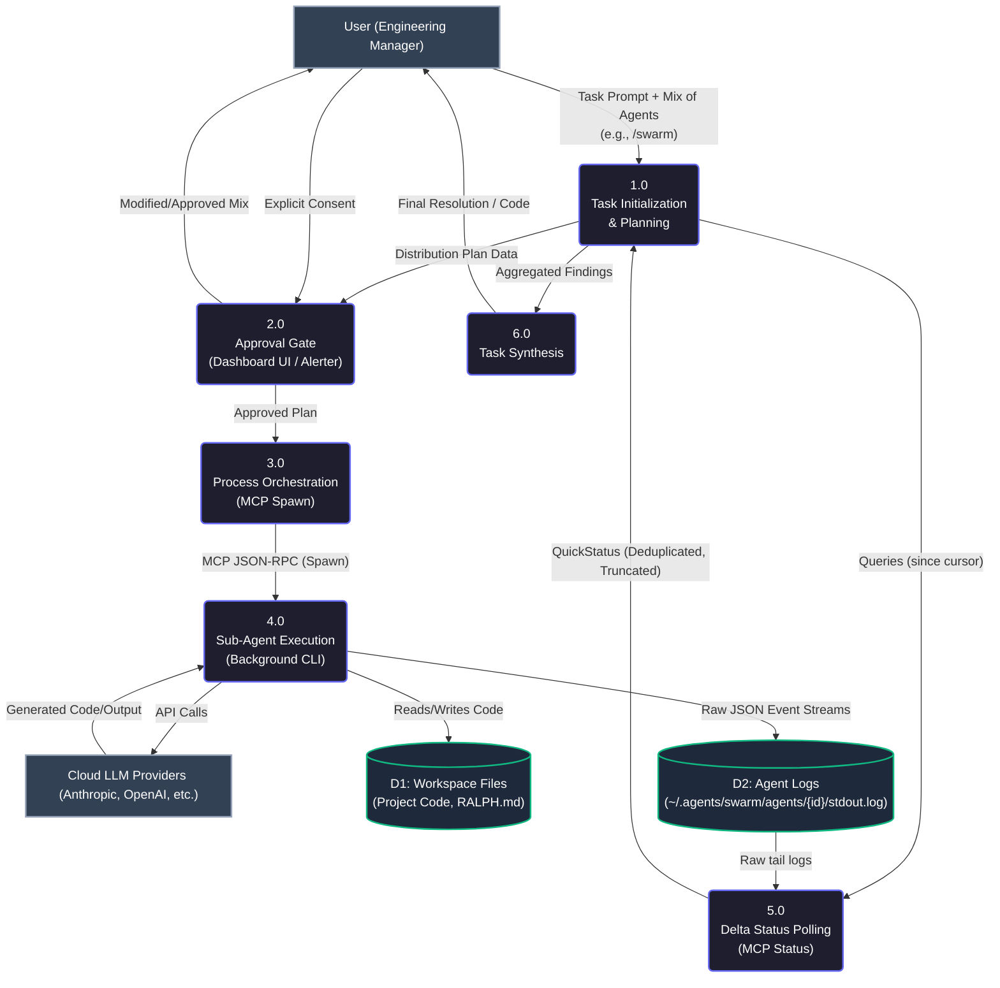
```mermaid
flowchart TD
    %% External Entities (Rectangles)
    User["User (Engineering Manager)"]
    CloudLLM["Cloud LLM Providers (Anthropic, OpenAI, etc.)"]

    %% Data Stores (Cylinders)
    D1[("D1: Workspace Files\n(Project Code, RALPH.md)")]
    D2[("D2: Agent Logs\n(~/.agents/swarm/agents/{id}/stdout.log)")]

    %% Processes (Rounded Rectangles)
    P1("1.0\nTask Initialization\n& Planning")
    P2("2.0\nApproval Gate\n(Dashboard UI / Alerter)")
    P3("3.0\nProcess Orchestration\n(MCP Spawn)")
    P4("4.0\nSub-Agent Execution\n(Background CLI)")
    P5("5.0\nDelta Status Polling\n(MCP Status)")
    P6("6.0\nTask Synthesis")

    %% Data Flows
    User -- "Task Prompt + Mix of Agents\n(e.g., /swarm)" --> P1
    P1 -- "Distribution Plan Data" --> P2
    P2 -- "Modified/Approved Mix" --> User
    User -- "Explicit Consent" --> P2
    P2 -- "Approved Plan" --> P3
    
    P3 -- "MCP JSON-RPC (Spawn)" --> P4
    P4 -- "API Calls" --> CloudLLM
    CloudLLM -- "Generated Code/Output" --> P4
    
    P4 -- "Reads/Writes Code" --> D1
    P4 -- "Raw JSON Event Streams" --> D2
    
    P1 -- "Queries (since cursor)" --> P5
    D2 -- "Raw tail logs" --> P5
    P5 -- "QuickStatus (Deduplicated, Truncated)" --> P1
    
    P1 -- "Aggregated Findings" --> P6
    P6 -- "Final Resolution / Code" --> User

    classDef process fill:#1e1e2f,stroke:#6366f1,stroke-width:2px,color:#fff;
    classDef store fill:#1e293b,stroke:#10b981,stroke-width:2px,color:#fff;
    classDef entity fill:#334155,stroke:#94a3b8,stroke-width:2px,color:#fff;
    
    class P1,P2,P3,P4,P5,P6 process;
    class D1,D2 store;
    class User,CloudLLM entity;
```

---

#### Detailed Data Flow Breakdown

#### 1.0 Task Initialization & Planning
*   **Input Data:** The user types a `/swarm` slash-command containing the task description and a desired "Mix of Agents" (e.g., `70% Claude, 30% Codex`) into an IDE terminal [1, 2].
*   **Processing:** The Lead Agent (Orchestrator) parses this prompt and explores the codebase (reading from **D1**) to map out integration points without making any changes [3, 4].
*   **Output Data:** The Orchestrator drafts a **Distribution Plan**, detailing which agents will own which specific files and tasks [1, 5].

#### 2.0 Approval Gate
*   **Input Data:** The generated Distribution Plan.
*   **Processing:** The system intercepts the plan, halting the Orchestrator's generation loop, and changes the task status to `pending` in the Dashboard UI [6, 7].
*   **Output Data:** The user provides explicit consent (or modifies the Mix of Agents data). This payload is injected back into the Orchestrator's terminal to authorize execution [1, 8].

#### 3.0 Process Orchestration (MCP Spawn)
*   **Input Data:** The authorized Distribution Plan.
*   **Processing:** The Orchestrator translates the plan into sequential or parallel calls to the `mcp__Swarm__spawn` tool [9, 10]. The MCP server validates the requested agent CLI, resolves the `effort` level (e.g., `fast` -> `claude-haiku-4-5-20251001`), and spawns detached child processes [11, 12].
*   **Output Data:** The server immediately returns a unique `agent_id` back to the Orchestrator without waiting for the process to finish, enabling true parallel swarms [13].

#### 4.0 Sub-Agent Execution (Background CLI)
*   **Input Data:** Specialized prompt contexts, specific file paths, and boundaries provided by the Orchestrator during spawn [14].
*   **Processing:** The background CLI tool connects to Cloud LLM Providers (consuming the user's local API keys) [15, 16]. It executes tools (e.g., `write_file`, `bash`) directly on the project codebase (**D1**).
*   **Output Data:** The sub-agent streams model-specific raw JSON logs (e.g., Codex's `response_item` or Claude's `assistant` events) directly into a dedicated log file (`~/.agents/swarm/agents/{id}/stdout.log`) (**D2**) [17-19]. 

#### 5.0 Delta Status Polling
*   **Input Data:** The Orchestrator periodically invokes the `mcp__Swarm__status` tool, passing a `since` cursor (an ISO timestamp) [11, 20].
*   **Processing:** The MCP backend reads the tail of **D2** (`stdout.log`), normalizes the disparate JSON log formats into a unified schema, and filters out events older than the `since` cursor [17, 18]. The `Summarizer` compresses the data by deduplicating file operations and truncating bash commands [11, 21, 22].
*   **Output Data:** A highly compressed `QuickStatus` data object is returned to the Orchestrator, conserving its context window [11, 23].

#### 6.0 Task Synthesis
*   **Input Data:** The final `QuickStatus` payload indicating `status: 'completed'` from all spawned sub-agents, along with their findings [11, 24].
*   **Processing:** The Orchestrator compares the sub-agents' independent work (especially in swarm-verified commands like `/sdebug` or `/splan`), synthesizing agreements, divergences, and the final state of the codebase [25, 26].
*   **Output Data:** A finalized, human-readable summary, test results, or final commit offer is provided to the User [27, 28].


Based on the architectural structure of the Swarmify framework, there are four key entities that rely on explicit state machines to manage their lifecycles: **AgentProcess**, **Swarm Approval Task**, **UnifiedTask**, and the **OAuth Connection**. 

Here are the detailed breakdowns and State Machine Diagrams (`stateDiagram-v2`) for each.

#### 1. Agent Process (`AgentStatus`)
The `AgentProcess` entity represents a detached background CLI process (like Claude or Codex) managed by the MCP server. Its lifecycle is tightly controlled by the `AgentManager` to enforce system limits and track execution [1].

*   **`running`**: The agent process has been spawned and is actively executing [2].
*   **`completed`**: The agent successfully finished its task and the process exited gracefully [2].
*   **`failed`**: The agent process crashed, encountered a fatal API error, or timed out [2].
*   **`stopped`**: The user or the orchestrator manually intervened and killed the process via the `Stop` MCP tool (sends SIGTERM/SIGKILL) [2, 3].

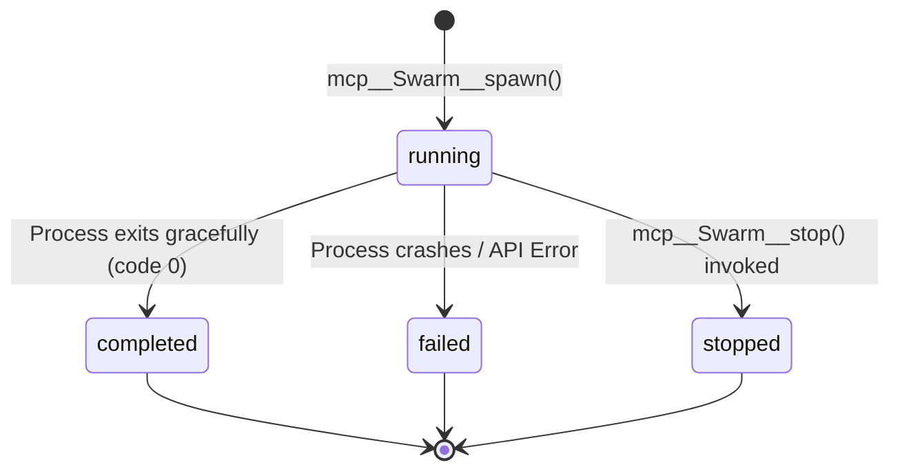
```mermaid
stateDiagram-v2
    [*] --> running : mcp__Swarm__spawn()
    
    running --> completed : Process exits gracefully (code 0)
    running --> failed : Process crashes / API Error
    running --> stopped : mcp__Swarm__stop() invoked
    
    completed --> [*]
    failed --> [*]
    stopped --> [*]
```

#### 2. Swarm Approval Task (`ApprovalStatus`)
The `ApprovalStatus` entity governs the Human-in-the-Middle (HITM) workflow. It tracks a multi-agent task from the moment the orchestrator drafts a distribution plan until the swarm finishes executing [4, 5].

*   **`pending`**: The Orchestrator has drafted a plan. Execution is blocked waiting for human review [4, 5].
*   **`approved`**: The user has clicked "Approve". Execution is authorized [4, 5].
*   **`rejected`**: The user denied the plan or modified the "Mix of Agents" (requiring a revision) [4, 5].
*   **`running`**: The Orchestrator is actively spawning sub-agents [4, 5].
*   **`complete`**: All sub-agents have finished and the task is resolved [4, 5].

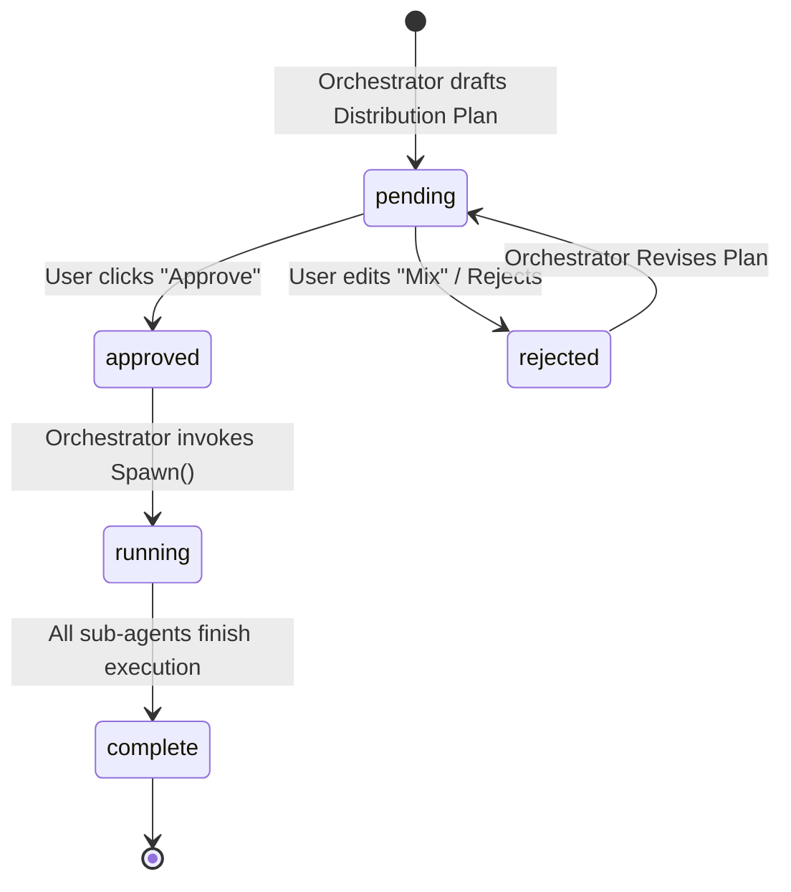
```mermaid
stateDiagram-v2
    [*] --> pending : Orchestrator drafts Distribution Plan
    
    pending --> approved : User clicks "Approve"
    pending --> rejected : User edits "Mix" / Rejects
    
    rejected --> pending : Orchestrator Revises Plan
    
    approved --> running : Orchestrator invokes Spawn()
    running --> complete : All sub-agents finish execution
    
    complete --> [*]
```

#### 3. Unified Task (`UnifiedTask.status`)
The `UnifiedTask` entity normalizes work items aggregated from various external sources (e.g., local Markdown files, Linear tickets, GitHub issues) so they can be managed in a single dashboard [6].

*   **`todo`**: The task is discovered (e.g., an unchecked `[ ]` in markdown, or an 'unstarted' ticket) [6].
*   **`in_progress`**: An agent has been assigned to the task or it is marked 'started' in the remote tracker [6].
*   **`done`**: The task is completed (e.g., `[x]` in markdown, or marked 'closed'/'canceled' remotely) [6].

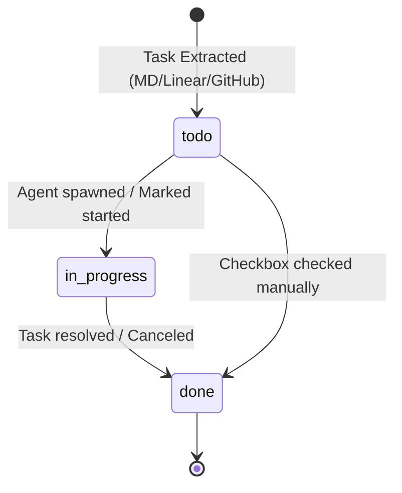
```mermaid
stateDiagram-v2
    [*] --> todo : Task Extracted (MD/Linear/GitHub)
    
    todo --> in_progress : Agent spawned / Marked started
    in_progress --> done : Task resolved / Canceled
    todo --> done : Checkbox checked manually
    
    done --> [*]
```

#### 4. OAuth Connection (`OauthDialog` Status)
When a user connects external tools like GitHub or Linear to Swarmify, the `OauthDialog` React component manages the state of the OAuth handshake and Edge worker polling [7, 8].

*   **`idle`**: The dialog is open and waiting for the user to initiate the flow [7].
*   **`waiting`**: The user clicked "Connect". A browser window is open, and the IDE is actively polling the Cloudflare worker for the callback token [7, 8].
*   **`success`**: The token was successfully received and stored [7].
*   **`error`**: The polling timed out or the authorization failed [7].

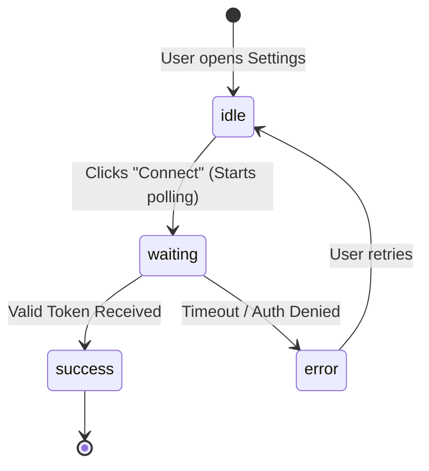
```mermaid
stateDiagram-v2
    [*] --> idle : User opens Settings
    
    idle --> waiting : Clicks "Connect" (Starts polling)
    
    waiting --> success : Valid Token Received
    waiting --> error : Timeout / Auth Denied
    
    error --> idle : User retries
    
    success --> [*]
```


### Step 4 Subsystems investigation

#### Core / Domain Layer

The Core / Domain layer of the Swarmify framework is fundamentally designed around the principles of **Clean Architecture**. It explicitly separates pure business logic, data models, and parsers from framework-specific infrastructure (such as the VS Code Extension API or native OS notification mechanisms). 

Within the repository, this separation is strictly enforced by physical directory boundaries, specifically the `extension/src/core/` directory and the pure TypeScript classes in `agents-mcp/src/`.

#### 1. Purpose of the Core Layer

The primary purpose of the Core layer is to ensure **testability, portability, and framework agnosticism**. 
By isolating the domain logic, Swarmify can execute its test suite (using `bun test`) in milliseconds without needing to mock the VS Code environment or spin up an extension host [1, 2]. The codebase explicitly states this intent across its domain files:
*   `agents.ts`: *"Pure data and lookup functions (no VS Code dependencies - testable)"* [1].
*   `settings.ts`: *"Settings types and pure functions (no VS Code dependencies - testable)"* [2].
*   `tasks.ts`: *"Pure types for unified task management across multiple sources // No VS Code dependencies - testable"* [3].
*   `terminals.ts`: *"Terminal state management following API.md architecture // Pure functions are testable..."* [4].

#### 2. Internal Structure & Domain Modules

The domain layer is divided into specialized modules that handle specific aspects of the multi-agent workflow:

**A. Configuration & Settings (`settings.ts`, `swarmifyConfig.ts`)**
This module defines the schema for the user's workspace and global preferences.
*   It parses the custom `.agents` YAML files into `AgentsConfig` objects, managing contexts, aliases, and tasks [5, 6].
*   It maintains the exact parameters for the `AgentSettings` interface, which dictates default models, prompt libraries, and display preferences [7].

**B. Task Aggregation (`tasks.ts`, `todos.ts`)**
This module normalizes external work items into a standardized schema for the orchestrator.
*   It converts varied data sources (like local Markdown checkboxes, Linear tickets, and GitHub issues) into a single `UnifiedTask` interface [3, 8].
*   It contains parsers (using regular expressions) to extract tasks from `TODO.md` and `RALPH.md` files while safely filtering out descriptions and metadata [9, 10].

**C. State & Session Parsing (`session.activity.ts`, `session.summary.ts`, `parsers.ts`)**
Because Swarmify agents operate as detached processes logging to disk, the Core layer contains the intelligence to interpret these logs.
*   It maps disparate JSON log formats from different models (Claude, Codex, Gemini, Cursor, OpenCode) into a universal schema (e.g., `init`, `message`, `tool_use`, `result`) [11-13].
*   It extracts the `CurrentActivity` state (e.g., `'reading'`, `'editing'`, `'running'`, `'thinking'`) by evaluating the tail-end of raw session streams [12, 14].

**D. Process Orchestration (`agents.ts`, `prewarm.ts`, `prewarm.simple.ts`)**
This module models the lifecycle of background AI executions.
*   It defines the `AgentProcess` and `AgentManager` classes to track states (`RUNNING`, `COMPLETED`, `FAILED`, `STOPPED`), enforce maximum concurrency limits (max 50 agents), and handle process groups (PID tracking) [15, 16].
*   It maintains the `SessionPoolState` and calculates replenishment needs to keep "warm" CLI sessions ready for instant user hand-off [17, 18].

**E. Codebase & Git Intelligence (`git.ts`, `file_ops.ts`)**
*   It contains algorithms to parse `git status` and `git diff` outputs, automatically detecting complex actions like directory moves [19, 20].
*   It infers file reads, writes, and deletions from raw bash commands (e.g., converting a `cat > path` command into a formal `file_write` event) [21].

#### 3. Key Entities & Data Structures

The Core layer revolves around a few deeply typed aggregates:
*   **`PrewarmedSession`**: Tracks ready-to-use background CLI instances, tracking their `agentType`, `sessionId`, and `workingDirectory` [17].
*   **`TerminalDetail` / `EditorTerminal`**: Maps the background session logic to visual IDE tabs, tracking the `messageQueue`, `approvalStatus`, and the `autoLabel` extracted from the first user prompt [22, 23].
*   **`AgentSummary`**: Used by the MCP server to compress delta-polling data. It deduplicates file operations using `Set<string>` and truncates bash outputs to conserve the lead agent's token context window [24, 25].

#### 4. Dependencies and Architectural Rules

The Core layer enforces strict dependency constraints to maintain its integrity:
*   **Zero IDE Coupling**: Files within `extension/src/core/` are strictly forbidden from importing `vscode`. Any VS Code-dependent implementations (like reading window states, opening tabs, or showing native dialogs) are isolated in `extension/src/vscode/` and must import from the core layer, never the other way around [1, 2, 4].
*   **Standard Library Focus**: The domain layer relies heavily on built-in Node.js libraries such as `child_process` (for spawning CLI tools), `fs/promises` (for log reading/writing), `path` (for cross-platform filepath resolution), and `crypto` (for UUID generation) [26-28].
*   **Lightweight Third-Party Packages**: The core layer's external dependencies are limited to pure data manipulation libraries, notably `yaml` for configuration parsing and `@modelcontextprotocol/sdk` to define the structural boundary of the backend tools [28, 29].


The Core / Domain layer of the Swarmify framework is fundamentally designed around the principles of **Clean Architecture**. It explicitly separates pure business logic, data models, and parsers from framework-specific infrastructure (such as the VS Code Extension API or native OS notification mechanisms). 

Within the repository, this separation is strictly enforced by physical directory boundaries, specifically the `extension/src/core/` directory and the pure TypeScript classes in `agents-mcp/src/`.

#### 1. Purpose of the Core Layer

The primary purpose of the Core layer is to ensure **testability, portability, and framework agnosticism**. 
By isolating the domain logic, Swarmify can execute its test suite (using `bun test`) in milliseconds without needing to mock the VS Code environment or spin up an extension host [1, 2]. The codebase explicitly states this intent across its domain files:
*   `agents.ts`: *"Pure data and lookup functions (no VS Code dependencies - testable)"* [1].
*   `settings.ts`: *"Settings types and pure functions (no VS Code dependencies - testable)"* [2].
*   `tasks.ts`: *"Pure types for unified task management across multiple sources // No VS Code dependencies - testable"* [3].
*   `terminals.ts`: *"Terminal state management following API.md architecture // Pure functions are testable..."* [4].

#### 2. Internal Structure & Domain Modules

The domain layer is divided into specialized modules that handle specific aspects of the multi-agent workflow:

**A. Configuration & Settings (`settings.ts`, `swarmifyConfig.ts`)**
This module defines the schema for the user's workspace and global preferences.
*   It parses the custom `.agents` YAML files into `AgentsConfig` objects, managing contexts, aliases, and tasks [5, 6].
*   It maintains the exact parameters for the `AgentSettings` interface, which dictates default models, prompt libraries, and display preferences [7].

**B. Task Aggregation (`tasks.ts`, `todos.ts`)**
This module normalizes external work items into a standardized schema for the orchestrator.
*   It converts varied data sources (like local Markdown checkboxes, Linear tickets, and GitHub issues) into a single `UnifiedTask` interface [3, 8].
*   It contains parsers (using regular expressions) to extract tasks from `TODO.md` and `RALPH.md` files while safely filtering out descriptions and metadata [9, 10].

**C. State & Session Parsing (`session.activity.ts`, `session.summary.ts`, `parsers.ts`)**
Because Swarmify agents operate as detached processes logging to disk, the Core layer contains the intelligence to interpret these logs.
*   It maps disparate JSON log formats from different models (Claude, Codex, Gemini, Cursor, OpenCode) into a universal schema (e.g., `init`, `message`, `tool_use`, `result`) [11-13].
*   It extracts the `CurrentActivity` state (e.g., `'reading'`, `'editing'`, `'running'`, `'thinking'`) by evaluating the tail-end of raw session streams [12, 14].

**D. Process Orchestration (`agents.ts`, `prewarm.ts`, `prewarm.simple.ts`)**
This module models the lifecycle of background AI executions.
*   It defines the `AgentProcess` and `AgentManager` classes to track states (`RUNNING`, `COMPLETED`, `FAILED`, `STOPPED`), enforce maximum concurrency limits (max 50 agents), and handle process groups (PID tracking) [15, 16].
*   It maintains the `SessionPoolState` and calculates replenishment needs to keep "warm" CLI sessions ready for instant user hand-off [17, 18].

**E. Codebase & Git Intelligence (`git.ts`, `file_ops.ts`)**
*   It contains algorithms to parse `git status` and `git diff` outputs, automatically detecting complex actions like directory moves [19, 20].
*   It infers file reads, writes, and deletions from raw bash commands (e.g., converting a `cat > path` command into a formal `file_write` event) [21].

#### 3. Key Entities & Data Structures

The Core layer revolves around a few deeply typed aggregates:
*   **`PrewarmedSession`**: Tracks ready-to-use background CLI instances, tracking their `agentType`, `sessionId`, and `workingDirectory` [17].
*   **`TerminalDetail` / `EditorTerminal`**: Maps the background session logic to visual IDE tabs, tracking the `messageQueue`, `approvalStatus`, and the `autoLabel` extracted from the first user prompt [22, 23].
*   **`AgentSummary`**: Used by the MCP server to compress delta-polling data. It deduplicates file operations using `Set<string>` and truncates bash outputs to conserve the lead agent's token context window [24, 25].

#### 4. Dependencies and Architectural Rules

The Core layer enforces strict dependency constraints to maintain its integrity:
*   **Zero IDE Coupling**: Files within `extension/src/core/` are strictly forbidden from importing `vscode`. Any VS Code-dependent implementations (like reading window states, opening tabs, or showing native dialogs) are isolated in `extension/src/vscode/` and must import from the core layer, never the other way around [1, 2, 4].
*   **Standard Library Focus**: The domain layer relies heavily on built-in Node.js libraries such as `child_process` (for spawning CLI tools), `fs/promises` (for log reading/writing), `path` (for cross-platform filepath resolution), and `crypto` (for UUID generation) [26-28].
*   **Lightweight Third-Party Packages**: The core layer's external dependencies are limited to pure data manipulation libraries, notably `yaml` for configuration parsing and `@modelcontextprotocol/sdk` to define the structural boundary of the backend tools [28, 29].


#### API / Interface Layer

The API and Interface layer of the Swarmify framework acts as the boundary between the core orchestration logic and external actors (AI models, human users, and the host IDE). Because Swarmify eschews a traditional web SaaS architecture, its interfaces rely heavily on the **Model Context Protocol (MCP)** for programmatic agent-to-agent communication and **VS Code's Webview `postMessage` API** for human-computer interaction.

#### 1. Purpose of the API Layer
The primary purpose of the programmatic API (the Swarm MCP server) is to provide a universal, cross-platform interface that allows any MCP-compatible client to spawn, monitor, and terminate sub-agents in parallel [1, 2]. This layer transforms isolated CLI coding agents into a hierarchical team by giving the Orchestrator (e.g., Claude) the "tools" needed to delegate work to specialists (e.g., Codex or Cursor) [3]. 

Concurrently, the Extension Interface layer exists to bridge the background AI processes with the developer's visual workspace, surfacing terminal states and requiring human approval before code executes [4].

#### 2. Internal Structure

#### A. The MCP Server API (`agents-mcp/src/`)
This is the programmatic API exposed to the LLMs over standard input/output (`stdio`). It is strictly separated into a protocol layer and a controller logic layer:

*   **Protocol Adapter (`server.ts`)**: This module utilizes the `@modelcontextprotocol/sdk` to bootstrap the server and register JSON-RPC schemas [5, 6]. It intercepts client initialization to detect the calling agent [6] and registers the four tool schemas (`ListToolsRequestSchema` and `CallToolRequestSchema`) [5, 7-10]. 
*   **Tool Handlers (`api.ts`)**: This acts as the controller layer. It maps the raw MCP parameters to internal framework functions in a highly testable way [11]. It handles the four core API endpoints:
    1.  **`handleSpawn`**: Validates parameters (agent type, prompt, mode, effort) and delegates to the `AgentManager`. It returns a `SpawnResult` immediately with an `agent_id` rather than blocking, enabling parallel execution [12-14].
    2.  **`handleStatus`**: Implements "Delta Polling." It accepts an optional `since` cursor (ISO timestamp) and a `filter`, pulling the normalized logs from the core `AgentManager`, calculating the deltas, and returning a highly compressed `TaskStatusResult` to save the Orchestrator's token window [13, 15].
    3.  **`handleStop`**: Routes cancellation requests to the `AgentManager`, allowing the API to stop a single agent by ID or halt an entire task group via SIGTERM [16, 17].
    4.  **`handleTasks`**: Aggregates all running and completed agents, sorting them by recent activity to return a unified `TasksResult` [17, 18].

#### B. The Webview / IDE Interface Layer (`extension/ui/` & `extension/src/vscode/`)
This layer handles the interaction between the React-based visual dashboard and the VS Code extension host.
*   **Message Passing**: Because the React Webview runs in an isolated context, the API relies on asynchronous messaging. The frontend uses `acquireVsCodeApi().postMessage()` to send commands like `fetchTasks` or `spawnAgent` [19-22]. 
*   **Event Listeners**: The React app maintains an `useEffect` hook that listens for `message` events from the VS Code host (e.g., `agentTerminalsData`, `updateRunningCounts`, `swarmStatus`), updating the UI state machine accordingly [20, 23].
*   **Command Registration (`extension.ts`)**: Registers standard IDE interface points (VS Code commands, keyboard shortcuts, and custom Markdown editors) and maps them to the internal system logic (like `agents.autogit` or `agents.newCodex`) [24-27].

#### 3. Dependencies

The API and Interface layer relies on the following dependencies:
*   **`@modelcontextprotocol/sdk`**: The foundational protocol library that provides the types (e.g., `CallToolRequestSchema`, `InitializeRequestSchema`) and transport (`StdioServerTransport`) necessary to expose the MCP tools [5, 28].
*   **Core Domain Modules**: The API layer explicitly depends on the pure TypeScript aggregates defined in the core layer, primarily `AgentManager` (for process limits and lifecycle tracking), `parsers.ts` (to map LLM outputs), and `summarizer.ts` (to generate the `QuickStatus` responses for the API) [11, 29-31].
*   **Node.js Standard Libraries**: The API heavily relies on `child_process` (to spawn the underlying agent binaries), `fs/promises` (to read raw session logs for status requests), and `path` [11, 32].
*   **React & Vite (Webview)**: The dashboard interface depends on React 19, Tailwind CSS v4, and Radix UI components, bundled specifically by Vite to operate within VS Code's Webview constraints [33, 34].


The API and Interface layer of the Swarmify framework acts as the boundary between the core orchestration logic and external actors (AI models, human users, and the host IDE). Because Swarmify eschews a traditional web SaaS architecture, its interfaces rely heavily on the **Model Context Protocol (MCP)** for programmatic agent-to-agent communication and **VS Code's Webview `postMessage` API** for human-computer interaction.

#### 1. Purpose of the API Layer
The primary purpose of the programmatic API (the Swarm MCP server) is to provide a universal, cross-platform interface that allows any MCP-compatible client to spawn, monitor, and terminate sub-agents in parallel [1, 2]. This layer transforms isolated CLI coding agents into a hierarchical team by giving the Orchestrator (e.g., Claude) the "tools" needed to delegate work to specialists (e.g., Codex or Cursor) [3]. 

Concurrently, the Extension Interface layer exists to bridge the background AI processes with the developer's visual workspace, surfacing terminal states and requiring human approval before code executes [4].

#### 2. Internal Structure

#### A. The MCP Server API (`agents-mcp/src/`)
This is the programmatic API exposed to the LLMs over standard input/output (`stdio`). It is strictly separated into a protocol layer and a controller logic layer:

*   **Protocol Adapter (`server.ts`)**: This module utilizes the `@modelcontextprotocol/sdk` to bootstrap the server and register JSON-RPC schemas [5, 6]. It intercepts client initialization to detect the calling agent [6] and registers the four tool schemas (`ListToolsRequestSchema` and `CallToolRequestSchema`) [5, 7-10]. 
*   **Tool Handlers (`api.ts`)**: This acts as the controller layer. It maps the raw MCP parameters to internal framework functions in a highly testable way [11]. It handles the four core API endpoints:
    1.  **`handleSpawn`**: Validates parameters (agent type, prompt, mode, effort) and delegates to the `AgentManager`. It returns a `SpawnResult` immediately with an `agent_id` rather than blocking, enabling parallel execution [12-14].
    2.  **`handleStatus`**: Implements "Delta Polling." It accepts an optional `since` cursor (ISO timestamp) and a `filter`, pulling the normalized logs from the core `AgentManager`, calculating the deltas, and returning a highly compressed `TaskStatusResult` to save the Orchestrator's token window [13, 15].
    3.  **`handleStop`**: Routes cancellation requests to the `AgentManager`, allowing the API to stop a single agent by ID or halt an entire task group via SIGTERM [16, 17].
    4.  **`handleTasks`**: Aggregates all running and completed agents, sorting them by recent activity to return a unified `TasksResult` [17, 18].

#### B. The Webview / IDE Interface Layer (`extension/ui/` & `extension/src/vscode/`)
This layer handles the interaction between the React-based visual dashboard and the VS Code extension host.
*   **Message Passing**: Because the React Webview runs in an isolated context, the API relies on asynchronous messaging. The frontend uses `acquireVsCodeApi().postMessage()` to send commands like `fetchTasks` or `spawnAgent` [19-22]. 
*   **Event Listeners**: The React app maintains an `useEffect` hook that listens for `message` events from the VS Code host (e.g., `agentTerminalsData`, `updateRunningCounts`, `swarmStatus`), updating the UI state machine accordingly [20, 23].
*   **Command Registration (`extension.ts`)**: Registers standard IDE interface points (VS Code commands, keyboard shortcuts, and custom Markdown editors) and maps them to the internal system logic (like `agents.autogit` or `agents.newCodex`) [24-27].

#### 3. Dependencies

The API and Interface layer relies on the following dependencies:
*   **`@modelcontextprotocol/sdk`**: The foundational protocol library that provides the types (e.g., `CallToolRequestSchema`, `InitializeRequestSchema`) and transport (`StdioServerTransport`) necessary to expose the MCP tools [5, 28].
*   **Core Domain Modules**: The API layer explicitly depends on the pure TypeScript aggregates defined in the core layer, primarily `AgentManager` (for process limits and lifecycle tracking), `parsers.ts` (to map LLM outputs), and `summarizer.ts` (to generate the `QuickStatus` responses for the API) [11, 29-31].
*   **Node.js Standard Libraries**: The API heavily relies on `child_process` (to spawn the underlying agent binaries), `fs/promises` (to read raw session logs for status requests), and `path` [11, 32].
*   **React & Vite (Webview)**: The dashboard interface depends on React 19, Tailwind CSS v4, and Radix UI components, bundled specifically by Vite to operate within VS Code's Webview constraints [33, 34].


#### Storage / Persistence

The Storage and Persistence layer in Swarmify is built on a strictly **local-first, file-based paradigm**. Because Swarmify eschews a centralized SaaS backend, its persistence mechanisms are designed to enable background processes to survive IDE restarts, track complex multi-agent state, and allow the visual IDE to extract real-time activity without requiring direct memory sharing.

#### 1. Purpose of the Persistence Layer
The primary goals of this layer are:
*   **Crash Resilience & Survival:** Agents run as detached background processes. If the user closes VS Code or it crashes, the orchestration state is safely saved to disk so the developer can resume their swarm exacty where they left off [1-4].
*   **Asynchronous Inter-Process Communication (IPC):** Agents do not communicate via shared memory or APIs. Instead, they write to dedicated file streams (like `stdout.log`), which the MCP server polls to summarize delta-updates for the lead orchestrator [3].
*   **Live UI State Inference:** The VS Code extension reads the native history databases of third-party CLI tools (like Cursor or Claude) to update the dashboard UI with live activity (e.g., "Reading src/auth.ts") without interfering with the agent's execution loop [5, 6].
*   **Cross-Platform Portability:** Using the local file system (e.g., `~/.agents/`) ensures the framework functions identically across macOS, Linux, and Windows [7, 8].

---

#### 2. Internal Structure & Data Stores
The persistence architecture is decentralized and split into four main storage domains:

#### A. MCP Orchestration State (`~/.agents/swarm/`)
This directory acts as the internal database for the `@swarmify/agents-mcp` server. It tracks the raw execution of sub-agents [2, 3].
*   **`agents/{id}/meta.json`**: Stores the metadata of a spawned process. It tracks `agent_id`, `pid`, `mode`, `status` (running, completed, failed, stopped), and the original task details. The `AgentProcess.loadFromDisk()` method reads these files on startup to rebuild the process tree [9-12].
*   **`agents/{id}/stdout.log`**: The raw stdout data streams emitted by the AI CLI tools [1, 3, 13]. The MCP server parses these logs using "Delta Polling" to summarize activity [14, 15].
*   **`config.json`**: The global swarm configuration detailing enabled agents and specific models mapped to effort levels [2, 16].
*   **`cache.json`**: A caching layer storing the latest NPM version of the framework to limit update-check API calls to a 12-hour TTL [17-19].

#### B. IDE Terminal & Session Recovery (`~/.swarmify/`)
To map background agent processes back to visual VS Code tabs, the extension maintains a state tracking mechanism:
*   **`sessions.yaml`**: Located at `~/.swarmify/agents/sessions.yaml`, this file implements a 2-map architecture. It maps the internal VS Code `AGENT_TERMINAL_ID` to the underlying CLI `AGENT_SESSION_ID` [4]. If VS Code restarts, the extension reads this YAML file to restore the terminal tabs, apply the correct icons, and resume the specific chat history [1, 20-22].

#### C. Native Agent Session Databases
Instead of replicating what the CLI tools already do, the IDE extension directly reads the native storage formats of the underlying AI models to drive the "Live Dashboard" [5, 6].
*   **Claude:** Polled from `~/.claude/projects/{workspace}/*.jsonl` [1, 13, 23].
*   **Codex:** Polled from `~/.codex/sessions/{year}/{month}/{day}/*.jsonl` [1, 13, 23].
*   **Gemini:** Polled from `~/.gemini/sessions/*.jsonl` [1, 13, 23].
*   **Cursor:** Polled from `~/.cursor/chats/{hash}/{uuid}/store.db`, which is a native SQLite database containing JSON and binary blobs [23-25].
*   **OpenCode:** Polled from a 3-level JSON storage structure under `~/.local/share/opencode/storage/session/{projectHash}/` [23, 26].

#### D. VS Code Extension Storage
*   **GlobalState (`context.globalState`)**: The VS Code API is used to persist UI preferences, default models, `agentStatusBarLabels` for custom tab titles, and OAuth tokens for GitHub and Linear integrations [1, 13, 27, 28].
*   **`.agents` Workspace Config**: A YAML file stored directly in the user's project root that defines cross-file aliases, task configurations (`RALPH.md`, `TODO.md`), and execution context [29-31].
*   **Saved Prompts**: Persistent user-defined slash-commands and prompt snippets are stored in `~/.swarmify/agents/prompts.json` (which persists across extension uninstalls) [1, 13, 32].

---

#### 3. Dependencies
To execute this local-first approach efficiently, the core domains rely on specific lightweight dependencies:
*   **`fs/promises` & `path`**: Native Node.js libraries govern asynchronous read/write operations and cross-platform directory resolution (no ORMs are used) [7, 8].
*   **`yaml`**: A parsing library used to read and serialize the `.agents` configuration files and the VS Code terminal `sessions.yaml` [4, 29, 33].
*   **`sql.js`**: WebAssembly-based SQLite. This is a critical dependency used within the VS Code Extension to natively query Cursor's `.db` chat history. Using WebAssembly prevents native compilation errors across different operating systems [25, 33, 34]. *(Note: Documentation also references `better-sqlite3`, but `sql.js` is explicitly bundled in the extension `package.json` to handle blob extraction safely [24, 33])*
*   **VS Code API**: Specifically `vscode.workspace.fs` and `context.globalState` to interact natively with editor states and file watchers for the `.agents` configurations [35, 36].


The Storage and Persistence layer in Swarmify is built on a strictly **local-first, file-based paradigm**. Because Swarmify eschews a centralized SaaS backend, its persistence mechanisms are designed to enable background processes to survive IDE restarts, track complex multi-agent state, and allow the visual IDE to extract real-time activity without requiring direct memory sharing.

#### 1. Purpose of the Persistence Layer
The primary goals of this layer are:
*   **Crash Resilience & Survival:** Agents run as detached background processes. If the user closes VS Code or it crashes, the orchestration state is safely saved to disk so the developer can resume their swarm exacty where they left off [1-4].
*   **Asynchronous Inter-Process Communication (IPC):** Agents do not communicate via shared memory or APIs. Instead, they write to dedicated file streams (like `stdout.log`), which the MCP server polls to summarize delta-updates for the lead orchestrator [3].
*   **Live UI State Inference:** The VS Code extension reads the native history databases of third-party CLI tools (like Cursor or Claude) to update the dashboard UI with live activity (e.g., "Reading src/auth.ts") without interfering with the agent's execution loop [5, 6].
*   **Cross-Platform Portability:** Using the local file system (e.g., `~/.agents/`) ensures the framework functions identically across macOS, Linux, and Windows [7, 8].

---

#### 2. Internal Structure & Data Stores
The persistence architecture is decentralized and split into four main storage domains:

#### A. MCP Orchestration State (`~/.agents/swarm/`)
This directory acts as the internal database for the `@swarmify/agents-mcp` server. It tracks the raw execution of sub-agents [2, 3].
*   **`agents/{id}/meta.json`**: Stores the metadata of a spawned process. It tracks `agent_id`, `pid`, `mode`, `status` (running, completed, failed, stopped), and the original task details. The `AgentProcess.loadFromDisk()` method reads these files on startup to rebuild the process tree [9-12].
*   **`agents/{id}/stdout.log`**: The raw stdout data streams emitted by the AI CLI tools [1, 3, 13]. The MCP server parses these logs using "Delta Polling" to summarize activity [14, 15].
*   **`config.json`**: The global swarm configuration detailing enabled agents and specific models mapped to effort levels [2, 16].
*   **`cache.json`**: A caching layer storing the latest NPM version of the framework to limit update-check API calls to a 12-hour TTL [17-19].

#### B. IDE Terminal & Session Recovery (`~/.swarmify/`)
To map background agent processes back to visual VS Code tabs, the extension maintains a state tracking mechanism:
*   **`sessions.yaml`**: Located at `~/.swarmify/agents/sessions.yaml`, this file implements a 2-map architecture. It maps the internal VS Code `AGENT_TERMINAL_ID` to the underlying CLI `AGENT_SESSION_ID` [4]. If VS Code restarts, the extension reads this YAML file to restore the terminal tabs, apply the correct icons, and resume the specific chat history [1, 20-22].

#### C. Native Agent Session Databases
Instead of replicating what the CLI tools already do, the IDE extension directly reads the native storage formats of the underlying AI models to drive the "Live Dashboard" [5, 6].
*   **Claude:** Polled from `~/.claude/projects/{workspace}/*.jsonl` [1, 13, 23].
*   **Codex:** Polled from `~/.codex/sessions/{year}/{month}/{day}/*.jsonl` [1, 13, 23].
*   **Gemini:** Polled from `~/.gemini/sessions/*.jsonl` [1, 13, 23].
*   **Cursor:** Polled from `~/.cursor/chats/{hash}/{uuid}/store.db`, which is a native SQLite database containing JSON and binary blobs [23-25].
*   **OpenCode:** Polled from a 3-level JSON storage structure under `~/.local/share/opencode/storage/session/{projectHash}/` [23, 26].

#### D. VS Code Extension Storage
*   **GlobalState (`context.globalState`)**: The VS Code API is used to persist UI preferences, default models, `agentStatusBarLabels` for custom tab titles, and OAuth tokens for GitHub and Linear integrations [1, 13, 27, 28].
*   **`.agents` Workspace Config**: A YAML file stored directly in the user's project root that defines cross-file aliases, task configurations (`RALPH.md`, `TODO.md`), and execution context [29-31].
*   **Saved Prompts**: Persistent user-defined slash-commands and prompt snippets are stored in `~/.swarmify/agents/prompts.json` (which persists across extension uninstalls) [1, 13, 32].

---

#### 3. Dependencies
To execute this local-first approach efficiently, the core domains rely on specific lightweight dependencies:
*   **`fs/promises` & `path`**: Native Node.js libraries govern asynchronous read/write operations and cross-platform directory resolution (no ORMs are used) [7, 8].
*   **`yaml`**: A parsing library used to read and serialize the `.agents` configuration files and the VS Code terminal `sessions.yaml` [4, 29, 33].
*   **`sql.js`**: WebAssembly-based SQLite. This is a critical dependency used within the VS Code Extension to natively query Cursor's `.db` chat history. Using WebAssembly prevents native compilation errors across different operating systems [25, 33, 34]. *(Note: Documentation also references `better-sqlite3`, but `sql.js` is explicitly bundled in the extension `package.json` to handle blob extraction safely [24, 33])*
*   **VS Code API**: Specifically `vscode.workspace.fs` and `context.globalState` to interact natively with editor states and file watchers for the `.agents` configurations [35, 36].


#### Configuration Management

The Configuration Management layer in Swarmify handles the diverse settings required to bridge local developer preferences, IDE visual states, project-specific context mappings, and backend agent routing. Because Swarmify spans an IDE extension and a decoupled backend MCP server, its configuration is highly distributed but synchronized through specific file paths and state objects.

#### 1. Purpose
The primary purpose of the configuration layer is to ensure **testability, crash resilience, and cross-platform flexibility**. 
*   **Decoupling Logic:** It separates pure configuration parsing (domain logic) from VS Code's proprietary APIs, allowing settings to be easily tested via the CLI and `bun test` [1, 2].
*   **Model Routing:** It dynamically maps abstract user requests (e.g., an `effort` level of `fast` or `detailed`) to specific foundational models (e.g., `gpt-4o-mini` vs. `gpt-5.1-codex-max`) [3-5].
*   **Context Discovery:** It allows teams to check-in workspace configurations (via `.agents` files) to ensure all developers on a project map the same root files (like `AGENTS.md`) to the correct model-specific aliases (`CLAUDE.md`, `GEMINI.md`) [1].
*   **State Persistence:** It tracks UI preferences and custom slash-command aliases, ensuring they survive IDE restarts or extension updates [6].

#### 2. Internal Structure & Data Stores
Configuration is split into three primary tiers based on scope:

#### A. Workspace & Context Config (`.agents`)
Stored directly in the user's home directory or project workspace, this YAML file manages how agents interpret project context and tasks [1, 7].
*   **`ContextMapping`:** Defines source files and their model-specific aliases (e.g., mapping `AGENTS.md` to `CLAUDE.md` and `GEMINI.md`) [1].
*   **`TasksConfig`:** Specifies the target files for autonomous and manual task tracking (e.g., `RALPH.md` and `TODO.md`) [8].
*   **`AgentId[]`:** An array defining which agents are explicitly enabled for the workspace [8].
*   **Merge Strategy:** When resolving configs, the system loads the user's global `~/.agents` file and merges it with the workspace's `.agents` file, using either a `union` or `replace` strategy [9-11].

#### B. Global Backend/MCP Config (`~/.agents/swarm/config.json`)
This handles the raw backend execution infrastructure for the `@swarmify/agents-mcp` server [12].
*   **`SwarmConfig`:** The root object containing agent and provider configurations [13].
*   **`AgentConfig`:** Dictates the exact CLI `command` used to spawn an agent, whether it is `enabled`, and its `provider` (e.g., Anthropic, OpenAI) [4].
*   **`AgentModelConfig` (Effort Mapping):** Maps the three effort levels (`fast`, `default`, `detailed`) to specific models. For example, Codex maps `fast` to `gpt-4o-mini` and `detailed` to `gpt-5.1-codex-max` [4].
*   *Migration Handling:* The persistence layer actively checks for legacy configuration paths (like `~/.agents/config.json` or `~/.swarmify/agents/config.json`) and automatically migrates them to the new `~/.agents/swarm/` directory on startup [14, 15].

#### C. IDE Extension Settings (`globalState` & `settings.json`)
The visual extension uses VS Code's native storage to manage the developer's experience [2, 16].
*   **`AgentSettings`:** A massive state object stored in VS Code's `globalState` tracking everything from prewarming toggles to custom agents [6].
    *   *`BuiltInAgentConfig` & `CustomAgentConfig`:* Tracks how many terminal instances of each agent to open and whether they launch on startup (`login: true`) [2, 17].
    *   *`CommandAlias`:* Lets users define custom shortcuts that attach specific CLI flags to agents (e.g., mapping "Fast" to a specific Claude model flag) [2].
    *   *`DisplayPreferences`:* Controls UI clutter, such as `showSessionIdInTitles`, `labelReplacesTitle`, and `showLabelOnlyOnFocus` [18].
*   **Workspace Settings (`vscode.workspace.getConfiguration`):** Manages Git integration configurations (`agents.ignoreFiles`, `agents.commitMessageExamples`, `agents.openaiApiKey`) and window-splitting behavior (`agents.enableTmux`) [19, 20].
*   **Prompts (`~/.swarmify/agents/prompts.json`):** User-saved custom prompts are saved to disk rather than `globalState` so they safely persist across extension uninstalls [6, 16, 21].

#### 3. Dependencies & File Watchers
To implement this cleanly, the Configuration Management layer relies on strict dependency rules:
*   **Pure TypeScript Modules:** The data types and parsing functions (`swarmifyConfig.ts`, `settings.ts`) depend only on standard Node.js libraries and the `yaml` package [1, 2, 22]. They contain zero VS Code imports.
*   **VS Code Integrations:** The `.vscode.ts` counterparts (`swarmifyConfig.vscode.ts`, `settings.vscode.ts`) import the pure modules and tie them to the `vscode` API [23, 24].
*   **File System Watchers:** The extension actively watches for configuration changes. The `watchConfigFile` function uses `vscode.workspace.createFileSystemWatcher` to monitor workspace `.agents` files, while `watchUserConfig` uses Node's `fs.watch` to efficiently monitor the home directory configuration without the heavy FSEvents overhead of scanning the entire home folder on macOS [25, 26].


The Configuration Management layer in Swarmify handles the diverse settings required to bridge local developer preferences, IDE visual states, project-specific context mappings, and backend agent routing. Because Swarmify spans an IDE extension and a decoupled backend MCP server, its configuration is highly distributed but synchronized through specific file paths and state objects.

#### 1. Purpose
The primary purpose of the configuration layer is to ensure **testability, crash resilience, and cross-platform flexibility**. 
*   **Decoupling Logic:** It separates pure configuration parsing (domain logic) from VS Code's proprietary APIs, allowing settings to be easily tested via the CLI and `bun test` [1, 2].
*   **Model Routing:** It dynamically maps abstract user requests (e.g., an `effort` level of `fast` or `detailed`) to specific foundational models (e.g., `gpt-4o-mini` vs. `gpt-5.1-codex-max`) [3-5].
*   **Context Discovery:** It allows teams to check-in workspace configurations (via `.agents` files) to ensure all developers on a project map the same root files (like `AGENTS.md`) to the correct model-specific aliases (`CLAUDE.md`, `GEMINI.md`) [1].
*   **State Persistence:** It tracks UI preferences and custom slash-command aliases, ensuring they survive IDE restarts or extension updates [6].

#### 2. Internal Structure & Data Stores
Configuration is split into three primary tiers based on scope:

#### A. Workspace & Context Config (`.agents`)
Stored directly in the user's home directory or project workspace, this YAML file manages how agents interpret project context and tasks [1, 7].
*   **`ContextMapping`:** Defines source files and their model-specific aliases (e.g., mapping `AGENTS.md` to `CLAUDE.md` and `GEMINI.md`) [1].
*   **`TasksConfig`:** Specifies the target files for autonomous and manual task tracking (e.g., `RALPH.md` and `TODO.md`) [8].
*   **`AgentId[]`:** An array defining which agents are explicitly enabled for the workspace [8].
*   **Merge Strategy:** When resolving configs, the system loads the user's global `~/.agents` file and merges it with the workspace's `.agents` file, using either a `union` or `replace` strategy [9-11].

#### B. Global Backend/MCP Config (`~/.agents/swarm/config.json`)
This handles the raw backend execution infrastructure for the `@swarmify/agents-mcp` server [12].
*   **`SwarmConfig`:** The root object containing agent and provider configurations [13].
*   **`AgentConfig`:** Dictates the exact CLI `command` used to spawn an agent, whether it is `enabled`, and its `provider` (e.g., Anthropic, OpenAI) [4].
*   **`AgentModelConfig` (Effort Mapping):** Maps the three effort levels (`fast`, `default`, `detailed`) to specific models. For example, Codex maps `fast` to `gpt-4o-mini` and `detailed` to `gpt-5.1-codex-max` [4].
*   *Migration Handling:* The persistence layer actively checks for legacy configuration paths (like `~/.agents/config.json` or `~/.swarmify/agents/config.json`) and automatically migrates them to the new `~/.agents/swarm/` directory on startup [14, 15].

#### C. IDE Extension Settings (`globalState` & `settings.json`)
The visual extension uses VS Code's native storage to manage the developer's experience [2, 16].
*   **`AgentSettings`:** A massive state object stored in VS Code's `globalState` tracking everything from prewarming toggles to custom agents [6].
    *   *`BuiltInAgentConfig` & `CustomAgentConfig`:* Tracks how many terminal instances of each agent to open and whether they launch on startup (`login: true`) [2, 17].
    *   *`CommandAlias`:* Lets users define custom shortcuts that attach specific CLI flags to agents (e.g., mapping "Fast" to a specific Claude model flag) [2].
    *   *`DisplayPreferences`:* Controls UI clutter, such as `showSessionIdInTitles`, `labelReplacesTitle`, and `showLabelOnlyOnFocus` [18].
*   **Workspace Settings (`vscode.workspace.getConfiguration`):** Manages Git integration configurations (`agents.ignoreFiles`, `agents.commitMessageExamples`, `agents.openaiApiKey`) and window-splitting behavior (`agents.enableTmux`) [19, 20].
*   **Prompts (`~/.swarmify/agents/prompts.json`):** User-saved custom prompts are saved to disk rather than `globalState` so they safely persist across extension uninstalls [6, 16, 21].

#### 3. Dependencies & File Watchers
To implement this cleanly, the Configuration Management layer relies on strict dependency rules:
*   **Pure TypeScript Modules:** The data types and parsing functions (`swarmifyConfig.ts`, `settings.ts`) depend only on standard Node.js libraries and the `yaml` package [1, 2, 22]. They contain zero VS Code imports.
*   **VS Code Integrations:** The `.vscode.ts` counterparts (`swarmifyConfig.vscode.ts`, `settings.vscode.ts`) import the pure modules and tie them to the `vscode` API [23, 24].
*   **File System Watchers:** The extension actively watches for configuration changes. The `watchConfigFile` function uses `vscode.workspace.createFileSystemWatcher` to monitor workspace `.agents` files, while `watchUserConfig` uses Node's `fs.watch` to efficiently monitor the home directory configuration without the heavy FSEvents overhead of scanning the entire home folder on macOS [25, 26].


### Step 5 Data model


The Swarmify persistence layer is highly decentralized, relying on a **local-first, file-based paradigm** instead of a centralized database [1, 2]. It splits state between the backend MCP orchestration engine, the VS Code extension's global state, and project-specific workspace files.

Here is the Entity-Relationship Diagram (ERD) detailing the persistence schemas across the file system and IDE storage.

#### Entity-Relationship Diagram

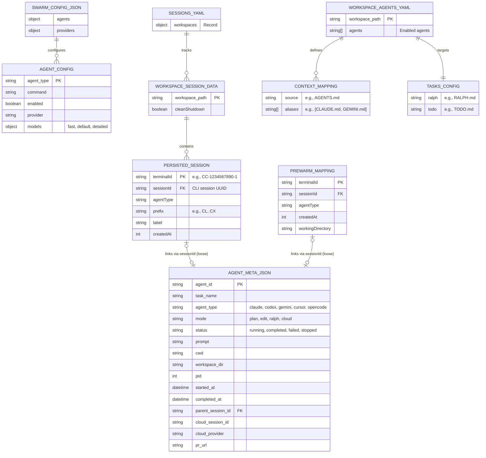
```mermaid
erDiagram
    %% MCP Backend Storage (~/.agents/swarm/)
    AGENT_META_JSON {
        string agent_id PK
        string task_name
        string agent_type "claude, codex, gemini, cursor, opencode"
        string mode "plan, edit, ralph, cloud"
        string status "running, completed, failed, stopped"
        string prompt
        string cwd
        string workspace_dir
        int pid
        datetime started_at
        datetime completed_at
        string parent_session_id FK
        string cloud_session_id
        string cloud_provider
        string pr_url
    }

    SWARM_CONFIG_JSON {
        object agents
        object providers
    }

    AGENT_CONFIG {
        string agent_type PK
        string command
        boolean enabled
        string provider
        object models "fast, default, detailed"
    }

    %% IDE Extension Storage
    SESSIONS_YAML {
        object workspaces "Record<WorkspacePath, WorkspaceData>"
    }

    WORKSPACE_SESSION_DATA {
        string workspace_path PK
        boolean cleanShutdown
    }

    PERSISTED_SESSION {
        string terminalId PK "e.g., CC-1234567890-1"
        string sessionId FK "CLI session UUID"
        string agentType
        string prefix "e.g., CL, CX"
        string label
        int createdAt
    }

    PREWARM_MAPPING {
        string terminalId PK
        string sessionId FK
        string agentType
        int createdAt
        string workingDirectory
    }

    WORKSPACE_AGENTS_YAML {
        string workspace_path PK
        string[] agents "Enabled agents"
    }

    CONTEXT_MAPPING {
        string source "e.g., AGENTS.md"
        string[] aliases "e.g., [CLAUDE.md, GEMINI.md]"
    }

    TASKS_CONFIG {
        string ralph "e.g., RALPH.md"
        string todo "e.g., TODO.md"
    }

    %% Relationships
    SWARM_CONFIG_JSON ||--o{ AGENT_CONFIG : "configures"
    SESSIONS_YAML ||--o{ WORKSPACE_SESSION_DATA : "tracks"
    WORKSPACE_SESSION_DATA ||--o{ PERSISTED_SESSION : "contains"
    WORKSPACE_AGENTS_YAML ||--o{ CONTEXT_MAPPING : "defines"
    WORKSPACE_AGENTS_YAML ||--|| TASKS_CONFIG : "targets"
    
    PERSISTED_SESSION |o--o| AGENT_META_JSON : "links via sessionId (loose)"
    PREWARM_MAPPING |o--o| AGENT_META_JSON : "links via sessionId (loose)"
```

#### Collection & Schema Breakdown

The persistence layer is physically distributed across four main domains:

#### 1. Backend Orchestration State (`~/.agents/swarm/`)
This acts as the internal database for the `@swarmify/agents-mcp` server, tracking detached background processes [1, 3].

*   **`agents/{id}/meta.json`**: The schema representing a single `AgentProcess` [4, 5].
    *   Tracks lifecycle limits and relationships for Swarm/SubAgent executions [4].
    *   **Fields:** `agent_id`, `task_name`, `agent_type`, `prompt`, `cwd`, `workspace_dir`, `mode`, `pid`, `status`, `started_at`, `completed_at`, `parent_session_id`, `cloud_session_id`, `cloud_provider`, `pr_url` [4, 5].
*   **`config.json`**: The global configuration dictating backend execution [6].
    *   **Fields:** `agents` (mapping `AgentType` to an `AgentConfig` specifying the `command`, `enabled` flag, and `models` for `fast`/`default`/`detailed` effort levels) and `providers` (mapping providers to their `apiEndpoint`) [7, 8].

#### 2. Terminal Session Recovery (`~/.swarmify/agents/sessions.yaml`)
Managed by the VS Code extension (`sessions.persist.ts`), this YAML file implements the 2-map architecture to restore agent tabs after an IDE crash or restart [2, 9].

*   **`SessionsFile`**: The root schema, holding a `workspaces` dictionary [10].
*   **`WorkspaceSessionData`**: Represents a specific IDE window/workspace [11].
    *   **Fields:** `cleanShutdown` (boolean) and an array of `sessions` [11].
*   **`PersistedSession`**: The schema mapping a VS Code terminal to an underlying AI CLI session [11].
    *   **Fields:** `terminalId` (internal IDE tracking ID, e.g., `CC-123`), `prefix`, `sessionId` (the UUID of the CLI process), `label`, `agentType`, and `createdAt` [11].

#### 3. Prewarm & Global State (VS Code `globalState`)
The extension utilizes VS Code's internal SQLite `globalState` API to store UI preferences and pooling data [12, 13].

*   **`AgentSettings`**: The massive monolithic schema for user preferences [14].
    *   **Fields:** `builtIn` (instances and default models per agent), `custom` (custom agent CLI definitions), `aliases` (custom command flags), `quickLaunch` (shortcuts), `prompts` (saved slash commands), `display` (terminal tab UI rules), and `taskSources` [14-16].
*   **`TerminalSessionMapping`**: Used specifically for recovering the Prewarm Pool after a dirty exit [17].
    *   **Fields:** `terminalId`, `sessionId`, `agentType`, `createdAt`, `workingDirectory` [17, 18].

#### 4. Workspace Configuration (`.agents`)
A version-controlled YAML file living in the root of the user's project, defining how Swarmify parses the local codebase context [19, 20].

*   **`AgentsConfig`**: The root object for context mapping [21].
    *   **`context`**: An array of `ContextMapping` objects linking a `source` file (e.g., `AGENTS.md`) to agent-specific `aliases` (e.g., `[CLAUDE.md, GEMINI.md]`) [19, 21].
    *   **`agents`**: An array of enabled `AgentId` strings [21].
    *   **`tasks`**: Maps the target files for autonomous and manual tasks (e.g., `ralph: "RALPH.md"`, `todo: "TODO.md"`) [21].


#### 1. Backend Orchestration Entities

#### **AgentProcess** (Stored as `meta.json` in `~/.agents/swarm/agents/{id}/`)
Represents a spawned background CLI process. It is the core aggregate for the MCP server's execution tracking [1, 2].

| Field | Type | Constraints / Valid Values | Description & Indices |
| :--- | :--- | :--- | :--- |
| **`agentId`** | `string` | UUID/Unique String | **Primary Key**. Directory name for agent storage [3]. |
| **`taskName`** | `string` | - | Used to group Swarm agents; **Indexed/Queried** via `listByTask` [4]. |
| **`agentType`** | `string` | `'claude' | 'codex' | 'gemini' | 'cursor' | 'opencode'` | The foundational model CLI executing the task [1, 2]. |
| **`prompt`** | `string` | - | The initial instruction/task passed to the agent [1]. |
| **`cwd`** | `string | null` | Valid directory path | Execution path; blocks dangerous paths (e.g., `/System`) in Ralph mode [2, 5]. |
| **`workspaceDir`** | `string | null` | Valid directory path | The root of the developer's workspace [1, 2]. |
| **`mode`** | `string` | `'plan' | 'edit' | 'ralph' | 'cloud'` | Defines agent file-system permissions and auto-looping [1, 2]. |
| **`pid`** | `number | null` | Valid OS Process ID | The OS-level process group ID for sending SIGTERM/SIGKILL [1, 2]. |
| **`status`** | `string` | `'running' | 'completed' | 'failed' | 'stopped'` | **State Machine**. Tracks execution lifecycle [1, 2]. |
| **`startedAt`** | `string` (ISO) | Valid Date | Timestamp of process spawn [1, 2]. |
| **`completedAt`** | `string | null` (ISO)| Valid Date | Timestamp of exit or termination [1, 2]. |
| **`parentSessionId`** | `string | null` | Existing `sessionId` | **Foreign Key**. Links sub-agents to the Orchestrator's CLI session UUID [1, 2]. |
| **`cloudSessionId`** | `string | null` | - | ID for tracking Anthropic/OpenAI cloud container runs [1, 2]. |
| **`cloudProvider`** | `string | null` | `'anthropic' | 'openai'` | Maps to the remote cloud infrastructure [1, 2, 6]. |
| **`prUrl`** | `string | null` | Valid URL | Extracted Pull Request link from cloud execution [1, 2]. |

#### **SwarmConfig & AgentConfig** (Stored in `~/.agents/swarm/config.json`)
Global execution settings for the MCP server [7].

| Field | Type | Constraints / Valid Values | Description & Indices |
| :--- | :--- | :--- | :--- |
| **`agents`** | `Record<AgentType, AgentConfig>`| Keys must be `AgentType` | Maps each agent to its CLI command and enabled status [7]. |
| **`command`** | `string` | System executable path | The CLI command used to spawn the agent (e.g., `codex exec`) [7, 8]. |
| **`enabled`** | `boolean` | - | Toggle indicating if the framework can spawn this agent [7]. |
| **`models`** | `AgentModelConfig` | Keys: `'fast' | 'default' | 'detailed'` | Maps effort levels to specific model strings (e.g., `claude-haiku-4-5-20251001`) [7, 8]. |
| **`provider`** | `string` | `'anthropic' | 'openai' | 'google' | 'custom'` | The inference provider mapping [7, 8]. |

---

#### 2. Frontend & IDE Extension Entities

#### **PersistedSession** (Stored in `~/.swarmify/agents/sessions.yaml`)
Restores full-screen terminal tabs and their agent associations after an IDE restart [9].

| Field | Type | Constraints / Valid Values | Description & Indices |
| :--- | :--- | :--- | :--- |
| **`terminalId`** | `string` | `Prefix-Timestamp-Count` (e.g., `CC-1705...-1`) | **Primary Key**. Internal IDE tracking ID (`AGENT_TERMINAL_ID`) [9, 10]. |
| **`sessionId`** | `string` | CLI session UUID | **Foreign Key**. Reconnects the UI to the background CLI history (`AGENT_SESSION_ID`) [9, 10]. |
| **`prefix`** | `string` | `'CC' | 'CX' | 'GX' | 'CR' | 'OC' | 'SH'` | The canonical prefix denoting the agent type [9, 11]. |
| **`agentType`** | `string` | `AgentType` enum | Ex: `claude`, `codex` [9]. |
| **`label`** | `string` | Max 5 words | User-defined or auto-generated status bar label [9, 12]. |
| **`createdAt`** | `number` | Unix Epoch | Timestamp of session creation [9]. |

#### **TerminalSessionMapping** (Prewarm Pool Tracking)
Persisted in VS Code `globalState` (`prewarm.mappings`) to recycle pre-spawned CLI shells [13].

| Field | Type | Constraints / Valid Values | Description & Indices |
| :--- | :--- | :--- | :--- |
| **`terminalId`** | `string` | Unique internal ID | **Primary Key** tracking prewarmed shell [13]. |
| **`sessionId`** | `string` | UUID | The pre-spawned CLI's session ID [13]. |
| **`agentType`** | `string` | `PrewarmAgentType` | `'claude' | 'codex' | 'gemini' | 'cursor' | 'opencode'` [13, 14]. |
| **`workingDirectory`** | `string` | Valid directory path | The specific project folder the process was spawned inside [13]. |

#### **WorkspaceConfig** (Stored as `.agents` in workspace root)
Defines project-specific routing and aliases [15, 16].

| Field | Type | Constraints / Valid Values | Description & Indices |
| :--- | :--- | :--- | :--- |
| **`context`** | `ContextMapping[]` | - | Maps generic source files to agent aliases [16]. |
| **`source`** | `string` | - | Origin file (e.g., `AGENTS.md`) [15]. |
| **`aliases`** | `string[]` | - | Agent-specific symlinks (e.g., `CLAUDE.md`, `GEMINI.md`) [15]. |
| **`agents`** | `AgentId[]` | Valid `AgentId` strings | Explicitly enabled agents for this specific workspace [16]. |
| **`tasks`** | `TasksConfig` | - | Target task files for autonomous vs manual tracking (e.g., `RALPH.md`, `TODO.md`) [16]. |

---

#### 3. Task & Data Management Entities

#### **UnifiedTask** (Aggregated UI Model)
Standardizes tasks from Markdown files, Linear, and GitHub for the Swarmify Dashboard [17].

| Field | Type | Constraints / Valid Values | Description & Indices |
| :--- | :--- | :--- | :--- |
| **`id`** | `string` | `source:id:line` format | **Primary Key**. Ex: `md:/path/to/TODO.md:14` or `linear:PROJ-123` [17, 18]. |
| **`source`** | `string` | `'markdown' | 'linear' | 'github'` | The external origin of the task [17]. |
| **`title`** | `string` | - | The parsed summary of the work item [17]. |
| **`description`** | `string` | - | Body/details of the task (Optional) [17]. |
| **`status`** | `string` | `'todo' | 'in_progress' | 'done'` | **State Machine** indicating work completion [17]. |
| **`priority`** | `string` | `'urgent' | 'high' | 'medium' | 'low'` | Maps remote priorities (e.g., Linear 1-4) to standardized scale (Optional) [17, 18]. |
| **`metadata`** | `TaskMetadata` | - | Source-specific data (file paths, URLs, assignees, labels) [17, 19]. |

#### **PromptEntry** (Stored in `~/.swarmify/agents/prompts.json`)
Saves user-defined custom slash-commands that persist across extension uninstalls [20].

| Field | Type | Constraints / Valid Values | Description & Indices |
| :--- | :--- | :--- | :--- |
| **`id`** | `string` | Unique identifier | **Primary Key**. Built-in prompts begin with `builtin-` [20, 21]. |
| **`title`** | `string` | - | Name of the slash-command [20]. |
| **`content`** | `string` | - | The raw text/workflow instructions [20]. |
| **`isFavorite`** | `boolean` | - | Pins the prompt to the top of the quick pick list [20]. |
| **`accessedAt`** | `number` | Unix Epoch | Tracks recency; **Index** used to sort non-favorite prompts descending [20, 21]. |


Based on the Swarmify codebase and architecture, several software design and implementation patterns are heavily utilized to manage multi-agent orchestration, IDE integration, and state persistence. 

Here are the core implementation patterns found in the framework:

#### 1. Object Pooling (Worker/Session Pools)
To eliminate boot-up latency for heavy CLI tools, Swarmify implements a **Session Pooling** pattern (referred to as "Prewarming").
*   **Implementation:** The extension runs background processes to maintain a pool of ready-to-use agent sessions `SessionPoolState` (tracking `available` and `pending` instances) [1]. 
*   **Execution:** When a user or lead agent requests a new sub-agent (like Codex or Gemini), the system hands off an available pre-spawned session ID instantly. The `AgentManager` then asynchronously replenishes the pool to maintain the configured `DEFAULT_POOL_SIZE` [2-4].

#### 2. Finite State Machines (FSM)
Explicit state machines are used to control the lifecycles of asynchronous entities:
*   **Agent Process Lifecycle (`AgentStatus`):** Tracks background execution states (`running`, `completed`, `failed`, `stopped`) [5, 6].
*   **Approval Gates (`ApprovalStatus`):** Enforces human-in-the-middle orchestration workflows, moving from `pending` -> `approved` (or `rejected`) -> `running` -> `complete` [7].
*   **Unified Tasks (`UnifiedTask.status`):** Normalizes Markdown, GitHub, and Linear work items into a strictly typed state of `todo`, `in_progress`, or `done` [8].
*   **OAuth Dialogs:** Manages UI states during remote token exchanges (`idle`, `waiting`, `success`, `error`) [9].

#### 3. Observer & Message Passing
Because Swarmify bridges a backend Node.js server, a VS Code extension, and an isolated React Webview, it relies on asynchronous event observation:
*   **File System Watchers:** The extension registers `vscode.workspace.createFileSystemWatcher` to observe changes in `.agents` workspace configurations, triggering automatic symlink updates when changed [10]. It also polls native agent `store.db` or `.jsonl` files to pipe live activity updates to the UI [11].
*   **Webview Message Passing:** The React UI and VS Code extension interact using an event-driven `postMessage` pattern. The frontend `useEffect` hook listens for specific `MessageEvent` payloads (e.g., `agentTerminalsData`, `swarmStatus`) to dynamically update the UI without reloading the webview [12].

#### 4. Adapter / Normalizer Pattern
AI models natively output vastly different JSON log structures (e.g., Claude uses `stream-json`, Codex outputs stringified arguments). 
*   **Implementation:** The `parsers.ts` module acts as an Adapter, using functions like `normalizeClaude()` and `normalizeCodex()` to translate these proprietary schemas into a unified, predictable framework event schema (e.g., mapping everything to standard `init`, `message`, `tool_use`, and `result` events) [13].
*   Similarly, the `linearToUnifiedTask` and `githubToUnifiedTask` functions adapt disparate remote API data structures into a single `UnifiedTask` interface for the dashboard [8].

#### 5. Strategy Pattern
The codebase uses the strategy pattern to handle model-specific or environment-specific logic dynamically:
*   **Pre-warming Strategies:** Different agents require different logic to prewarm. The `SIMPLE_PREWARM_CONFIGS` maps each agent to a specific execution method (`none` for Claude, `spawn-kill` for Codex, `spawn-wait` for Gemini/Cursor) and injects strategy-specific `extractSessionId` parsing rules [14, 15].
*   **Terminal Identification Strategies:** To correctly identify agent VS Code terminals, `getTerminalDisplayInfo()` attempts several strategies in sequence: 1) Parse the terminal name, 2) Check for `AGENT_TERMINAL_ID` environment variables, and 3) Fallback to reverse-looking up the assigned tab icon [16, 17].

#### 6. Cursor-Based Delta Polling (Event Sourcing)
To coordinate Swarms without overwhelming an LLM's context window, Swarmify avoids sending full execution logs via its MCP server.
*   **Implementation:** The MCP `Status` tool utilizes a `since` parameter (an ISO timestamp cursor). The backend reads the full raw log files but filters out historical events, deduplicates file operations using `Sets`, truncates bash output, and returns highly compressed state deltas to the orchestrator [18, 19]. 

#### 7. Orchestrator / Hierarchical Delegation (Master-Worker)
The defining operational pattern of Swarmify is **SubAgents and Swarms**.
*   **Implementation:** A "Lead Agent" (Orchestrator) operates in `plan` mode to explore code and draft a Distribution Plan. It then delegates the implementation workload by spinning up specialized "SubAgents" (Workers) asynchronously using the `mcp__Swarm__spawn` tool, ensuring files are divided without collision [20, 21].


| External Service / API | Purpose | Protocol / Flow | Version / Endpoint |
| :--- | :--- | :--- | :--- |
| **Anthropic API** | Provides inference for Claude models (`claude-haiku-4-5-20251001`, `claude-sonnet-4-5`, `claude-opus-4-5`) and powers remote cloud execution mode [1, 2]. | HTTPS / REST | `https://api.anthropic.com` [3] |
| **OpenAI API** | Provides inference for Codex models (`gpt-4o-mini`, `gpt-5.2-codex`, `gpt-5.1-codex-max`), isolated cloud containers, and AI-generated git commit messages via the Autogit feature [1, 4, 5]. | HTTPS / REST | `v1` (`https://api.openai.com/v1` and `.../chat/completions`) [3, 6] |
| **Google Gemini API** | Provides inference for Gemini models (`gemini-3-flash-preview`, `gemini-3-pro-preview`) [1]. | HTTPS / REST | `v1` (`https://generativelanguage.googleapis.com/v1`) [3] |
| **OpenRouter API** | Serves as an alternative/fallback API provider for generating AI commit messages in the Autogit feature [4, 6]. | HTTPS / REST | `v1` (`https://openrouter.ai/api/v1/chat/completions`) [6] |
| **Linear API** | Integrates project management tasks directly into the IDE's Dashboard, fetching assigned issues to convert them into a normalized `UnifiedTask` schema [7-9]. | OAuth 2.0 / MCP | `https://linear.app/oauth/authorize` [10] |
| **GitHub API** | Fetches assigned open issues and pull requests to display in the extension's unified tasks dashboard [7, 11, 12]. | OAuth 2.0 / MCP | `https://github.com/login/oauth/authorize` [13] |
| **NPM Registry API** | Fetches the latest package metadata to perform 12-hour TTL cache-based version checks, alerting the user if the local `@swarmify/agents-mcp` backend is outdated [14, 15]. | HTTPS / REST | `latest` (`https://registry.npmjs.org/@swarmify/agents-mcp/latest`) [14] |


Here is a breakdown of the integration and execution patterns used within the Swarmify framework:

#### 1. Asynchronous Patterns
Asynchronous integration is the foundational architectural pattern of Swarmify, allowing multiple agents to run in parallel without blocking the IDE or the Orchestrator.

*   **Non-Blocking Agent Spawning**: When the Orchestrator (e.g., Claude) invokes the `mcp__Swarm__spawn` tool, the MCP server uses `child_process.spawn()` with `detached: true` to start the sub-agent and returns an `agent_id` immediately [1-4]. This non-blocking pattern allows the Orchestrator to spawn multiple agents in parallel to create a "Swarm" [5, 6]. 
*   **Asynchronous Context Monitoring (Live UI)**: The VS Code extension runs asynchronous background loops that poll native agent session files (like Cursor's SQLite `.db` or Claude's `.jsonl` files). It parses the tail end of these files to extract and push real-time activity updates (e.g., "Reading src/auth.ts") to the React Dashboard via `postMessage` without blocking the IDE [7-10].
*   **Asynchronous Session Pre-warming**: The extension maintains a pool of background CLI sessions. The replenishment of this pool (`replenishPool`) happens asynchronously to ensure the user always has instant access to new agent terminals without waiting for boot times [11-13].
*   **Delayed/Async Session Detection**: For agents like OpenCode that do not output their session ID immediately, Swarmify asynchronously waits 3 seconds after spawn and then compares session lists to detect the active session ID [14-16].

#### 2. Synchronous Patterns
Synchronous patterns are used sparingly, primarily for critical initialization steps, file system checks, and CLI discovery.

*   **CLI Availability Checks**: During startup and post-installation, the framework uses `execSync` to synchronously execute `which <cli>` or `where <cli>` commands. This immediately determines if necessary binaries (like `claude`, `codex`, or `gemini`) are available on the system's `PATH` before allowing the server to initialize [17-19].
*   **Configuration and Persistence Loading**: Local configuration files (like `.agents` YAML configs or `sessions.yaml`) are frequently loaded synchronously via `fs.readFileSync` so the extension can establish its initial state, mappings, and terminal routing before spawning the visual components [20, 21].

#### 3. Retry and Polling Mechanisms
Swarmify relies heavily on polling to manage decentralized state and external integrations.

*   **Delta-Based Cursor Polling**: Instead of relying on a constant open socket to the agents, the Orchestrator polls the MCP `Status` tool periodically. To prevent token explosion, this polling uses a `since` cursor (an ISO timestamp). The server calculates the delta, returning only new, deduplicated, and truncated events since the last poll [1, 22-24].
*   **OAuth Status Polling**: When connecting to external task sources (Linear or GitHub), the `OauthDialog` React component initiates a `setInterval` loop that polls the extension host (`checkOAuthStatus`) every 1000ms until the Cloudflare edge worker returns the successful token or times out [25, 26].
*   **Auto-Label Terminal Polling**: To generate tab names dynamically, the extension sets up a polling interval (`setInterval`) that checks the session logs every 5 minutes. It continues to retry until it successfully extracts the first user message to use as the tab's label [27].

#### 4. Circuit Breaker, Timeout, and Limiting Mechanisms
To prevent resource exhaustion, zombie processes, and hanging network requests, Swarmify implements several resilience patterns.

*   **Process Escalation (Graceful to Force Kill)**: When the `Stop` tool is invoked, the `AgentManager` sends a `SIGTERM` to the agent's process group. If the processes do not exit gracefully within 10 seconds, it acts as a circuit breaker and escalates to `SIGKILL` to ensure no orphaned bash shells remain [28-30].
*   **Strict Concurrency Limits**: The `AgentManager` enforces hard capacity limits on the system, capping background executions at `maxAgents` (default 50) and `maxConcurrent` (default 10) to prevent the host machine from being overwhelmed by LLM CLI processes [31-33].
*   **Network Request Timeouts**: When querying the NPM registry to check for `@swarmify/agents-mcp` updates, the request uses an `AbortController` configured with a strict 3-second timeout (`FETCH_TIMEOUT_MS = 3000`). If the network hangs, it aborts silently and falls back to cached data [34, 35].
*   **Time-To-Live (TTL) Caching**: To prevent rate-limiting and improve performance, the version-checking network request is shielded by a 12-hour TTL cache (`CACHE_TTL_MS`) [34, 36]. 
*   **Command Execution Timeouts**: Background commands, such as spawning pre-warmed sessions or querying remote cloud status, are wrapped in explicit timeouts (e.g., 30000ms for pre-warm spawns and 15000ms for Codex cloud status checks) [30, 37, 38].


Here is the C4 Level 2 (Container) Integration Map Diagram for the Swarmify framework. This diagram illustrates how the internal containers of the Swarmify system (Extension, MCP Server, OAuth Worker, and CLIs) interact with external cloud services and APIs.

#### Integration Map Diagram (C4 Level 2)

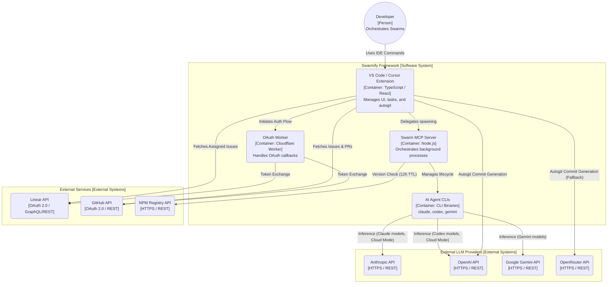
```mermaid
flowchart TB
    %% External Entities
    User(("Developer\n[Person]\nOrchestrates Swarms"))

    %% Swarmify System Boundary
    subgraph System_Swarmify ["Swarmify Framework [Software System]"]
        Ext("VS Code / Cursor Extension\n[Container: TypeScript / React]\nManages UI, tasks, and autogit")
        MCP("Swarm MCP Server\n[Container: Node.js]\nOrchestrates background processes")
        OAuth("OAuth Worker\n[Container: Cloudflare Worker]\nHandles OAuth callbacks")
        CLIs("AI Agent CLIs\n[Container: CLI Binaries]\nclaude, codex, gemini")
    end

    %% External LLM Providers
    subgraph External_LLMs ["External LLM Providers [External Systems]"]
        Anthropic("Anthropic API\n[HTTPS / REST]")
        OpenAI("OpenAI API\n[HTTPS / REST]")
        Google("Google Gemini API\n[HTTPS / REST]")
        OpenRouter("OpenRouter API\n[HTTPS / REST]")
    end

    %% External Task & Registry Services
    subgraph External_Services ["External Services [External Systems]"]
        Linear("Linear API\n[OAuth 2.0 / GraphQL/REST]")
        GitHub("GitHub API\n[OAuth 2.0 / REST]")
        NPM("NPM Registry API\n[HTTPS / REST]")
    end

    %% Internal Container Interactions
    User -->|Uses IDE Commands| Ext
    Ext -->|Delegates spawning| MCP
    MCP -->|Manages lifecycle| CLIs
    Ext -->|Initiates Auth Flow| OAuth

    %% External LLM Integrations
    CLIs -->|"Inference (Claude models, Cloud Mode)"| Anthropic
    CLIs -->|"Inference (Codex models, Cloud Mode)"| OpenAI
    CLIs -->|"Inference (Gemini models)"| Google
    
    Ext -->|Autogit Commit Generation| OpenAI
    Ext -->|"Autogit Commit Generation (Fallback)"| OpenRouter
    
    %% External Service Integrations
    Ext -->|Fetches Assigned Issues| Linear
    Ext -->|Fetches Issues & PRs| GitHub
    OAuth -->|Token Exchange| Linear
    OAuth -->|Token Exchange| GitHub
    
    MCP -->|"Version Check (12h TTL)"| NPM
```

#### External Services Integration Breakdown

The Swarmify framework delegates all heavy lifting (inference, task tracking, package management) to external services. The integration points are divided based on the internal container responsible for the connection:

#### 1. AI Agent CLIs → Cloud LLM Providers
Because Swarmify operates as an open-source local orchestrator, it does not proxy LLM calls through a central SaaS backend. Instead, the detached background CLI processes connect directly to the providers using the developer's local API keys [1].
*   **Anthropic API**: The local `claude` CLI sends inference requests for models like `claude-haiku-4-5-20251001` and `claude-opus-4-5`. It also connects to Anthropic's remote cloud infrastructure when spawned in `cloud` mode [1].
*   **OpenAI API**: The local `codex` CLI communicates with OpenAI for models like `gpt-4o-mini` and `gpt-5.1-codex-max`. It is also used to deploy isolated cloud containers in `cloud` mode [1].
*   **Google Gemini API**: The local `gemini` CLI relies on this API for executing models like `gemini-3-flash-preview` [1].

#### 2. VS Code Extension (`swarm-ext`) → External APIs
The IDE extension handles direct API calls for features related to the developer's workspace and task management.
*   **Linear & GitHub APIs**: The extension utilizes dedicated MCP clients to fetch open tickets and PRs directly into the Swarmify Dashboard's "Unified Tasks" list [1].
*   **OpenAI & OpenRouter APIs**: For the `Autogit` feature (Cmd+Shift+G), the extension packages the `git status` and `git diff` outputs and sends them to OpenAI (via the `agents.openaiApiKey` setting) or OpenRouter as a fallback to generate conventional commit messages [1, 2].

#### 3. OAuth Worker → Task Trackers
*   **Linear & GitHub OAuth**: Because VS Code extensions cannot securely host static callback URLs for OAuth 2.0 flows on their own, Swarmify utilizes a remote Cloudflare edge worker (`swarmify-oauth.muqsitnawaz.workers.dev`). This worker securely intercepts the redirects from Linear and GitHub, manages the token exchange, and passes the authenticated state back to the local IDE [3].

#### 4. Swarm MCP Server → NPM Registry
*   **NPM Registry API**: The `@swarmify/agents-mcp` backend server periodically polls `https://registry.npmjs.org/@swarmify/agents-mcp/latest` to check if a newer version of the orchestration infrastructure is available [1]. To prevent rate-limiting, this network request is strictly bound by a 12-hour Time-To-Live (TTL) cache file (`~/.agents/swarm/cache.json`) [4].

